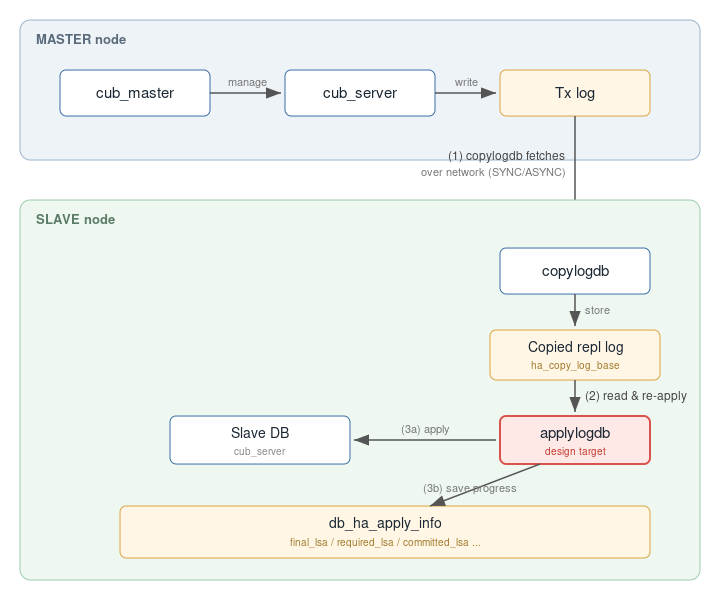
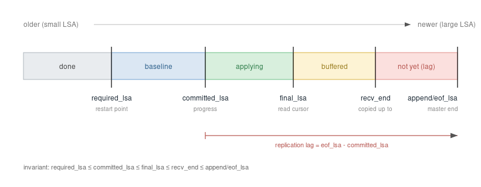

# 병렬 applylogdb 코디네이터 설계 보고서

이 문서는 parallel `applylogdb` PoC 이후 실제 구현으로 넘어가기 위한 병렬화 컨셉을 정리한 **설계 보고서**다. 상세 자료구조나 API가 아니라, 어떤 책임을 새 모듈로 분리할지와 트랜잭션 간 충돌·순서를 어떻게 다룰지에 초점을 둔다. 발표·학습 자료로 함께 쓰며, 흐름은 *CUBRID 현재 복제 → 로지컬 복제와 병렬화의 관계 → PoC로 본 가능성 → 다른 DBMS는 어떻게 하는가 → 그래서 우리 코디네이터 설계 → 정확성 시나리오 → 재시작 문제* 순이다. 벤더별 더 깊은 근거는 같은 폴더의 조사 문서(`reference/{base,mysql,pgsql}/`, `coordinator_design_mapping_from_vendors.md`, `cubrid_special_table_scenarios.md`)에 있고, 외부 출처 링크는 문서 끝 **참고문헌**에 모았다.

> **한눈 요약.** CUBRID의 applylogdb는 로지컬(행 재실행) 복제이고, 로지컬이기 때문에 병렬 적용이 의미가 있다. PoC는 트랜잭션을 `tranid % worker`로 단순 분배해 병렬화의 *가능성*(반영 시간 약 3.4배 단축)을 보였지만, 트랜잭션 간 의존성은 일부러 다루지 않았다. 정식 병렬화를 위해 MySQL·PostgreSQL·EDB PGD를 조사한 결과, "병렬 실행과 commit 순서 보존을 분리하고 coordinator가 분배"하는 **MySQL 모델**이 CUBRID 구조와 가장 잘 맞았다. 그래서 현재 PoC의 LogReader가 트랜잭션을 워커 큐에 넣는 그 지점에 **충돌·순서 판단(코디네이터)** 을 넣는 것이 1차 설계의 핵심이다. 다만 applier는 복제 로그만으로는 외래키 관계를 알 수 없어, 안전을 위해 commit 순서를 보수적으로 지켜야 하며, 병렬로 적용하면 재시작 시 정합성 문제가 새로 생긴다.

---

# Act A. CUBRID 복제 현황과 로지컬 복제

## A.1 현재 CUBRID HA 복제는 어떻게 도는가



CUBRID HA 노드는 마스터 프로세스(`cub_master`), 데이터베이스 서버(`cub_server`), 그리고 복제를 담당하는 두 프로세스 **`copylogdb`** 와 **`applylogdb`** 로 구성된다 [C1]. 복제는 두 단계로 이루어진다. 먼저 슬레이브의 `copylogdb`가 마스터 서버에 트랜잭션 로그를 요청해 받아 로컬에 복사해 둔다(저장 위치는 `ha_copy_log_base`, 동기 방식은 `ha_copy_sync_mode`의 SYNC/ASYNC로 설정). 그다음 `applylogdb`가 그 복사된 로그를 읽어 슬레이브 DB에 실제로 반영하고, 어디까지 반영했는지를 내부 카탈로그 `db_ha_apply_info`에 기록한다 [C1].

복사와 반영을 굳이 다른 프로세스로 나눈 이유는, 반영이 느려지더라도 로그를 받아두는 일은 계속할 수 있게 하여 반영 지연이 마스터의 트랜잭션 진행에 영향을 주지 않도록 하기 위함이다 [C1]. 이 문서가 손대려는 부분은 이 가운데 **applylogdb의 반영(apply) 단계**다.



이 복제가 "어디까지 받고·읽고·반영했는지"를 표시하는 방식이 위 그림이다. 복제 로그를 LSA 순서(왼쪽=과거 → 오른쪽=최신)로 펼쳐 놓고 진도 표지들을 얹은 것인데, 오른쪽부터 보면 마스터 로그의 끝이 **`append/eof_lsa`**, `copylogdb`가 받아 둔 마지막 위치가 **`recv_end`** 다(둘 사이는 아직 못 받은 구간). `applylogdb`는 받아 둔 로그를 읽기 커서 **`final_lsa`** 까지 읽어 적용에 투입하고, 그중 **마스터와 같은 순서로 반영·commit을 끝낸 경계**가 **`committed_lsa`**(=진도)다. 그리고 **`required_lsa`** 는 아직 끝나지 않은 가장 오래된 트랜잭션의 시작점으로, **재시작 시 여기서부터 다시 읽어 멱등 재적용**하는 기준점(low-water mark)이다. 그래서 정상 상태에서 이 표지들은 늘 `required_lsa ≤ committed_lsa ≤ final_lsa ≤ recv_end ≤ append/eof_lsa` 순서를 유지하며, 복제 지연(lag)은 대략 `append/eof_lsa − committed_lsa`로 가늠한다. 이 값들은 `db_ha_apply_info`에 영속되어 재시작 지점과 진도를 결정한다(LSA 종류별 세부와 코드 위치는 B.3에서 다시 다룬다).

용어를 미리 맞춰 두면, 복제 로그(repl log)는 마스터가 "무엇이 바뀌었는지"를 남긴 기록이고, **LSA**(Log Sequence Address)는 그 로그 안의 위치를 가리키는 번호표다. 정확히는 **로그 페이지 id(`pageid`)와 페이지 내 오프셋(`offset`)** 으로 이루어진다(`log_lsa.hpp`: pageid 48bit + offset 16bit) — 즉 "몇 번 로그 페이지의 몇 바이트 지점"이라는 뜻이지 파일 번호가 아니다. "어디까지 처리했는지"를 이 LSA로 표현하며, 역할로는 MySQL의 binlog position(파일명+오프셋)·PostgreSQL의 LSN(WAL 바이트 위치)에 대응한다(좌표의 granularity는 서로 다르다). CUBRID에서 **class**는 테이블을 가리키는 말이라, 이후 예시의 `TblA`는 곧 class A다. 그리고 이 문서가 새로 도입하려는 **코디네이터**는 워커 앞단에서 "이 트랜잭션을 지금 보내도 되는가(충돌·순서)"를 판단해 분배하는 계층이다. 마지막으로 **committed_lsa**는 "어디까지 순서대로 반영을 끝냈는가"를 가리키는 진도이고, **순서 정리**는 병렬로 끝난 결과를 commit 순서대로 줄 세워 이 진도를 전진시키는 단계를 말한다.

## A.2 applylogdb는 로지컬(행 재실행) 복제다

코드를 확인해 보면 applylogdb의 워커는 슬레이브에 DB 클라이언트 세션으로 접속해, 복제 로그를 `la_apply_insert_log`·`la_apply_update_log`·`la_apply_delete_log`·`la_apply_statement_log`로 **행/문장 단위로 다시 실행**한다(`log_applier.c:897-902`, 워커 세션 `:1720~`) [C2]. 즉 마스터의 물리 페이지를 그대로 복사하는 방식이 아니라 변경을 논리적으로 재적용하는 **로지컬 복제**다. 쉽게 말하면 마스터에서 일어난 INSERT/UPDATE/DELETE를 슬레이브에서 다시 수행하는 셈인데, 다만 SQL 문장을 재실행하는 것이 아니라 마스터가 만든 *변경된 행 이미지*를 서버 내부 경로(locator)로 직접 반영한다 — 물리 복제(페이지 바이트 복사)와도, 단순 SQL 재실행과도 구분되는 중간 형태다. 그 결과 슬레이브는 자기 로그를 새로 생성하므로 **슬레이브의 LSA와 마스터의 LSA는 별개의 값**이 된다.

이 적용 경로에서 정확성과 직결되는 사실 몇 가지를 코드로 확인했다 [C2]. 첫째, 적용은 `la_repl_add_object`로 변경 객체를 워커별 리스트에 모았다가 `locator_repl_flush_all`로 한꺼번에 flush하는 방식이다(`:7589`, `:7470`). 둘째, **복제는 PK를 기준으로 동작**한다 — 복제 로그 항목은 `class + PK 값 + operation`만 담고(`la_make_repl_item:5708~`, 마스터 측 `repl_log_insert`는 PK 인덱스에서만 로그를 남긴다), 따라서 복제 대상 테이블에는 반드시 PK가 있어야 하고 충돌 판단의 키로 class와 PK를 항상 쓸 수 있다. 셋째, **외래키 검사는 applier가 아니라 슬레이브 서버가 한다** — `la_apply_*`는 변경을 모아 서버에 보낼 뿐이고, FK는 서버의 `locator_insert_force`/`update_force` 안에서 검사된다(`xlocator_repl_force` → `locator_insert_force(..., dont_check_fk=false)` → `locator_check_foreign_key`, `locator_sr.c:7029,5198`). 그래서 자식 행을 부모보다 먼저 적용하면 서버의 FK 검사에 걸려 apply 에러가 나고 복제가 멈춘다(이 점이 뒤의 설계를 좌우한다).

실패 처리도 봐 두면, 마스터에서 트랜잭션이 abort되면 applier는 그 트랜잭션의 복제 항목 리스트를 비우고(`LOG_ABORT → la_free_repl_items_by_tranid`), apply 중 에러가 나면 재시도 가능한 에러는 잠시 쉬었다 다시 시도하며(`la_retry_on_error` → `LA_SLEEP`+continue), 그래도 안 되면 `fail_counter`를 올린다(`:8841-8849`, `:7703`). 트리거는 applier가 `db_disable_trigger`로 꺼 두므로 적용 중 재실행되지 않는다(`:1831`).

## A.3 물리 vs 로지컬 — 병렬화는 왜 로지컬에서만 하는가

복제 방식은 크게 둘로 나뉜다. **물리 복제**는 로그(WAL이나 페이지 변경)를 그대로 복사해 재생하고, **논리 복제**는 변경을 행 단위로 다시 실행한다. 흔히 물리가 "레코드당 비용이 싸서 빠르다"고 하지만, 항상 그런 것은 아니다. 물리 재생은 보통 단일 스레드로 동작해(예: PostgreSQL의 startup process) 멀티코어로 바쁜 마스터를 못 따라가 지연이 쌓일 수 있고, 클러스터를 통째로·같은 버전끼리·읽기 전용으로만 복제할 수 있어 경직되어 있다. 반면 논리 복제는 레코드당 비용(파싱·인덱스·제약 처리)이 더 들지만, 일부 테이블만 선택해 복제하거나 버전이 다른 서버·이기종으로 복제하고, 복제본에서도 쓰기를 허용하는 등 유연하다 [B1][B4].

핵심은 **병렬화 가능성**이다. 물리 재생은 LSN·페이지에 강하게 묶여 있어 병렬화가 어렵다(PostgreSQL도 parallel recovery는 아직 제안 단계다 [P-rec]). 반면 논리 복제는 트랜잭션·행 단위라 "어떤 트랜잭션이 서로 독립인가"를 판단해 병렬화하기가 상대적으로 쉽다. 그래서 현대 DB들이 유연한 논리 복제를 택하고 그 약점인 적용 속도를 병렬화로 메우는 방향으로 가며, 실제로 **병렬 적용을 제공하는 것은 전부 논리 복제 계열**이다(MySQL의 멀티스레드 복제, PostgreSQL의 parallel apply, EDB PGD의 Parallel Apply). CUBRID의 applylogdb 역시 논리 복제이므로 같은 논리로 병렬화가 의미가 있다 — 이것이 이 프로젝트의 출발점이다(상세는 `reference/base/physical_vs_logical_replication.md`).

## A.4 현재 PoC의 병렬화 방식과 한계

먼저 왜 병렬화가 필요한지부터 짚자. 마스터는 여러 클라이언트가 멀티코어로 동시에 쓰지만, 슬레이브의 applylogdb 반영은 사실상 직렬이라 마스터를 못 따라가 **복제 지연(lag)** 이 쌓인다. lag이 커지면 두 가지가 곤란하다 — 마스터 장애로 슬레이브가 승격될 때 뒤처진 만큼 **데이터가 유실되고(failover RPO)**, 슬레이브를 읽기용으로 쓰면 **오래된 데이터**를 보게 된다. 그래서 슬레이브도 멀티코어를 활용해 병렬로 따라잡아야 한다 — 그것이 이 작업의 목적이다.

현재 PoC는 commit 레코드를 만나면 `worker_idx = tranid % LA_APPLY_WORKER_COUNT`로 워커를 고른다. 구현이 단순하다는 장점이 있지만 두 가지 문제가 있다. 하나는 서로 관련 있는(같은 데이터를 건드리는) 트랜잭션이 우연히 다른 워커에 배정되어 동시에 실행될 수 있다는 점이고 — 이러면 복제 결과가 원본의 실행 순서와 달라질 수 있어 가장 큰 문제다 — 다른 하나는 서로 독립인 트랜잭션이 같은 워커에 쏠려 병렬 효과를 못 내는 경우다. 결국 단순한 워커 선택기로는 부족하고, 트랜잭션 간 **충돌과 순서를 먼저 판단하는 코디네이터**가 필요하다(Act D).

---

# Act B. PoC 설계·구현과 결과

## B.1 PoC의 모듈 구조와 develop 대비 변경점

PoC의 구조는 별도 설계 문서 `2.design/poc_design.md`에 **LogReader와 ApplyWorker** 두 모듈로 정의되어 있다. LogReader는 active/archive 로그에서 복제 로그를 읽어 `LA_ITEM`을 만들고 트랜잭션 단위로 `LA_APPLY`를 구성하다가, commit 로그를 만나면 그 트랜잭션을 확정해 워커 큐에 넣는다. 그리고 워커들의 완료 결과를 수집해 **commit LSA 순서대로** 전역 완료를 판정하고 `committed_lsa`와 `db_ha_apply_info`를 갱신하며 다 쓴 항목을 정리한다. ApplyWorker는 설정된 개수만큼 생성되어 각자 작업 큐·워커 로컬 workspace·슬레이브 서버 세션을 갖고, 받은 트랜잭션을 적용·flush·commit한 뒤 완료 LSA를 LogReader에 보고한다. 즉 이 PoC 구조에서 우리가 말하는 "코디네이터"와 "순서 정리"는 새로운 모듈이 아니라 **LogReader가 이미 맡고 있는 책임**이다 — 코디네이터는 LogReader가 워커 큐에 넣는 그 enqueue 판단(현재 `tranid % worker`)을 충돌·순서 판단으로 바꾸는 것이고, 순서 정리는 LogReader의 결과 수집·committed_lsa 갱신 부분이다.

develop(오리지널)과 PoC를 비교하면, PoC는 `log_applier.c`에 약 3,900줄을 더했는데 대부분이 워커·dispatch·retire 구조와 측정 계측이다. **핵심 정합성 메커니즘(LSA 관리, 재시작 멱등 skip, FK 검사, 복제 로그 형식)은 develop과 동일**하다 — develop은 단일 직렬 함수 `la_apply_commit_list`로 적용하던 것을 PoC가 워커 경로로 옮겼을 뿐 판정 조건은 같다 [C2]. 설계 문서(poc_design.md)와 실제 코드 사이에는 몇 가지 차이가 있다. 설계는 "insert 연산만"(§29)을 대상으로 했지만 코드는 **INSERT와 UPDATE를 모두** 지원하며(`la_is_supported_poc_item`; DELETE는 함수만 있고 실제로는 미지원), 설계에 없던 측정 계측(`la_Debug_progress`)과 병목 측정용 제약(일부 워커만 flush하는 `LA_APPLY_WORKER_REPL_ACTIVE_COUNT`, apply_info 갱신을 건너뛰는 `LA_SKIP_READER_COMMIT_APPLY_INFO`)이 들어가 있다. 이 측정용 제약들은 정식 구현에서는 제거 대상이다. 반대로 설계가 명시적으로 PoC 범위에서 제외한 것도 있는데, 바로 §32·34의 **"트랜잭션 간 의존성 판별, 병렬 스케줄링, 정교한 오류 복구"** 다. 즉 현재 PoC가 의존성을 안 보고 `tranid % worker`로만 분배하는 것은 설계대로이며, **우리 코디네이터는 PoC가 의도적으로 비워 둔 바로 그 자리를 채우는 다음 단계**다.

## B.2 PoC 결과 — 병렬화의 가능성

같은 설정(buffer 5G, dwb=0)에서 순차 적용과 병렬 적용을 비교했을 때, 병렬화로 슬레이브 전체 반영 시간이 약 3.4배 단축되고 복제 지연(lag)이 4~6배 줄었다. 다만 워커 하나가 단일 테이블을 처리하는 시간 자체는 1.5~2배 늘었는데(insert 기준 8.05초 → 16.10초), 이는 병목이 네트워크가 아니라 **슬레이브에서 실제로 변경을 적용하는 on-CPU 로직**(로그 생성의 prior_lsa, lock, page/space 할당)에 있기 때문이다. 이는 insert/update 콜체인 분석으로 확인했다(상세는 `final_report.md`). 요컨대 **병렬화의 효과 자체는 분명하다**는 것이 PoC의 결론이다. 다만 PoC는 의존성을 보지 않고 단순 분배만 하므로, 자연히 다음 질문이 따라온다 — *제대로 된(충돌·순서를 지키는) 병렬화는 어떻게 해야 하는가?*

## B.3 진도 관리에 쓰이는 LSA들

이 질문에 답하기 전에, applylogdb가 진도를 추적하는 데 쓰는 LSA들을 정리해 두면 뒤의 순서 정리·재시작 논의가 쉬워진다 [C2]. 마스터 로그의 끝을 가리키는 `append_lsa`·`eof_lsa`는 복제 지연 계산에 쓰인다(`append_lsa − committed_lsa`가 대략 lag이다). applier의 진행을 나타내는 핵심 값은 넷이다. `final_lsa`는 마지막으로 읽어 처리한 위치(읽기 커서)이고, `required_lsa`는 "아직 끝나지 않은 가장 오래된 트랜잭션의 시작" 즉 **재시작 시 다시 읽기 시작할 지점(low-water mark)** 으로 `la_find_required_lsa`가 진행 중 트랜잭션들의 최저 start_lsa로 계산한다(`:4078`). `committed_lsa`는 마지막으로 반영을 끝낸 commit 로그의 위치이고 `committed_rep_lsa`는 마지막으로 반영한 데이터 변경 로그의 위치인데, 둘 다 순서 정리(retire) 단계에서 갱신된다(`:2082`). 이 값들은 `db_ha_apply_info` 카탈로그에 영속되어 재시작 시 `la_get_last_ha_applied_info`로 로드되며, 정상 상태의 진도선은 `required_lsa ≤ committed_lsa ≤ final_lsa ≤ append_lsa`다.

---

# Act C. 다른 DBMS는 병렬화를 어떻게 하는가

정식 병렬화를 설계하기 위해 논리 복제의 병렬 적용을 제공하는 세 DBMS를 조사했다. 결론부터 말하면 PostgreSQL과 EDB PGD는 우리 상황에 직접 모델로는 맞지 않아 탈락했고, MySQL이 가장 가까웠다. 벤더↔CUBRID 매핑은 `coordinator_design_mapping_from_vendors.md`에, 벤더별 상세는 `reference/{mysql,pgsql}/`에 있다.

## C.1 PostgreSQL — 탈락

PostgreSQL의 논리 복제는 publication/subscription 모델로, publisher가 WAL을 logical decoding해 변경 스트림을 만들고 subscriber의 apply worker가 적용한다 [P1]. 그런데 **하나의 구독 안에서는 트랜잭션을 publisher의 순서 그대로 직렬로 적용**하며, MySQL처럼 트랜잭션 간 의존성을 계산해 독립 트랜잭션을 병렬로 분배하지는 않는다. 병렬성이 나타나는 곳은 두 군데뿐이다. 하나는 구독 생성 시 기존 테이블 데이터를 복사하는 초기 동기화 단계로, 여러 tablesync worker가 병렬로 복사한다(`max_sync_workers_per_subscription`) [P1][P2]. 다른 하나는 큰 트랜잭션을 commit 전에 조각내어 보내는 streaming인데, `streaming=parallel`이면 leader apply worker가 parallel apply worker에게 조각을 넘겨 적용하고 commit 시점에 leader가 그 워커의 완료를 기다려 순서를 맞춘다(PostgreSQL 16에서 비기본으로 도입, 18부터 기본) [P3][P4][P5]. 그러나 이는 어디까지나 *한 트랜잭션의 조각*을 처리하는 것이지 여러 트랜잭션을 의존성 기준으로 병렬화하는 것이 아니다. 따라서 "독립 트랜잭션 자동 병렬 + 전역 순서 보존"을 목표로 하는 우리에게 PostgreSQL은 직접 모델로 부적합하다. 다만 구독 경계를 잘못 자르면 원자성·순서가 깨지는 사례는 "병렬 단위를 잘못 자르면 무엇이 깨지는가"를 보여주는 반면교사로 가치가 있다 [P6].

## C.2 EDB PGD — 탈락(단, 한 측면은 선례)

EDB PGD(구 BDR)는 상용 멀티마스터 제품으로, 구독당 여러 writer를 두는 Parallel Apply를 제공한다(`bdr.writers_per_subscription` 기본 2, 최대 8) [E1]. 각 writer는 자기 트랜잭션의 최종 commit이 origin의 commit 순서를 위반하지 않도록 보장하고, 같은 행(tuple)을 쓰려는 선행 트랜잭션이 있으면 그것이 commit될 때까지 대기시켜 순서를 예방한다. 그리고도 순서가 어긋나면 에러를 내고 롤백하는 backstop을 둔다 — 즉 순수한 낙관적 방식이 아니라 "선행 tuple 대기로 예방 + 위반 시 롤백" 혼합이다 [E1][E2]. PGD를 전체 모델로 채택하지 않은 이유는 세 가지다. 토폴로지가 멀티마스터라(노드 간 충돌 해소·합의가 필요하다) 단방향 master-slave인 CUBRID HA에는 과하고 맞지 않으며, 상용 폐쇄 제품이라 내부를 청사진으로 삼기 어렵고, 구조 자체는 뒤에 볼 MySQL이 CUBRID와 더 잘 맞는다 [E3]. 다만 "의존성·충돌 판단을 apply 측에서 한다"는 한 가지 측면만은 CUBRID(코디네이터가 슬레이브 측에서 판단)와 닮아 선례로 참고할 만하다(상세는 `reference/pgsql/edb_pgd_parallel_apply.md`).

## C.3 MySQL — 가장 유사하여 채택

MySQL 복제는 source가 변경을 binary log에 기록하고, replica의 I/O 스레드가 이를 relay log로 받은 뒤, 병렬 적용 시 **coordinator 스레드가 relay log를 순서대로 읽어 워커 스레드에 배정**하는 구조다 [M1]. 우리 설계와 가장 비슷한 점은 **병렬 실행과 commit 순서 보존을 분리**한다는 점이다.

병렬 여부의 판단은 의존성을 기준으로 한다. source가 트랜잭션마다 `sequence_number`(binlog 안의 논리 순번)와 `last_committed`(이 트랜잭션이 기다려야 하는 가장 최근 선행 트랜잭션, 일종의 watermark)를 binlog에 적어 두고, replica의 coordinator(`replica_parallel_type=LOGICAL_CLOCK`)가 이를 읽어 `last_committed` 이하의 트랜잭션이 모두 끝났으면 병렬로 실행한다 [M2][M4]. 이 의존성을 *어떻게 계산하는지*는 `binlog_transaction_dependency_tracking`으로 정하는데, `COMMIT_ORDER`는 group commit 묶음을 기준으로(8.0.46 기본값), `WRITESET`은 트랜잭션이 바꾼 행/키 집합의 충돌 여부를 봐서 더 정밀하게(병렬 폭이 넓다), `WRITESET_SESSION`은 거기에 같은 세션의 순서 보존을 더해 계산한다 [M3][M5]. 여기서 중요한 사실은, **write set 자체는 binlog에 실리지 않고** source가 `last_committed`를 계산하는 내부 입력으로만 쓰이며 replica에는 계산 결과(`sequence_number`/`last_committed`)만 전달된다는 점이다.

병렬로 실행한 트랜잭션의 최종 commit 순서는 `replica_preserve_commit_order`(SPCO, 8.0.27부터 기본 ON이며 LOGICAL_CLOCK이 전제)가 source 순서로 강제한다. 그래서 워커들이 동시에 실행하더라도 commit만큼은 원본 순서대로 외부에 보이며, 뒤 트랜잭션이 앞보다 먼저 보이는 "gap"이 방지된다 [M2][M6]. 한편 binary log group commit은 병렬 복제의 필수 조건은 아니고, 여러 트랜잭션의 commit window를 겹치게 만들어 LOGICAL_CLOCK의 병렬 폭을 넓혀 주는 보조 요소다 [M3]. 정리하면 MySQL의 "source가 의존성을 계산해 내려보내고, replica coordinator가 병렬 실행하되 commit 순서는 따로 보존한다"는 구조가 CUBRID의 "코디네이터가 분배하고 순서 정리 단계가 committed_lsa를 순서대로 갱신한다"와 1:1로 대응하여, 우리는 MySQL 모델을 차용하기로 했다(상세는 `reference/mysql/`).

한 가지 더 짚을 점은 **MySQL이 commit 순서를 보존하는 "층위"와 그 이유**인데, 이는 뒤의 Act F(재시작 문제)와 직접 맞닿아 있다. SPCO는 단순히 진도 표시만 순서대로 맞추는 게 아니라, 워커가 **물리적으로 commit하기 직전에 자기 차례가 올 때까지 대기**시켜 durable commit 자체를 source 순서로 직렬화한다(코드상 `Commit_order_manager`가 책임지며, ordered_commit의 첫 단계에서 차례 대기로 진입한다 — `sql/rpl_replica_commit_order_manager.h`, `sql/binlog.cc`의 ordered_commit) [M7]. MySQL이 *왜* 여기까지 하는지는 두 가지로 확인된다. 첫째, replica가 **source에 존재한 적 없는 중간 상태를 외부에 노출하지 않게** 하기 위해서다 — 뒤 트랜잭션이 앞보다 먼저 보이는 gap이 생기면 read scale-out에서 일관성이 깨지며, 이것이 이 기능의 원 설계 동기다("the slave database can be in a state that never existed on the master") [M8]. 둘째, **크래시 복구 좌표가 gap-free여야 유효**하기 때문이다 — commit이 순서대로면 단일 복구 위치 앞은 전부 적용 완료가 보장되지만, out-of-order commit은 그 위치 뒤에 이미 durable한 트랜잭션을 남겨 복구를 어긋나게 한다(매뉴얼이 multithreaded replica의 gap을 복구 실패 요인으로 명시) [M6]. **이 둘째 이유가 바로 CUBRID에서 Act F가 다루는 재시작 정합 문제와 정확히 같은 동기**다. MySQL은 commit 순서를 진도층이 아니라 물리 commit 단계에서 강제함으로써 그 문제를 애초에 만들지 않는다.

---

# Act D. CUBRID 병렬화 설계 — 코디네이터

## D.1 코디네이터의 위치와 모듈 책임

설계의 핵심은 새로운 거대한 모듈을 만드는 것이 아니라, 현재 LogReader가 commit 시점에 `tranid % worker_count`로 워커를 고르는 그 한 지점을 **충돌·순서 판단으로 바꾸는 것**이다. 전체 흐름은 다음과 같다.

```text
복제 로그 리더  →  코디네이터          →  워커 풀          →  순서 정리
(record 스캔,     (충돌/순서 판단,        (적용·flush·       (committed_lsa를
 트랜잭션 구성,    실행/대기 구분,         commit, 결과 반환)  commit 순서대로 갱신,
 변경 class 수집)  워커 선택)                                 apply info 갱신)
```

복제 로그 리더는 레코드를 트랜잭션별 apply list로 모으면서 그 트랜잭션이 바꾼 class 집합도 함께 수집하고, commit 레코드를 만나면 작업을 완성해 코디네이터에 넘긴다(워커에 직접 넣지 않는다). 코디네이터는 그 변경 class 집합으로 충돌 여부를 판단해 실행 가능한 것과 대기시킬 것을 나누고, 스키마 변경 같은 작업은 barrier로 처리하며, 실행 가능한 것만 워커 큐에 넣는다. 워커는 받은 작업을 적용·flush·commit하고 결과만 돌려줄 뿐 충돌 판단은 하지 않는다. 마지막으로 순서 정리 단계가 병렬로 도착한 결과를 모아 commit LSA 순서로만 `committed_lsa`를 전진시킨다. 코디네이터가 던지는 질문은 "이 트랜잭션이 앞선 것과 충돌하는가, 충돌한다면 어디까지 기다려야 하는가, 실행 가능하다면 어느 워커에 보낼 것인가"의 순서인데, 앞의 둘은 correctness 문제이고 마지막 하나가 성능 문제이므로 충돌·순서 판단이 워커 분배보다 우선한다.

여기서 자연스럽게 드는 의문 하나를 짚고 가자. **"commit 순서를 지킬 거면 결국 순차 적용과 뭐가 다른가? 병렬로 한 의미가 없지 않나?"** 답은 **"실행"과 "commit 순서 보존"이 서로 다른 층**이라는 데 있다. 비유하면 여러 일꾼이 **일은 동시에 하되**(병렬 적용), "완료 도장"은 **접수 순서대로** 찍는 것이다. 무거운 부분인 적용(실행)은 워커들이 동시에 처리하고, 상대적으로 가벼운 commit과 진도(`committed_lsa`)만 마스터의 commit 순서대로(연속 prefix로) 맞춘다 — 그러면 병렬 적용의 이득(여러 워커가 동시에 슬레이브 CPU·I/O를 쓰는 것)은 그대로 얻으면서, 외부에서 슬레이브를 보면 항상 마스터와 같은 순서로만 보인다. **"순서를 지킨다"가 "전부 직렬"을 뜻하지는 않는다**는 것이 핵심이다. 직렬이 강제되는 것은 FK·같은 행처럼 순서가 실제로 중요한 쌍뿐이고, 그 외 대다수 독립 트랜잭션은 온전히 병렬로 흐른다. 이 "병렬 실행 ↔ commit 순서 보존 분리"는 곧 MySQL이 `LOGICAL_CLOCK`(병렬 판단)과 `replica_preserve_commit_order`(순서 보존)를 분리한 구조와 같으며(C.3), CUBRID에서는 그 역할이 각각 코디네이터 분배와 순서 정리 단계로 나뉜다.

## D.2 충돌은 무엇을 기준으로 판단하는가 (1차안: class 단위)

1차 구현에서는 충돌을 **class 단위**로 판단한다. 리더가 apply list를 만들며 수집해 둔 changed class 집합을 코디네이터가 받아, 현재 실행 중이거나 아직 순서 정리가 끝나지 않은 트랜잭션들의 변경 class와 비교한다. 같은 class가 하나라도 겹치면 충돌로 보아 새 트랜잭션을 바로 보내지 않고 pending 상태로 두었다가, 선행 트랜잭션의 실행과 순서 정리가 끝난 뒤 다시 평가한다. 겹치는 class가 하나도 없으면 병렬로 실행할 수 있다. 변경 class를 알 수 없거나 스키마 변경·sysop처럼 판단이 안전하지 않은 작업은 barrier로 처리해 앞뒤를 끊는다.

예를 들어 `Tx1`이 class A를, `Tx2`가 class B를 바꾼다면 둘은 겹치는 class가 없어 병렬로 실행할 수 있다. 반면 `Tx3`도 class A를 바꾼다면 Tx1과 같은 class라 충돌이므로, Tx1이 끝나고 정리될 때까지 미룬다. 다만 이 방식은 row까지 들여다보지 않으므로, 실제로는 `Tx4`가 A의 1번 행을 `Tx5`가 A의 999번 행을 바꿔 사실은 독립인 경우에도 같은 class라는 이유로 충돌로 본다. 즉 class 단위 판단은 **보수적**이다. 복제 로그 포맷을 바꾸지 않고 applylogdb 내부에서 구현할 수 있고 correctness 판단이 단순하다는 장점이 있는 대신, row/write-set 기준보다 병렬성이 낮고 특정 hot class(재고·집계·카운터처럼 많은 트랜잭션이 공통으로 갱신해 변경이 몰리는 인기 테이블 — CUBRID는 테이블을 class라 부르며, 일반적으로는 hot table/hot spot이라 한다)에 트랜잭션이 몰리면 사실상 순차 실행이 되어 버린다는 단점이 있다. 이 한계는 뒤(D.5)의 정밀 병렬화로 풀 여지를 남겨 둔다.

충돌한 트랜잭션을 어떻게 대기시킬지는 두 가지 방식이 있다. 하나는 전역 pending queue에 보관했다가 선행 트랜잭션이 끝나면 다시 평가해 워커에 배정하는 방식이고, 다른 하나는 충돌 도메인의 owner 워커 큐에 바로 붙여 큐 자체로 순서를 보장하는 방식이다. 후자는 단일 class 트랜잭션에는 단순하지만, 한 class에 몰리면 워커 skew가 커지고 여러 class를 동시에 바꾸는 트랜잭션은 어느 큐에 붙일지 애매해진다. 그래서 컨셉 단계에서는 다중 class·스키마·sysop까지 일반적으로 다룰 수 있는 **전역 pending queue 방식**을 기본으로 본다.

## D.3 단계를 둘로 나누는 이유 (Phase 1 / Phase 2)

설계는 두 단계로 나눈다. **Phase 1**은 복제 로그 포맷을 바꾸지 않고 applier 안에서 class 단위로 충돌을 판단하며 commit 순서를 보존하는 단계로, 독립 트랜잭션만 병렬로 돌린다. 코디네이터 구조와 correctness, 병렬 효과를 빠르게 검증하는 것이 목적이다. **Phase 2**는 FK로 엮인 트랜잭션까지 병렬화하거나 row/write-set 수준의 정밀 병렬을 하는 단계인데, 이는 복제 로그에 의존성 정보를 싣거나 서버가 그룹 단위로 처리하도록 하는 등 **복제 로그 구조 변경**을 수반한다. 로그 포맷 변경은 작업 분량과 기간을 예측하기 어렵기 때문에, Phase 1과 분리해 후속 과제로 둔다.

여기서 Phase 1과 Phase 2의 근본 차이는 **commit 순서(의존성)를 누가 정하느냐**다. Phase 1에서는 복제 로그에 의존성 정보가 없으므로 **apply 측 코디네이터가** 변경 class 집합을 보고 충돌·순서를 직접 판단해 commit 순서를 정한다. 반면 Phase 2에서 마스터가 의존성 정보(논리 순번·watermark 등)를 로그에 미리 실어 보내면, **그 판단의 주체가 마스터(source)로 옮겨가 코디네이터는 commit 순서를 스스로 계산해 정하지 않는다** — 로그가 지정한 의존성·순서를 그대로 따라 분배만 한다. 이는 MySQL이 source에서 `LOGICAL_CLOCK` 의존성을 계산해 내려보내고 replica는 그것을 따르는 구조와 같다(C.3, D.5). 즉 Phase 2로 가면 코디네이터의 역할이 "순서를 판단하는 주체"에서 "정해져 내려온 순서를 집행하는 주체"로 가벼워진다(슬레이브가 그 순서대로 commit을 보존·집행하는 것은 그대로 남는다 — 옮겨가는 것은 *판단*이지 *집행*이 아니다).

## D.4 설계 방향을 그렇게 잡은 이유 (applier는 FK를 모른다)

그 전에, **슬레이브가 commit 순서를 (마스터 순서대로) 조절·보존해야 하는 이유**부터 짚자. 크게 셋이다. ① **서버가 강제하는 cross-class 제약(FK 등)** — 부모보다 자식을 먼저 commit하면 서버의 FK 검사에 걸려 apply 에러로 복제가 멈춘다(E.1). ② **같은 데이터의 갱신 순서** — 같은 행을 바꾸는 두 트랜잭션의 순서가 뒤바뀌면 최종 값이 원본과 달라진다(lost update). ③ **진도·복구의 유효성** — 진도(`committed_lsa`)가 commit 순서대로(연속 prefix로) 전진해야 재시작 지점이 유효하고, 슬레이브를 읽을 때도 마스터에 존재한 적 있는 상태만 보인다. 이 셋 중 ②는 같은 class 직렬화(D.2)로, ③은 순서 정리 단계로 다루고, 가장 까다로운 ①(FK)이 1차 설계의 방향을 좌우했다 — 아래에서 그 이유를 본다.

왜 "보수적으로 commit 순서를 지킨다"는 방향을 택했는지는 코드 분석에서 나온 두 발견으로 설명된다. 첫째, **applier는 외래키 관계를 알 방법이 없다.** 복제 로그 항목(`la_make_repl_item`)은 class와 PK, operation만 담고 있고 `log_applier.c`에는 FK나 제약을 다루는 코드가 전혀 없다 — FK 관계는 서버의 스키마 카탈로그(`SM_CLASS`)에만 존재한다. 따라서 applier는 두 트랜잭션이 부모-자식으로 엮였는지를 자기 입력(복제 로그)만으로는 판단할 수 없다. 둘째, **그 FK 검사는 서버가 한다**(A.2). 그래서 코디네이터가 부모와 자식을 독립으로 오판해 병렬로 보내고 자식이 부모보다 먼저 적용되면, 서버의 FK 검사에 걸려 apply 에러가 나고 복제가 멈춘다. 게다가 FK 검사는 자식의 INSERT 시점에 일어나므로, 최종 commit 순서만 맞추는 것(MySQL의 SPCO 같은 방식)으로는 부족하고 자식이 적용되는 순간 이미 부모가 commit되어 보여야 한다. 결국 applier가 FK를 못 가리는 이상, 안전하게 가려면 commit 순서를 (FK 관련을 구분하지 못한 채) 보수적으로 지키거나 별도로 스키마의 FK 메타데이터를 읽어 와야 한다. 이 발견이 설계의 방향을 정했다.

## D.5 (장기) 정밀 병렬을 위한 복제 로그 확장

class 단위의 보수성을 넘어 정밀하게 병렬화하려면 결국 복제 로그에 의존성 정보를 실어야 한다. MySQL이 source에서 write set으로 watermark를 계산해 그 결과만 binlog에 남기는 것과 같은 맥락이다. CUBRID가 이를 한다면 추가할 정보는 네 가지로 정리되는데, 트랜잭션의 논리 순번(`sequence`)과 직렬화가 필요한 barrier 표시는 공통으로 두고, 의존성은 **둘 중 하나**를 택한다 — source가 미리 계산한 결과인 watermark를 싣거나(MySQL식), 아니면 바꾼 키 집합(conflict key)이라는 원재료를 실어 applier가 직접 충돌을 계산하게 하거나다. 둘 다 싣는 것이 아니라 "가공된 결과를 보내느냐, 원재료를 보내느냐"의 선택이며, CUBRID 코디네이터가 이미 apply 측에서 판단하는 구조이므로 conflict key 쪽(원재료 전송)이 더 자연스러운 확장이다.

---

# Act E. 정확성 시나리오

이 설계가 모든 경우에 올바르게 동작하는지(correctness), 그리고 병렬성을 얼마나 살리는지(성능)를 시나리오로 점검한다. 특수 테이블별 상세는 `cubrid_special_table_scenarios.md`에 있다.

## E.1 commit 순서를 강제해야 하는 이유 — FK 시나리오

서버가 FK를 검사하므로(A.2), 순서를 지키지 않은 병렬 적용은 복제를 깬다. 마스터에서 `T1`이 `orders(100)`을 넣고 그다음 `T2`가 이를 참조하는 `order_items(order_id=100)`을 넣었다고 하자. 마스터에서는 부모가 먼저 commit되었으므로 FK가 만족된다. 그런데 슬레이브의 코디네이터가 class 단위로만 보면 T1은 `orders`, T2는 `order_items`로 class가 달라 "독립"으로 오판하고 둘을 병렬로 보낸다. 만약 T2(자식)를 처리하는 워커가 T1(부모)보다 먼저 commit하면, 그 시점에 `orders(100)`이 아직 없으므로 서버의 FK 검사에 걸려 apply 에러가 나고 복제가 멈춘다. 고치는 방법은 부모를 먼저 commit한 뒤 자식을 적용하는 것 — 즉 commit 순서를 보존하는 것이다. applier가 FK를 못 가리므로(D.4) 이 순서 보존을 보수적으로 적용해야 하며, 뒤에서 볼 상속의 공유 unique 인덱스도 같은 종류의 문제다.

```text
master:  T1 commit INSERT orders(100)  →  T2 commit INSERT order_items(100, FK→orders)
slave 비순차 병렬: 자식 T2가 부모 T1보다 먼저 commit → orders(100) 없음 → FK 위반 → 복제 중단
해결: 부모 먼저 commit → 자식 적용 → FK 통과
```

## E.2 시나리오별 동작 정리

여러 경우를 이 설계가 어떻게 다루는지 한눈에 보면 다음과 같다. 같은 class에서 같은 행을 바꾸는 경우(분실 갱신, PK/unique 재사용)는 same-class 직렬화로 순서가 보존되어 안전하지만 직렬일 수밖에 없다. 같은 class에서 다른 행을 바꾸는 경우도 안전하지만 보수적으로 직렬화되어 병렬 기회를 잃는다(정밀화의 여지). 서로 다른 class를 바꾸는 독립 트랜잭션은 안전하면서 최대로 병렬화된다. FK로 엮인 cross-class와 상속의 공유 unique는 Phase 1에서 commit 순서 보존으로 안전을 확보하고 Phase 2의 서버 그룹 처리로 병렬을 넓힌다. 파티션은 뒤에 설명할 스키마 규칙 덕분에 안전하게 병렬화된다. 롱 트랜잭션은 멱등 재적용을 전제로 복구 비용을 감수하며, 하나의 큰 트랜잭션은 한 워커가 처리하므로 병렬 이득은 제한적이다.

class 단위 병렬화의 효과는 트랜잭션이 얼마나 여러 class로 분산되느냐에 달려 있다. 서로 다른 class를 바꾸는 트랜잭션이 연속되면 워커가 모두 가동되어 효과가 크지만(best case), 하나의 hot class에 몰리면 워커가 여러 개여도 사실상 순차 실행이 된다(worst case). 현실은 그 중간으로, class group별로는 순서를 지키되 서로 다른 group은 병렬로 도는 형태가 된다.

## E.3 그 밖의 충돌·특수 테이블 점검

여기서 판단의 기준은 한 가지다 — **applier가 자기 입력만으로 식별할 수 있는가.** 식별할 수 있는 것은 이미 처리된다. unique/PK 키 재사용(예: 같은 class에서 `DELETE pk=5` 후 `INSERT pk=5`)은 서버가 unique 인덱스로 잡아 비순차면 중복키 에러가 나지만, 같은 class라 코디네이터가 class OID로 same-class 직렬화해 막는다. 트리거는 applier가 `db_disable_trigger`로 꺼 두므로 재실행되지 않아 숨은 의존을 만들지 않는다. 반대로 applier가 식별할 수 없는 것이 cross-class 위험인데, 앞서 본 FK와 상속이 여기 속한다. 상속은 subclass가 superclass의 unique 제약을 물려받을 때 **같은 인덱스(BTID)를 공유**하므로(`schema_manager.c:9488-9506`), 서로 다른 subclass에 같은 키를 비순차로 적용하면 공유 unique를 위반한다 — FK와 같은 가족이며 실무 빈도는 낮다.

특수 테이블 중 파티션은 걱정과 달리 안전하다. CUBRID는 "파티션 키가 모든 인덱스 키에 포함되어야 한다"는 규칙(msg 1169)을 강제하므로, 같은 unique 키 값은 반드시 한 파티션에만 존재하여 서로 다른 파티션을 병렬로 적용해도 충돌이 생길 수 없다(FK와 파티션의 조합 역시 CUBRID가 제약한다). 뷰는 데이터를 저장하지 않아 비복제이고, LOB는 행에 외부 저장(ELO) locator만 들어가고 실제 데이터는 트랜잭션 로그로 복제되지 않으므로 코디네이터와 무관하다. 결국 **applier가 막을 수 없는 cross-class 위험은 FK와 상속 둘뿐**이고, 둘 다 Phase 1의 commit 순서 보존으로 덮인다.

---

# Act F. 재시작 시 문제

## F.1 병렬화가 만드는 재시작 정합 문제

applylogdb는 논리 재실행 방식이라 재시작하면 `required_lsa`(LWM)부터 로그를 다시 읽어 적용한다. 이미 적용한 것을 또 적용해 중복이 생기는 것을 막기 위해, 코드에는 두 단계의 멱등(idempotent) skip이 있다 [C2]. 기동 시점의 진도를 baseline(`last_committed_lsa`)으로 잡아 두고, 트랜잭션의 `commit_lsa`가 baseline 이하면 그 트랜잭션을 통째로 건너뛰며(`:8754`), 항목 단위로도 baseline보다 새 것(`item.lsa > last_committed_rep_lsa`)만 적용한다(`:8775`). 이 조건은 develop과 PoC가 동일하다. 물리 redo가 페이지 LSN 비교로 자동으로 멱등이 되는 것(ARIES)을, CUBRID는 복제 진도 LSA를 baseline과 비교하는 방식으로 구현한 셈이다.

그런데 여기에 **병렬화 때문에 새로 생기는 문제**가 있다. 먼저 한 가지 구분을 분명히 해야 한다. "commit 순서를 보존한다"에는 두 층위가 있다 — 진도(`committed_lsa`)를 순서대로 전진시키는 **외부 가시성·진도 층위**와, 워커가 디스크에 **물리적으로 durable commit하는 순서까지 강제하는 층위**다. PoC처럼 워커가 독립적으로 commit하면 앞 층위만 맞고 뒤 층위는 강제되지 않는데(MySQL SPCO가 물리 commit 직전에 차례를 기다리는 것과 대비된다, C.3), 그때 아래의 문제가 생긴다. 본 설계는 F.2에서 뒤 층위까지 강제하기로 정해 이 문제를 원천 차단한다. 재시작 시 재적용 자체는 병렬일 필요가 없고 직렬로 해도 된다. 문제는 그 전에 **병렬 운영이 남긴 out-of-order durable commit**이다. 워커들이 독립적으로 commit하므로, commit 순서상 뒤에 있는 트랜잭션이 앞 트랜잭션보다 먼저 슬레이브에 durable하게 commit될 수 있다. 그런데 진도(`committed_lsa`)는 commit 순서대로만 전진하므로, 그렇게 먼저 커밋된 트랜잭션은 `commit_lsa > committed_lsa`인 상태가 된다. 이 상태에서 크래시가 나면, 재시작 시 `required_lsa`부터 (직렬로) 다시 읽을 때 그 트랜잭션은 `commit_lsa ≤ baseline` 조건에 걸리지 않아 **건너뛰어지지 않고 다시 적용되어 중복**이 된다. 직렬로만 운영하면 `committed_lsa`가 곧 실제 durable 경계라서 생기지 않는, **오직 병렬화 때문에 생기는 문제**다. poc_design.md가 §34에서 "정교한 오류 복구"를 PoC 범위에서 제외했는데, 바로 이 영역이 아직 비어 있다.

## F.2 해결을 위해 바꿔야 할 부분

해결의 방향으로는 셋을 검토했다. ① 진도 watermark 하나만 두지 말고 그 위에 이미 적용된 트랜잭션들을 따로 추적해 영속화하는 방법(applied-set), ② 워커가 watermark에서 너무 멀리 앞서 commit하지 못하도록 out-of-order commit 윈도우에 상한을 두는 방법(window bound), ③ 아예 **워커의 durable commit 순서 자체를 source 순서로 강제**해 문제를 원천 차단하는 방법이다.

**본 설계는 ③(commit 순서 강제)을 채택한다.** 이는 곧 **MySQL이 택한 길(SPCO)**과 같다 — 워커가 물리 commit 직전에 자기 차례가 올 때까지 대기하게 만들어 durable commit 순서를 source와 일치시키고, 그 결과 복구 좌표가 항상 gap-free가 되어 F.1의 문제 자체를 만들지 않는다(MySQL이 commit 순서를 물리층에서 강제하는 둘째 이유가 바로 이것이다, C.3). 구현상으로도 ③이 가장 깔끔하다. 이미 설계에 있는 **순서 정리 단계**가 결과를 commit 순서대로 모아 `committed_lsa`를 전진시키고 있으므로, 거기에 "자기 차례가 될 때까지 물리 commit을 대기"하는 게이트 한 단계만 더하면 된다(등록→차례 대기→commit→다음 워커 grant). 이러면 **재시작 멱등 skip은 지금의 단일 watermark 그대로** 두어도 되고, 추가로 영속화할 자료구조가 없다. ①·②는 out-of-order durable commit을 허용한 채 skip 판정만 정확히 만들어 commit 단계의 병렬을 더 살리는 대안이지만, applied-set의 크래시-세이프 영속화·복구·GC(또는 윈도우 관리)라는 새 실패 표면을 떠안는다.

③의 비용은 "앞 트랜잭션이 늦으면 뒤 워커가 commit을 못 하고 대기"하는 commit 단계의 head-of-line 지연이다. 다만 **실행(적용) 자체는 ③에서도 그대로 병렬**이고, PoC 측정에서 병목은 commit이 아니라 slave on-CPU apply(prior_lsa·락·페이지/공간 할당)였으므로 commit 직렬화가 반납하는 병렬 이득은 작을 가능성이 크다. 실제 영향은 정식 구현에서 실측으로 확인한다.

①·②(out-of-order durable commit 허용)는 commit 단계의 병렬을 더 살리는 길이라 **Phase 2의 완화책으로도 검토했으나 채택하지 않는다.** out-of-order로 굳은 트랜잭션을 재시작 시 정확히 가려내려면 applied-set의 크래시-세이프 영속화·복구·GC(또는 윈도우 관리)가 필요한데, 이 재시작 정합 복잡도와 그로 인한 새 실패 표면이 commit 병렬에서 얻을 이득보다 크다고 판단했다. 따라서 Phase 1·2 모두 **워커가 commit 순서를 제어하는 ③(commit 게이트)을 유지**한다 — 적용은 병렬, durable commit은 마스터 순서.

---

## 남은 설계 쟁점

class 식별자는 이름의 rename·재사용 위험을 피하기 위해 **class OID로 확정**한다(applier가 이미 `ws_oid()`로 OID를 갖고 있다). 순서 대기 해제 기준은 1차에서는 워커 완료가 아니라 순서 정리 완료로 두는 것이 안전하다(병렬성은 줄지만 correctness 판단이 단순하다). 그 밖에 pending 작업이 너무 많아질 때 리더를 어떻게 멈출지, barrier 범위를 어디까지 잡을지, 나중에 row/write-set 단위로 확장할 때 기존 class 정책과 어떻게 공존시킬지가 남아 있고, 무엇보다 F.2의 **재시작 정합 보강**이 정식 구현의 필수 항목이다.

## 참고문헌

문서 내 코드 `file:line`은 CUBRID 로컬 소스([C2]) 기준이며, 벤더 사실의 1차 출처는 아래와 같다. 더 풍부한 인용은 `reference/{base,mysql,pgsql}/` 각 문서의 References 절에 있다.

**CUBRID**
- [C1] CUBRID HA — CUBRID 11.0 Manual. https://www.cubrid.org/manual/en/11.0/ha.html
- [C2] CUBRID 로컬 소스(`feature/parallel_applylogdb_poc` / `develop`): `src/transaction/log_applier.c`, `locator_sr.c`, `replication.c`, `src/object/schema_manager.c`, `work_space.c/h`; 설계 `2.design/poc_design.md`; 결과 `final_report.md`; 특수테이블 `cubrid_special_table_scenarios.md`

**물리 vs 논리 복제**
- [B1] PostgreSQL Docs — Different Replication Solutions. https://www.postgresql.org/docs/current/different-replication-solutions.html
- [B3] MySQL 8.0 Manual — The Binary Log / InnoDB Redo Log. https://dev.mysql.com/doc/refman/8.0/en/binary-log.html , https://dev.mysql.com/doc/refman/8.0/en/innodb-redo-log.html
- [B4] dbplus — Logical vs Physical Replication. https://dbplus.tech/en/2024/07/18/the-replication-dichotomy-logical-vs-physical-replication/
- [P-rec] PostgreSQL Wiki — Parallel Recovery(제안 단계). https://wiki.postgresql.org/wiki/Parallel_Recovery

**MySQL**
- [M1] MySQL 8.0 Manual — Replication Implementation / Replication Threads. https://dev.mysql.com/doc/refman/8.0/en/replication-implementation.html , https://dev.mysql.com/doc/refman/8.0/en/replication-threads.html
- [M2] MySQL 8.0 Manual — Replica Server Options and Variables(`replica_parallel_type`, `replica_parallel_workers`, `replica_preserve_commit_order`). https://dev.mysql.com/doc/refman/8.0/en/replication-options-replica.html
- [M3] MySQL 8.0 Manual — Binary Logging Options(`binlog_transaction_dependency_tracking`). https://dev.mysql.com/doc/refman/8.0/en/replication-options-binary-log.html
- [M4] MySQL WorkLog — WL#6813(MTS ordered commits/SPCO), WL#9556(writeset). https://dev.mysql.com/worklog/task/?id=6813 , https://dev.mysql.com/worklog/task/?id=9556
- [M5] MySQL Blog — Improving the Parallel Applier with Writeset-based Dependency Tracking. https://dev.mysql.com/blog-archive/improving-the-parallel-applier-with-writeset-based-dependency-tracking/
- [M6] MySQL 8.0 Manual — Replication and Transaction Inconsistencies(gap, gap-free 복구 좌표, low-water mark). https://dev.mysql.com/doc/refman/8.0/en/replication-features-transaction-inconsistencies.html
- [M7] MySQL 8.0.46 소스 — SPCO 구현: `sql/rpl_replica_commit_order_manager.{h,cc}`(Commit_order_manager 책임=워커 commit을 source 순서로), `sql/binlog.cc`(ordered_commit 첫 단계의 차례 대기), `sql/sys_vars.cc:4282`(기본 ON).
- [M8] Libing Song(Oracle). "Preserve Master's Commit Order on Slave"(기능 원 설계 동기 = source에 없던 중간 상태 비노출). MySQL Server Blog Archive, 2014. https://dev.mysql.com/blog-archive/preserve-masters-commit-order-on-slave/
- (초기 구축) Clone Plugin / GTID auto-positioning. https://dev.mysql.com/doc/refman/8.0/en/clone-plugin.html , https://dev.mysql.com/doc/refman/8.0/en/replication-gtids-auto-positioning.html

**PostgreSQL**
- [P1] PostgreSQL Docs — Logical Replication Architecture. https://www.postgresql.org/docs/current/logical-replication-architecture.html
- [P2] PostgreSQL Docs — Logical Replication Configuration Settings. https://www.postgresql.org/docs/current/logical-replication-config.html
- [P3] PostgreSQL Docs — CREATE SUBSCRIPTION(`streaming`). https://www.postgresql.org/docs/current/sql-createsubscription.html
- [P4] PostgreSQL Docs — Logical Streaming Replication Protocol. https://www.postgresql.org/docs/current/protocol-logical-replication.html
- [P5] Amit Kapila — Parallel Apply of Large Transactions(PG16 도입, PG18 기본). http://amitkapila16.blogspot.com/2025/09/parallel-apply-of-large-transactions.html
- [P6] PostgreSQL Docs — Logical Replication Conflicts / Restrictions. https://www.postgresql.org/docs/current/logical-replication-conflicts.html , https://www.postgresql.org/docs/current/logical-replication-restrictions.html

**EDB PGD**
- [E1] EDB PGD — Parallel Apply. https://www.enterprisedb.com/docs/pgd/latest/reference/parallelapply/
- [E2] EDB PGD — Transaction streaming. https://www.enterprisedb.com/docs/pgd/latest/reference/transaction-streaming/
- [E3] EDB PGD — Known issues and limitations. https://www.enterprisedb.com/docs/pgd/latest/known_issues/
