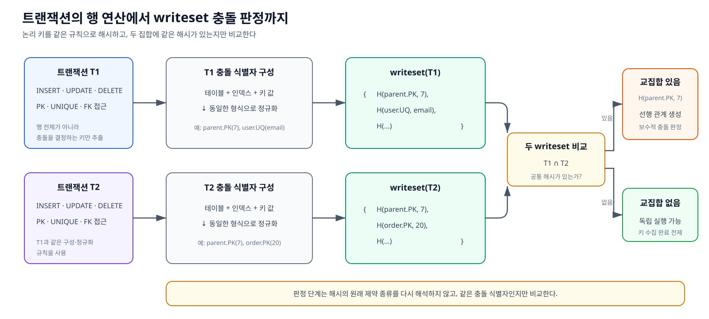
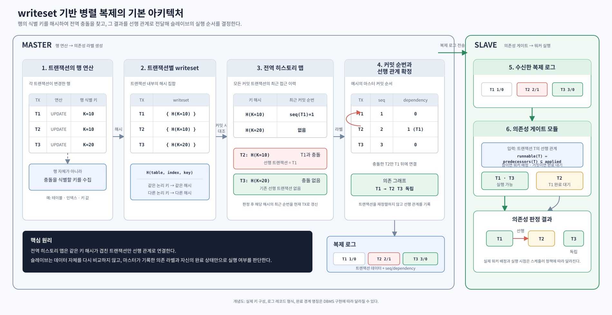

# 2. writeset이란

## 2.1 개념 — 트랜잭션이 건드린 키의 집합

writeset은 한 트랜잭션의 행 연산에서 다른 트랜잭션과 충돌할 수 있는 키를 추출해 표현한 집합이다. 키 원문 대신 테이블·인덱스·키 값을 조합한 해시를 저장하므로, 실제 데이터 전체를 비교하지 않고도 트랜잭션 사이의 충돌 가능성을 판정할 수 있다.

커밋한 트랜잭션의 writeset은 전역 history에 게시한다. 현재 트랜잭션의 writeset에 history와 같은 해시가 있으면 동일한 논리 키를 접근했거나 해시 충돌이 발생한 것으로 보고 보수적으로 선행 관계를 만든다. 같은 해시가 없으면, 순서를 결정하는 키가 빠짐없이 같은 규칙으로 수집됐다는 전제에서 독립 실행 가능한 트랜잭션으로 판정할 수 있다. 기본 writeset 모델의 판정 단계는 해시가 어느 제약조건에서 만들어졌는지 다시 해석하지 않고 충돌 식별자로 사용한다.

이 문서에서 다루는 해시 대상은 행의 쓰기 충돌을 식별하는 **PRIMARY KEY**, 값의 중복과 재사용 순서를 보장하는 **UNIQUE 계열**, 부모와 자식의 참조 순서를 보장하는 **FOREIGN KEY**다.

*그림 2-1. 트랜잭션의 행 연산에서 충돌 식별자를 추출해 writeset을 만들고, 먼저 커밋한 writeset을 게시한 전역 history에서 같은 해시를 조회해 선행 관계 또는 독립 실행 가능성을 판정하는 과정*

## 2.2 writeset 생성부터 적용 판정까지

writeset 기반 병렬 복제는 행 연산에서 의존성을 만들고, 그 의존성을 슬레이브의 실행 판정에 사용하는 흐름으로 구성된다.

그림에서 사용하는 용어의 의미는 다음과 같다.

- `seq`: 마스터에서 확정된 트랜잭션의 커밋 순서를 식별하는 값
- `dependency` 또는 `predecessors(T)`: 트랜잭션 T보다 먼저 적용되어야 하는 트랜잭션을 나타내는 선행 관계
- `applied`: 슬레이브에서 적용을 완료한 트랜잭션의 집합

*그림 2-2. 마스터의 충돌 키 추출과 dependency 계산부터 복제 로그 전달, 슬레이브의 적용 가능 여부 판정까지 이어지는 writeset 기반 병렬 복제 흐름*

1. **추출 — 그림의 1~2번**
   - 트랜잭션의 행 연산에서 충돌을 식별할 키를 수집한다.
   - 수집한 키를 해시하여 트랜잭션별 writeset에 저장한다.
2. **의존성 추적 — 그림의 3~4번**
   - 커밋 시점에 트랜잭션의 writeset을 전역 히스토리 맵과 대조한다.
   - 같은 키 해시를 먼저 사용한 트랜잭션이 있으면 해당 트랜잭션을 선행 관계로 기록한다.
   - 판정이 끝나면 현재 트랜잭션의 커밋 순번으로 전역 히스토리 맵을 갱신한다.
3. **의존성 전달과 소비 — 그림의 5~6번**
   - 확정된 커밋 순번과 선행 관계를 트랜잭션 데이터와 함께 복제 로그로 전송한다.
   - 슬레이브의 의존성 게이트는 선행 트랜잭션이 모두 적용됐는지 확인하여 실행 가능 상태로 둘지, 완료를 기다리게 할지 결정한다.

이 구조에서 슬레이브는 행 데이터의 충돌 여부를 다시 계산하지 않는다. 마스터가 계산한 선행 관계가 슬레이브의 병렬 실행 가능 범위를 결정하므로, 키 추출의 정확성과 전역 히스토리 갱신 순서가 정합성의 전제가 된다.

## 2.3 PK 외 제약 키와 변경 시 수집 규칙

PK만으로는 PK가 다른 행 사이의 제약조건 충돌을 판정할 수 없다. 트랜잭션의 적용 순서가 바뀌었을 때 제약 위반을 일으킬 수 있는 UNIQUE 값과 FK 참조 값도 충돌 키로 수집한다.

- **UNIQUE 제약 값** — PK가 다른 행 사이의 중복과 값 재사용 순서를 식별한다.
- **FK 부모 키에 대한 참조** — 서로 다른 테이블에 있는 부모와 자식 트랜잭션의 순서를 식별한다.

UPDATE로 PK·UNIQUE·FK 값이 바뀌면 변경 전 값과 변경 후 값을 모두 수집한다. 변경 전 값은 다른 트랜잭션이 그 값을 다시 사용할 때의 순서를 판정하는 데 필요하고, 변경 후 값은 같은 값을 사용하는 다른 트랜잭션과의 충돌을 판정하는 데 필요하다. 이는 별도의 키 종류가 아니라 UPDATE에 적용하는 수집 규칙이다.

어떤 값을 실제로 수집하고 정규화할지, 그 과정에서 생기는 한계는 이후 조사와 설계에서 다룬다.
