# 3. MySQL writeset의 제약조건 처리와 한계

MySQL은 마스터에서 트랜잭션의 writeset을 전역 이력과 비교해 선행 관계를 계산하고, 그 결과를 binlog에 기록한다. 슬레이브는 기록된 선행 관계가 충족된 트랜잭션을 병렬 워커에 배정한다.

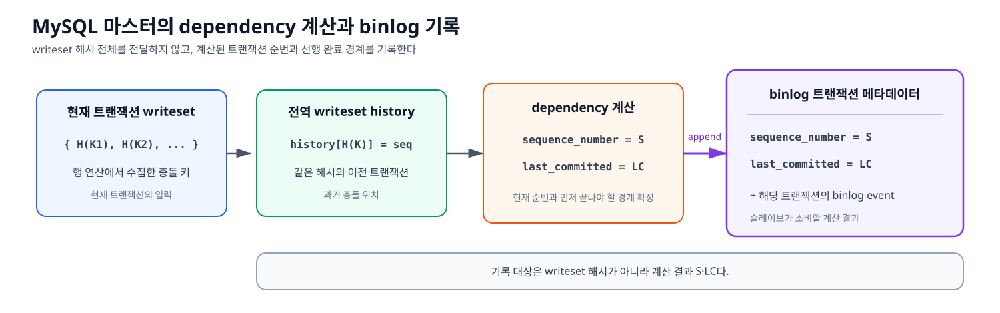

*그림 3-1. 마스터가 writeset과 전역 이력을 비교해 계산한 `sequence_number(S)`와 `last_committed(LC)`를 binlog의 트랜잭션 메타데이터로 기록하는 과정*

지난 writeset PoC에서는 PK가 같은 행의 충돌을 중심으로 병렬화 원리와 결과를 설명했다. 그러나 PK가 다른 행도 UNIQUE 값의 중복과 재사용, FK 부모·자식 관계에 의해 실행 순서가 생길 수 있다. PoC를 본격 설계로 확장하려면 PK 충돌만으로는 충분하지 않으므로, MySQL이 UNIQUE와 FK를 어떤 충돌 키로 표현하고 선행 관계를 만드는지 추가로 조사했다.

이 장은 MySQL 9.7 계열 소스를 기준으로 writeset 처리 흐름과 PK·UNIQUE·FK 처리 방식을 정리한다. 코드 좌표는 `mysql-9.7.0`의 HEAD `845d525d49c8027a4d0cdcc43372c96ba295c857` 기준이다. 이 방식에서 확인된 병렬화 한계와 실측은 뒤 절에서 이어서 다룬다.

> [!NOTE]
> **두 가지 읽기 경로**
> 본문은 알고리즘, 상태 변화, 이슈 시나리오와 실측을 따라 설계 의미를 이해하는 경로다. 실제 소스의 조건·행번호를 검증할 때는 같은 문서의 [통합 부록 10.1](./10-코드-및-실측-부록.md#101-mysql-writeset-코드-근거)을 함께 본다. 그림은 표와 설명을 대체하지 않으며, 상태 관계와 시간선을 먼저 파악하도록 돕는다.

## 3.1 조사 범위와 전체 흐름

PK만 수집해도 같은 행을 변경하는 트랜잭션의 순서는 판정할 수 있다. 하지만 실제 스키마에서는 PK가 다른 행도 다음 제약조건에 의해 연결된다.

- **UNIQUE 값의 중복과 재사용** — 한 트랜잭션이 값을 제거하고 다른 트랜잭션이 같은 값을 사용한다면 적용 순서가 바뀌어서는 안 된다.
- **FK 부모 키에 대한 참조** — 부모 키의 생성·변경·삭제와 자식의 참조 사이에는 무결성을 위한 순서가 필요하다.

또한 UPDATE로 PK·UNIQUE·FK 값이 바뀌면 이전 값의 해제와 새로운 값의 점유를 모두 추적할 수 있도록 변경 전 값과 변경 후 값을 함께 수집해야 한다. 이는 별도의 키 종류가 아니라 변경 시 적용하는 수집 규칙이다.

따라서 본격 설계에서는 PK뿐 아니라 UNIQUE와 FK가 요구하는 순서를 함께 판정해야 한다. 이를 확인하기 위해 MySQL의 키 추출, 해시 생성, 전역 이력 갱신, 슬레이브 적용까지 조사 범위를 넓혔다.

조사 범위는 마스터가 의존성 라벨을 **생성하는 과정**과 슬레이브가 그 라벨을 **소비하는 과정**으로 나뉜다.

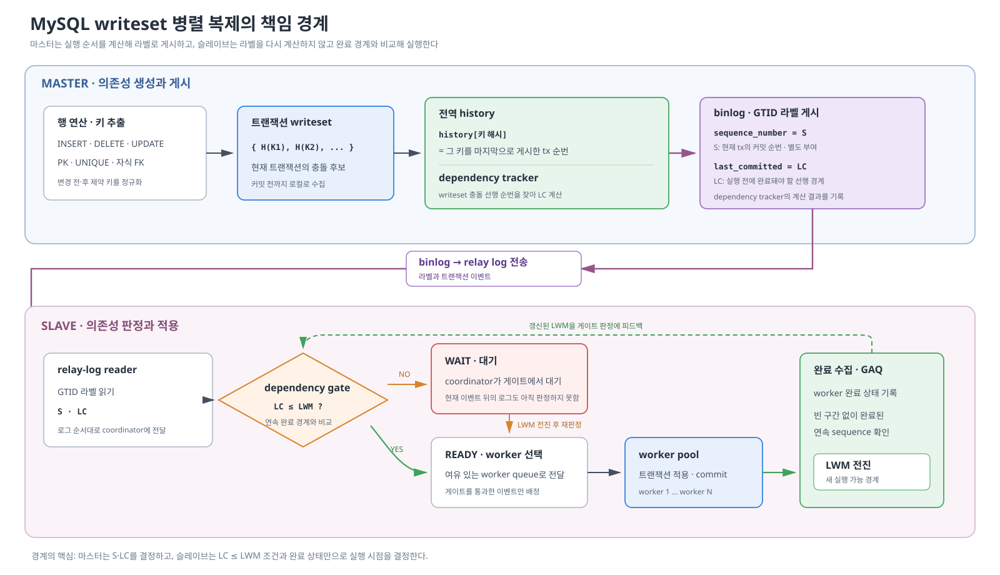

*그림 3-2. 행에서 만든 제약 키 해시가 마스터의 S·LC 라벨로 변환되고 슬레이브의 `LC ≤ LWM` 실행 조건으로 전달되는 책임 경계*

그림의 위쪽은 마스터가 행 연산에서 충돌 키를 수집하고 전역 이력과 비교해 `sequence_number(S)`와 `last_committed(LC)`를 결정하는 책임을 보여준다. 아래쪽은 슬레이브가 이 계산을 재현하지 않고, 전달받은 `LC`를 연속 완료 경계 `LWM`과 비교해 워커 실행 여부를 판정하는 책임을 보여준다. 워커 완료가 수집되어 `LWM`이 전진하면 대기 중인 현재 이벤트를 다시 판정할 수 있다.

병렬성은 다음 두 단계에서 서로 다른 방식으로 감소한다.

* **마스터 — 병렬 실행 자격 감소:** 연속된 트랜잭션의 `last_committed`가 바로 앞 트랜잭션의 `sequence_number`로 계속 기록되면 의존성 사슬이 형성된다.

* **슬레이브 — 실행 기회 지연:** 마스터가 독립 실행을 허용했더라도 코디네이터가 앞선 트랜잭션에서 대기하면, 뒤에서 허용된 병렬 실행도 늦어진다.

다음 절부터 두 현상을 마스터의 의존성 계산과 슬레이브의 실행 스케줄링으로 나누어 코드와 실측을 통해 확인한다.

## 3.2 마스터 — 의존성 라벨을 만드는 과정

MySQL의 writeset 기반 선행 관계는 마스터에서 다음 순서로 만들어진다.

1. **제약 키를 추출한다.** 행이 변경되면 PK를 포함한 UNIQUE 키와 자식 테이블이 부모를 참조하는 FK 키를 수집한다.
2. **트랜잭션 writeset을 만든다.** `add_pke()`가 수집한 키를 정규화해 제약 키 표현으로 조립하고, `generate_hash_pke()`가 이미 조립된 표현을 해시해 현재 트랜잭션의 writeset에 추가한다.
3. **충돌한 선행 트랜잭션을 찾는다.** `get_dependency()`가 각 키 해시를 전역 history와 대조한다. history에는 해당 키 해시를 마지막으로 게시한 트랜잭션의 커밋 순번이 저장돼 있다.
4. **의존성 라벨을 기록한다.** 현재 트랜잭션의 커밋 순번을 `sequence_number(S)`로 부여하고, 충돌 검사로 얻은 선행 완료 경계를 `last_committed(LC)`로 기록한다. 슬레이브는 이 두 값을 이용해 실행 가능 여부를 판정한다.

`sequence_number`는 마스터의 커밋 순번이고, `last_committed`는 이 트랜잭션보다 먼저 완료돼야 하는 선행 커밋 경계를 나타낸다. 두 트랜잭션의 `last_committed`가 같다고 해서 서로 충돌한다는 뜻은 아니다. 반대로 뒤 트랜잭션의 `last_committed`가 앞 트랜잭션의 `sequence_number`를 가리키면 두 트랜잭션은 같은 실행 그룹에 들어갈 수 없다.

MySQL은 먼저 commit-order 기반의 보수적인 선행 관계를 구한 뒤, writeset을 안전하게 사용할 수 있을 때 전역 해시 이력을 이용해 그 범위를 줄인다. 따라서 writeset을 사용할 수 없는 트랜잭션은 병렬 실행의 정확성을 포기하는 것이 아니라 더 보수적인 commit-order로 돌아간다.

### 3.2.1 키 수집과 의존성 계산 알고리즘

**Algorithm 1: 행 연산에서 트랜잭션 writeset 만들기**

Algorithm 1은 그림 3-3과 같이 행 이미지에서 충돌 키와 폴백 상태를 수집한다.

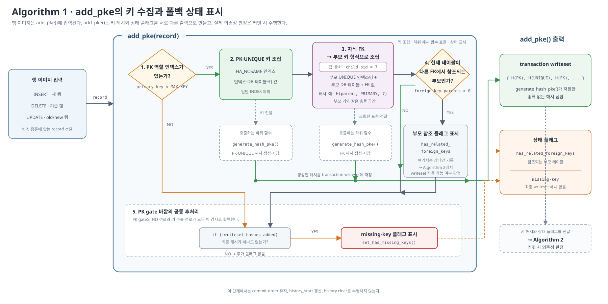

*그림 3-3. `add_pke()`가 행 이미지에서 키 해시와 폴백 상태를 각각 만들어 커밋 시 의존성 판정에 넘기는 구조*

그림의 왼쪽은 연산이 키 수집에 제공하는 행 이미지를 구분한다. INSERT는 새 행, DELETE는 기존 행을 사용하고, UPDATE는 변경 전·후 행을 모두 사용해 이전 키의 해제와 새 키의 점유를 함께 추적한다.

PK·UNIQUE는 현재 테이블의 인덱스명과 DB·테이블, 정규화한 키 값으로 충돌 식별자를 만든다. 반면 자식 테이블에 선언된 FK는 자식 테이블의 키 공간이 아니라 **참조 대상 부모의 UNIQUE 인덱스명과 부모 DB·테이블**을 사용한다. 예를 들어 `child.pid=7 → parent.id=7`은 `H(parent, PRIMARY, 7)` 형태로 만들어 부모 키와 같은 충돌 공간에서 만난다.

두 경로에서 완성된 식별자는 같은 `xxHash64` 함수를 거쳐 하나의 transaction writeset에 들어간다. MySQL writeset은 해시가 PK·UNIQUE·FK 중 어디에서 왔는지나 참조·변경 역할을 별도로 보존하지 않는다. 이후 의존성 추적은 이 종류 없는 해시 집합만을 사용한다.

그림 하단은 writeset을 사용할 수 없다고 표시한 뒤 커밋 시 폴백하는 조건을 보여준다. `add_pke()`의 키 추출은 PK 역할 인덱스가 있는 경우에만 진입한다. 이 게이트 안에서 PK·UNIQUE를 수집하고 자식 테이블이 부모를 참조하는 FK 키까지 추출한 다음, 현재 변경 테이블이 다른 FK에서 참조되는 부모인지 확인해 `has_related_foreign_keys`를 표시한다. 이 시점에 writeset을 즉시 폐기하지는 않는다. PK 역할 인덱스가 없어 게이트에 진입하지 못하면 바깥의 검사에서 `missing-key`가 표시된다. **커밋 시 `missing-key` 또는 `has_related_foreign_keys`가 표시된 트랜잭션은 해시로 `last_committed`를 낮추지 않고 보수적인 commit-order 값을 사용한다.** 다만 **`missing-key` 폴백은 기존 history를 유지하고, FK 부모 변경을 나타내는 `has_related_foreign_keys` 폴백은 `history_start`를 올린 뒤 history를 비운다.**

**Algorithm 2: 커밋 시 의존성 라벨 만들기**

Algorithm 2는 그림 3-4와 같이 commit-order가 계산한 `S`와 초기 선행 경계 `C`에서 시작한다. writeset을 안전하게 사용할 수 있을 때만 해시 이력으로 `C`를 낮추고, 사용할 수 없으면 보수적인 commit-order 값을 유지한다.

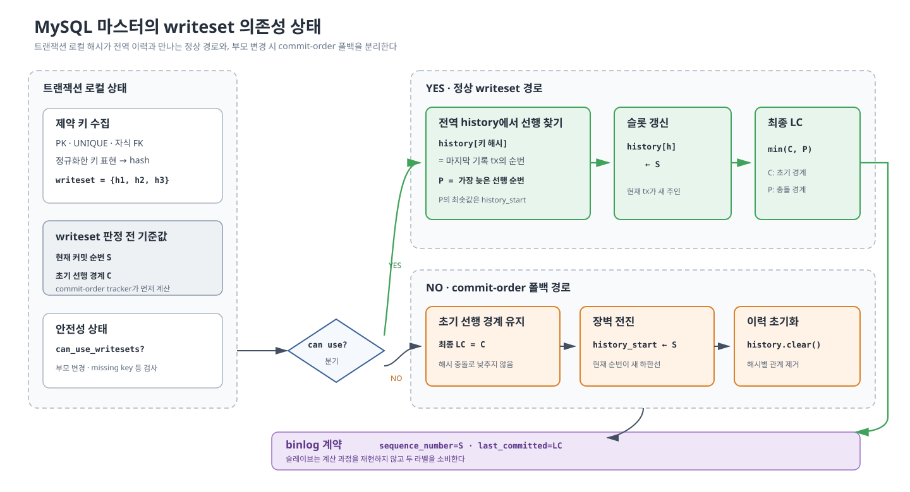

*그림 3-4. writeset을 사용할 수 있으면 LC를 실제 키 충돌까지 낮추고, 사용할 수 없으면 commit-order를 유지하며 필요한 경우 전역 이력 장벽을 남기는 두 분기*

- `S`: 현재 트랜잭션의 커밋 순번
- `C`: commit-order가 계산한 초기 선행 경계
- `P`: `history_start`와 현재 writeset의 동일 해시에서 찾은 마지막 게시 순번 중 가장 늦은 값
- `LC`: binlog에 기록할 최종 선행 완료 경계

세 경로의 계산과 history 처리는 다음과 같다.

| 경로 | 최종 LC | 현재 해시 게시 | `history_start`와 history |
|---|---|---|---|
| 정상 writeset | `min(C,P)` | 각 `history[h]`를 `S`로 갱신 | 기존 이력 유지 |
| `missing-key` | `C` | 게시할 키 없음 | 기존 이력 유지 |
| FK 부모·history 용량 초과 | `C` | 게시하지 않음 | `history_start=S`, history 초기화 |

정상 경로는 실제 해시 충돌 위치까지 선행 경계를 낮춰 병렬 실행 자격을 넓힌다. 두 폴백 경로는 모두 `LC=C`를 사용하지만, 그림 3-4의 장벽 전진과 이력 초기화는 FK 부모·history 용량 초과에만 적용된다.

각 단계에 대응하는 실제 함수와 소스 코드는 [통합 부록 10.1](./10-코드-및-실측-부록.md#101-mysql-writeset-코드-근거)에서 확인한다.

`commit_parent`가 binlog에 `last_committed`로 기록되는 값이다. 낮을수록 더 많은 트랜잭션과 병렬로 적용되며, writeset의 역할은 이 값을 안전한 범위에서 낮추는 것이다.

### 3.2.2 PK·UNIQUE 처리 규칙

MySQL에서 PK는 별도의 writeset 알고리즘으로 처리되지 않는다. `add_pke()`는 `HA_NOSAME` 속성을 가진 인덱스를 순회하며 PK와 UNIQUE 인덱스를 같은 UNIQUE 계열로 수집한다.

UNIQUE 값은 PK가 다른 행 사이에도 실행 순서를 만든다. 예를 들어 한 트랜잭션이 `email='X'`인 행을 삭제하고 다음 트랜잭션이 다른 PK로 같은 값을 삽입한다면, PK만 비교해서는 두 트랜잭션이 독립으로 보인다. 그러나 삽입이 먼저 적용되면 UNIQUE 위반이 발생하므로 `email='X'`도 같은 충돌 키로 연결해야 한다.

다음은 UNIQUE 값 재사용에 필요한 순서를 보여주는 시나리오다.

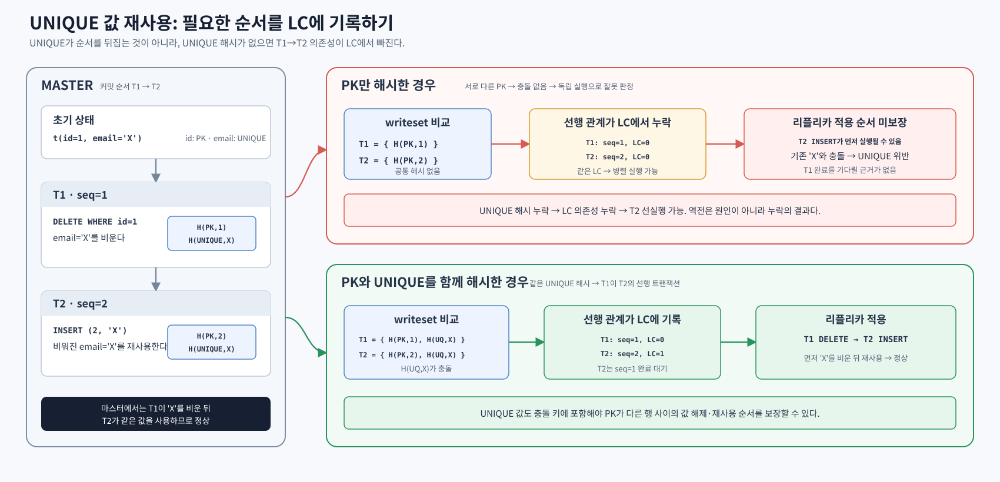

*그림 3-5. PK가 다른 DELETE와 INSERT도 UNIQUE 해시가 같으면 값 제거 후 재사용 순서가 LC에 기록됨을 보여주는 대조*

그림의 핵심은 해시 대상에 따라 LC가 달라진다는 점이다. PK만 해시하면 두 PK 해시가 겹치지 않아 T1과 T2가 각각 `seq=1, LC=0`과 `seq=2, LC=0`으로 기록되므로 병렬 실행이 가능하다. UNIQUE 값도 해시하면 `H(UNIQUE email,'X')`가 충돌해 T2가 `seq=2, LC=1`로 기록되고 T1→T2 선행 관계가 생긴다. 이 LC가 실행 순서를 만드는 이유는 슬레이브 코디네이터가 LC와 LWM을 다음과 같이 비교하기 때문이다.

**LC/LWM 실행 가능 조건**

```text
LC(T) <= LWM  → 실행 가능
LC(T) >  LWM  → 완료 경계가 전진할 때까지 대기
```

LWM(Low-Water Mark)은 해당 순번 이하의 모든 트랜잭션이 적용 완료됐음을 나타내는 연속 완료 경계다. T1의 `seq=1`, T2의 `seq=2`, `LC=1`인 경우 판정은 다음과 같이 변한다.

**예제 3-1 — T1 완료 전후에 달라지는 T2의 LC/LWM 판정**

```text
T1 완료 전: LWM=0, LC(T2)=1 > 0  → T2 대기
T1 완료 후: LWM=1, LC(T2)=1 <= 1 → T2 실행 가능
```

따라서 T2의 `LC=1`은 T1을 트랜잭션 ID로 직접 가리킨다는 뜻이 아니라, **`seq=1`까지 적용 완료 경계가 전진해야 T2를 실행할 수 있다**는 뜻이다. 이 예시에서 `seq=1`은 T1이므로, 리플리카는 T1이 `email='X'`를 제거한 뒤 T2가 같은 값을 재사용하는 순서를 보존한다.

UNIQUE 제약에서 실제로 충돌하는 값은 writeset에서도 같은 해시로 표현되어야 한다. MySQL은 이를 위해 다음과 같이 수집한다.

- `UNIQUE (a, b)`와 같은 복합 키는 `a`와 `b`를 합쳐 해시 하나를 만든다. 컬럼별 해시를 따로 만들지 않는다.
- UNIQUE 키의 일부가 NULL이면 같은 형태의 행이 여러 개 존재할 수 있으므로 해당 키는 writeset에서 제외한다.
- 대소문자를 구분하지 않는 collation에서 `'abc'`와 `'ABC'`가 같은 값이라면, 두 값도 같은 해시가 되도록 정규화한다.
- UPDATE로 UNIQUE 값이 `X`에서 `Y`로 바뀌면 이전 값 `X`와 새로운 값 `Y`를 모두 수집한다. 그래야 다른 트랜잭션이 `X`를 재사용하거나 `Y`를 사용하는 경우에도 적용 순서를 연결할 수 있다.

복합 키는 부록 [A.2](./10-코드-및-실측-부록.md#1012-코드-2--pke-조립-add_pke의-pkunique-경로-sqlrpl_write_set_handlercc942-1043)의 키 구성 컬럼 루프(`:949-950`)와 루프 뒤의 단일 해시 호출(`:1031-1043`), NULL 제외는 `:956`과 `:1031`, collation 정규화는 `make_sort_key()` 호출(`:971-984`)에서 확인할 수 있다. UPDATE는 `sql/handler.cc:8093-8097`에서 변경 후·변경 전 레코드를 모두 `add_pke()`에 전달한다. 해당 코드는 부록 [A.11](./10-코드-및-실측-부록.md#10111-update의-변경-전후-키-수집)에 수록한다.

### 3.2.3 FK 처리

다음 스키마에서 `child.pid`는 `parent.id`를 참조한다.

```sql
CREATE TABLE parent (
  id INT PRIMARY KEY
);

CREATE TABLE child (
  id  INT PRIMARY KEY,
  pid INT,
  FOREIGN KEY (pid) REFERENCES parent(id)
);
```

실제 데이터 연산에서 `child.pid=7`은 자식 행의 `pid` 컬럼에 값 `7`을 저장하는 INSERT다. 이때 FK 검사는 참조 대상인 `parent.id=7`이 존재하는지 확인한다. 부모 행이 없으면 자식 INSERT는 FK 위반으로 실패하며, 이 과정에서 부모 행의 값은 변경되지 않는다.

부모가 존재해 자식 INSERT가 허용되면 writeset 추출은 별도로 자식의 FK 값 `7`에 참조 대상 부모 테이블과 UNIQUE 인덱스의 식별 정보를 붙여 충돌 키를 만든다. 따라서 `child.pid=7`은 writeset에서 `H(child, pid, 7)`이 아니라 `H(parent, PRIMARY, 7)`로 표현되고, `parent.id=7`의 변경에서 생성한 해시와 같은 충돌 공간에서 비교된다. 이는 부모 변경과 자식 참조 사이의 선행 관계를 찾기 위한 표현이며, 부모 값을 읽어 자식 컬럼을 갱신하거나 부모 행을 변경한다는 뜻이 아니다.

다만 부모 역할과 자식 역할은 처리 방식이 다르다.

| 변경 역할 | MySQL 처리 | 목적 |
|---|---|---|
| 자식 테이블의 FK 참조 | 부모 키 형식의 FK 해시를 writeset에 추가한다. | 부모 키와 자식 참조 사이의 관계를 식별한다. |
| FK가 참조하는 부모 테이블의 변경 | 관련 FK가 있음을 표시하고 writeset 최적화 대신 commit-order로 폴백한다. | 전역 이력만으로 놓칠 수 있는 부모·자식 순서를 보수적으로 보장한다. |

두 경로가 어느 트랜잭션에서 실행되는지는 다음 시나리오로 구분할 수 있다.

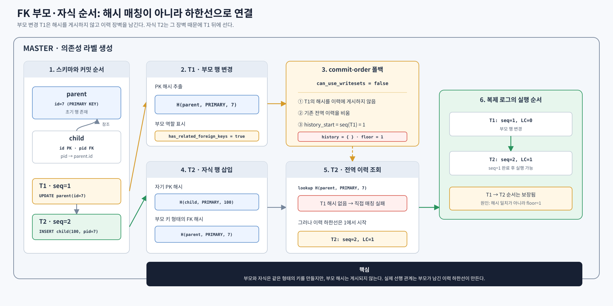

*그림 3-6. 부모 변경과 자식 참조의 순서는 직접적인 해시 매칭이 아니라 부모가 남긴 `history_start` 장벽으로 보장됨을 보여주는 시나리오*

부모 테이블 변경은 항상 자식과 직접 같은 해시를 찾아 의존성을 만드는 방식이 아니다. writeset 사용이 비활성화되면서 commit-order 경계가 적용되고 전역 이력이 정리되는 경로가 순서를 보장한다. 따라서 binlog의 `last_committed`만 관찰해 부모와 자식이 이어졌다고 해서 이를 직접 해시 일치의 결과로 해석하면 안 된다.

이 폴백은 정합성을 우선하는 보수적 처리다. 그러나 부모 변경과 무관한 트랜잭션까지 같은 commit-order 경계의 영향을 받을 수 있으므로 병렬성은 감소할 수 있다.

그림 3-6의 **2→3번은 부모 테이블 변경을 표시하고 commit-order로 폴백하는 과정**으로 3.2.3.1에서 설명한다. **4→5번은 자식 FK 해시를 만들고 전역 history에서 선행 순번을 찾는 과정**으로 3.2.3.2에서 설명한다.

#### 3.2.3.1 부모 변경과 commit-order 폴백

부모 테이블 변경에 대한 폴백은 추출 시점의 상태 표시와 커밋 시점의 실제 처리로 나뉜다.

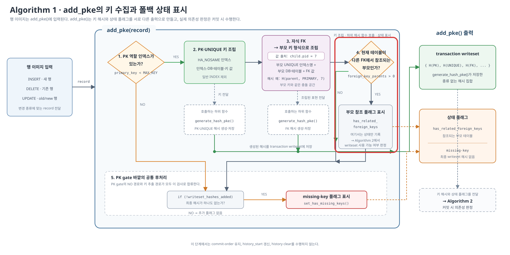

*그림 3-7. 변경 테이블이 FK의 부모인지 확인한 결과는 상태로만 남고 실제 commit-order 폴백은 커밋 시점에 결정되는 지점*

* **추출 시점:** `add_pke()`는 현재 변경 테이블이 다른 FK에서 참조되는 부모이면 `has_related_foreign_keys` 상태를 표시한다. 이 단계에서는 writeset을 폐기하거나 전역 이력을 변경하지 않는다.

* **커밋 시점:** `Writeset_trx_dependency_tracker::get_dependency()`는 이 상태를 확인하고 정상 writeset 경로를 건너뛴다. 이에 따라 `commit_parent`를 writeset으로 낮추지 않고, 현재 트랜잭션의 해시도 전역 이력에 게시하지 않는다. 대신 현재 sequence를 새 `history_start`로 설정하고 기존 이력을 비운다.

`history_start`는 전역 history가 초기화된 시점의 sequence를 보존하는 경계다. history를 비우면 이전 트랜잭션의 키별 sequence를 더 이상 조회할 수 있으므로, 이후 트랜잭션의 writeset 선행 순번이 이 값보다 앞까지 내려가지 않게 한다. 따라서 `history_start`는 특정 키의 충돌을 나타내는 값이 아니라, 지워진 이력을 대신하는 보수적인 전역 장벽이다.

이 폴백은 CASCADE·RESTRICT·SET NULL 같은 FK 동작 종류를 구분하지 않고, 다른 FK에서 참조되는 부모 테이블의 행을 변경하면 적용된다. 다만 완전 직렬화를 의미하지는 않으며, 같은 커밋 그룹에 속한 트랜잭션 사이의 commit-order 병렬성은 남을 수 있다. 처리 흐름은 3.2.1에서, 실제 코드는 부록 [A.4](./10-코드-및-실측-부록.md#1014-코드-4--get_dependency-의존성-추적의-상위-진입점-sqlrpl_trx_trackingcc336-343)와 A.6에서 확인한다.

[MySQL WL#9556 FR13](https://dev.mysql.com/worklog/task/?id=9556)은 FK 관계에서 부모 테이블에 영향을 주는 트랜잭션을 `COMMIT_ORDER`로 되돌리고 필요할 때 writeset 이력을 비우도록 요구한다. 즉, MySQL이 이 동작을 보수적 정합성 규칙으로 채택했다는 사실은 명확하다. 그러나 WL은 이 정책이 필요한 구체적인 실패 시나리오와 전체 설계 근거까지 설명하지 않는다. 추가로 조사한 FK 관련 이슈들도 각각 폴백 누락이나 과직렬화 같은 현상과 구현 경계를 보여줄 뿐, 이 정책을 선택한 이유를 직접 제시하지는 않는다.

따라서 다음 해석은 코드, 관련 이슈와 재현·실측을 종합한 **분석상의 추정**이다. MySQL은 부모 변경이 다른 테이블에 미치는 간접 영향이나 writeset 해시만으로는 누락될 수 있는 선행 관계를 안전하게 막기 위해, 정밀한 충돌 판정보다 commit-order 경계와 이력 초기화를 선택한 것으로 볼 수 있다.

#### 3.2.3.2 자식 FK 추출과 공통 history 판정

앞에서 만든 자식 FK 해시도 PK·UNIQUE 해시와 같은 전역 history에서 처리된다.

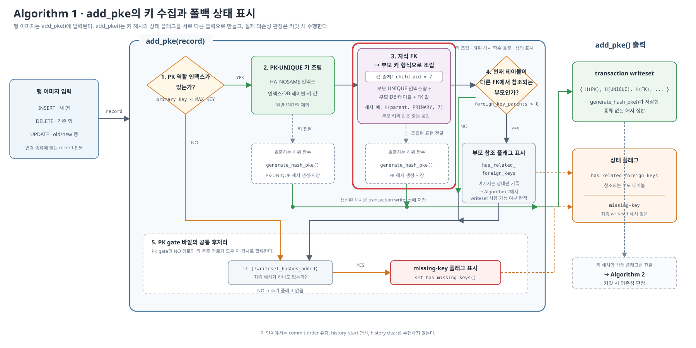

*그림 3-8. 자식 FK 값이 부모의 인덱스·DB·테이블 식별자를 사용해 부모 키와 같은 해시 공간에 들어가는 지점*

정상 writeset 경로는 `history_start`를 선행 순번의 시작값으로 두고 현재 writeset의 각 해시를 전역 이력과 대조한다. 같은 해시가 있으면 그 해시를 마지막으로 게시한 트랜잭션의 sequence를 찾고, 모든 해시에서 얻은 값 중 가장 늦은 sequence를 선행 순번으로 선택한다. 이후 각 해시 슬롯을 현재 트랜잭션의 sequence로 갱신하며, 처음 발견한 해시는 현재 sequence로 새로 등록한다.

첫 번째 자식이 커밋하면 `history[FK 해시]`에 자신의 sequence를 기록하고, 같은 부모를 참조하는 다음 자식은 이 값을 선행 순번으로 선택해 `last_committed`에 반영한 뒤 같은 슬롯을 자신의 sequence로 갱신한다. 이 과정이 반복되면 서로 변경 충돌이 없는 자식들 사이에도 앞 자식의 sequence를 기다리는 의존성 사슬이 만들어진다. 실제 FK 해시 조립은 부록 [A.5](./10-코드-및-실측-부록.md#1015-자식-fk-추출-코드), 이력 조회·갱신은 부록 [A.6](./10-코드-및-실측-부록.md#1016-전역-이력의-충돌-판정과-부모-변경-폴백)에 수록한다. 구체적인 history 상태 변화는 3.3.1의 그림과 실측에서 확인한다.

다음 절에서는 부모 폴백 장벽과 동일 FK 해시의 갱신이 실제 의존성과 병렬성에 어떤 결과를 만드는지 사례와 실측으로 확인한다.

## 3.3 마스터 측 한계 — FK 과직렬화와 정확성 경계

마스터 측 한계는 두 종류다. 첫째, 필요한 FK 순서보다 큰 `last_committed`를 기록해 병렬 실행 자격을 과도하게 줄일 수 있다. 둘째, 지원 경계에서는 필요한 FK 선행 관계가 반대로 누락될 수 있다. 앞 절의 코드가 만드는 두 결과를 이슈와 실측에 인접시켜 확인한다.

### 3.3.1 부모 폴백 장벽과 자식의 과직렬화

앞 절에서 확인한 두 경로는 서로 다른 방식으로 병렬성을 줄인다. 부모 테이블 변경은 이력 하한선을 올려 뒤의 무관한 트랜잭션까지 부모 이전으로 내려가지 못하게 하고, 동일한 FK 해시의 조회와 갱신은 같은 부모를 참조하는 자식 트랜잭션들을 서로 연결한다.

[MySQL Bug #110071](https://bugs.mysql.com/bug.php?id=110071)은 이 가운데 자식의 FK 해시 때문에 **같은 부모 값을 참조하는 자식 INSERT들이 서로 직렬화되는 문제**다. 2023년 2월 Verified 상태가 됐으며, 사전조사 시점에 확인한 공개 이슈 코멘트에서는 MySQL 8.0.46과 8.4.11에서도 문제가 남아 있었다.

이 문제는 부모 변경 시 적용하는 commit-order 폴백이 아니라, writeset을 정상적으로 사용하는 자식 트랜잭션끼리 같은 FK 해시를 공유해서 발생한다.

다음 입력에서는 T4와 T5가 서로 다른 자식 행을 삽입하므로 행 쓰기 충돌이 없다. 두 트랜잭션이 공유하는 것은 `bparent.id=1`을 참조한다는 사실뿐이다.

**예제 3-2 — 동일한 부모를 참조하는 두 자식 INSERT 시나리오**

```sql
CREATE TABLE ta      (id INT PRIMARY KEY);
CREATE TABLE bparent (id INT PRIMARY KEY);
CREATE TABLE tc      (id INT PRIMARY KEY);
CREATE TABLE bchild (
  id INT PRIMARY KEY,
  parent_id INT,
  FOREIGN KEY (parent_id) REFERENCES bparent(id)
);

-- 각각 별도 트랜잭션으로 실행하고 T1~T5 순서로 커밋
-- T1: 부모와 무관
INSERT INTO ta VALUES (1);
-- T2: 참조당하는 부모 변경
INSERT INTO bparent VALUES (1);
-- T3: 부모와 무관
INSERT INTO tc VALUES (1);
-- T4: 첫 번째 자식
INSERT INTO bchild VALUES (101, 1);
-- T5: 두 번째 자식
INSERT INTO bchild VALUES (102, 1);
```

순차 커밋에서 코드상 예상한 `last_committed`는 다음과 같으며, 같은 시나리오를 MySQL 9.7.2에서 실행한 binlog 실측도 `0, 1, 2, 2, 4`로 일치했다.

| seq | 트랜잭션 | `last_committed` | 판정 이유 |
|---:|---|---:|---|
| 1 | T1: 무관한 A | 0 | 선두 트랜잭션 |
| 2 | T2: 부모 | 1 | commit-order 폴백 후 하한선을 2로 올림 |
| 3 | T3: 무관한 C | **2** | 키 충돌은 없지만 T2의 하한선에 걸림 |
| 4 | T4: 첫 번째 자식 | **2** | 부모 해시 매칭이 아니라 T2의 하한선에 걸림 |
| 5 | T5: 두 번째 자식 | **4** | T4가 게시한 동일한 FK 해시와 충돌 |

필요한 순서는 부모 T2→자식 T4·T5뿐이다. 그러나 순차 커밋에서는 무관한 T1→T2와 T2→T3, 자식 T4→T5 의존성까지 추가된다.

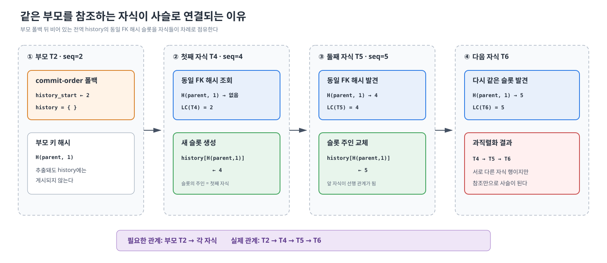

*그림 3-9. 같은 부모를 참조하는 각 자식이 동일 FK 해시 슬롯을 자신의 sequence로 덮어써 형제 간 직렬 사슬을 만드는 원리*

그림은 표의 T2·T4·T5 관계를 전역 이력 상태로 풀어낸다. 부모 T2의 폴백 직후에는 `history_start=2`이고 맵은 비어 있다. 첫째 자식 T4가 부모 키 형태의 FK 해시 슬롯을 sequence 4로 만들고, 둘째 자식 T5가 그 슬롯을 찾아 `LC=4`를 얻은 뒤 주인을 sequence 5로 바꾼다. 같은 부모를 참조하는 다음 자식도 sequence 5를 기다리므로, 필요한 부모→자식 관계가 자식→자식 사슬로 확대된다.

#### 3.3.1.1 부모 하한선과 형제 직렬이 만들어지는 메커니즘

이력 맵은 해시당 슬롯이 하나이며 “그 해시를 마지막으로 남긴 트랜잭션의 seq”를 저장하고, 조회에 성공한 트랜잭션도 주인을 자기로 덮어쓴다(부록 [A.6](./10-코드-및-실측-부록.md#1016-전역-이력의-충돌-판정과-부모-변경-폴백)의 코드 6). 그리고 부모 쓰기는 폴백 때문에 자기 키 해시를 맵에 등록하지 못하므로, “부모 키 모양의 해시” 자리를 처음 차지하는 것은 부모가 아니라 **첫째 자식의 FK 해시**다. 이 둘이 결합해 형제 사슬이 만들어진다.

**예제 3-3 — 부모 폴백 이후 자식 T4·T5·T6이 동일 FK 해시 슬롯을 이어받는 과정**

```text
(부모 T2가 폴백 + clear. 하한선=2, 맵은 비어 있음)

T4 (bchild id=101 삽입, fk=1) 커밋:
  조회 H(bparent,1) → 없음 → lc = 하한선(2)
  등록: H(bchild,101)→4,  H(bparent,1)→4
        ← 자기 PK 해시와 "부모 키 모양의 FK 해시"를 둘 다 이력에 등록

T5 (bchild id=102 삽입, fk=1) 커밋:
  조회 H(bparent,1) → 있음, 주인 = 4        ← 부모 키 모양이지만 주인은 형제!
  lc = 4 (T4 뒤로 직렬). 주인을 5로 갱신

T6 (같은 부모를 참조하는 자식이 또 오면):
  주인 = 5 → lc = 5                          ← 부채꼴이 아니라 사슬로 늘어섬
```

원인은 둘이다. ① 부모가 폴백으로 자기 해시를 등록하지 못한다. ② 조회한 트랜잭션이 주인을 자기로 덮어쓴다. ②는 같은 행을 쓰는 진짜 쓰기 충돌에는 올바른 규칙이지만, 행을 쓰는 게 아니라 **가리키기만 하는 참조**에까지 같은 규칙이 적용되어 형제끼리 얽힌다.

#### 3.3.1.2 MySQL 9.7.2 실측

MySQL 9.7.2의 마스터·레플리카 환경에서 부모 10만 행을 한 트랜잭션으로 넣고, 자식 10만 행은 5만 행씩 두 트랜잭션으로 나누어 부모→자식 Tx1→자식 Tx2 순서로 커밋했다. 레플리카는 `replica_parallel_workers=10`, `LOGICAL_CLOCK`, `replica_preserve_commit_order=ON`으로 구성했다.

두 시나리오는 자식의 `parent_id`만 다르다. 부모행 분리 대조군에서는 Tx1과 Tx2가 서로 겹치지 않는 부모 행 범위를 참조하고, 부모행 공유 실험군에서는 두 트랜잭션의 모든 자식이 같은 `parent_id=1`을 참조한다. 로그 전달 시점이 결과에 섞이지 않도록 세 트랜잭션이 relay log에 도착한 것을 확인한 뒤 SQL 스레드를 시작했다.

| 트랜잭션 | 부모행 분리 대조군 | 부모행 공유 실험군 |
|---|---:|---:|
| 부모 (`seq=1`) | `LC=0` | `LC=0` |
| 자식 Tx1 (`seq=2`) | `LC=1` | `LC=1` |
| 자식 Tx2 (`seq=3`) | **`LC=1`** | **`LC=2`** |

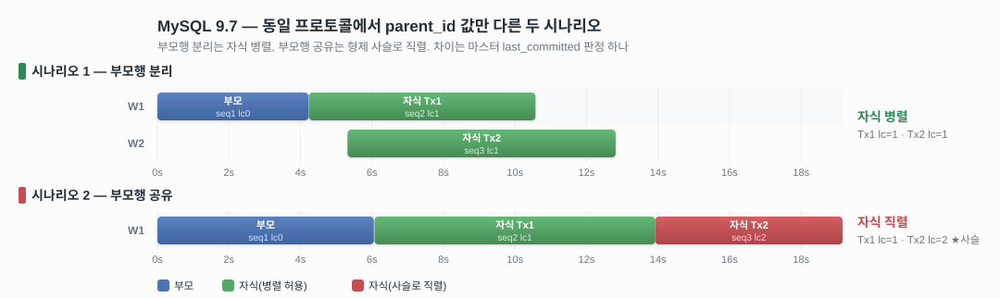

*그림 3-10. 부모 키 공유만으로 둘째 자식의 LC가 1에서 2로 증가하고 워커 실행 구간의 중첩이 사라진 MySQL 9.7.2 실측 대조*

그림은 위 의존성 라벨과 레플리카 워커에서 측정한 적용 구간을 함께 보여준다. 정확한 시간값은 다음과 같다.

| 트랜잭션 | 부모행 분리 대조군 | 부모행 공유 실험군 |
|---|---|---|
| 부모 | W1, 0.000~4.228초 | W1, 0.000~6.052초 |
| 자식 Tx1 | W1, 4.235~10.572초 | W1, 6.071~13.919초 |
| 자식 Tx2 | **W2, 5.315~12.814초** | **W1, 13.922~19.160초** |

부모행 분리 대조군에서는 두 자식의 `LC`가 모두 1이고, 서로 다른 워커에서 5.26초 동안 겹쳐 실행됐다. 부모행 공유 실험군에서는 자식 Tx2의 `LC`가 앞선 자식 Tx1의 `seq=2`로 올라갔고, Tx1이 끝난 뒤 같은 워커에서 실행됐다. PK가 다른 자식 행을 변경했는데도 같은 부모 키를 참조했다는 이유로 형제 사슬이 생긴 것이다.

이 결과는 한 번 수행한 비교 실험이다. 따라서 그림의 절대 실행 시간을 일반적인 성능 수치로 해석하지 않는다. 다만 두 시나리오에서 트랜잭션 크기·커밋 순서·적용 절차를 같게 하고 `parent_id`의 공유 여부만 바꿨으므로, `LC=1→2` 변화와 자식 실행 구간의 비중첩은 동일 FK 해시가 만든 직렬 의존성을 확인하는 근거로 사용할 수 있다.

### 3.3.2 FK 처리의 추가 정확성 경계

#### 3.3.2.1 Bug #109923 — PK 없는 부모의 FK 장벽 누락

[MySQL Bug #109923](https://bugs.mysql.com/bug.php?id=109923)은 부모의 보조 인덱스를 참조하는 FK에서 자식 행의 `last_committed`가 실제보다 작게 계산되어, 리플리카가 자식을 부모보다 먼저 적용하고 `HA_ERR_NO_REFERENCED_ROW`로 SQL 스레드를 중단하는 문제다.

근본 원인은 FK 부모 장벽을 만들도록 표시하는 `set_has_related_foreign_keys()` 호출이 “PK가 있는 테이블만 진입하는 블록” 안에 있다는 점이다.

실제 소스에서는 부모 변경 상태를 표시하는 호출이 PK 존재 여부를 검사하는 블록 안에 있다. 따라서 PK가 없는 부모는 `missing-key` 폴백으로 자신의 `last_committed`에는 commit-order 값을 사용하지만, `history_start`를 부모의 sequence로 올리고 history를 비우는 FK 부모 장벽은 만들지 못한다. 이 장벽이 없으면 뒤의 자식 트랜잭션에서 부모보다 앞선 값까지 `last_committed`가 낮아질 수 있고, 리플리카에서 부모의 완료를 기다리지 않은 채 자식이 먼저 실행될 수 있는 조건이 만들어진다. 조건과 원본 행번호는 부록 [A.7](./10-코드-및-실측-부록.md#1017-bug-109923의-pk-게이트와-부모-폴백-플래그)에 수록한다.

Bug #109923에서 보고된 원래 구성은 PK 없는 부모의 비유니크 일반 인덱스를 자식 FK가 참조하는 형태였다.

**예제 3-4 — Bug #109923에서 문제가 된 PK 없는 부모의 일반 KEY 참조**

```sql
CREATE TABLE parent (
  did INT,
  KEY (did)                 -- PK·UNIQUE가 아닌 일반 보조 인덱스
);

CREATE TABLE child (
  id INT PRIMARY KEY,
  did INT,
  FOREIGN KEY (did) REFERENCES parent(did)
);
```

이 구성에서는 부모에 PK가 없어 부모 변경을 표시하는 코드가 PK 게이트를 통과하지 못한다. 그 결과 부모 트랜잭션이 자식의 `last_committed`에 포함되지 않을 수 있다. MySQL 9.7.2의 기본값인 `restrict_fk_on_non_standard_key=ON`은 이와 같은 비유니크 키 참조 DDL을 `ERROR 6125`로 차단한다. 다만 이는 writeset의 PK 게이트를 수정한 결과가 아니며, 기존 스키마나 해당 설정을 `OFF`로 둔 환경에서는 원래 코드 경로를 구분해 보아야 한다.

반면 **PK 없는 부모의 완전한 UNIQUE 키를 참조하는 FK는 MySQL 9.7.2 기본 설정에서도 합법**이다. 따라서 다음 실측은 Bug #109923의 비유니크 `KEY` 스키마를 그대로 재현한 것이 아니라, 같은 PK 게이트 결함이 현재 허용되는 `UNIQUE KEY` 구성에도 남아 있는지 검증한 별도 사례다.

MySQL 9.7.2에서 부모의 PK 유무만 달리한 같은 네 트랜잭션을 실행한 결과는 다음과 같다.

**예제 3-5 — PK 없는 UNIQUE 부모와 PK 부모의 FK 의존성 라벨 대조 스키마**

```sql
-- 실험군: PK 없는 부모, UNIQUE만 존재
CREATE TABLE parent2 (did INT, name VARCHAR(10), UNIQUE KEY (did));
CREATE TABLE child2  (id INT PRIMARY KEY, did INT,
                      FOREIGN KEY (did) REFERENCES parent2(did));

-- 대조군: PK 있는 부모
CREATE TABLE parent3 (did INT PRIMARY KEY, name VARCHAR(10));
CREATE TABLE child3  (id INT PRIMARY KEY, did INT,
                      FOREIGN KEY (did) REFERENCES parent3(did));

-- 각 그룹에서 순차 4커밋
INSERT INTO ta VALUES (1);            -- T1 무관
INSERT INTO parent_ VALUES (7,'c');   -- T2 부모
INSERT INTO tc VALUES (1);            -- T3 무관
INSERT INTO child_ VALUES (3, 7);     -- T4 자식
```

| seq | 트랜잭션  | 실험군: PK 없음 | 대조군: PK 있음 |
| --- | ----- | ---------: | ---------: |
| 1   | T1 무관 |          0 |          0 |
| 2   | T2 부모 |          1 |          1 |
| 3   | T3 무관 |          1 |      **2** |
| 4   | T4 자식 |      **1** |      **2** |

대조군에서는 `T4.last_committed=2`로 부모 T2의 완료를 기다린다. 반면 MySQL 9.7.2의 실험군 binlog 실측에서는 `T4.last_committed=1`이 부모 `T2.sequence_number=2`보다 작게 기록되는 것을 확인했다. 이는 자식의 의존성 라벨에 부모 트랜잭션이 포함되지 않았음을 의미한다. 실제 적용 순서는 worker 스케줄링에 따라 달라지므로 항상 오류가 발생하는 것은 아니지만, 자식이 부모보다 먼저 적용되어 FK 오류가 발생할 가능성이 생긴다.

#### 3.3.2.2 Bug #97836 — 복합 PK의 선행 접두사 참조

[MySQL Bug #97836](https://bugs.mysql.com/bug.php?id=97836)은 부모가 복합 PK `(a,b,c)`를 가지고 있지만 자식 FK가 선행 접두사 `a`만 참조하는 구성에서, 그룹 복제 세컨더리가 자식을 부모보다 먼저 적용해 applier가 그룹에서 이탈하는 문제다.

문제가 보고된 스키마 형태는 다음과 같다.

**예제 3-6 — 복합 PK의 선행 접두사만 참조하는 비표준 FK 스키마**

```sql
CREATE TABLE parent (
  a INT,
  b INT,
  c INT,
  PRIMARY KEY (a, b, c)
);

CREATE TABLE child (
  id INT PRIMARY KEY,
  parent_a INT,
  FOREIGN KEY (parent_a) REFERENCES parent(a)
);
```

부모의 복합 PK는 `(a,b,c)` 전체를 이어붙인 해시 하나지만 자식은 `a`만 해시하므로 두 해시는 일치하지 않는다. MySQL 8.4 이후에는 `restrict_fk_on_non_standard_key` 기본값으로 이런 비표준 FK 생성을 차단한다. 이 문제는 그룹 복제 경로의 공개 이슈이며 이번 비동기 복제 실측에는 포함하지 않았다.

> [!NOTE]
> **MySQL 9.7.2 기본 설정의 차단과 호환 설정의 잔존 위험**
> MySQL 9.7.2 컨테이너 실측에서 기본값인 `restrict_fk_on_non_standard_key=ON`이면 복합 PK `(a,b,c)`의 선행 컬럼 `a`만 참조하는 FK DDL은 `ERROR 6125`로 차단됐다. 세션에서 이 변수를 `OFF`로 바꾸면 경고와 함께 DDL이 허용됐다. 이 호환 설정에서는 부모가 `(a,b,c)` 전체로 만든 해시와 자식이 `(a)`로 만든 해시가 달라 직접적인 writeset 매칭이 누락될 수 있다. 따라서 기본 설정에서는 신규 구성이 차단된다는 사실과, 비표준 키 참조를 허용한 환경에는 기존 위험이 남는다는 사실을 구분해야 한다. 이는 앞 절의 PK 없는 부모·완전한 UNIQUE 참조 실측이나 그 경우의 `history_start` 보완 분석을 대체하지 않는다.

## 3.4 슬레이브 — 의존성 라벨을 소비하는 과정

마스터가 기록한 `sequence_number`와 `last_committed`는 슬레이브 코디네이터의 `Mts_submode_logical_clock::schedule_next_event()`에서 소비된다. 코디네이터는 GTID 이벤트에서 두 값을 읽고, 현재 트랜잭션의 `last_committed`가 슬레이브의 LWM 이하인지 확인한다. 조건을 만족해야 worker를 선택할 수 있다.

worker는 트랜잭션을 순서와 다르게 끝낼 수 있으므로, 완료된 순번의 최댓값만으로는 앞의 미완료 트랜잭션을 찾을 수 없다. GAQ는 **트랜잭션 그룹을 커밋 순서대로 적고 각각의 완료 여부를 표시하여, 완료가 처음 끊기는 위치를 찾는 장부**다. 코디네이터는 GAQ의 앞에서부터 완료된 항목을 확인하다가 아직 끝나지 않은 항목을 만나면 멈춘다. 그 직전, 즉 앞쪽에 빈 구간 없이 완료된 마지막 순번이 LWM이다.

```text
GAQ 커밋 순서:  [seq=1 완료] [seq=2 실행 중] [seq=3 완료]
                                ↑ 여기서 연속 완료가 끊김

LWM = 1
```

`seq=3`이 먼저 끝났더라도 `seq=2`가 남아 있으므로 LWM은 3이 아니라 1이다. 현재 트랜잭션의 `last_committed=2`라면 `2 <= LWM`이 아직 성립하지 않아 코디네이터가 기다린다. GAQ는 이 완료 경계를 계산하는 장부이며, 게이트에서 막힌 현재 트랜잭션을 보관하고 뒤의 트랜잭션을 먼저 판정하는 pending queue는 아니다.

즉 GAQ의 핵심 역할은 worker 완료 상태를 커밋 순서와 대조해 LWM을 올리고, 대기 중인 트랜잭션이 `last_committed <= LWM` 조건으로 실행 가능해지는 시점을 판정할 근거를 제공하는 것이다. 위 예에서 `seq=2`까지 완료되면 이미 끝난 `seq=3`까지 연속 완료로 연결되어 LWM이 1에서 3으로 전진하고, `last_committed`가 3 이하인 트랜잭션을 실행할 수 있게 된다.

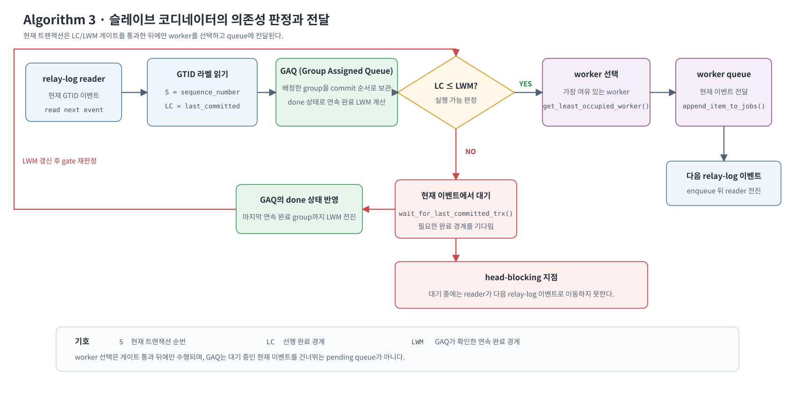

*그림 3-11. 코디네이터가 현재 이벤트의 LC/LWM 게이트를 통과한 뒤에야 worker를 선택하므로 대기 중에는 다음 로그로 이동하지 못하는 구조*

그림 3-11의 핵심은 **현재 트랜잭션의 `last_committed`가 LWM 이하가 된 뒤에야 worker를 선택한다**는 점이다. 조건을 만족하지 못하면 코디네이터는 현재 트랜잭션에서 기다린다. 이때 현재 트랜잭션은 worker queue에 들어가지 않고, 코디네이터도 다음 relay-log 트랜잭션으로 이동하지 않는다. 따라서 뒤에 충돌이 없는 트랜잭션이 있어도 아직 의존성을 판정하거나 worker에 배정할 수 없다. 이 대기가 뒤의 독립 트랜잭션까지 늦추는 과정은 3.5에서 설명한다.

| 본문 알고리즘 | 실제 함수 | 실제 코드 |
|---|---|---|
| GTID 라벨 기록과 LC/LWM 게이트 | `Mts_submode_logical_clock::schedule_next_event()` | 부록 [A.8](./10-코드-및-실측-부록.md#1018-코드-8--schedule_next_event-gtid-라벨-수신과-lclwm-게이트-sqlrpl_mta_submodecc281-395) |
| 게이트 통과 뒤 worker 선택 | `Log_event::get_slave_worker()` | 부록 [A.9](./10-코드-및-실측-부록.md#1019-코드-9--get_slave_worker-게이트-통과-뒤-worker-선택-sqllog_eventcc2680-2691) |
| worker queue로 이벤트 전달 | 코디네이터 이벤트 적용 루프 | 부록 [A.10](./10-코드-및-실측-부록.md#10110-코드-10--코디네이터-이벤트-루프-선택한-worker의-queue로-전달-sqlrpl_replicacc4564-4565-4572-4582-4628-4630) |

실제 호출 순서와 코드 행번호는 부록 [A.8](./10-코드-및-실측-부록.md#1018-코드-8--schedule_next_event-gtid-라벨-수신과-lclwm-게이트-sqlrpl_mta_submodecc281-395)~[A.10](./10-코드-및-실측-부록.md#10110-코드-10--코디네이터-이벤트-루프-선택한-worker의-queue로-전달-sqlrpl_replicacc4564-4565-4572-4582-4628-4630)에서 확인할 수 있다.

## 3.5 슬레이브 측 한계 — 코디네이터 head-blocking

코디네이터는 relay log를 순서대로 한 건씩 스케줄한다. 현재 트랜잭션의 `last_committed`가 LWM보다 크면 worker를 선택하기 전에 읽기 커서를 쥔 채 기다린다. 여기서 LWM은 “그 순번 이하의 트랜잭션이 모두 완료됐다”는 연속 완료 경계다. 중간 트랜잭션이 게이트를 통과하지 못하면 뒤에 있는 독립 트랜잭션도 아직 읽히거나 worker에 배정되지 않는다.

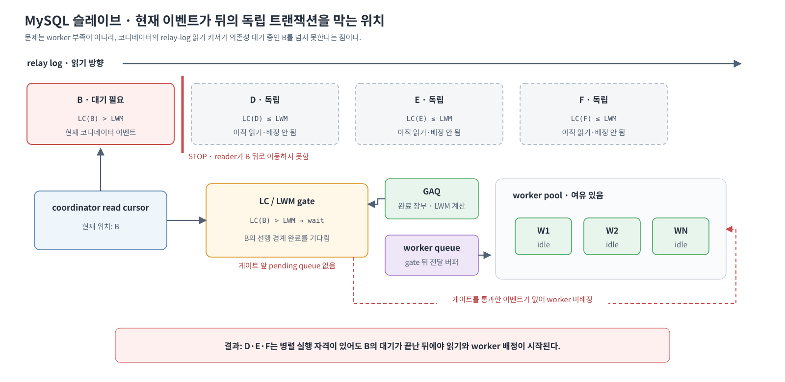

*그림 3-12. worker가 비어 있어도 선두 B의 의존성 대기가 끝날 때까지 뒤의 독립 D·E·F가 읽히거나 배정되지 못하는 현상*

MySQL에 큐가 없는 것은 아니다. 그러나 앞 절에서 확인했듯 워커별 작업 큐는 배정이 끝난 이벤트의 전달 버퍼이고, GAQ는 이미 스케줄된 그룹의 LWM과 체크포인트를 관리하는 장부다. 막힌 트랜잭션을 보관하고 뒤의 독립 트랜잭션을 먼저 판정하는 **게이트 앞 대기 큐**는 없다.

대용량 트랜잭션은 게이트가 풀린 뒤에도 영향을 줄 수 있다. 코디네이터의 이벤트 루프는 relay log를 순서대로 읽고, 현재 트랜잭션에 속한 이벤트를 선택된 worker queue에 전달한 다음 뒤의 트랜잭션 GTID에 도달한다. 따라서 앞 트랜잭션의 이벤트 수와 전달량이 크면 뒤의 독립 트랜잭션을 발견하고 스케줄하는 시각이 늦어질 수 있다. 이는 특정 조건문 하나가 직접 보장하는 성질이 아니라 **순차적인 relay-log 읽기·이벤트 전달 구조에서 도출한 분석**이며, 다음 절의 시간선이 실제 발생 여부를 뒷받침한다.

## 3.6 두 한계를 함께 확인한 MySQL 실측

### 3.6.1 환경과 시나리오

- MySQL 9.7.2(`mysql:9.7` 컨테이너)
- `replica_parallel_workers=10`
- `LOGICAL_CLOCK`, `preserve_commit_order=ON`
- 모든 트랜잭션은 5만 행, 행당 240자×10컬럼
- 수동 GTID 2101~2106
- binlog GTID 이벤트의 `last_committed`·`sequence_number`와 `performance_schema` 워커 타임스탬프를 측정

| 순서 | 트랜잭션 | 내용 |
|---|---|---|
| 1 | A | 부모 `tbl_ws1` INSERT 5만 행 |
| 2 | Achild1 | 자식 `tbl_ws2` 5만 행, 전부 `parent_id=1` |
| 3 | Achild2 | 자식 `tbl_ws2` 5만 행, 전부 `parent_id=1` |
| 4~6 | B, C, D | FK가 없는 독립 테이블에 각각 5만 행 INSERT |

### 3.6.2 마스터가 기록한 병렬 실행 자격

| 트랜잭션 | `last_committed` | `sequence_number` |
|---|---:|---:|
| A(parent) | 0 | 1 |
| Achild1 | 1 | 2 |
| Achild2 | **2** | 3 |
| B | **1** | 4 |
| C | **1** | 5 |
| D | **1** | 6 |

- Achild2의 `last_committed=2`는 부모행 공유가 만든 자식 사슬이다. 마스터가 직렬 라벨을 부여했다.
- B·C·D의 `last_committed=1`은 마스터가 A 커밋 직후 실행을 허가했다는 뜻이다. 이후의 지연은 슬레이브에서 발생한다.

### 3.6.3 슬레이브 적용 시간선

| 트랜잭션 | 워커 | 시작(초) | 종료(초) | 실행 시간(초) |
|---|---:|---:|---:|---:|
| A(parent) | 1 | 0.000 | 2.000 | 2.000 |
| Achild1 | 1 | 2.020 | 5.698 | 3.677 |
| Achild2 | 1 | 5.727 | 11.306 | 5.579 |
| B | 2 | 6.782 | 12.133 | 5.351 |
| C | 3 | 7.827 | 14.562 | 6.735 |
| D | 4 | 9.505 | 15.840 | 6.335 |

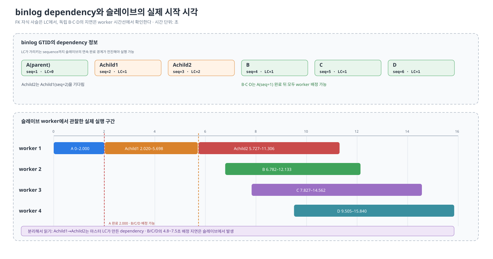

*그림 3-13. Achild1→Achild2의 직렬화는 마스터 LC에서, 실행 자격을 얻은 B·C·D의 지연은 슬레이브 워커 시간선에서 발생했음을 분리한 실측*

타임라인의 위쪽은 마스터가 기록한 실행 자격이고 아래쪽은 슬레이브에서 관찰한 실제 워커 구간이다. Achild2는 `LC=2`이므로 Achild1 완료 전에는 자격 자체가 없다. 반면 B·C·D는 모두 `LC=1`이라 A가 끝난 2.000초부터 실행할 수 있지만, 실제 시작은 6.782초 이후다. 그림은 이 차이를 마스터가 만든 FK 사슬과 슬레이브 코디네이터의 배정 지연으로 분리해 보여주며, 정확한 수치는 위 표와 아래 설명을 기준으로 한다.

**현상 1 — FK 자식 사슬**

Achild1은 A가 끝난 0.020초 뒤 시작했고, Achild2는 Achild1이 끝난 0.029초 뒤 시작했다. 두 자식의 실행 구간은 전혀 겹치지 않았다.

**현상 2 — head-blocking**

B·C·D는 `last_committed`상 A가 끝난 2.000초부터 실행할 수 있었지만 실제 시작은 6.782초, 7.827초, 9.505초였다. 각각 실행 자격을 얻은 시점보다 약 4.8초, 5.8초, 7.5초 늦었다.

5.7초까지는 코디네이터가 Achild2 게이트에서 대기해 B·C·D를 읽지 못했다. 게이트가 풀린 뒤에도 단일 코디네이터가 앞선 대용량 트랜잭션의 이벤트를 워커 큐에 순차적으로 전달하면서 B·C·D 시작이 약 1초 간격으로 밀렸다.

**내장 대조군**

Achild2와 B·C·D는 서로 다른 워커에서 동시에 실행됐다. 따라서 Achild1→Achild2 직렬화는 워커 능력 부족이 아니라 마스터의 `last_committed` 라벨 때문이고, B·C·D의 늦은 시작은 슬레이브 코디네이터의 로그 판정·전달 시점 때문이다.

### 3.6.4 실측의 해석 범위

이 실험은 한 번 수행한 측정이다. `last_committed` 값은 의존성 판정의 결정적 결과지만 시간값은 반복 통계가 아니다. 또한 B·C·D의 계단 간격은 트랜잭션 크기와 relay log 전달량에 영향을 받는다. 따라서 절대 성능값을 비교하기보다, **병렬 실행 자격은 마스터에서 줄어들고 허용된 병렬성의 실현은 슬레이브에서 지연된다**는 두 발생 위치를 확인하는 근거로 사용한다.

## 3.7 CUBRID 설계에 전달되는 요구사항

MySQL 조사에서 확인한 내용은 다음과 같다.

1. PK·UNIQUE·FK 해시는 하나의 트랜잭션 writeset과 전역 history에 함께 저장된다. 이때 해시가 어느 제약에서 생성됐는지와 해당 키를 변경한 것인지 참조한 것인지에 대한 역할 정보는 보존되지 않는다.
2. PK가 다른 행도 UNIQUE 값을 제거한 뒤 재사용하거나 UPDATE로 제약 값이 바뀌면 실행 순서가 필요하다. 따라서 UNIQUE 값과 UPDATE의 old/new 키를 모두 수집해야 한다.
3. 자식 FK는 참조 대상 부모의 인덱스·DB·테이블 식별 공간으로 해시된다. 반면 참조되는 부모 테이블을 변경하면 해시별 판정을 사용하지 않고 commit-order를 유지하며 history를 초기화하는 폴백이 적용된다.
4. 같은 부모 값을 참조하는 자식들은 같은 FK 해시를 만들고, 각 트랜잭션이 history 슬롯을 자신의 sequence로 갱신한다. 그 결과 [Bug #110071](https://bugs.mysql.com/bug.php?id=110071)처럼 자식끼리 선행 관계가 이어지는 의존성 사슬이 만들어진다.
5. 슬레이브 코디네이터는 worker를 선택하기 전에 `LC > LWM`인 현재 이벤트에서 대기한다. 이 동안 뒤의 독립 트랜잭션은 relay log에 있어도 아직 읽히거나 worker에 배정되지 않는다.
6. [Bug #109923](https://bugs.mysql.com/bug.php?id=109923)의 원래 사례는 PK 없는 부모의 비유니크 `KEY` 참조였으며, MySQL 9.7.2 기본 설정은 해당 DDL을 차단한다. 그러나 현재 허용되는 PK 없는 부모의 완전한 `UNIQUE KEY` 참조에서도 같은 PK 게이트를 통과하지 못할 수 있고, 별도 실측에서 자식 라벨에 부모 sequence가 포함되지 않았다.

마스터와 슬레이브의 한계는 CUBRID 설계에 다음 요구사항으로 전달된다.

1. **WRITE와 REF 역할 보존** — 같은 부모 키 공간을 사용하더라도 키를 생성·변경·삭제하는 WRITE와 그 키를 가리키는 REF를 구분해 history에 저장해야 한다.
2. **충돌 조합의 명시** — WRITE→WRITE, WRITE→REF, REF→WRITE는 필요한 순서를 만들고, REF→REF는 서로 의존하지 않도록 probe와 publish 규칙을 분리해야 한다.
3. **안전하지 않은 키의 보수적 처리** — 제약 키를 완전하게 추출하거나 동일한 충돌 공간으로 변환할 수 없다면, 누락된 의존성 라벨을 게시하지 않도록 폴백하거나 병렬 처리를 중단해야 한다.
4. **로그 읽기와 실행 대기의 분리** — 물리적인 로그 순서는 그대로 읽되, COMMIT까지 읽어 완성한 트랜잭션 task는 선행 관계가 충족되지 않아도 보관하고 reader가 뒤의 로그를 계속 처리할 수 있어야 한다.
5. **코디네이터 pending 상태** — 실행할 수 없는 완성 task는 worker queue가 아니라 별도의 pending queue에 두고, 완료 경계가 전진할 때 다시 판정해야 한다.
6. **완료 상태와 재시작 위치의 분리** — worker의 개별 완료는 completed set에 기록하고 commit 순서 FIFO와 대조해 연속 완료 경계만 전진시켜야 한다. 영구 저장되는 재시작 위치도 이 연속 경계까지만 갱신해야 한다.

[5장](./5-cubrid-writeset-병렬화-요구사항.md)은 이 조사에서 CUBRID가 만족해야 할 요구사항을 도출하고, [6장](./6-cubrid-writeset-병렬화-개념-설계.md)은 WRITE/REF 슬롯과 pending queue로 그 요구사항을 구현하는 구조를 설명한다.
