# 4. CUBRID develop의 LSA와 직렬 처리

MySQL 조사에서 도출한 요구사항을 CUBRID에 적용하려면, 먼저 `develop` applylogdb가 로그를 읽고 변경을 반영한 뒤 재시작 지점을 남기는 과정을 알아야 한다. 이 장은 병렬화 이전의 직렬 applylogdb만 다룬다.

## 4.1 LSA란 무엇인가

LSA(Log Sequence Address)는 로그 레코드의 위치를 `(pageid, offset)`으로 표현하는 좌표다. `pageid`가 작은 위치가 먼저이고, 같은 페이지에서는 `offset`이 작은 위치가 먼저다.

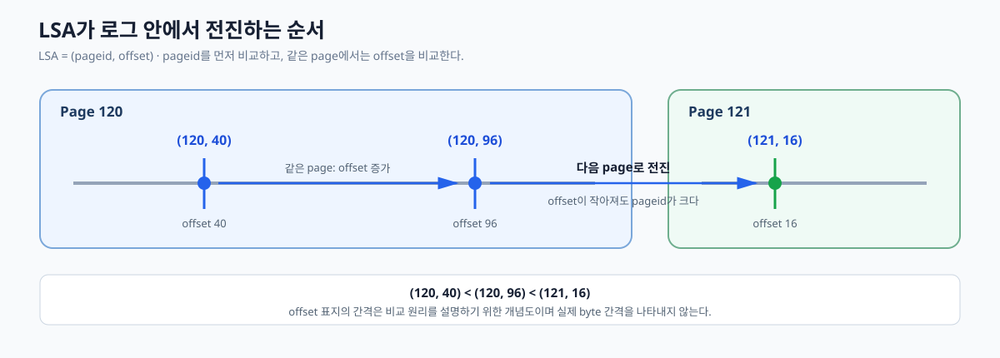

*[그림 4-1] `pageid`와 `offset`의 사전식 비교로 로그 위치의 앞뒤를 판단하는 방법.*

LSA는 로그 레코드를 다시 찾는 좌표다. applylogdb는 이 좌표를 로그 탐색, 트랜잭션 구성, 적용 진행 기록, 로그 보존과 재시작에 서로 다른 이름으로 사용한다.

이 장의 그림은 로그 레코드를 D(변경 데이터)·R(복제 지시)·C(COMMIT) 한 글자로 표시하고, `la_Info`의 위치도 같은 방식의 한 글자 기호로 표시한다. 뒤의 숫자는 시점이며, `C0`는 직전 실행에서 끝낸 COMMIT, `C1`은 이번에 처리하는 COMMIT이다.

| 기호  | 가리키는 LSA       | 뜻                                            | 글자의 유래                                    |
| --- | -------------- | -------------------------------------------- | ----------------------------------------- |
| Q   | `required_lsa` | 가장 오래된 미완 트랜잭션의 첫 로그. 다시 읽기 시작 위치이자 로그 보존 하한 | R이 replication record에 쓰여 re**q**uired의 q |
| F   | `final_lsa`    | applier가 읽고 있는 위치                            | **f**inal                                 |
| E   | `eof_lsa`      | 유효 로그의 끝                                     | **e**of                                   |
| A   | `append_lsa`   | 다음 로그 기록 위치                                  | **a**ppend                                |

## 4.2 develop applier의 한 사이클

`develop`의 applylogdb는 마스터 로그를 순서대로 읽어 트랜잭션별 메모리 구조를 만들고, COMMIT 순서대로 변경을 적용한다. 적용 데이터와 진행 LSA가 같은 DB COMMIT으로 영속되므로, 재시작하면 영속된 완료 경계는 건너뛰고 `required_lsa`부터 미완 범위만 다시 구성할 수 있다.

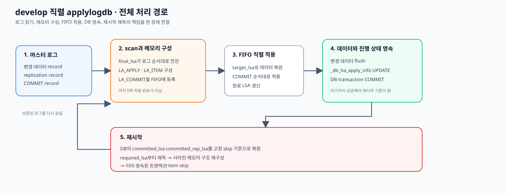

*[그림 4-2] 로그 읽기, 트랜잭션 구성, FIFO 직렬 적용, 진행 상태 영속과 재시작 시 다시 읽기로 이어지는 develop의 전체 경로.*

이 장의 나머지는 세 부분으로 나뉜다. 4.3은 LSA를 소유 위치별로 구분하고, 4.4는 하나의 트랜잭션을 정상 처리할 때 LSA가 전진하는 순서를 보여주며, 4.5는 프로세스를 다시 시작할 때 영속된 LSA를 복원하고 로그를 재독하는 순서를 보여준다. 병렬 적용에서 종료 시 홀이 생기는 이유와 재시작 처리는 [6-2장](./6-2-cubrid-슬레이브-병렬-적용-설계.md)에서 설명한다.

## 4.3 LSA를 소유 위치에 따라 구분한다

LSA 이름이 많은 이유는 하나의 진행값을 여러 이름으로 부르기 때문이 아니다. 마스터가 로그에 기록한 연결 좌표, 트랜잭션별 작업 위치와 applylogdb의 전역 진행 상태가 각각 따로 존재하기 때문이다.

### 4.3.1 마스터 로그에서 받은 읽기 전용 위치

다음 값은 마스터가 로그 레코드와 active log header에 기록한다. applylogdb는 값을 변경하지 않고 로그를 읽고 검증할 때 참조한다.

- **`forw_lsa`**: 물리적으로 다음 로그 레코드를 가리킨다. applier는 이 값을 따라 `final_lsa`를 전진시킨다.
- **`back_lsa`**: 물리적으로 이전 로그 레코드를 가리킨다. applier는 직전 위치인 `prev_final`과 비교해 로그 체인의 연속성을 확인한다.
- **`prev_tranlsa`**: 다른 트랜잭션의 레코드를 건너 같은 트랜잭션의 이전 레코드를 가리킨다. NULL이면 applylogdb가 해당 트랜잭션에서 처음 관찰한 레코드로 판정한다.
- **`chkpt_lsa`**: DB 서버가 비정상 종료됐을 때 서버 자체의 crash recovery 분석을 시작하는 checkpoint 위치다. applylogdb의 복제 진행 위치가 아니며 상태 dump에만 표시한다. 역할 변경 신호 확인이나 drain 완료 판정에도 사용하지 않는다.

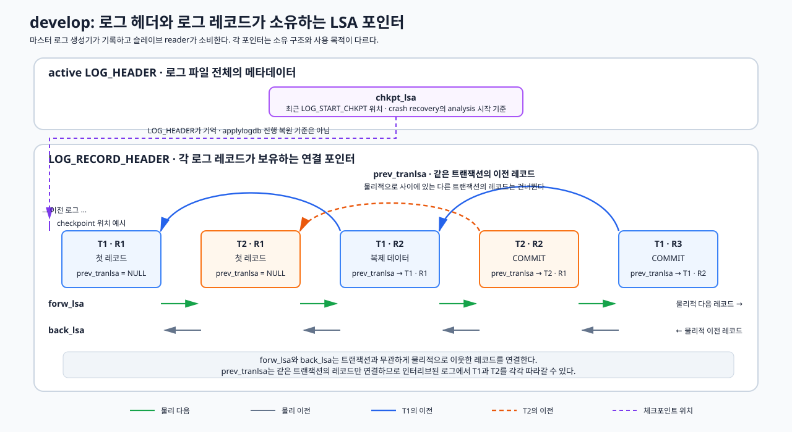

*[그림 4-3] 마스터가 로그에 기록한 물리 로그 체인, 트랜잭션별 로그 체인과 checkpoint 위치.*

코드상 필드와 판정 위치는 [10.2.3절](./10-코드-및-실측-부록.md#1023-로그-헤더와-레코드-연결-포인터)에서 확인한다.

### 4.3.2 트랜잭션별 메모리 구조가 보관하는 위치

reader는 같은 `trid`의 로그를 읽어 `LA_APPLY` 슬롯에 `LA_ITEM` 목록을 만들고, 종료 로그를 만나면 별도의 `LA_COMMIT` 노드를 만든다. 다음 값은 해당 트랜잭션을 구성하고 적용하는 동안 메모리에만 유지된다.

- **`LA_ITEM.lsa`**: replication record 자체의 위치다. item 적용 성공 경계와 재시작 시 item skip 비교에 사용한다.
- **`LA_ITEM.target_lsa`**: replication record가 가리키는 실제 data log record의 위치다. INSERT·UPDATE·DELETE에 사용할 record image를 복원한다.
- **`LA_APPLY.start_lsa`**: 해당 트랜잭션에서 처음 관찰한 로그 위치다. 미완 트랜잭션의 로그 보존 및 재구성 하한 후보가 된다.
- **`LA_APPLY.last_lsa`**: long transaction에서 마지막으로 관찰한 replication record 위치다. 메모리에서 해제한 item을 다시 만들기 위한 재탐색 상한이다.
- **`LA_COMMIT.log_lsa`**: 전역 FIFO commit list 노드가 보관하는 COMMIT·SYSOP_END·ABORT 레코드 위치다. 해당 노드의 처리가 끝나면 `committed_lsa`를 갱신하는 경계가 된다.

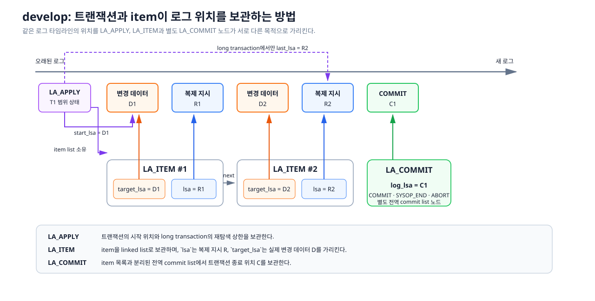

*[그림 4-4] 하나의 normal transaction에서 `LA_APPLY`, `LA_ITEM` 목록과 `LA_COMMIT`이 서로 다른 LSA를 보관하는 관계.*

normal transaction은 여러 `LA_ITEM`을 COMMIT 처리까지 메모리에 둔다. item이 `LA_MAX_REPL_ITEMS`(1000)개에 도달하면 long transaction으로 전환해 head item과 `LA_APPLY.last_lsa`만 남긴다. COMMIT에서는 보존한 범위의 로그를 다시 읽어 item을 하나씩 재생성하고 적용한다. 상세 수명은 [10.2.2절](./10-코드-및-실측-부록.md#1022-item별-위치와-트랜잭션-수집-범위)에서 확인한다.

### 4.3.3 `la_Info`에서 관리하고 DB에도 저장하는 위치

`la_Info`는 applylogdb 프로세스의 전역 메모리 구조다. 다음 여섯 값은 실행 중 `la_Info`에 있고, `la_log_commit()`이 `_db_ha_apply_info`에도 저장한다.

- **`append_lsa`**: active log header가 가리키는 다음 로그 기록 위치다. 로그 입력 상태와 applier의 읽기 지연량을 확인한다.
- **`eof_lsa`**: active log header가 가리키는 현재 유효 로그의 끝이다. applier는 이 위치를 넘어 읽지 않는다.
- **`final_lsa`**: applier가 현재 처리하거나 다음에 읽을 로그 위치다. 로그를 읽은 위치이며 적용 완료를 뜻하지 않는다.
- **`committed_rep_lsa`**: 적용에 성공한 마지막 replication item의 위치다.
- **`committed_lsa`**: 처리를 끝낸 마지막 COMMIT 계열 레코드의 위치다.
- **`required_lsa`**: 미완 트랜잭션을 다시 구성하기 위해 보존해야 하는 가장 오래된 로그 위치다. 활성 `LA_APPLY.start_lsa` 중 최솟값이며, 활성 트랜잭션이 없으면 `final_lsa`를 사용한다.

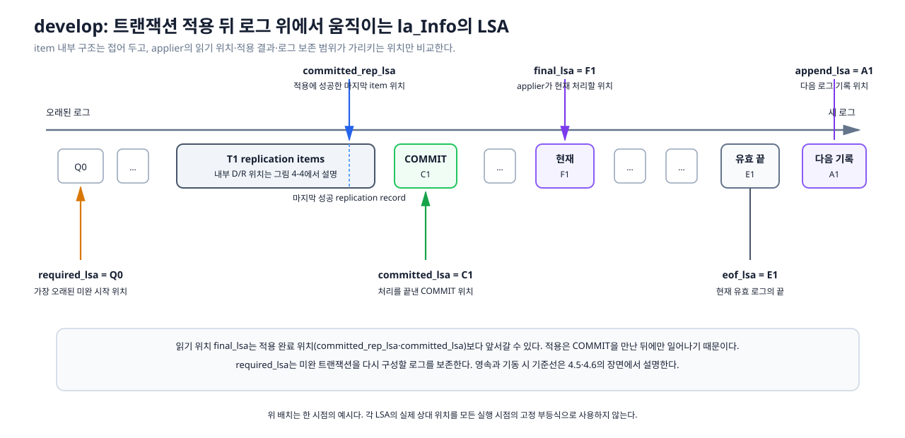

*[그림 4-5] `la_Info`가 로그 입력 범위, reader 위치, item·트랜잭션 완료 위치와 로그 보존 하한을 따로 관리하는 구조.*

### 4.3.4 `la_Info`에서 기동 중에만 유지하는 기준선

다음 두 값은 별도의 DB 컬럼이 아니다. 기동 시 `_db_ha_apply_info`에서 복원한 두 committed 값을 복사해 고정하며, 실행 중 원본 값이 전진해도 함께 움직이지 않는다.

- **`last_committed_lsa`**: `committed_lsa`를 복사한 값이다. 이미 반영한 트랜잭션 전체를 건너뛰는 기준이자 DB 저장값의 하한이다.
- **`last_committed_rep_lsa`**: `committed_rep_lsa`를 복사한 값이다. 처리 대상 트랜잭션 안에서 이미 반영한 item을 건너뛰는 기준이자 DB 저장값의 하한이다.

### 4.3.5 함수 안에서만 사용하는 보조 위치

- **`old_lsa`**: page fetch 전후의 `final_lsa`를 비교해 applier가 전진했는지 확인한다.
- **`last_eof_lsa`**: 직전에 본 `eof_lsa`와 현재 값을 비교해 새 로그 유입 여부를 확인한다.
- **`prev_final`**: 직전 레코드 위치를 보관해 현재 레코드의 `back_lsa`와 비교한다.
- **`lsa_apply`**: commit-list 적용 함수가 반환한 종료 레코드 위치를 받아 `committed_lsa` 갱신에 사용한다.

이 값들은 계산 중에만 존재하고 DB에는 저장하지 않는다. 실제 사용 위치는 [10.2절](./10-코드-및-실측-부록.md#102-cubrid-develop-lsa-코드-근거)에 모았다.

## 4.4 정상 처리에서 LSA가 전진하는 순서

하나의 normal transaction T1이 두 데이터를 변경한다고 하자. 그림에서는 실제 변경 data log를 D1·D2, 이를 가리키는 replication record를 R1(`target_lsa=D1`)·R2(`target_lsa=D2`), COMMIT record를 C1로 표시한다.

시작 상태는 `committed_lsa=C0`, `committed_rep_lsa=R0`이며 `_db_ha_apply_info`에도 같은 값이 저장돼 있다. D1은 applylogdb가 처음 관찰하는 T1의 로그 레코드이므로 `prev_tranlsa`는 NULL이다.

### 4.4.1 T1을 발견하고 transaction slot을 만든다

`final_lsa`가 D1에 도달하고 D1의 `prev_tranlsa`가 NULL이면, applier는 D1을 T1에서 처음 만난 로그로 판단한다. `LA_APPLY(T1)`을 만들고 D1을 `start_lsa`에 저장한 뒤 `forw_lsa`를 따라 다음 로그로 이동한다.

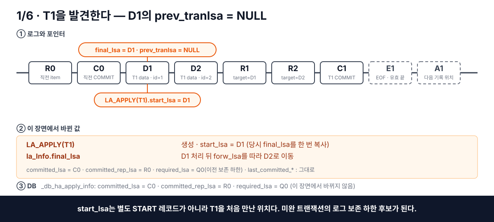

*[그림 4-6] D1에서 T1의 `LA_APPLY`를 만들고 현재 reader 위치를 `start_lsa`에 보존한 상태.*

### 4.4.2 replication item을 구성한다

R1에서는 `LA_ITEM` #1에 `lsa=R1`, `target_lsa=D1`을 저장하고, R2에서는 `LA_ITEM` #2에 `lsa=R2`, `target_lsa=D2`를 저장한다. 두 item을 만든 뒤 `final_lsa`는 다음 레코드 C1을 가리킨다.

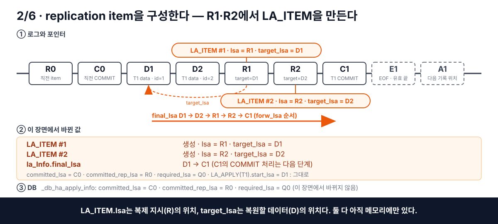

*[그림 4-7] R1·R2에서 두 replication item을 만들고 C1을 다음 reader 위치로 둔 상태.*

### 4.4.3 C1을 commit list에 등록한다

C1에 도달하면 `LA_COMMIT(T1).log_lsa=C1`인 노드를 FIFO commit list에 넣는다. 아직 item을 적용하지 않았으므로 두 committed 값은 C0·R0에 머문다.

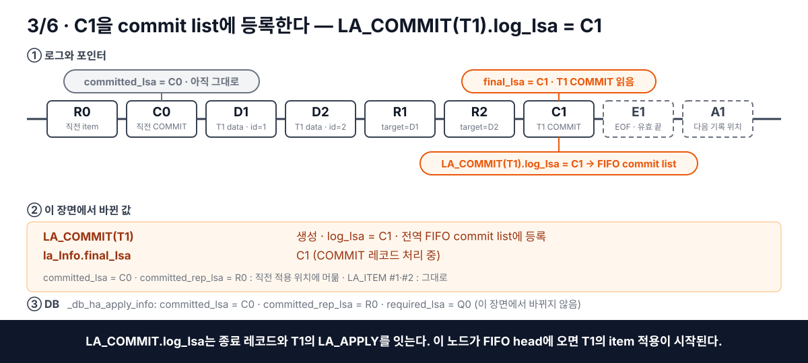

*[그림 4-8] C1의 위치를 T1의 item 목록과 분리된 commit-list 노드에 기록한 상태.*

### 4.4.4 D1·D2를 적용한다

FIFO head의 T1에서 두 item을 차례로 꺼내고, 각 `target_lsa`를 따라 D1·D2의 record image를 복원해 UPDATE한다. item 적용이 성공할 때마다 `committed_rep_lsa`는 R1, R2 순서로 전진한다.

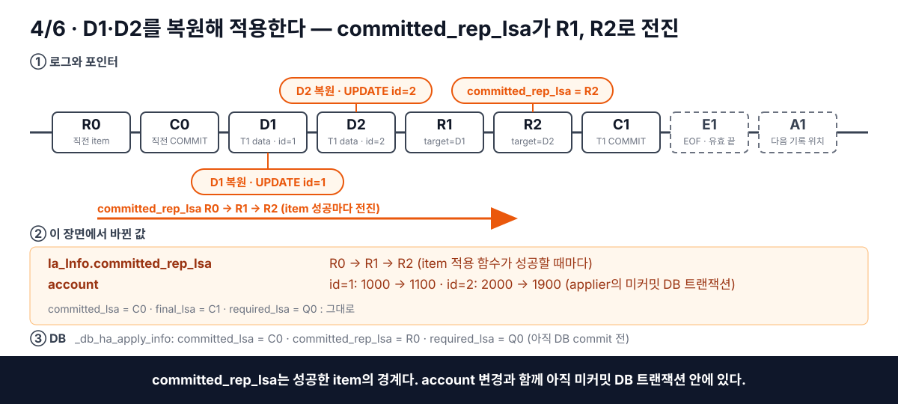

*[그림 4-9] 두 변경 데이터를 적용하고 성공한 replication record까지 item 완료 위치를 전진시킨 상태.*

### 4.4.5 T1 완료 위치를 기록하고 메모리를 정리한다

두 item의 적용이 끝나면 `committed_rep_lsa=R2`가 된다. 이어 C1을 `committed_lsa`에 기록하고 T1의 `LA_APPLY`, `LA_ITEM`, `LA_COMMIT`을 제거한다. T1은 더 이상 `required_lsa` 계산에 포함되지 않는다.

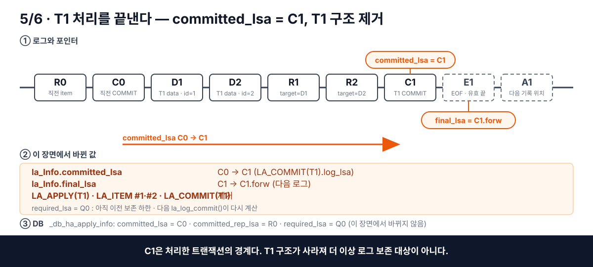

*[그림 4-10] T1의 완료 위치를 C1로 기록하고 트랜잭션별 메모리 구조를 정리한 상태.*

### 4.4.6 적용 데이터와 진행 위치를 함께 영속한다

활성 `LA_APPLY`가 없으면 `la_find_required_lsa()`는 현재 `final_lsa`를 새 `required_lsa`로 선택한다. `la_log_commit()`은 `append_lsa`와 `eof_lsa`를 복사하고, 변경 데이터 flush와 `_db_ha_apply_info` UPDATE를 수행한 뒤 같은 DB 트랜잭션을 COMMIT한다.

```text
required_lsa 재계산
→ append_lsa·eof_lsa 복사
→ 변경 데이터 flush
→ _db_ha_apply_info UPDATE
→ DB transaction COMMIT
```

이 COMMIT이 성공해야 D1·D2의 변경과 `committed_lsa=C1`, `committed_rep_lsa=R2`, 새 `required_lsa`가 함께 영속된다.

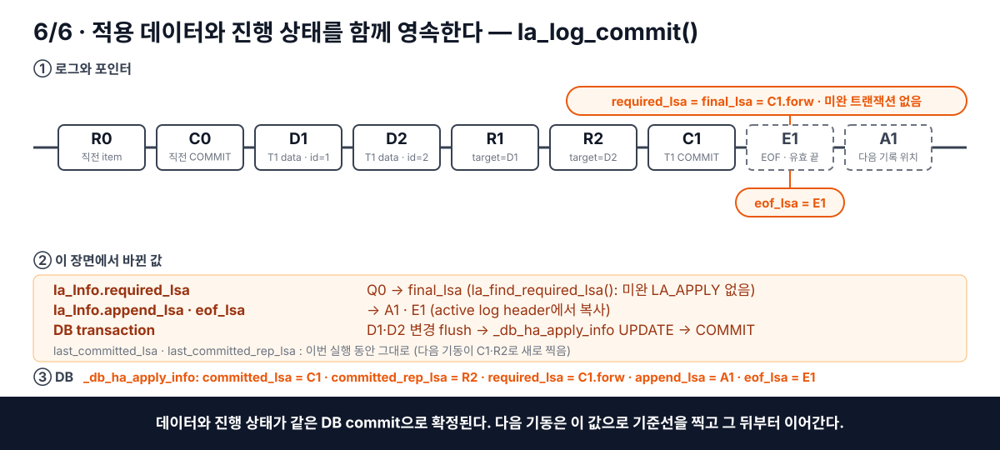

*[그림 4-11] 적용 데이터와 여섯 진행 위치를 같은 DB COMMIT으로 확정한 정상 처리의 마지막 단계.*

## 4.5 비정상 종료 뒤 LSA를 복원하고 전진시키는 순서

`_db_ha_apply_info`는 applylogdb가 재시작 뒤에도 이어서 사용할 진행 상태를 보관하는 카탈로그 테이블이다. 이 절은 기동 시 저장된 값에서 기준선을 **복원**하는 순서와 그 기준선이 쓰이는 두 위치를 설명한 뒤, 같은 예제의 재시작 장면 일곱 개를 따라간다.

### 4.5.1 기동 시 고정되는 두 값

다음 두 값은 `_db_ha_apply_info`의 컬럼이 아니다. 기동 시 DB에서 복원한 `committed_lsa`와 `committed_rep_lsa`를 한 번 복사해 만들고, 실행 중 두 원본이 전진해도 함께 움직이지 않는다.

- **`last_committed_lsa`**: 기동 시 `committed_lsa`를 복사한 트랜잭션 기준선
- **`last_committed_rep_lsa`**: 기동 시 `committed_rep_lsa`를 복사한 replication item 기준선

두 기준선을 만드는 순서와 두 가지 쓰임(이미 반영한 트랜잭션·item 건너뛰기, 저장값 하한)은 바로 아래에서 설명한다.

### 4.5.2 복원 순서

`la_apply_log_file()`의 기동 순서는 세 줄로 요약된다.

```text
① last_committed_lsa     ← committed_lsa       트랜잭션 기준선을 C0로 고정
   last_committed_rep_lsa ← committed_rep_lsa   item 기준선을 R0로 고정
② committed_lsa          ← required_lsa        실행용 COMMIT 위치만 Q로 되감기
③ final_lsa              ← committed_lsa       Q부터 로그 재독 시작
```

①은 `la_get_last_ha_applied_info()`가 `_db_ha_apply_info` 행을 `LA_HA_APPLY_INFO`로 읽어 `la_Info`의 여섯 값을 채운 직후에 수행한다. ②는 그 뒤에 `la_apply_log_file()`이 수행하며, ③은 메인 루프 진입 시 `la_apply_pre()`가 수행한다. 기준선을 먼저 고정하고 그 다음에 되감기 때문에 `last_committed_*`는 직전 실행이 마지막으로 영속한 완료 위치 C0·R0를 유지하고, 실행용 `committed_lsa`만 Q로 내려간다. 두 기준선은 `_db_ha_apply_info`의 컬럼이 아니라 이 복사로만 만들어지는 메모리 값이며, 실행 중 `committed_lsa`와 `committed_rep_lsa`가 전진해도 바뀌지 않는다.

예외는 최초 실행이다. DB 행의 `committed_lsa`·`committed_rep_lsa`가 NULL이면 기준선을 복사하기 전에 두 값을 `required_lsa`(이 경우 active log의 `eof_lsa`)로 채우므로, 기준선도 같은 값으로 시작한다.

코드 근거는 [10.2.7절](./10-코드-및-실측-부록.md#1027-apply-info-복원과-재시작-기준선)에 있다.

### 4.5.3 기준선의 두 가지 쓰임

`last_committed_lsa`와 `last_committed_rep_lsa`를 읽는 코드는 상태 dump를 제외하면 두 곳이다.

| 쓰임                      | 함수                                 | 동작                                                                                                                                 |
| ----------------------- | ---------------------------------- | ---------------------------------------------------------------------------------------------------------------------------------- |
| ① 이미 반영한 트랜잭션·item 건너뛰기 | `la_apply_repl_log()`              | `commit_lsa ≤ last_committed_lsa`이면 트랜잭션의 item을 적용하지 않고 폐기한다. 그보다 뒤의 트랜잭션 안에서는 `LA_ITEM.lsa ≤ last_committed_rep_lsa`인 item만 건너뛴다. |
| ② 저장값 하한                | `la_update_ha_last_applied_info()` | DB에 쓸 `committed_lsa`·`committed_rep_lsa`가 각 기준선보다 작으면 기준선 값을 대신 저장한다.                                                             |

②가 필요한 이유는 복원 순서에 있다. 기동 직후 `committed_lsa`는 `required_lsa`로 후퇴한 상태인데, applier가 C0를 다시 지나기 전에도 `la_log_commit()`이 호출되는 경로가 있다. 역할 전환 시 `la_change_state()`의 강제 commit과, HA 서버 상태 레코드를 처리하는 `la_log_record_process()`의 commit은 트랜잭션 COMMIT 처리와 무관하게 발생한다. 이때 ②가 없으면 후퇴한 `committed_lsa`가 그대로 DB에 저장돼 안전 경계가 뒤로 밀린다. ①만으로는 재시작을 반복할 때 영속 경계가 후퇴하는 것을 막을 수 없다.

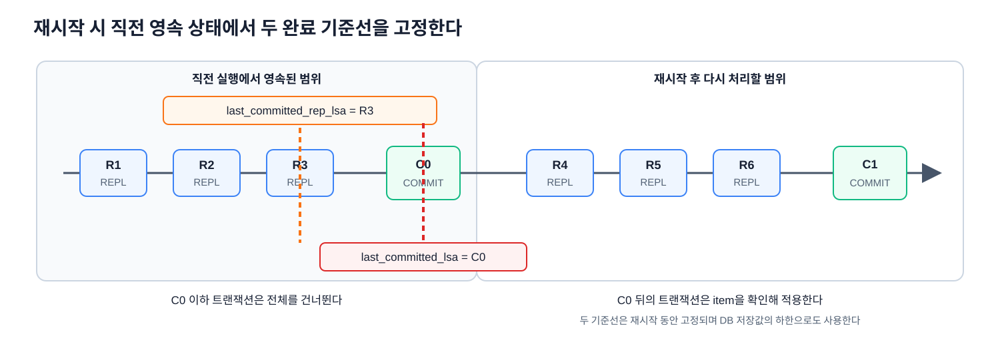

*[그림 4-12] 직전 실행에서 영속한 마지막 replication item R3와 COMMIT C0를 각각 `last_committed_rep_lsa`와 `last_committed_lsa`로 고정하고, 기준선 전후의 재처리 범위를 구분하는 구조.*

### 4.5.4 저장된 LSA로 읽기와 완료 위치를 복구하는 순서

다음 그림은 재시작 과정에서 각 LSA가 어디에서 복원되고 어떻게 사용되는지를 순서대로 보여준다. DB에는 마지막으로 영속한 `committed_lsa=C0`, `committed_rep_lsa=R0`, `required_lsa=Q`와 당시의 `final_lsa=F0`가 남아 있다고 가정한다. 프로세스가 종료되기 전에는 reader가 C0보다 뒤까지 읽었지만, 그 구간의 메모리 구조와 미영속 진행값은 사라진 상태다. 그림에서는 바뀐 값을 주황으로, 고정되거나 바뀌지 않은 값을 회색으로 표시한다.

#### 4.5.4.1 종료 뒤에는 영속한 LSA만 남는다

종료 전 메모리의 `final_lsa`는 C0보다 뒤에 있을 수 있다. 그러나 프로세스가 종료되면 메모리의 `final_lsa`, `LA_APPLY`, `LA_ITEM`, `LA_COMMIT`은 사라지고, 마지막 DB COMMIT으로 확정한 `committed_lsa=C0`, `committed_rep_lsa=R0`, `required_lsa=Q`만 재시작 기준으로 남는다.

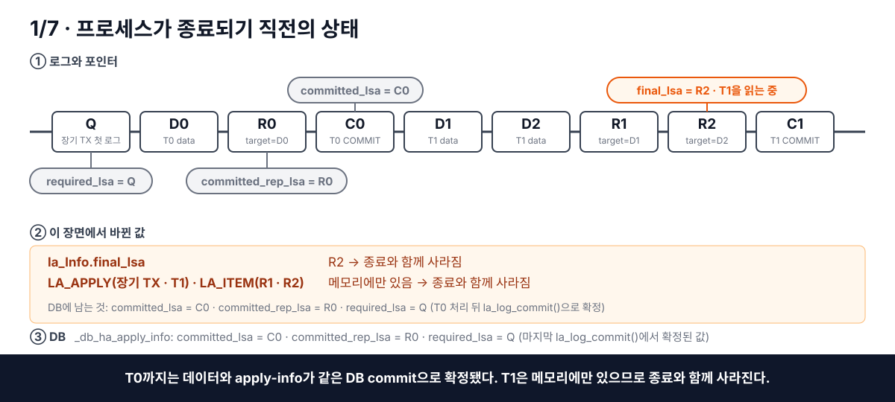

*[그림 4-13] 종료 직전 메모리의 진행 상태와, 종료 뒤에도 DB에 남는 세 값의 구분.*

#### 4.5.4.2 DB에 저장한 LSA를 `la_Info`로 복원한다

재시작하면 `la_get_last_ha_applied_info()`가 `_db_ha_apply_info`를 읽어 `committed_lsa=C0`, `committed_rep_lsa=R0`, `required_lsa=Q`, `final_lsa=F0`를 `la_Info`에 복원한다. 아직 읽기 위치를 되감거나 기준선을 만들기 전이므로, 이 값들은 직전 실행이 마지막으로 영속한 상태를 그대로 나타낸다.

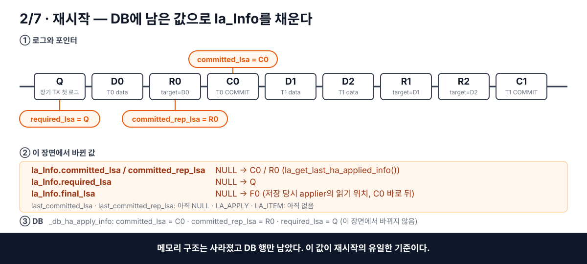

*[그림 4-14] DB 행의 값이 `la_Info`로 복원된 직후. 기준선과 트랜잭션 구조는 아직 없다.*

#### 4.5.4.3 완료 위치를 재시작 기준선으로 고정한다

복원 직후 `last_committed_lsa`에는 C0를, `last_committed_rep_lsa`에는 R0를 복사한다. 두 값은 이번 실행 동안 움직이지 않으며, 재독 구간에서 이미 반영한 트랜잭션과 item을 건너뛰는 기준이자 DB 저장값의 하한으로 사용한다.

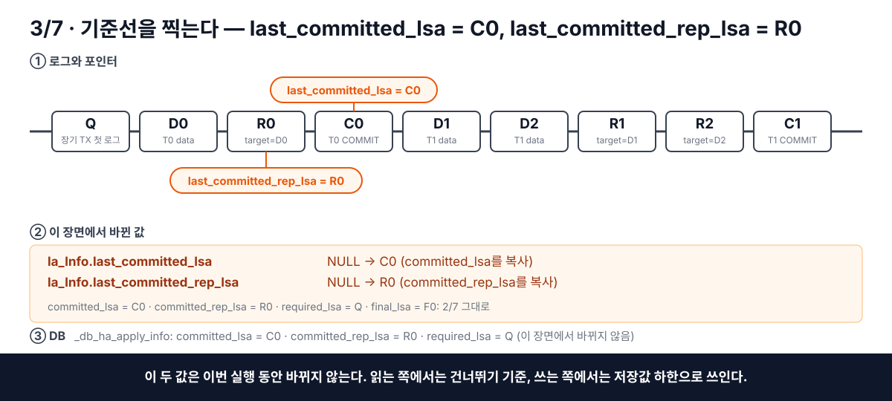

*[그림 4-15] 복원한 두 committed 값을 복사해 이번 실행의 고정 기준선 C0·R0를 만든 상태.*

#### 4.5.4.4 읽기 위치를 `required_lsa`까지 되감는다

기준선을 고정한 뒤 `committed_lsa`를 C0에서 `required_lsa=Q`로 되감고, `final_lsa`도 Q로 맞춘다. DB에 저장된 값과 두 `last_committed_*` 기준선은 그대로 유지한다. 이 되감기는 완료된 데이터를 다시 적용하기 위한 것이 아니라, 영속되지 않은 트랜잭션별 메모리 구조를 Q부터 다시 만들기 위한 것이다.

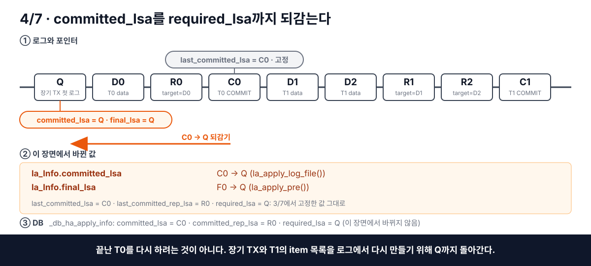

*[그림 4-16] 기준선 C0는 고정된 채 `committed_lsa`와 `final_lsa`만 Q로 되감긴 상태.*

#### 4.5.4.5 Q부터 다시 읽고 완료 기준선 이하는 건너뛴다

reader는 Q부터 `forw_lsa`를 따라가며 `final_lsa`를 다시 전진시킨다. COMMIT 위치가 `last_committed_lsa=C0` 이하인 트랜잭션은 이미 DB에 반영됐으므로 item을 적용하지 않고 폐기한다. 이 구간을 읽는 동안 실행용 `committed_lsa`는 Q에 머물고, 고정 기준선 C0는 바뀌지 않는다.

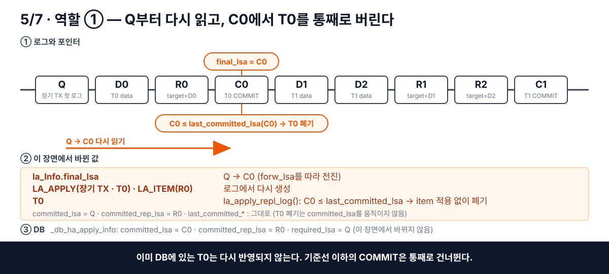

*[그림 4-17] Q~C0 구간을 다시 읽어 구조를 재구성하되, 기준선 이하의 T0는 적용 없이 폐기하는 판정.*

#### 4.5.4.6 재독 중에는 기준선이 DB 저장값의 후퇴를 막는다

`final_lsa`가 C0를 지나 다시 전진하는 동안에도 실행용 `committed_lsa`는 Q에 머물 수 있다. 이때 `la_log_commit()`이 호출되면 `la_update_ha_last_applied_info()`는 Q 대신 `last_committed_lsa=C0`를 저장한다. `committed_rep_lsa`에도 같은 방식으로 R0 하한을 적용한다. 따라서 재독 때문에 메모리 위치를 되감아도 DB에 영속한 완료 경계는 뒤로 이동하지 않는다.

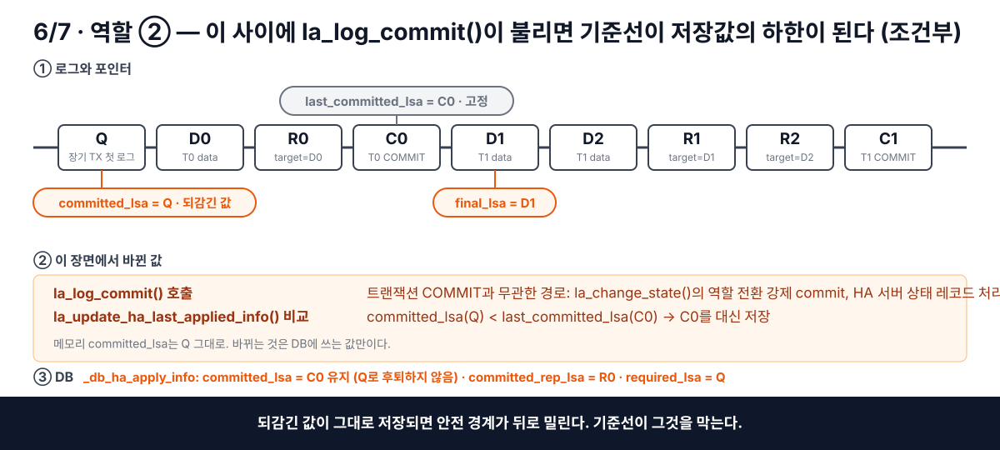

*[그림 4-18] 되감긴 `committed_lsa`가 저장되려는 순간 기준선 C0가 하한으로 작용해 DB 값이 후퇴하지 않는 조건부 장면.*

#### 4.5.4.7 기준선을 지나면 새 완료 위치를 저장한다

reader가 C0 뒤의 처리 대상에 도달하면 R0보다 뒤의 item을 적용해 `committed_rep_lsa`를 전진시키고, 트랜잭션 처리가 끝나면 `committed_lsa`도 C0보다 뒤로 전진시킨다. 새 값이 두 기준선을 넘으면 `la_log_commit()`은 실제 `committed_lsa`와 `committed_rep_lsa`를 DB에 저장한다. 다음 기동은 이 값들로 새로운 기준선을 만든다.

`last_committed_rep_lsa`가 item을 실제로 건너뛰는 경우는 `LOG_SYSOP_END`에서 일부 item이 COMMIT보다 먼저 적용·영속된 경우다. develop은 `LOG_SYSOP_END` 위치까지의 item을 먼저 적용하므로, 재시작 시 트랜잭션 전체가 `last_committed_lsa` 뒤에 있더라도 이미 영속한 item은 `last_committed_rep_lsa` 이하에서 건너뛸 수 있다.

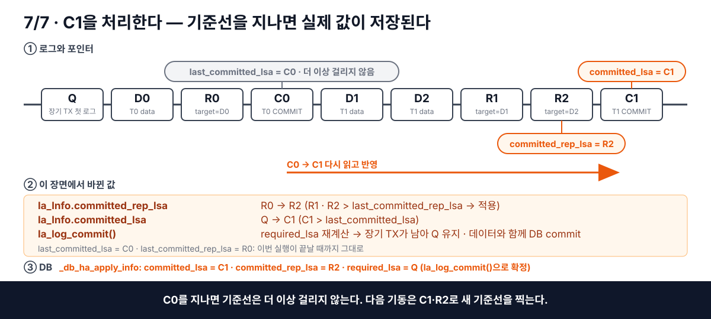

*[그림 4-19] 기준선을 지난 뒤 T1을 반영하고 새 완료 위치 C1·R2를 DB에 확정한 결과.*

## 4.6 정리

정상 처리에서는 `final_lsa`가 로그를 따라 전진하고, item과 트랜잭션의 적용이 끝날 때 `committed_rep_lsa`와 `committed_lsa`가 뒤따른다. `la_log_commit()`은 적용 데이터와 여섯 진행 위치를 함께 영속한다.

재시작에서는 DB에 저장한 완료 위치를 두 `last_committed_*` 기준선으로 고정한 뒤 `required_lsa`부터 로그를 다시 읽는다. 기준선 이하는 이미 반영한 작업으로 건너뛰고, 그 뒤의 작업을 다시 적용해 새 완료 위치를 만든다.

이 값들이 병렬 적용에서 어떻게 달라지는지는 [6-2.2절](./6-2-cubrid-슬레이브-병렬-적용-설계.md#6-22-reader-위치와-안전한-완료-위치)에서 다룬다.
