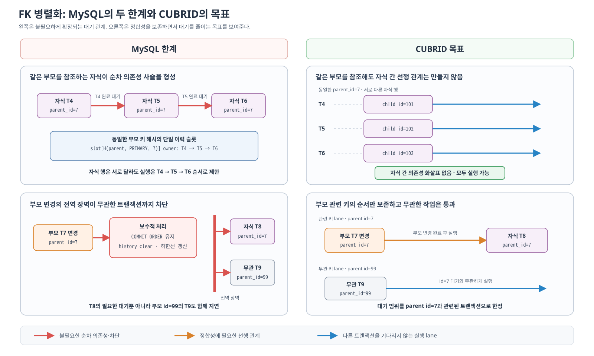
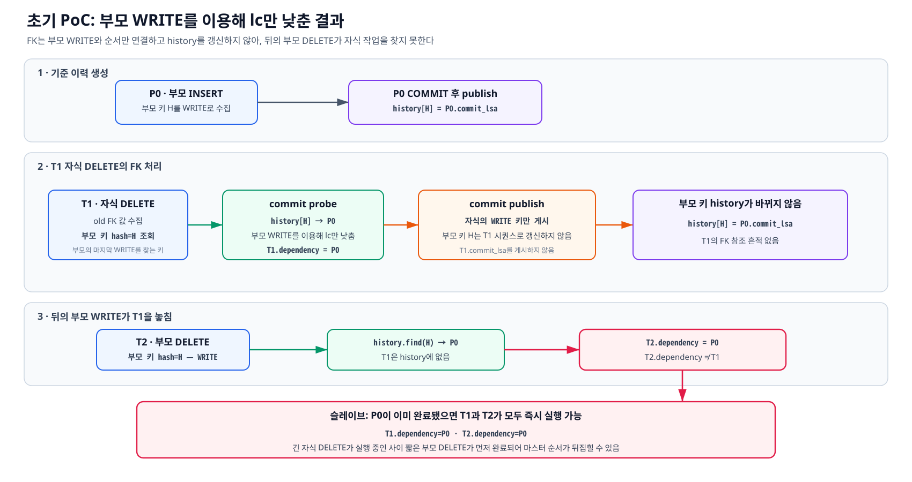
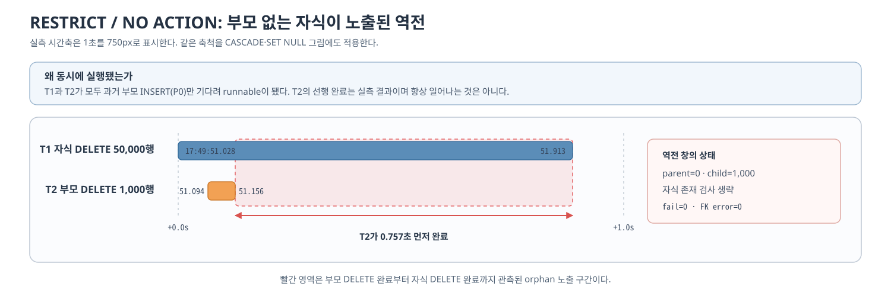
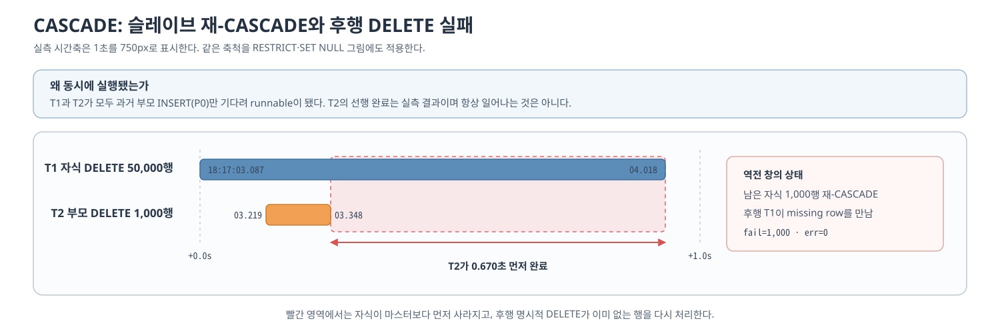
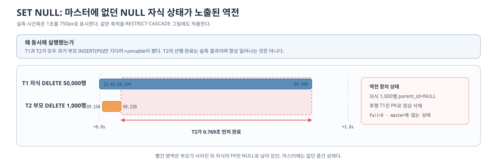

# 5. CUBRID writeset 병렬화 요구사항

3장은 MySQL의 writeset이 제약조건의 순서를 만드는 방법과 실제 병렬 실행에서 드러난 한계를 확인했다. 이 장은 그 조사와 초기 CUBRID PoC의 순서 역전 실측을 근거로, 본격 설계가 반드시 만족해야 할 요구사항을 정리한다.

여기서는 문제와 보장 조건을 먼저 확정한다. 충돌 키, WRITE/REF 이력, 복제 라벨, pending queue와 worker의 구체적인 구현 구조는 [6장 개념 설계](./6-cubrid-writeset-병렬화-개념-설계.md)에서 설명한다.

[통합 부록](./10-코드-및-실측-부록.md)은 본문의 요구사항이 추정에만 의존하지 않도록 FK 액션별 코드 경로와 원시 실측값을 보존한다.

## 5.1 MySQL 조사에서 도출한 설계 입력

### 5.1.1 FK 정합성을 지키면서 자식 간 과직렬화를 제거해야 한다

MySQL은 자식 FK를 참조 대상 부모 키의 형식으로 해시한다. 이 방식은 부모 변경과 자식 참조의 순서를 만들지만, 같은 부모 키를 참조하는 자식도 동일한 해시를 전역 이력의 단일 슬롯에서 조회하고 다시 게시하게 한다. 서로 다른 자식 행을 변경하더라도 **같은 부모 행을 참조**하면 트랜잭션이 커밋 순서대로 연결되는 이유다. 참조하는 부모 행이 다르면 해시가 달라 슬롯을 공유하지 않으므로 이 사슬은 생기지 않는다(해시 충돌은 [2.1](./2-writeset이란.md#21-개념--트랜잭션이-건드린-키의-집합)의 보수적 판정에 따른다).

또한 참조되는 부모 테이블을 변경하면 writeset 대신 `COMMIT_ORDER`를 사용하고 이력을 비우는 보수 처리를 한다. 이 정책은 부모·자식 순서가 누락되는 경우를 막지만, 새 이력 하한선이 뒤의 트랜잭션에 전역 장벽으로 작용해 부모와 관계없는 트랜잭션의 의존성도 함께 높인다.



*그림 5-1. MySQL에서 동일 부모를 참조하는 자식의 순차 의존성과 부모 변경의 전역 장벽이 만들어지는 모습, 그리고 CUBRID에서 자식 간 선행 관계를 제거하고 부모 관련 키에만 대기를 한정하려는 목표*

그림의 첫째 행은 같은 부모를 참조하는 자식들이 MySQL에서는 단일 이력 슬롯을 통해 직렬 사슬로 연결되지만, CUBRID에서는 서로 기다리지 않아야 한다는 대응 관계를 보여준다. 둘째 행은 MySQL의 부모 변경이 전체 이력에 장벽을 남기는 반면, CUBRID에서는 대기 범위를 해당 부모 키와 관련된 트랜잭션으로 한정해야 한다는 차이를 보여준다.

두 한계를 완화하더라도 부모 키 변경과 자식 FK 참조 사이의 순서는 보존해야 한다. 이 정합성 조건 아래에서 CUBRID는 다음 두 가지를 목표로 한다.

- 같은 부모 키를 참조하기만 하는 자식 트랜잭션은 서로 의존하지 않는다.
- 부모 키와 관련된 의존성을 해당 키에만 한정하여, 관계없는 트랜잭션까지 기다리게 하는 전역 장벽을 만들지 않는다.

자식 FK 참조를 일반 쓰기와 동일한 충돌로 처리하면 MySQL에서 확인한 것처럼 같은 부모 키를 참조할 뿐인 자식 트랜잭션까지 서로 의존해 병렬성을 잃는다. 이를 피하기 위해 자식 FK를 writeset에서 아예 제외하면 부모 키 변경과 자식 참조 사이의 선행 관계가 누락되어 슬레이브의 반영 순서가 뒤집힐 수 있다.

#### 자식 FK 참조를 이력에 게시하지 않았을 때 확인된 순서 역전

초기 PoC의 writeset과 history에는 WRITE만 있었다. 자식 FK는 부모 키의 마지막 WRITE를 이용해 lc만 낮췄고, 부모 키 history를 자식의 시퀀스로 갱신하지 않았다. 이 방식은 같은 부모를 참조하는 자식끼리 의존하지 않게 하지만, 뒤의 부모 변경도 앞선 자식 작업을 history에서 발견할 수 없게 한다.

##### 초기 PoC의 dependency 계산과 history 게시

초기 PoC의 writeset과 history에는 WRITE만 있었다. 자식 FK를 부모 키의 WRITE처럼 history에 게시하면 같은 부모를 참조하는 다음 자식이 앞선 자식의 시퀀스를 읽어 MySQL과 같은 형제 직렬화가 생긴다. 이를 피하기 위한 초기 아이디어는 **자식 FK로 부모의 마지막 WRITE 시퀀스를 확인해 lc만 낮추고, 부모 키 history는 자식의 시퀀스로 갱신하지 않는 것**이었다.

```text
history: hash → 마지막 WRITE 트랜잭션의 본인 seq
writeset: 현재 트랜잭션이 변경한 WRITE 키

자식 FK를 처리할 때:
    부모_키_hash = hash(참조하는 부모 키)
    부모_write_seq = history[부모_키_hash]

    if 부모_write_seq가 존재하면:
        lc = min(기본 lc, 부모_write_seq)
        # 부모보다 먼저 실행되지 않도록 순서만 연결한다.

    부모_키_hash를 자식의 WRITE로 history에 게시하지 않음
    # 다음 자식이 현재 자식을 기다리는 사슬을 만들지 않는다.

트랜잭션이 커밋하면:
    본인_seq = 현재 트랜잭션의 COMMIT LSA

    for write_hash in 현재 트랜잭션의 writeset:
        history[write_hash] = 본인_seq
```

##### 부모와 두 자식을 대입한 시나리오

먼저 P0가 부모 키 7을 만들면 WRITE 이력이 history에 게시된다.

```text
P0: 부모 키 7 생성 — WRITE
    본인 seq = 100
    history[부모 키 7] = 100
```

이후 C1과 C2는 같은 부모 키의 마지막 WRITE인 P0를 조회해 lc를 100으로 낮춘다. 그러나 부모 키 history를 자신의 시퀀스로 갱신하지는 않는다.

```text
C1: 부모 키 7을 참조하는 자식 작업
    부모 키 history 조회 → 100
    C1.lc = 100
    본인 seq = 120
    부모 키 history는 갱신하지 않음

C2: 부모 키 7을 참조하는 자식 작업
    부모 키 history 조회 → 여전히 100
    C2.lc = 100
    본인 seq = 130
    부모 키 history는 갱신하지 않음
```

두 자식은 모두 P0만 기다린다. C2가 C1을 기다리지 않으므로 형제 자식 병렬화가 가능하다. 이것이 부모 키 history를 갱신하지 않은 의도였다.

```text
C1.lc = P0
C2.lc = P0
```

문제는 그 뒤에 부모 키 7을 삭제하는 P3가 왔을 때 발생한다. C1의 120과 C2의 130이 부모 키 history에 없으므로 P3도 여전히 P0만 발견한다.

```text
P3: 부모 키 7 삭제 — WRITE
    history 조회 → 여전히 100
    P3.lc = 100
    # C1의 120과 C2의 130은 부모 키 history에 없으므로 발견하지 못한다.

    본인 seq = 150
    history[부모 키 7] = 150
```

초기 구현이 만든 dependency와 실제로 필요한 dependency는 다음과 같이 다르다.

```text
[초기 구현]
P0(100)
 ├─ C1(120)
 ├─ C2(130)
 └─ P3(150)

[필요한 관계]
P0
 ├─ C1 ─┐
 └─ C2 ─┴→ P3
```

초기 아이디어는 부모보다 자식이 먼저 실행되는 것을 막으면서 형제 자식의 직렬화를 제거했지만, 자식 참조 이후의 부모 변경 순서를 기록하지 못했다. 이 역방향 누락을 막기 위해 이후 설계에서 부모 키의 참조를 별도로 기록하는 REF와 `read_seq`를 도입했다.

##### 공통 실험 구성과 순서 역전 조건

부모 `tbl_ws1(id PK)`와 자식 `tbl_ws2(id PK, parent_id FK)`에 각각 100,000행을 적재했다. 부모 데이터는 한 트랜잭션으로, 자식 데이터는 50,000행씩 두 트랜잭션으로 커밋한 뒤 슬레이브 정착을 확인했다. 세 실험은 기본 테이블·컬럼 구조와 데이터가 같고 `ON DELETE` 액션만 다르므로, 액션별 소절에서 각각의 DDL을 보여준다.

세 액션 모두 마스터에서 실행한 트랜잭션 순서는 같다. T1이 자식 50,000행을 먼저 삭제하고 커밋한 뒤, T2가 그 범위와 겹치는 부모 1,000행을 삭제하고 커밋한다.

**예제 5-1 — 세 FK 액션에 공통으로 실행한 마스터 트랜잭션**

```sql
-- T1: 자식 50,000행을 먼저 삭제하고 커밋
DELETE FROM tbl_ws2 WHERE id BETWEEN 1 AND 50000;
COMMIT;

-- T2: T1이 삭제한 자식 중 마지막 1,000행이 참조하던 부모를 삭제하고 커밋
DELETE FROM tbl_ws1 WHERE id BETWEEN 49001 AND 50000;
COMMIT;
```

초기 PoC에서 순서가 누락되는 원인도 세 액션에 공통이다. 초기 부모 INSERT P0는 부모 키 변경을 history에 게시한다. T1은 자식 DELETE 과정에서 그 부모 키의 P0을 이용해 lc를 낮추지만, 부모 키 history를 자신의 시퀀스로 갱신하지 않는다. T2가 같은 부모 키를 삭제할 때도 history에는 P0만 남아 있으므로 T1과 T2는 모두 이미 완료된 P0만 dependency로 가진다. 슬레이브에서는 둘 다 즉시 실행할 수 있고, 약 1초가 걸리는 T1(50,000행)과 짧은 T2(1,000행)가 서로 다른 worker에서 실행되면 T2가 먼저 완료할 수 있다. 이는 항상 T2가 앞선다는 뜻이 아니라, `T1→T2`를 강제할 dependency가 없어 실측에서 역전이 재현됐다는 뜻이다.



*그림 5-2. 초기 PoC에서 자식 FK는 부모 WRITE를 이용해 lc만 낮추고 부모 키 history를 갱신하지 않아, 뒤의 부모 DELETE가 자식 작업을 선행 작업으로 발견하지 못하는 과정*

##### RESTRICT / NO ACTION — 부모 없는 자식이 잠시 노출된다

다음 DDL은 실측 스키마에서 payload 컬럼과 보조 인덱스를 제외해 FK 동작만 남긴 최소 재현형이다.

**예제 5-2 — RESTRICT 실험의 FK 정의를 보여주는 최소 재현 DDL**

```sql
CREATE TABLE tbl_ws1 (
  id INT PRIMARY KEY
);

CREATE TABLE tbl_ws2 (
  id INT PRIMARY KEY,
  parent_id INT,
  CONSTRAINT fk_tbl_ws2_parent
    FOREIGN KEY (parent_id) REFERENCES tbl_ws1(id)
    ON DELETE RESTRICT
);
```

- **마스터** — RESTRICT와 NO ACTION은 부모 DELETE 시점에 참조 자식이 남아 있으면 삭제를 거부한다. `locator_check_primary_key_delete()`는 `btree_find_foreign_key()`로 자식을 찾고, 발견하면 `ER_FK_RESTRICT`를 반환한다.
- **log applier** — applylogdb 요청은 `DB_CLIENT_TYPE_LOG_APPLIER`로 식별되어 `LOG_CHECK_LOG_APPLIER(thread_p)`가 참이다. 따라서 `btree_find_foreign_key()`와 `ER_FK_RESTRICT` 경로를 실행하지 않는다. 에러를 무시하는 것이 아니라 **자식 존재 검사 자체를 건너뛰는 것**이다(부록 [A.1](./10-코드-및-실측-부록.md#1031-restrictno-action의-log-applier-검사-생략), `locator_sr.c:4248-4268`).
- **이 실험** — 마스터에서는 T1이 자식을 먼저 삭제했으므로 T2가 성공한다. 슬레이브에서는 dependency가 누락된 T1과 T2가 동시에 실행되고, T2가 먼저 적용되면 자식 1,000행이 남아 있어도 부모 DELETE가 성공한다. T1 완료 전까지 부모 없는 자식 1,000행이 노출되지만 `fail_counter`는 증가하지 않는다.



*그림 5-3. dependency가 누락된 RESTRICT 실측에서 짧은 부모 DELETE가 0.757초 먼저 끝나 부모 없는 자식 1,000행이 노출된 과정*

실측에서 부모 DELETE는 자식 DELETE보다 0.757초 먼저 완료됐고 `applied=1000 del=1000 fail=0`이었다. 0.2초 간격 폴러는 부모가 사라진 뒤 자식이 끝나기 전까지 부모 없는 자식 1,000행을 관측했다.
T1이 끝나면 자식도 삭제돼 최종적으로 마스터와 같은 부모 99,000행·자식 50,000행으로 수렴한다. 그러나 에러와 fail 증가 없이 부모 없는 자식 1,000행이 중간 상태로 노출됐다는 점은 최종 행 수 비교만으로 확인할 수 없다. 폴러의 원시 관측값은 부록 [B.1](./10-코드-및-실측-부록.md#1041-restrict--no-action)에 수록한다.

##### CASCADE — 부모 DELETE worker가 T1의 미처리 자식을 먼저 CASCADE한다

**예제 5-3 — CASCADE의 FK 정의를 보여주는 최소 재현 DDL**

```sql
CREATE TABLE tbl_ws1 (
  id INT PRIMARY KEY
);

CREATE TABLE tbl_ws2 (
  id INT PRIMARY KEY,
  parent_id INT,
  CONSTRAINT fk_tbl_ws2_parent
    FOREIGN KEY (parent_id) REFERENCES tbl_ws1(id)
    ON DELETE CASCADE
);
```

develop의 직렬 처리에서는 자식과 부모 DELETE의 실행 순서와 관계없이 CASCADE로 인한 `fail_counter`가 발생하지 않는다. 두 순서에서 생성되는 복제 항목과 적용 과정은 부록 [A.4](./10-코드-및-실측-부록.md#1034-develop의-cascade-sql-순서와-복제-항목-생성)에서 확인한다.

PoC 실측의 마스터 커밋과 복제 로그 순서는 위 첫 번째 케이스인 `T1 자식 DELETE → T2 부모 DELETE`였다. 다만 초기 병렬 PoC에서 dependency가 누락되면 두 worker가 동시에 실행될 수 있다. 이때 T2 worker가 T1 worker의 미처리 범위 1,000행에 먼저 도달하면 log applier의 CASCADE 분기가 그 자식을 삭제한다(부록 [A.2](./10-코드-및-실측-부록.md#1032-cascadeset-null은-log-applier에서도-실행)). 뒤이어 T1 worker가 같은 범위의 자식 복제 항목을 적용하면 대상을 찾지 못해 `ER_OBJ_OBJECT_NOT_FOUND`가 발생하고, 실측에서 `fail_counter=1000`, `err=0`으로 집계됐다(부록 [A.3](./10-코드-및-실측-부록.md#1033-이미-삭제된-자식-복제-항목의-부분-실패-집계)). 즉 로그 순서가 부모→자식으로 바뀐 것이 아니라, 병렬 worker의 **겹치는 행 처리 순서**가 달라진 결과다.



*그림 5-4. 로그 순서는 T1→T2이지만, T2 worker가 T1의 미처리 자식 1,000행을 CASCADE로 먼저 삭제해 T1의 자식 복제 항목에 실패 1,000건을 남긴 과정*

실측에서 부모 DELETE는 0.67초 먼저 완료됐다. T2 worker가 T1 worker의 미처리 자식 1,000행을 먼저 CASCADE로 삭제했고, T1은 50,000개 복제 항목 중 49,000개만 삭제해 `fail_counter=1000`, `err=0`으로 집계됐다. 트랜잭션 자체는 중단되지 않았으며 최종 데이터는 수렴했다. 적용 건수와 폴러의 원시 관측값은 부록 [B.2](./10-코드-및-실측-부록.md#1042-cascade)에 수록한다.

##### SET NULL — 마스터에는 없던 NULL 상태가 잠시 노출된다

SET NULL을 사용하려면 자식의 FK 컬럼이 NULL을 허용해야 한다. CUBRID는 `NOT NULL`인 FK 컬럼에 SET NULL을 지정한 DDL을 거부하므로, 실측 스키마의 `parent_id`는 NULL 허용 컬럼이다.

**예제 5-4 — SET NULL의 FK 정의와 NULL 허용 조건을 보여주는 최소 재현 DDL**

```sql
CREATE TABLE tbl_ws1 (
  id INT PRIMARY KEY
);

CREATE TABLE tbl_ws2 (
  id INT PRIMARY KEY,
  parent_id INT,
  CONSTRAINT fk_tbl_ws2_parent
    FOREIGN KEY (parent_id) REFERENCES tbl_ws1(id)
    ON DELETE SET NULL
);
```

- **마스터** — SET NULL은 부모 DELETE 시점에 남아 있는 참조 자식은 유지하고 FK 컬럼만 NULL로 변경한다.
- **log applier** — SET NULL 분기도 `LOG_CHECK_LOG_APPLIER` 가드 밖에 있어 슬레이브에서 다시 실행된다. `locator_check_primary_key_delete()`는 남아 있는 자식을 찾아 `locator_attribute_info_force()`로 FK 컬럼을 NULL로 변경한다(부록 [A.2](./10-코드-및-실측-부록.md#1032-cascadeset-null은-log-applier에서도-실행), `locator_sr.c:4270-4503`).
- **이 실험** — 마스터에서는 T1이 자식을 먼저 삭제했으므로 T2가 NULL로 바꿀 행이 없다. 슬레이브에서는 dependency가 누락되어 T2가 먼저 적용되면, 자식 1,000행의 `parent_id`가 NULL로 변경되어 마스터에 없던 중간 상태가 노출된다. 뒤의 T1은 PK로 해당 행을 정상 삭제하므로 `fail_counter=0`이다.



*그림 5-5. dependency가 누락된 SET NULL 실측에서 부모 DELETE가 0.769초 먼저 끝나 마스터에는 없던 NULL 자식 1,000행이 노출된 과정*

실측에서 부모 DELETE는 0.769초 먼저 끝났고, 폴러는 그 사이에 부모는 없지만 `parent_id=NULL`인 자식 1,000행이 남은 상태를 세 번 관측했다. 이후 T1이 `applied=50000 del=50000 fail=0`으로 끝나면서 최종 데이터는 수렴했다. `child_remain`은 `parent_id BETWEEN 49001 AND 50000` 조건이어서 NULL로 바뀐 행을 세지 않으며, `child_null`은 `id BETWEEN 49001 AND 50000 AND parent_id IS NULL`인 행을 세어 이 중간 상태를 확인한다. 원시 관측값은 부록 [B.3](./10-코드-및-실측-부록.md#1043-set-null)에 수록한다.

초기 병렬 PoC에서는 FK dependency 누락으로 develop의 직렬 적용이 보장하던 부모·자식 순서가 깨졌다. 그 결과 RESTRICT/NO ACTION과 SET NULL에서는 마스터에 없던 중간 데이터 상태가 노출됐고, CASCADE에서는 대상 없음 에러 로그와 `fail_counter=1,000`이 발생했다. CUBRID는 이 순서를 복원하면서 형제 자식의 병렬성을 유지하기 위해 동일 키에 대한 접근을 `WRITE`와 `REF`로 구분한다.

### 5.1.2 대기와 로그 읽기를 분리해야 한다

MySQL 슬레이브 코디네이터는 현재 트랜잭션의 의존성이 충족되지 않으면 그 자리에서 기다린다. 그러면 로그 뒤쪽에 이미 커밋된 독립 트랜잭션도 아직 읽고 판정할 수 없다. 대용량 트랜잭션의 로그를 읽고 전달하는 동안에도 뒤의 실행 기회가 늦어진다.

CUBRID는 선행 조건을 만족하지 못한 완성된 트랜잭션을 게이트 앞에서 보류하고 reader가 로그를 계속 읽을 수 있어야 한다. 이 선택은 병렬성을 늘리지만 커밋 순서와 완료 순서를 달라지게 하므로, 완료 상태와 LSA의 관리까지 함께 설계해야 한다.

## 5.2 본격 설계가 만족해야 할 요구사항

앞의 코드 분석과 실측에서 다음 요구사항을 도출한다.

1. **부모 변경과 자식 참조의 순서를 보존한다.** 부모 키를 생성·변경·삭제하는 트랜잭션과 그 키를 참조하는 자식 트랜잭션 사이에는 필요한 선행 관계가 빠지지 않아야 한다.
2. **같은 부모를 참조하기만 하는 자식은 서로 기다리지 않는다.** 정합성에 필요하지 않은 형제 자식의 의존성 사슬을 만들지 않아야 한다.
3. **대기 범위를 관련 키로 한정한다.** 한 부모 키의 변경이 관계없는 키의 트랜잭션까지 기다리게 하는 전역 장벽이 되어서는 안 된다.
4. **로그 읽기와 실행 대기를 분리한다.** 현재 트랜잭션이 선행 작업을 기다리더라도 reader는 뒤의 로그를 계속 읽고 독립 트랜잭션을 발견할 수 있어야 한다.
5. **실행할 수 없는 완성된 작업을 별도로 보류한다.** 아직 조건을 만족하지 않은 작업은 worker를 점유하지 않는 pending 상태에 두고, 완료 상태가 바뀔 때 다시 판정해야 한다.
6. **로그 순서와 다른 완료를 보존하되 안전한 경계만 전진시킨다.** 후행 트랜잭션이 먼저 끝날 수 있으므로 개별 완료와 앞에서부터 빠짐없이 완료된 연속 경계를 구분해야 한다.
7. **재시작에 안전한 완료 경계를 영속한다.** reader 위치나 가장 큰 worker 완료 위치가 아니라, 재시작 후 중복과 누락을 만들지 않는 연속 완료 상태만 복구 기준으로 사용해야 한다.
8. **독립 top operation의 반영 의미를 develop과 같게 유지한다.** serial 갱신(AUTO_INCREMENT 포함), `INCR()`/`DECR()`, checksumdb처럼 바깥 트랜잭션과 독립적으로 커밋되는 top operation의 복제 항목은 바깥 트랜잭션의 COMMIT·ABORT와 무관하게 마스터에 남는다. 슬레이브도 바깥 트랜잭션의 결과와 무관하게 이 항목을 마스터 순서대로 반영해야 하며, 같은 `db_serial` 행에 대한 갱신은 마스터의 갱신 순서를 지켜야 한다. PoC는 이 경로를 생략했다([9.1.1](./9-미해결-리스크.md#911-log_sysop_end-별도-task-처리와-db_serial-갱신-순서)).

이를 만족하기 위한 다음 장의 핵심 해법은 동일 부모 키에 대한 **변경(WRITE)** 과 **참조(REF)** 를 구분하고, 슬레이브에서 reader·pending·worker·완료 경계의 책임을 분리하는 것이다.
