# 6-1. CUBRID 마스터 writeset 개념 설계

이 장은 마스터가 행 연산에서 writeset을 만들고, 커밋 직전에 선행 조건을 확정하여 복제 로그에 전달하는 구조와 `WS_LABEL`의 기록 계약을 설명한다. 슬레이브의 실행 판정은 [6-2장](./6-2-cubrid-슬레이브-병렬-적용-설계.md), 실제 함수별 변경 위치는 [8-1장](./8-1-cubrid-마스터-writeset-상세-설계.md)에서 다룬다.

## 6-1.1 마스터의 책임과 전체 흐름

마스터는 트랜잭션이 건드린 제약 키를 수집하고, 앞서 커밋한 트랜잭션의 이력과 비교해 슬레이브가 지켜야 할 선행 조건을 만든다. 이 과정은 다음 다섯 단계로 끝난다.

1. 행 연산에서 제약 키와 접근 종류를 수집한다.
2. 키를 충돌 식별자로 정규화해 트랜잭션 writeset에 저장한다.
3. 커밋 직전에 전역 history를 조회해 dependency를 확정한다(probe).
4. dependency를 `WS_LABEL`에 기록하고 COMMIT을 남긴다.
5. 확정된 COMMIT LSA를 전역 history에 게시한다(publish).

핵심은 **dependency를 먼저 확정하고, 현재 트랜잭션의 COMMIT LSA는 그 뒤에 게시하는 것**이다. probe는 과거 이력을 조회만 하고, publish는 현재 트랜잭션이 정상 커밋된 뒤에만 수행한다.

트랜잭션 로컬 writeset은 `std::vector<LOG_WRITESET_ENTRY>`, 마스터 전역 history는 `tbb::concurrent_hash_map`으로 관리한다. 로컬에는 이번 트랜잭션의 항목을 모으고, 전역 map에는 여러 커밋 스레드가 조회·갱신하는 과거 이력을 보관한다. 선택 이유와 동기화 범위는 [전역 history map 대안 비교](./8-1-cubrid-마스터-writeset-상세-설계.md#전역-history-map-대안-비교)에서 설명한다.

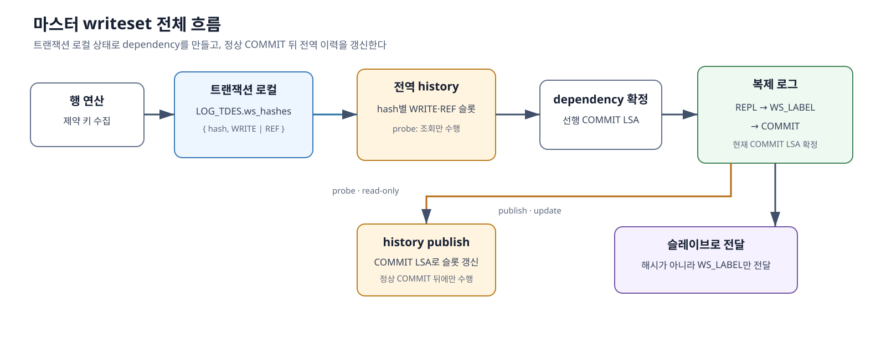

*그림 6-1-1. 트랜잭션 로컬 writeset과 마스터 전역 history를 거쳐 dependency 라벨을 만들고 COMMIT LSA를 다시 history에 게시하는 전체 흐름*

## 6-1.2 행 연산에서 수집할 키

writeset은 행 전체가 아니라 적용 순서를 만드는 제약조건의 키를 수집한다.

- **PRIMARY KEY·UNIQUE·REVERSE UNIQUE — `WRITE`**: 행 또는 UNIQUE 값의 생성·변경·삭제 순서를 보존한다.
- **자식 FOREIGN KEY 값 — `REF`**: 부모 키의 상태를 전제로 수행한 자식 작업임을 표시한다.
- **INSERT**: `new key`를 수집한다.
- **DELETE**: `old key`를 수집한다.
- **UPDATE**: `old key`와 `new key`를 모두 수집한다.

일반 `INDEX`와 `REVERSE INDEX`는 검색 경로일 뿐 중복이나 참조 무결성을 강제하지 않으므로 수집하지 않는다.

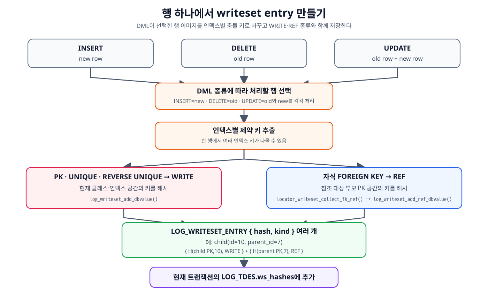

*그림 6-1-2. INSERT의 new row, DELETE의 old row, UPDATE의 old·new row에서 인덱스별 WRITE·REF 항목을 만들어 트랜잭션 writeset에 저장하는 과정*

자식 행 `child(id=10, parent_id=7)`을 삽입하면 하나의 행에서도 두 항목이 생긴다. 자식 PK는 `WRITE`, 부모 PK의 존재를 전제로 하는 FK 값은 `REF`다. 접근 종류는 수집할 때 확정하며 커밋 시점에 다시 추론하지 않는다.

### 충돌 식별자

충돌 식별자는 관계없는 클래스와 인덱스가 같은 값 때문에 섞이지 않으면서, 부모 PK의 WRITE와 이를 참조하는 자식 FK의 REF는 같은 공간에서 만나도록 구성한다.

- **PK·UNIQUE·REVERSE UNIQUE의 WRITE**

  `H(현재 class_oid, 현재 index VFID, 정규화한 전체 키 값)`

- **자식 FK의 REF**

  `H(부모 class_oid, 부모 PK index VFID, 부모 PK 도메인으로 정규화한 FK 값)`

- **부모 PK와 자식 FK의 대응**

  `WRITE(parent.PK=7) == REF(child.FK=7)`

같은 인덱스에서 DBMS가 동일하다고 판단하는 값은 같은 충돌 키를 만들어야 한다. 따라서 문자열은 collation을 반영하고, 복합 키는 전체 컬럼을 사용한다. UNIQUE·REVERSE UNIQUE의 NULL은 이번 설계에서 보수적으로 WRITE 키에 포함하며, 자식 FK의 NULL은 참조할 부모가 없으므로 REF를 만들지 않는다. NULL의 packed 표현과 최적화 대안은 [8-1.6절](./8-1-cubrid-마스터-writeset-상세-설계.md#8-15-unique-null-정책과-향후-최적화)에서 다룬다.

`H`는 `class_oid`, index VFID와 정규화한 키 값을 하나의 충돌 식별자로 해시한다. 같은 논리 키는 같은 해시가 되어야 하며, 서로 다른 키가 우연히 같은 해시가 되면 안전을 위해 충돌한 것으로 처리한다. 실제 해시 함수와 값의 packing 방법은 [8-1장](./8-1-cubrid-마스터-writeset-상세-설계.md)에서 설명한다.

충돌 식별자는 마스터 history에서만 사용한다. 슬레이브에는 해시나 인덱스 식별자를 보내지 않고, 마스터가 확정한 dependency만 전달한다.

## 6-1.3 WRITE와 REF history를 분리하는 이유

서로 다른 자식 행이 같은 부모를 참조한다는 이유만으로는 두 자식 작업 사이에 실행 순서가 필요하지 않다. 다른 제약 키가 충돌하지 않는다면 두 작업은 병렬로 적용할 수 있다. 하지만 이후 부모 키를 변경하거나 삭제하는 작업은 그 부모의 기존 상태를 참조한 자식 작업을 추월해서는 안 된다. 이 두 조건을 함께 지키기 위해, 같은 충돌 키의 history를 **변경 이력(WRITE)**과 **참조 이력(REF)**으로 나눈다.

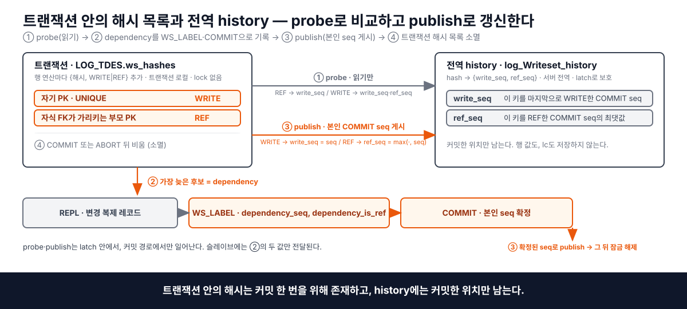

*그림 6-1-2a. 트랜잭션의 WRITE·REF entry가 같은 키의 `write_seq`·`ref_seq`를 서로 다른 규칙으로 조회하고, 정상 COMMIT 뒤 본인 시퀀스를 해당 슬롯에 게시하는 흐름*

### 1. 현재 writeset에서 어떤 키 항목을 처리하는가

초기 PK writeset은 트랜잭션에 해시 값만 저장했으므로 그 키를 직접 변경했는지 FK로 참조했는지 구분할 수 없었다. FK PoC에서 기존 해시 항목을 `{ hash, kind }` 형태의 entry로 바꾸고 `WRITE`와 `REF` 종류를 추가했다.

먼저 확인하는 것은 현재 writeset 항목의 `kind`가 WRITE인지 REF인지다. 행 전체를 둘 중 하나로 분류하는 것은 아니다. 한 행에서도 제약조건에 따라 여러 항목이 만들어진다.

예를 들어 자식 행 `child(id=10, parent_id=7)`을 삽입하면 다음 두 항목을 수집한다.

| 행에서 수집한 키 | 현재 항목의 종류 | 의미 |
| --- | --- | --- |
| 자식 PK `id=10` | WRITE | 자식 키 10을 생성한다 |
| FK가 참조하는 부모 PK `7` | REF | 부모 키 7의 존재를 전제로 자식 작업을 수행한다 |

`kind`는 과거 history를 조회한 뒤 정하는 값이 아니다. 행 연산에서 제약 키를 수집할 때 PK·UNIQUE·REVERSE UNIQUE 키는 WRITE로, 자식 FK가 가리키는 부모 키는 REF로 정한다. REF는 일반 SELECT를 뜻하지 않으며, 자식 INSERT뿐 아니라 DELETE의 old FK와 UPDATE의 old/new FK에서도 수집한다. 수집 범위와 NULL 처리는 6-1.2절의 규칙을 따른다.

### 2. 같은 키의 변경 기록과 참조 기록을 따로 보관한다

부모 PK 7의 WRITE와 이를 참조하는 자식 FK의 REF는 같은 충돌 해시로 history를 찾는다. 여기에는 서로 충돌하는 두 요구가 있다.

- 자식의 REF를 일반 WRITE처럼 하나의 이력에 게시하면, 같은 부모를 참조하는 자식끼리 앞선 자식의 이력을 기다리는 사슬이 생긴다.
- 자식의 REF를 게시하지 않으면 자식끼리는 병렬로 실행되지만, 뒤의 부모 WRITE가 앞선 자식 작업을 발견하지 못한다.

초기 PoC의 writeset과 history에는 WRITE만 있었다. 자식 FK는 부모의 마지막 WRITE를 이용해 lc만 낮추고 부모 키 history를 갱신하지 않았기 때문에 형제 자식은 병렬화됐지만, 뒤의 부모 WRITE가 앞선 자식 작업을 발견하지 못했다. 초기 구현의 알고리즘, 순서 누락 과정과 FK 동작별 실측은 [5장 해당 절](./5-cubrid-writeset-병렬화-요구사항.md#자식-fk-참조를-이력에-게시하지-않았을-때-확인된-순서-역전)에서 설명한다.

따라서 REF도 history에 남겨 부모 WRITE가 발견할 수 있게 하되, 형제 자식의 선행 조건으로는 사용하지 않아야 한다. 이를 위해 같은 키 아래에 WRITE와 REF 이력을 별도 슬롯으로 보관한다.

```text
history[부모 키 7의 해시]
    write_seq : 이 키를 마지막으로 WRITE한 트랜잭션의 COMMIT LSA
                (해당 WRITE 트랜잭션의 본인 시퀀스)
    ref_seq  : 이 키를 REF한 트랜잭션들이 게시한 COMMIT LSA 중 최댓값
                (가장 늦게 게시된 REF 트랜잭션의 본인 시퀀스)
```

즉, history에서 찾은 값 하나가 WRITE 또는 REF인 것이 아니라, **같은 키 아래에 두 종류의 과거 이력이 따로 저장되어 있다.** 각 슬롯에는 행의 실제 값이 아니라 마스터에서 커밋한 로그 위치가 들어 있다.

현재 REF는 `write_seq`만 선행 조건으로 사용하므로 형제 자식끼리는 기다리지 않는다. 현재 WRITE는 `ref_seq`도 확인하므로 앞선 자식 참조를 놓치지 않는다. `lc` 계산과 커밋 후 history 게시까지 포함한 수치 예제는 [6-1.6절](#6-16-본인-시퀀스와-lc-계산-예시)에서 이어서 설명한다.

같은 부모 1,000키를 대상으로 슬롯 분리 후 다시 측정했을 때, 부모 DELETE는 1,000키 모두의 `ref_seq`에서 앞선 자식 DELETE의 COMMIT LSA를 찾았다(`hits=1000`, `read_dep=1`). 그 결과 RESTRICT·CASCADE·SET NULL 모두 슬레이브에서 자식 DELETE가 끝난 뒤 부모 DELETE가 적용됐으며, 슬롯 분리 전에 관측된 순서 역전과 중간 불일치 상태가 사라졌다.

### 3. 현재 항목의 종류에 따라 조회할 슬롯을 정한다

**현재 항목이 REF라면 `write_seq`만 본다.** 부모 키의 앞선 생성·변경이 적용되어야 현재 자식 작업을 적용할 수 있기 때문이다. 같은 부모를 참조한 다른 자식의 `ref_seq`는 선행 후보로 삼지 않는다. 따라서 그 참조만으로 자식끼리 의존성이 생기지 않는다.

**현재 항목이 WRITE라면 `write_seq`와 `ref_seq`를 모두 보고 더 늦은 LSA를 후보로 고른다.** 같은 키의 앞선 변경 순서를 지켜야 하고, 그 키의 이전 상태를 전제로 수행한 참조 작업보다 현재 변경·삭제가 먼저 적용되어서도 안 되기 때문이다. 이때 과거 로그를 열어 값의 변경 내용을 다시 판단하는 것이 아니라, 이미 분리해 둔 두 슬롯의 LSA를 비교한다.

| 현재 키 항목 | 확인할 과거 이력 | 현재 트랜잭션이 정상 커밋한 뒤 게시할 위치 |
| --- | --- | --- |
| REF | `write_seq` | `ref_seq`에 현재 COMMIT LSA를 최댓값으로 반영 |
| WRITE | `write_seq`, `ref_seq` | `write_seq`에 현재 COMMIT LSA를 기록 |

이 조회는 마스터의 커밋 직전에 수행한다. 마스터가 선행 조건을 계산해 전달하면, 실제로 그 조건의 완료를 기다리는 곳은 슬레이브다.

## 6-1.4 dependency 판정

마스터는 현재 트랜잭션의 각 entry를 같은 해시의 history 슬롯과 대조한다. 현재 REF는 `write_seq`만 후보로 삼고, 현재 WRITE는 `write_seq`와 `ref_seq`를 모두 고려한다. 여러 entry에서 얻은 후보 가운데 현재 트랜잭션보다 먼저 완료돼야 할 가장 늦은 COMMIT LSA와 대기 방식을 최종 dependency로 선택한다.

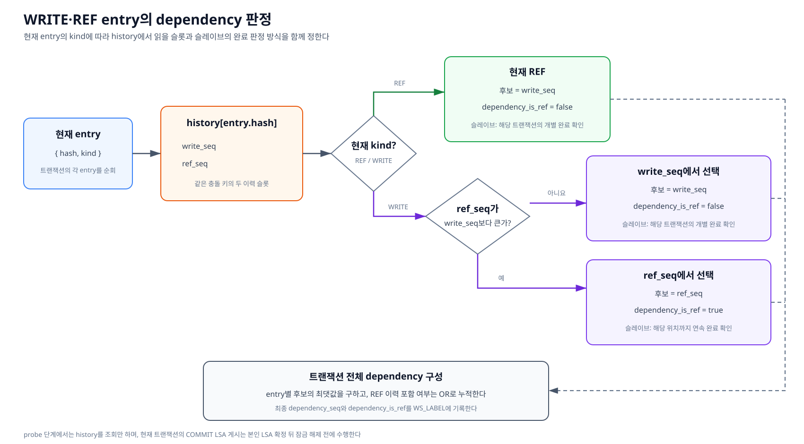

*그림 6-1-3. 트랜잭션의 각 WRITE·REF entry를 전역 history와 대조해 선행 COMMIT LSA와 슬레이브의 대기 방식을 정하는 과정*

### 4. `ref_seq` 한 건의 완료만 보면 안 된다

`ref_seq`는 여러 REF의 COMMIT LSA 중 최댓값 하나만 보관한다. 그러나 그 값은 마스터의 커밋 순서일 뿐, 슬레이브에서 그 앞의 REF까지 모두 적용됐다는 뜻은 아니다.

마스터에서 T1 다음 T2가 커밋했더라도 두 REF는 서로 의존하지 않는다. 따라서 슬레이브에서 T1이 실행 중인 동안 T2가 먼저 끝날 수 있다. 이때 `ref_seq`가 가리키는 T2 한 건만 완료됐다고 판단하면, 아직 끝나지 않은 T1을 놓친 채 부모 WRITE가 실행될 수 있다.

### 5. from_ref_seq와 연속 완료 경계로 해결한다

부모 WRITE가 `ref_seq`를 선행 후보로 선택하면 검증 대상 구현은 이 출처를 `from_ref_seq=true`로 함께 보존하여 슬레이브의 대기 방식을 정한다. 키 종류에 따라 후보와 출처를 함께 반환하는 전체 수도코드는 [8-1.2.4절](./8-1-cubrid-마스터-writeset-상세-설계.md#8-124-마스터-로컬-commit의-dependency-계산과-history-게시)에서 설명한다.

```text
write_seq에서 선택 → from_ref_seq=false → 해당 트랜잭션의 개별 완료 확인
ref_seq에서 선택  → from_ref_seq=true  → 해당 위치까지 연속 완료 확인
```

REF 슬롯에서 선택한 선행 조건은 **그 LSA까지 빠짐없이 적용이 완료된 연속 완료 경계(frontier)**로 판정한다. 이 방식은 해당 키의 참조자뿐 아니라 그 위치 앞에 남은 무관한 트랜잭션도 기다릴 수 있는 보수적인 방법이다.

## 6-1.5 커밋 시 dependency 확정과 history 게시

앞 절의 dependency 판정은 COMMIT 직전의 `probe`에서 수행하고, 그 결과를 로그에 남긴 뒤 정상 COMMIT의 본인 시퀀스를 history에 게시한다. 두 시점을 섞으면 아직 COMMIT하지 않은 현재 트랜잭션을 과거 이력처럼 노출할 수 있으므로 다음 순서를 지킨다.

1. `probe`: 현재 트랜잭션의 WRITE·REF 키로 과거 history를 조회한다. history는 변경하지 않는다.
2. `WS_LABEL`: 계산한 dependency LSA와 대기 방식을 복제 로그에 기록한다.
3. `COMMIT`: COMMIT 로그를 기록해 현재 트랜잭션의 본인 COMMIT LSA를 확정한다.
4. `publish`: 정상 COMMIT의 본인 LSA를 각 entry의 종류에 따라 `write_seq` 또는 `ref_seq`에 게시한다.
5. 게시가 끝난 뒤 행 잠금을 해제한다.

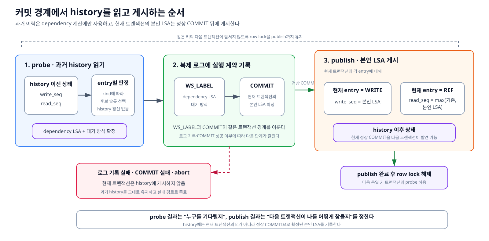

*그림 6-1-4a. 과거 history를 읽는 probe, dependency와 COMMIT의 로그 기록, 정상 COMMIT의 본인 LSA를 history에 게시하는 경계*

로그 기록이나 COMMIT에 실패한 트랜잭션은 history에 게시하지 않는다.

### `WS_LABEL`의 복제 로그 기록과 전달 규칙

마스터는 계산에 사용한 충돌 키, WRITE·REF 슬롯과 history map을 슬레이브에 보내지 않는다. 최종 계산 결과 두 값만 `LOG_DUMMY_WS_LABEL`에 기록한다.

| 필드 | 의미 |
|---|---|
| `dependency_seq` | 현재 트랜잭션보다 먼저 적용을 끝내야 하는 선행 COMMIT LSA |
| `dependency_is_ref` | 특정 선행 트랜잭션의 개별 완료를 볼지, 해당 위치까지의 연속 완료 경계를 볼지 구분하는 값 |

`dependency_is_ref`는 현재 트랜잭션이 WRITE인지 REF인지 나타내지 않는다. 최종 dependency가 과거 `ref_seq`에서 선택되어 슬레이브가 연속 완료 경계를 기다려야 하는지를 전달한다.

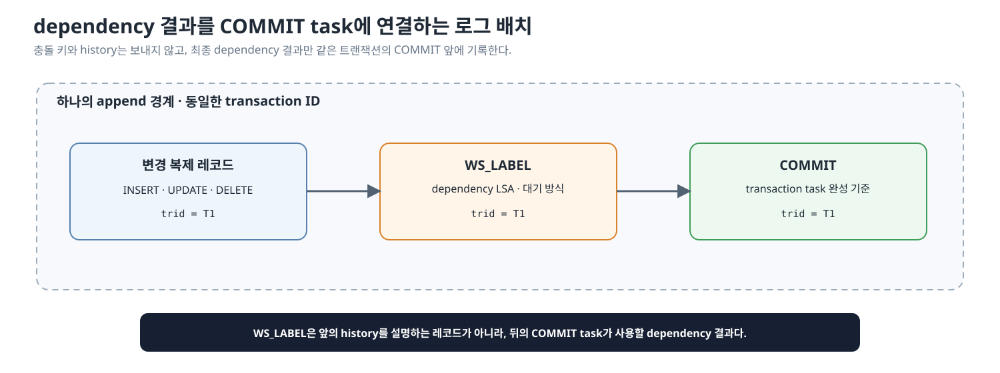

*그림 6-1-4b. 한 트랜잭션의 변경 복제 레코드, dependency 라벨과 COMMIT을 같은 트랜잭션 ID로 연결하는 복제 로그 배치*

`WS_LABEL`은 행이나 스키마를 변경하는 로그가 아니며, 다음 COMMIT에 붙일 순서 메타데이터다. 변경 복제 레코드, WS_LABEL과 COMMIT은 하나의 append 경계에서 다음 조건을 만족해야 한다.

- WS_LABEL은 같은 `trid`의 COMMIT 바로 앞에 기록한다.
- 병렬 적용할 복제 항목이 있는 COMMIT에는 정확히 하나의 WS_LABEL을 연결한다.
- system recovery는 이 레코드를 데이터 변경으로 redo·undo하지 않고, applylogdb reader만 dependency 메타데이터로 소비한다.

정식 로그 형식은 C 구조체의 `bool` 크기나 padding에 의존하지 않도록 필드 크기·정렬·버전 판별 방법을 고정해야 한다. postponed commit, system transaction과 복제 항목이 없는 COMMIT에 라벨을 기록할지는 상세 설계에서 경로별로 확정한다. 실제 레코드 구조와 append 함수는 [8-1.2절](./8-1-cubrid-마스터-writeset-상세-설계.md#8-12-마스터-변경)에서 설명한다.

## 6-1.6 본인 시퀀스와 lc 계산 예시

이제 앞의 판정 규칙과 커밋 경계를 하나의 수치 예제로 연결한다.

`lc`는 현재 트랜잭션보다 앞서 완료되어야 하는 위치이며, 이 문서의 `dependency_seq`에 해당한다. 본인 시퀀스는 현재 트랜잭션 자신의 COMMIT 위치다. 다음은 LSA를 이해하기 쉬운 숫자로 줄여 쓴 예다. T0·T3는 부모 키 7을 WRITE하고, T1·T2는 서로 다른 자식 행에서 부모 키 7을 REF한다. U0·U1은 이 키와 무관한 트랜잭션이다.

```text
마스터 커밋 순서
T0 부모 7 생성         본인 seq=100
U0 무관한 트랜잭션     본인 seq=110
T1 자식 10 → 부모 7   본인 seq=120
T2 자식 11 → 부모 7   본인 seq=130
U1 무관한 트랜잭션     본인 seq=140
T3 부모 7 삭제         본인 seq=150
```

T0가 커밋하면 부모 키 7의 WRITE history에 자신의 시퀀스 100을 게시한다.

```text
history[부모 키 7]
    write_seq = 100   # T0 본인 seq
    ref_seq  = NULL
```

T1은 기본 lc 110을 가지고 probe를 시작한다. 현재 항목이 REF이므로 `write_seq=100`만 후보로 사용하여 최종 lc를 100으로 낮춘다. T1이 커밋하면 자신의 시퀀스 120을 `ref_seq`에 게시한다.

```text
T1 본인 seq = 120
T1 기본 lc  = 110
T1 후보     = write_seq 100
T1 최종 lc  = min(110, 100) = 100

커밋 후: write_seq=100, ref_seq=120
```

T2도 REF이므로 T1이 게시한 `ref_seq=120`은 보지 않고 `write_seq=100`만 본다. 따라서 T1과 같은 lc를 얻어 두 자식은 서로 기다리지 않는다. 커밋 후에는 T2 자신의 시퀀스 130을 `ref_seq`에 반영한다.

```text
T2 본인 seq = 130
T2 기본 lc  = 120
T2 후보     = write_seq 100
T2 최종 lc  = min(120, 100) = 100

커밋 후: write_seq=100, ref_seq=max(120, 130)=130
```

T3는 부모 키 7을 삭제하는 WRITE다. 이전 WRITE와 REF 중 더 늦은 위치를 먼저 고르고 그 후보로 기본 lc를 낮춘다. 선택한 130이 `ref_seq`에서 왔으므로 슬레이브에서는 130 한 건의 개별 완료가 아니라 130까지의 연속 완료 경계를 기다린다. T3이 커밋하면 lc 130이 아니라 자신의 시퀀스 150을 `write_seq`에 게시한다.

```text
T3 본인 seq = 150
T3 기본 lc  = 140
T3 후보     = max(write_seq 100, ref_seq 130) = 130
T3 최종 lc  = min(140, 130) = 130

커밋 후: write_seq=150, ref_seq=130
```

계산과 게시를 두 단계로 나누면 다음과 같다.

```text
[커밋 전 probe: lc 계산]
현재 REF   → 후보 = write_seq
현재 WRITE → 후보 = max(write_seq, ref_seq)
최종 lc    → min(기본 lc, 후보)

[커밋 후 publish: 본인 시퀀스 게시]
현재 REF   → ref_seq = max(기존 ref_seq, 본인 seq)
현재 WRITE → write_seq = max(기존 write_seq, 본인 seq)
```

probe의 `max(write_seq, ref_seq)`는 과거 선행자를 선택하고, publish의 `max(기존 ref_seq, 본인 seq)`는 가장 늦은 REF 기록을 남긴다. history에는 lc가 아니라 현재 트랜잭션의 본인 시퀀스를 게시한다.

### 그림으로 확인하는 최종 결과

위 계산에서 T1과 T2는 모두 T0를 dependency로 얻었으므로 서로 기다리지 않는다. T3는 `ref_seq`에서 T2의 위치를 선택했으므로 T2 한 건이 아니라 T2까지의 연속 완료 경계를 기다린다. 다음 네 장면은 그 슬레이브 실행 과정을 보여준다.

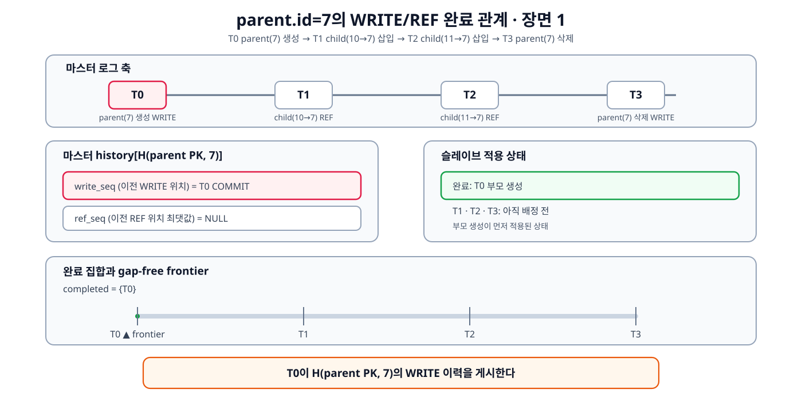

*그림 6-1-5a. T0의 부모 생성 WRITE가 `write_seq`에 게시된 상태*

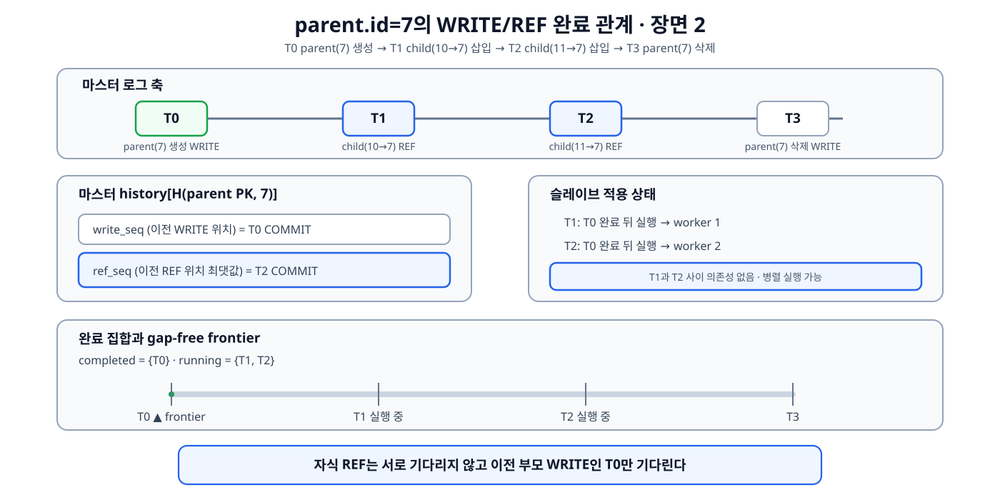

*그림 6-1-5b. T1과 T2가 T0만 기다리고 서로 의존하지 않은 채 실행되는 상태*

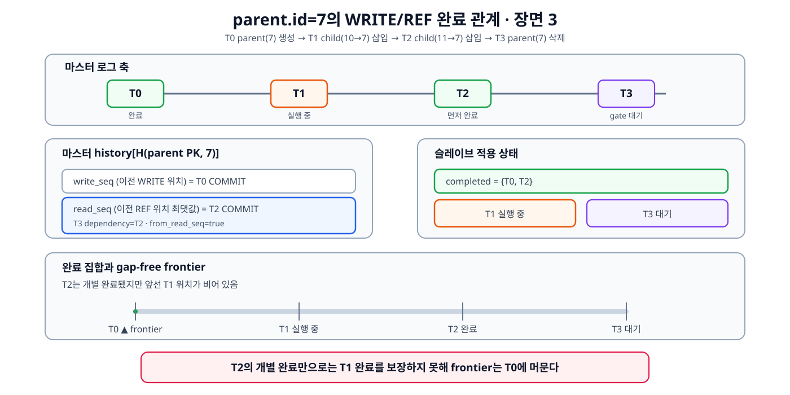

*그림 6-1-5c. T2가 먼저 끝났지만 T1이 남아 있어 연속 완료 경계가 전진하지 못한 상태*

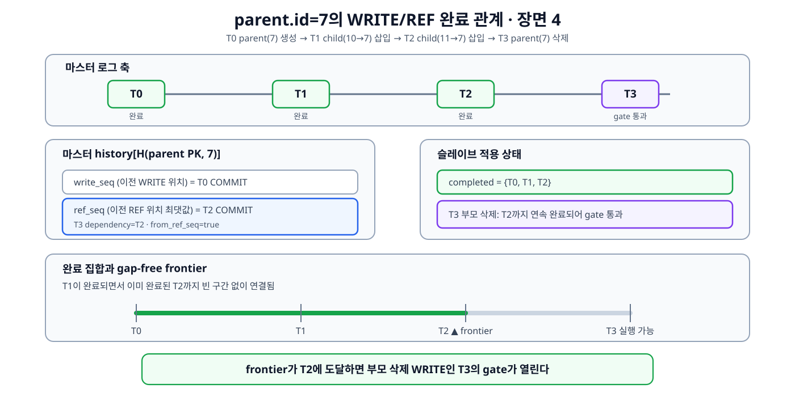

*그림 6-1-5d. T1까지 끝나 연속 완료 경계가 T2까지 전진하고 부모 삭제 T3가 실행 가능해진 상태*

이로써 마스터의 `ref_seq=130`은 슬레이브에서 “T2만 끝났는가”가 아니라 “T2까지 모두 끝났는가”로 해석되어야 함을 확인할 수 있다.

본문에서는 충돌 규칙과 출력 의미만 정의한다. 반복문, 폴백 분기와 현재 단일 라벨 표현의 보완점은 [8-1.2.4절](./8-1-cubrid-마스터-writeset-상세-설계.md#8-124-마스터-로컬-commit의-dependency-계산과-history-게시)에서 설명한다.

> [!NOTE]
> **트랜잭션 전체 계산의 미확정 사항**
> 여러 키의 후보를 가장 큰 LSA 하나와 출처 플래그 하나로 합치면 REF의 연속 완료 조건이 사라질 수 있다. 이 문제는 [8-1.2.4절](./8-1-cubrid-마스터-writeset-상세-설계.md#8-124-마스터-로컬-commit의-dependency-계산과-history-게시)의 ‘다중 dependency 축약 규칙’에서 별도로 다룬다.

## 6-1.7 정상 계산을 할 수 없을 때의 보수 처리

키별 dependency 계산은 필요한 충돌 키가 모두 수집됐다는 전제에서만 안전하다. PoC에서 정상적으로 발생할 수 있는 다음 두 경우에는 키별 계산 대신 commit-order 기준을 사용한다.

- **트랜잭션 writeset 용량 초과**: `LOG_WRITESET_TX_LIMIT`에 도달하면 지금까지 모은 부분 writeset을 버리고 `ws_overflow=true`로 전환한다.
- **statement replication**: DDL처럼 행 이미지로 충돌 키를 만들 수 없는 트랜잭션은 `repl_log_insert_statement()`에서 `ws_overflow=true`로 전환한다.

보수 처리는 부분 writeset으로 충돌 없음을 추측하지 않는다. 키별 후보로 `lc`를 낮추는 대신 직전 COMMIT LSA인 `prev_commit`을 dependency로 사용하고, 슬레이브에서는 **그 위치까지의 연속 완료 경계**를 기다린다. 따라서 앞선 적용에 빈 구간이 남아 있는 동안에는 이 트랜잭션을 실행하지 않는다. 여기서 commit-order는 마스터의 COMMIT 자체를 직렬화한다는 뜻이 아니라, 슬레이브 적용을 안전한 커밋 순서 경계 뒤로 보내는 폴백이다.

### 복합 FK와 NULL FK

복합 FK와 NULL FK는 위 폴백 사유와 구분한다.

- **복합 FK**: 현재 PoC는 부모 PK domain이 `DB_TYPE_MIDXKEY`이면 REF 수집을 건너뛰며 `ws_overflow`로 전환하지 않는다. 정식 설계에서는 자식 FK 컬럼 전체를 부모 PK의 컬럼 순서와 각 domain에 맞춰 하나의 MIDXKEY로 구성하고, 부모 PK WRITE와 동일한 충돌 식별자를 만들어 REF로 수집한다.
- **NULL FK**: 단일 FK가 NULL이거나 복합 FK의 구성 컬럼 중 하나라도 NULL이면 참조할 부모 키가 없으므로 REF를 만들지 않는다. 이는 실패나 폴백이 아니라 정상 수집 규칙이며 정식 설계에서도 유지한다.

부모 domain 조회, key 추출, 형 변환 또는 packing 자체가 실패한 경우는 commit-order 폴백으로 숨기지 않는다. 정식 구현은 오류를 호출자에게 전달해 불완전한 writeset으로 트랜잭션이 정상 커밋되지 않게 한다.

> [!WARNING]
> **폴백 대기 방식의 구현 확인 필요**
> commit-order 폴백은 `prev_commit` 한 건의 개별 완료가 아니라 그 위치까지의 연속 완료를 기다려야 한다. 따라서 폴백 라벨은 `dependency_is_ref=true`와 같은 frontier 대기 방식으로 기록한다.

충돌 키가 실제로 없어 writeset이 빈 트랜잭션은 병렬 처리할 수 있다. abort된 트랜잭션은 정상 COMMIT LSA가 없으므로 history에 게시하지 않는다.

### 전역 history map이 가득 찬 경우

트랜잭션 하나의 writeset 용량 초과와 전역 history map의 용량 도달은 구분한다. 전자는 그 트랜잭션의 키 수집이 불완전한 상태이고, 후자는 마스터가 이전 트랜잭션들의 키별 이력을 더 보관할 수 없는 상태다.

전역 history가 가득 차면 오래된 entry 일부만 임의로 덮어쓰지 않는다. 현재 정상 COMMIT의 본인 시퀀스를 새 `history_start`로 설정한 뒤 history map 전체를 비운다. 이후 트랜잭션의 키별 후보는 이 시작값보다 앞쪽으로 낮아질 수 없으며, 새로 COMMIT하는 트랜잭션의 `write_seq`·`ref_seq`를 게시하면서 map을 다시 채워 나간다.

```text
전역 history 용량 도달
→ history_start = 현재 정상 COMMIT LSA
→ history map 전체 clear
→ 이후 dependency 계산의 하한으로 history_start 사용
→ 새 COMMIT의 WRITE·REF 이력으로 map 재구축
```

map을 비우면 clear 이전의 키별 관계를 직접 찾을 수 없으므로 한동안 dependency가 새 `history_start` 아래로 낮아지지 않는다. 병렬성은 일시적으로 줄지만, 삭제된 과거 이력을 충돌 없음으로 오해하지 않게 만드는 안전장치다.

해시 오류의 두 방향도 결과가 다르다.

- 서로 다른 키가 우연히 같은 해시가 되면 충돌한다고 잘못 판단해 불필요하게 기다린다. 성능만 나빠진다.
- 같은 키가 서로 다른 해시가 되거나 키가 누락되면 실제 충돌을 발견하지 못한다. 필요한 순서가 깨질 수 있으므로 허용할 수 없다.

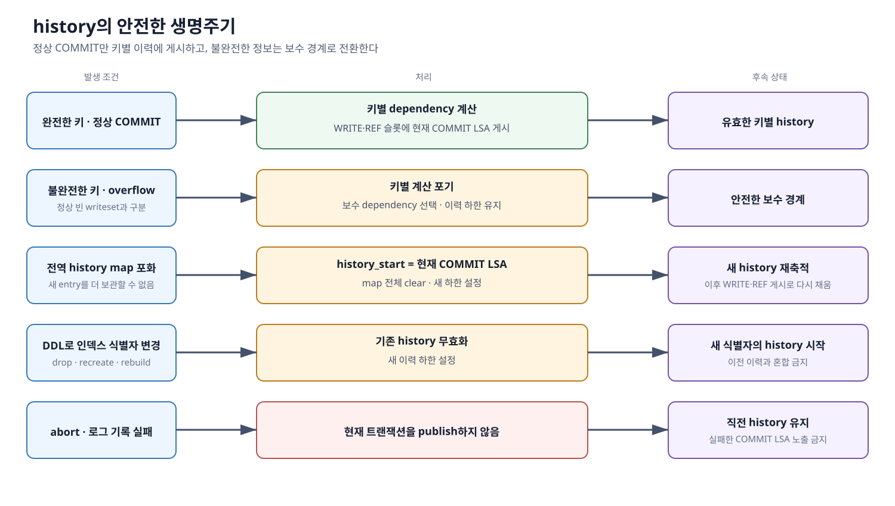

*그림 6-1-6. 정상 수집, 불완전한 수집, 전역 map 포화, DDL 식별자 변경과 abort에 따라 history를 게시·초기화하거나 유지하는 처리*

### 슬레이브에 전달하는 정보

마스터의 전역 history와 충돌 키 자체는 슬레이브로 보내지 않는다. 마스터가 계산을 끝낸 뒤 슬레이브가 실행 여부를 판단하는 데 필요한 결과 두 가지만 `WS_LABEL`로 전달한다.

- **누구를 기다리는가 — `dependency_seq`**: 먼저 완료돼야 할 선행 COMMIT LSA
- **어떻게 기다리는가 — `dependency_is_ref`**: 해당 트랜잭션 한 건의 개별 완료를 볼지, 그 위치까지의 연속 완료 경계를 볼지 나타내는 값

슬레이브는 이 정보를 다시 계산하지 않고 실행 가능 여부만 판정한다. 같은 `trid`의 변경 목록·WS_LABEL·COMMIT을 task로 결합하는 과정과 gate·pending·worker의 집행 구조는 [6-2.3절](./6-2-cubrid-슬레이브-병렬-적용-설계.md#6-23-복제-로그에서-transaction-task까지)부터 설명한다.
