# 6-2. CUBRID 슬레이브 병렬 적용 설계

전체 병렬화 구조는 [6장](./6-cubrid-writeset-병렬화-개념-설계.md), 마스터의 선행 조건 계산과 `WS_LABEL` 기록 형식은 [6-1장](./6-1-cubrid-마스터-writeset-설계.md)에서 설명한다. 이 문서는 슬레이브의 `reader → task → dependency gate → pending queue 또는 worker → result → 연속 완료 경계`를 개념 수준에서 설명한다.

여기서 reader와 coordinator는 별도 thread가 아니다. 같은 reader 실행 흐름이 복제 로그를 읽는 역할과 task 배정·결과 회수·공유 상태 갱신을 조정하는 역할을 함께 맡는다.

## 6-2.1 슬레이브 전체 실행 구조

슬레이브 병렬 적용은 reader/coordinator와 worker 사이에서 task와 결과의 소유권을 queue로 넘기는 구조다.

이 구조의 핵심은 **단일 reader/coordinator thread와 여러 worker thread의 역할 분리**다. reader/coordinator는 직접 DB 변경을 적용하지 않고, 복제 로그를 읽으며 task 조립·배정과 결과 수거를 조정한다. DB 적용은 queue로 task를 받은 여러 worker가 나누어 수행한다. 따라서 reader/coordinator는 특정 worker의 완료를 매번 기다리지 않고 다음 로그를 계속 읽을 수 있다.

- **pending queue**: 선행 조건이 아직 충족되지 않은 완성 task를 reader/coordinator가 보관한다.
- **worker queue**: worker별 context에 있는 입력 queue다. reader/coordinator가 실행이 허용된 task를 넣고 해당 worker가 가져간다.
- **result queue**: worker별 context에 있는 출력 queue다. worker가 적용 결과를 넣고 reader/coordinator가 worker별 queue를 돌며 회수한다.
- **배정 순서 상태**: worker에 넘긴 순서와 반환 결과의 대응을 추적한다. task 자체를 중복 소유하는 queue가 아니다.

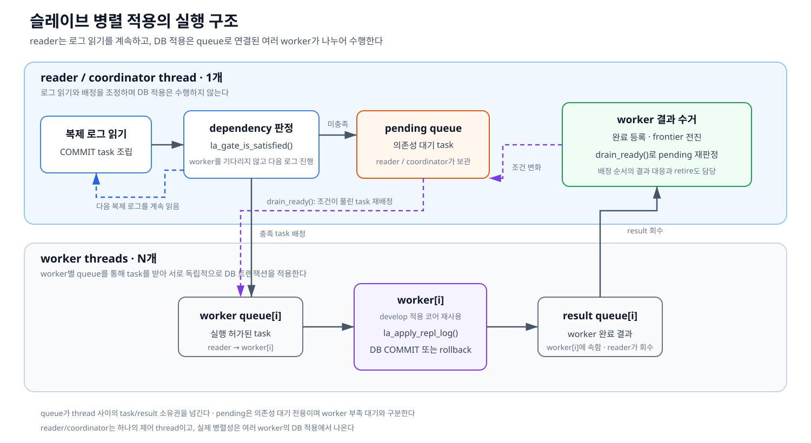

*그림 6-2-1. 로그 읽기와 조정을 담당하는 reader/coordinator, develop의 적용 코어를 재사용해 DB 적용을 병렬 수행하는 worker들, 완료 결과로 pending task를 다시 실행시키는 순환*

그림의 **dependency 판정**은 별도의 queue나 thread가 아니다. reader/coordinator 내부에서 현재 task의 선행 조건이 충족됐는지 확인하는 단계다. 조건이 충족되면 task의 소유권을 선택한 `worker[i]`의 worker queue로 넘긴다. 조건이 미충족이면 reader/coordinator가 pending queue에 task를 보관한다.

task를 `worker[i]`에 넘긴 뒤 reader/coordinator에는 task 자체 대신 결과를 연결할 배정 순서 항목이 남는다. reader/coordinator는 `worker[i]`의 완료를 그 자리에서 기다리지 않고 다음 복제 로그를 계속 읽는다. 따라서 하나의 task는 pending queue와 worker queue에 동시에 들어가지 않는다.

`worker[i]`는 적용을 끝낸 결과를 자신의 result queue에 넣는다. reader/coordinator가 worker별 result queue를 돌며 결과를 회수하면 개별 완료 상태와 frontier가 바뀐다. 이어서 pending task의 dependency를 다시 판정하고, 새로 실행 가능해진 task를 선택한 `worker[i]`의 worker queue로 넘긴다. worker는 pending queue나 frontier를 직접 변경하지 않는다.

result는 해당 배정 순서 항목과 대응시키고 head부터 처리한다. 이 배정 순서는 마스터 커밋 순서의 연속 완료 경계와 다른 상태다. 전자는 result를 task와 대응시키고, 후자는 재시작에 안전한 적용 위치를 정한다. 상세한 완료 판정은 6-2.2.4와 그림 6-2-2b, 실제 함수 호출 순서는 [8-2.4절](./8-2-cubrid-슬레이브-병렬-적용-상세-설계.md#8-24-dependency-gate와-queue-배정-구조)에서 설명한다.

## 6-2.2 병렬 적용에 따른 LSA 관리 변화

[4장](./4-cubrid-develop-lsa와-직렬-처리.md)에서 설명한 LSA의 종류와 물리적 의미는 병렬화 후에도 바뀌지 않는다. 새로운 로그 좌표를 추가하는 대신, 기존 COMMIT LSA를 task의 현재 위치·선행 조건·개별 완료·연속 완료 경계로 구분해 관리한다. 이에 따라 **reader가 로그를 읽은 위치와 worker가 적용을 끝낸 위치가 더 이상 함께 움직이지 않는다.**

이 절은 이 차이를 설명하는 핵심 LSA만 다룬다. 개별 복제 항목의 LSA와 로그 레코드 연결 포인터처럼 병렬화로 의미가 바뀌지 않는 값은 4장의 정의를 따르며, 구조체와 함수의 상세 대응은 [8-2장](./8-2-cubrid-슬레이브-병렬-적용-상세-설계.md)에서 다룬다.

### 6-2.2.1 develop과 병렬 적용의 차이

develop에서는 reader가 COMMIT을 만나면 같은 실행 흐름에서 해당 트랜잭션을 DB에 적용한다. DB COMMIT이 끝난 뒤 완료 위치와 읽기 위치를 차례로 전진시키므로, 앞의 트랜잭션을 남겨 둔 채 뒤의 COMMIT을 계속 읽지 않는다.

병렬 적용에서는 reader가 COMMIT에서 task를 완성해 worker에 넘긴 뒤 결과를 기다리지 않고 다음 로그를 읽는다. 따라서 reader의 읽기 위치는 앞서가고, 실제 적용 완료 위치는 worker 결과를 따라 뒤에서 전진한다.

이 차이를 나타내는 두 값은 다음과 같다.

- **`final_lsa`**: reader가 현재 처리하거나 다음에 읽을 로그 위치다. task를 worker에 넘긴 뒤에도 다음 로그를 따라 전진하므로, 해당 위치까지 DB 반영이 끝났다는 뜻은 아니다.
- **`committed_lsa`**: 대상 DB에 앞에서부터 빠짐없이 적용됐다고 확정한 마지막 COMMIT 위치다. worker 하나가 더 뒤의 task를 먼저 끝내더라도 중간에 미완료 task가 있으면 그 앞에 머문다.

따라서 병렬 적용 중에는 일반적으로 `final_lsa`가 `committed_lsa`보다 앞설 수 있다. 그림 6-2-2a는 reader가 먼저 전진하고, worker 완료 결과가 COMMIT 순서의 빈 구간 없이 이어질 때만 `committed_lsa`가 뒤따라 전진하는 관계를 보여준다.

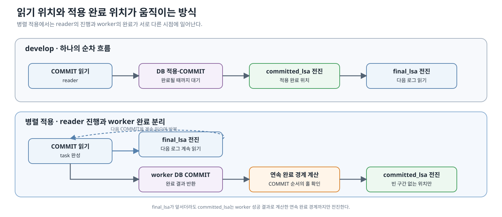

*그림 6-2-2a. develop에서는 읽기와 적용 완료가 같은 흐름으로 전진하지만, 병렬 적용에서는 reader가 `final_lsa`를 전진시켜 다음 COMMIT 읽기를 반복하는 동안 worker의 적용 완료가 별도로 진행되는 차이*

### 6-2.2.2 핵심 LSA와 메모리 완료 상태

병렬화는 새로운 형식의 로그 좌표를 만들지 않는다. `commit_lsa`와 `dependency_seq`는 모두 마스터 로그의 COMMIT 좌표를 슬레이브 task에 보존한 값이다. `commit_lsa`는 reader가 현재 트랜잭션의 COMMIT 레코드에서 얻고, `dependency_seq`는 마스터가 `WS_LABEL`에 기록해 전달한다. 두 값은 변경 데이터를 찾는 복제 항목 위치가 아니라, task의 실행 순서와 완료 여부를 판정하는 메타데이터다.

- 슬레이브가 worker 결과를 수거하면서 메모리에 직접 유지하는 것은 **개별 완료 상태**와 **연속 완료 경계(frontier)**다.
- **개별 완료 상태(completed set) — 메모리 완료 집합**: worker가 DB COMMIT에 성공했다고 반환한 `commit_lsa`들을 보관한다. frontier보다 뒤의 특정 선행 트랜잭션이 먼저 끝났는지 확인하고, 앞쪽 홀이 닫힐 때 frontier를 연속으로 전진시키는 데 사용한다.
- **연속 완료 경계(frontier) — 메모리 경계 상태**: COMMIT 순서에서 중간 홀 없이 연속으로 완료된 마지막 COMMIT LSA다. 메모리의 COMMIT 순서 상태와 개별 완료 상태를 대조해 계산하며, `committed_lsa`는 이 경계까지만 전진해 영속된다.

개별 완료 상태는 COMMIT LSA의 존재 여부를 빠르게 확인하는 **해시 기반 집합**이고, COMMIT 순서 상태는 reader가 COMMIT을 읽은 순서대로 LSA를 넣는 **FIFO**다. 두 상태는 다음처럼 함께 사용한다.

```text
reader가 COMMIT을 읽음
→ COMMIT LSA를 순서 FIFO에 추가

worker 완료 결과를 수거함
→ 성공한 COMMIT LSA를 완료 해시에 추가
→ FIFO head가 완료 해시에 있는 동안
     frontier를 head까지 전진
     FIFO head 제거
→ frontier 이하의 완료 해시 항목은 안전한 시점에 정리
```

HWM은 별도 변수나 자료구조가 아니라, 개별 완료 상태에 들어 있는 COMMIT LSA 중 최댓값을 설명하기 위한 개념이다. HWM과 frontier가 같으면 읽어 온 범위가 순서대로 완료된 상태다. 앞선 task가 끝나지 않은 채 뒤의 task가 먼저 끝나면 HWM은 앞으로 이동하지만 frontier는 홀 앞에 머문다.

완료 집합에서 frontier보다 뒤의 항목은 아직 특정 dependency 판정과 홀 해소에 필요하므로 용량이 부족하다는 이유로 버릴 수 없다. 완료 집합이 정해진 상한에 가까워지면 frontier 이하 항목을 먼저 정리하고, 그래도 공간을 확보하지 못하면 reader의 추가 task 유입에 backpressure를 적용하거나 명시적으로 중단해야 한다.

4장에서 설명한 기존 LSA가 병렬 적용에서 어떻게 달라지는지는 다음과 같다.

| 대상                              | develop                               | 병렬 적용                                                     | 리뷰할 핵심                                          |
| ------------------------------- | ------------------------------------- | --------------------------------------------------------- | ----------------------------------------------- |
| `la_Info.final_lsa`             | 현재 트랜잭션의 적용을 마친 뒤 다음 로그로 전진           | task를 넘긴 뒤 worker 완료 전에 먼저 전진할 수 있음                       | 읽기 위치를 적용 완료 위치로 사용하지 않는가                       |
| `LA_APPLY_TASK.commit_lsa`      | reader가 순차 적용하는 COMMIT 위치             | task가 자신의 COMMIT 위치를 끝까지 보존해 순서 밖 완료를 원래 COMMIT 순서에 다시 연결 | task 생성부터 결과 수거까지 값이 유지되는가                      |
| `la_Info.committed_lsa`         | 순차 DB COMMIT이 끝난 위치로 전진               | 연속 완료 경계까지만 전진하고 그 값을 영속                                  | 메모리 경계와 apply info 영속 성공을 구분하는가                 |
| `la_Info.required_lsa`          | reader가 보유한 미완 트랜잭션의 가장 오래된 시작 위치를 보존 | reader가 지나간 task도 retire될 때까지 미완 범위에 포함                   | pending·worker·결과 대기 task의 시작 위치를 너무 일찍 버리지 않는가 |
| `la_Info.committed_rep_lsa`     | 적용한 복제 항목의 진행 위치                      | 여러 worker 결과의 관측 최댓값이며 연속 완료를 보장하지 않음                     | 재시작 안전 경계나 hole 통과 조건으로 사용하지 않는가                |

즉 병렬화는 LSA의 물리적 의미를 바꾸지 않는다. **어떤 실행 결과를 확인한 뒤 값을 전진시킬 수 있는지**와 **그 값을 언제까지 보존해야 하는지**가 달라진다.

### 6-2.2.3 reader가 앞서갈 때 보존해야 하는 경계

T1의 COMMIT 위치가 C1이고, 그 전까지 빠짐없이 적용된 위치가 C0이라고 하자. reader가 C1에서 task를 만들어 worker에 넘기면 다음 로그로 이동할 수 있다.

```text
C1 COMMIT 읽기
→ T1 task에 commit_lsa=C1 보존
→ task를 pending 또는 worker에 전달
→ reader는 final_lsa를 다음 로그로 전진
→ T1의 성공 결과가 없으므로 frontier와 committed_lsa는 C0 유지
```

`final_lsa`가 C1을 지났다는 것은 reader가 C1을 읽었다는 뜻일 뿐이다. T1의 DB COMMIT 성공 결과가 완료 집합에 등록되고, C1이 COMMIT 순서 FIFO의 head로 확인돼야 frontier와 `committed_lsa`가 C1까지 전진한다.

T1이 아직 pending, worker queue, 실행 중 또는 결과 처리 대기 상태라면 장애 후 T1을 다시 구성할 가능성이 남아 있다. 따라서 T1의 시작 로그 위치도 `required_lsa` 계산에 계속 포함해야 한다.

### 6-2.2.4 순서 밖 완료와 COMMIT 순서의 홀

마스터의 COMMIT 순서가 `C1 → C2 → C3`이어도 worker 완료 순서는 `C3 → C1 → C2`가 될 수 있다.

아래 표의 **개별 완료 상태** 열이 completed set의 현재 내용이다. `{C3}`은 C3의 worker 결과가 먼저 수거되어, C3의 `commit_lsa`가 완료 해시에 들어 있다는 뜻이다.

| worker 결과가 도착한 시점 | 개별 완료 상태       | 연속 완료 경계             |
| ----------------- | -------------- | -------------------- |
| C3 완료             | `{C3}`         | C1이 비어 있으므로 유지       |
| C1 완료             | `{C1, C3}`     | C1까지 전진              |
| C2 완료             | `{C1, C2, C3}` | C2와 이미 끝난 C3까지 연속 전진 |

뒤의 C3가 먼저 끝났지만 앞의 C1·C2가 끝나지 않은 구간이 **COMMIT 순서의 홀**이다. 개별 완료 상태는 C3 같은 특정 트랜잭션의 완료를 알려 주지만, 안전한 완료 위치는 아니다. `committed_lsa`는 이 홀을 건너뛰지 않고 연속 완료 경계까지만 전진한다.

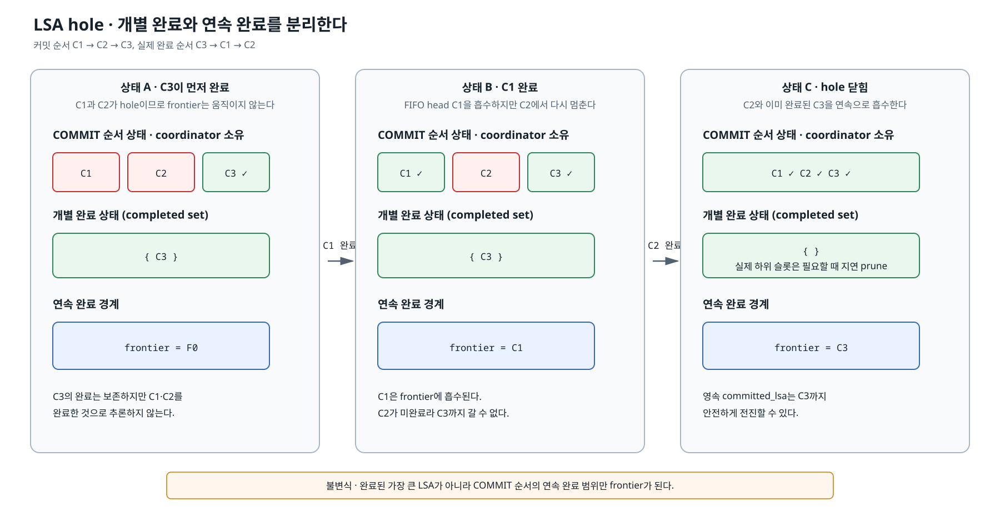

*그림 6-2-2b. reader의 읽기 진행과 worker의 순서 밖 완료를 허용하면서, 앞의 빈 구간이 채워질 때만 연속 완료 경계를 전진시키는 구조*

개별 완료 상태에는 연속 완료 경계보다 뒤에서 먼저 끝난 트랜잭션의 COMMIT LSA가 들어간다. 따라서 WRITE history에서 선택한 특정 선행 트랜잭션이 끝났는지는 이 상태로 확인할 수 있다. 반면 REF history에서 선택한 선행 조건은 그 LSA까지 앞선 작업이 모두 끝나야 하므로 연속 완료 경계로 판정한다. 재시작에 사용할 안전한 적용 완료 위치도 같은 경계를 따른다.

여기에는 목적이 다른 두 순서 상태가 사용된다.

- **배정 순서 상태**: worker에 보낸 task와 돌아온 result를 대응시키고, 배정 순서대로 결과를 확정한다.
- **COMMIT 순서 상태**: 마스터의 COMMIT 순서를 보존한다. 앞에서부터 완료가 확인된 항목을 따라가며 연속 완료 경계를 전진시킨다.


개별 완료와 연속 완료 경계를 dependency 판정에 사용하는 방법은 [6-2.4절](#6-24-dependency-판정과-task-배정), 홀 상태의 상세 자료구조와 용량 문제는 [8-2장](./8-2-cubrid-슬레이브-병렬-적용-상세-설계.md)에서 설명한다.

### 6-2.2.5 영속과 재시작

#### 6-2.2.5.1 영속 완료 위치

영속된 `committed_lsa`는 다음 의미를 지켜야 한다.

> 이 위치 이하의 모든 COMMIT은 대상 DB에 빠짐없이 적용됐다.

따라서 `final_lsa`, 가장 큰 개별 완료 LSA 또는 `committed_rep_lsa`를 이 값으로 사용할 수 없다. 메모리의 연속 완료 경계를 `committed_lsa`에 반영하고 apply info 저장까지 성공한 뒤에야 재시작 시 신뢰할 수 있다.

#### 6-2.2.5.2 비정상 종료 뒤의 홀 복구

비정상 종료에서는 drain을 끝내지 못할 수 있다. 완료를 추정해 경계를 앞당기는 대신 마지막으로 영속된 `committed_lsa`부터 다시 읽는다. 이때 이전 실행에서 저장한 `final_lsa`를 복구 상한 R로 고정한다. 저장된 R이 이전 실행에서 worker가 적용했을 가능성이 있는 범위를 빠짐없이 덮도록, task 공개와 `final_lsa` 영속의 순서 및 주기 저장 사이의 crash window 처리 계약은 상세 설계에서 확정해야 한다.

그림 6-2-2b의 상태 B에서 C1과 C3은 DB COMMIT을 마쳤지만 C2는 아직 끝나지 않았다. 따라서 연속 완료 경계와 `committed_lsa`는 C1에 머문다. 이때 종료 직전 상태에는 서로 다른 세 위치가 존재한다.

- **reader 위치**: `final_lsa`는 C3 뒤까지 전진했다.
- **개별 완료 상태**: C3은 C2보다 먼저 DB COMMIT을 마쳐 완료 상태에 남아 있다.
- **안전한 완료 위치**: C2가 미완료이므로 연속 완료 경계와 영속 `committed_lsa`는 C1에 머문다.

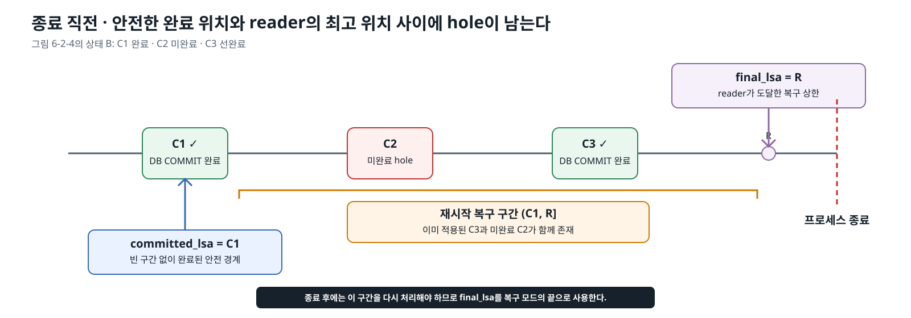

*그림 6-2-2c. 그림 6-2-2b의 상태 B에서 `committed_lsa`와 `final_lsa` 사이에 이미 적용된 C3과 미완료 C2가 함께 남은 채 종료되는 문제*

여기서 `final_lsa=R`을 완료 위치로 사용하면 미완료 C2를 건너뛰게 된다. `committed_lsa=C1`은 안전하지만, 재시작하면 `(C1, R]` 구간에서 미완료 C2와 이미 적용된 C3을 다시 만나게 된다. 따라서 기동 시 저장된 `final_lsa=R`을 복구 상한으로 고정하고, 이 구간을 복구 중인 상태와 R 이후의 정상 운영 상태를 구분해야 한다.


```text
기동
→ 영속된 committed_lsa를 재시작 기준선으로 복원
→ reader의 읽기 위치를 committed_lsa로 설정
→ 저장된 final_lsa를 recovery boundary R로 보존
→ (committed_lsa, R] 구간 재처리
→ R까지는 재적용 오류의 로그와 fail_counter 증가 생략
→ R 범위의 task와 연속 완료 경계 처리 완료
→ 정상 오류 처리로 전환
```

이 구간에는 이전 실행에서 이미 DB COMMIT된 task와 아직 적용되지 않은 hole이 섞여 있다. 이미 적용된 task의 재처리에서 발생하는 오류는 복구 구간의 관측 대상에서 제외하지만, 실패를 성공으로 바꾸거나 연속 완료 경계를 우회하지 않는다.

`required_lsa`는 복구 상한이 아니라 로그 보관 하한이다. 실행 중인 트랜잭션 가운데 가장 오래된 시작 위치를 유지한다.

#### 6-2.2.5.3 복구 완료 판정

reader가 이전 실행의 읽기 위치까지 다시 도달했다는 사실만으로 복구가 끝난 것은 아니다. 그 범위의 task가 pending이나 worker에 남아 있을 수 있다.

복구 완료는 다음 조건을 함께 확인한다.

- 복구 대상 로그 범위를 다시 읽었다.
- 해당 범위의 task가 모두 처리됐다.
- 연속 완료 경계가 해당 범위의 마지막 COMMIT까지 도달했다.
- 갱신한 `committed_lsa`의 영속이 성공했다.

복구 중 오류 로그와 실패 횟수를 어떻게 집계할지는 완료 판정과 분리한다. 오류 관측을 생략하더라도 실패한 task를 성공으로 표시하거나 연속 완료 경계를 우회해서는 안 된다.

### 6-2.2.6 핵심 불변식

1. `final_lsa`는 적용 완료 위치가 아니다.
2. 개별 완료의 최댓값은 재시작 안전 경계가 아니다.
3. DB COMMIT 성공을 확인한 결과만 완료 상태에 반영한다.
4. 연속 완료 경계는 COMMIT 순서의 홀을 건너뛰지 않고 단조 증가한다.
5. `committed_lsa`는 연속 완료 경계까지만 전진하며, 영속 성공 전에는 재시작 완료 위치가 아니다.
6. 미완 task의 시작 위치는 task가 정리될 때까지 `required_lsa` 계산에 남는다.
7. drain하지 못한 비정상 종료는 영속된 `committed_lsa`부터 저장된 `final_lsa` 복구 상한까지 다시 처리한다.

이 절은 LSA의 역할과 상태 변화만 정의한다. 구조체와 함수의 상세 대응 및 홀 상태의 자료구조는 [8-2장](./8-2-cubrid-슬레이브-병렬-적용-상세-설계.md), 역할 전환 경로의 코드 근거는 [10.5절](./10-코드-및-실측-부록.md#105-cubrid-역할-전환-drain-코드-근거)에서 확인한다.

## 6-2.3 복제 로그에서 transaction task까지

슬레이브는 마스터의 충돌 키나 WRITE·REF history를 다시 계산하지 않는다. reader는 복제 로그를 물리적 순서대로 읽으면서 일반 복제 레코드, `LOG_DUMMY_WS_LABEL`, COMMIT을 같은 `trid`로 연결해 COMMIT 단위의 task를 완성한다.

- **변경 목록**: `LOG_REPLICATION_DATA`·`LOG_REPLICATION_STATEMENT`에서 모은 한 트랜잭션의 복제 항목
- **선행 조건**: `LOG_DUMMY_WS_LABEL`의 `dependency_seq`와 `dependency_is_read`
- **자신의 순서 좌표**: 해당 트랜잭션의 COMMIT LSA

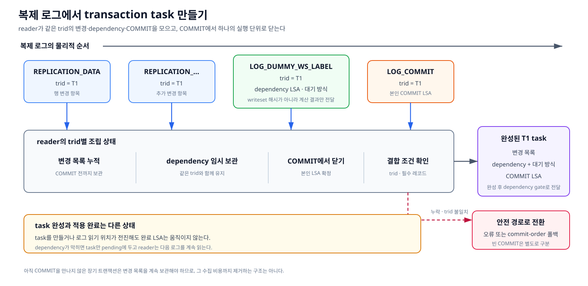

*그림 6-2-3. reader가 같은 trid의 복제 항목과 dependency 라벨을 모으고 COMMIT에서 하나의 transaction task로 닫는 과정*

`LOG_DUMMY_WS_LABEL`은 writeset 해시 전체가 아니라 마스터가 계산한 **dependency 결과만** 전달한다. reader는 라벨을 같은 `trid`의 변경 목록과 함께 보관하다가 COMMIT을 만나면 본인 COMMIT LSA까지 묶어 task를 완성한다. task를 만들거나 로그 읽기 위치가 전진한 사실만으로 적용 완료 위치를 바꾸지는 않는다.

WS_LABEL을 읽는 순간에는 DB 적용이나 task 실행이 일어나지 않는다. reader는 `trid`, `dependency_seq`, `dependency_is_read`를 임시 보관하고, 뒤이어 같은 `trid`의 COMMIT을 확인한 경우에만 task로 옮긴다. 현재 task의 `commit_lsa`는 COMMIT 레코드 위치에서 얻고, 선행 조건은 WS_LABEL에서 얻는다. 라벨을 소비한 뒤에는 다음 트랜잭션과 섞이지 않도록 임시 상태를 초기화한다.

복제 변경이 있는데 같은 `trid`의 라벨이 없거나 다른 라벨이 연결되면 dependency를 알 수 없다. 이를 `NULL` dependency로 통과시키지 않고 오류 또는 commit-order 폴백으로 전환해야 한다. 중복 라벨, 소비되지 않은 이전 라벨, `trid` 불일치와 payload decode 실패도 정상적인 `dependency_seq=NULL`과 구분한다. 복제 항목이 없는 빈 COMMIT은 별도로 구분하며, 혼합 버전에서는 알 수 없는 WS_LABEL 형식을 조용히 독립 task로 바꾸지 않는다.

막힌 task는 pending에 두고 reader는 다음 로그를 계속 읽는다. 장기 트랜잭션의 COMMIT 전 변경 목록은 계속 보관해야 한다.

`LOG_SYSOP_END`도 복제 항목이 있으면 하나의 task를 닫는 레코드로 처리한다. reader는 해당 sysop 범위의 item을 트랜잭션 변경 목록에서 떼어 별도 task로 만들고, SYSOP_END LSA를 자신의 순서 좌표로 사용한다. 같은 `trid`의 다음 sysop task나 최종 COMMIT task는 직전 sysop task의 완료를 기다려야 한다. 이를 통해 serial 갱신이나 `INCR()`처럼 바깥 트랜잭션과 독립적으로 커밋되는 top operation을 바깥 COMMIT·ABORT와 분리해 반영한다. 함수별 대응과 현재 기능 브랜치와의 차이는 [8-2.3절](./8-2-cubrid-슬레이브-병렬-적용-상세-설계.md#8-23-reader의-로그-읽기와-task-구성), 남은 구현·실측 항목은 [9.1.1](./9-미해결-리스크.md#911-log_sysop_end-별도-task-처리와-db_serial-갱신-순서)에 정리한다.

## 6-2.4 dependency 판정과 task 배정

dependency gate는 선행 조건을 새로 계산하지 않는다. 마스터가 전달한 조건이 현재 완료 상태에서 충족됐는지만 판정한다.

```text
reader가 LOG_COMMIT 확인
→ trid의 변경 목록과 dependency로 transaction task 완성
→ COMMIT LSA를 커밋 순서 FIFO에 등록
→ dependency 충족 여부 판정
    ├─ 충족   → worker에 dispatch
    └─ 미충족 → pending queue에 보관
```

게이트의 충족 여부는 다음 순서로 판정한다.

```text
if dependency 없음:
    통과

if dependency <= 연속 완료 경계:
    통과

if dependency_is_read == true:
    pending  # 최종 dependency가 과거 read_seq에서 선택됐다는 뜻이다.
             # 완료 집합의 해당 LSA 한 건만으로는 앞선 REF 전체의 완료를 보장할 수 없다.

if 완료 집합에 dependency LSA가 있음:
    통과    # 위 분기를 지나왔으므로 WRITE 이력에서 온 dependency에만 적용된다.
            # 완료 집합은 frontier보다 뒤에서 먼저 적용을 마친 트랜잭션의
            # COMMIT LSA를 보관하는 메모리 집합이다.

pending # dependency가 있는 선행 WRITE가 아직 완료되지 않았다.
```

- **dependency 없음**: 기다릴 충돌이 없으므로 바로 통과한다.
- **연속 완료 경계 이하**: dependency 종류와 관계없이 그 위치까지 빠짐없이 적용됐으므로 통과한다.
- **경계보다 큰 REF 이력 dependency**: 마지막 참조자 한 건의 개별 완료만으로는 앞선 형제 참조자의 완료를 보장할 수 없어 pending에 둔다.
- **경계보다 큰 WRITE 이력 dependency**: 완료 집합에 정확히 같은 COMMIT LSA가 있으면 선행 WRITE 한 건의 완료가 확인됐으므로 통과한다. 없으면 pending에 둔다.

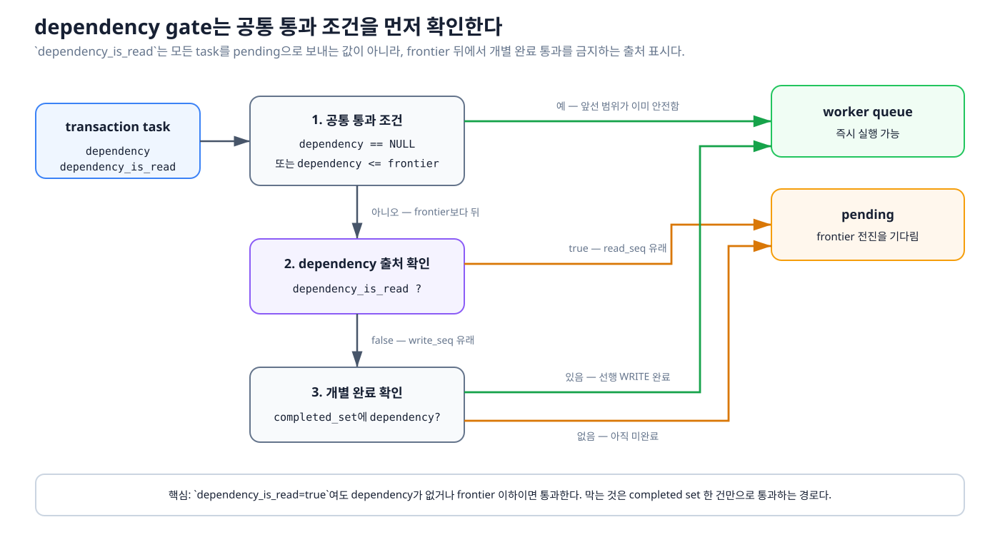

*그림 6-2-4. dependency gate가 전달받은 선행 조건의 충족 여부만 판정해 task를 worker queue 또는 pending queue로 보내는 구조*

pending task가 다시 움직이는 계기는 worker의 완료 결과다.

```text
worker가 DB COMMIT 완료
→ reader/coordinator가 result 수거
→ COMMIT LSA를 완료 집합에 등록
→ 연속 완료 경계 전진
→ pending task를 같은 게이트 조건으로 재판정
    ├─ 충족   → pending에서 제거하고 worker에 dispatch
    └─ 미충족 → pending 유지
```

최초 task 판정과 pending 재판정은 같은 충족 규칙을 사용한다. 차이는 최초 판정은 reader가 COMMIT task를 완성했을 때 수행하고, 재판정은 worker 결과 수거로 완료 집합이나 연속 완료 경계가 바뀐 뒤 `drain_ready`에서 수행한다는 점이다.

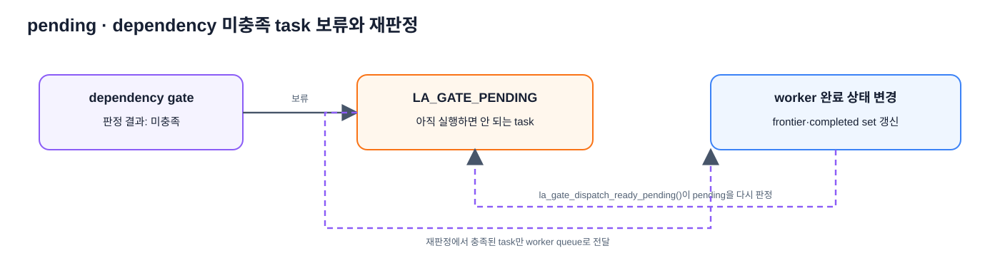

*그림 6-2-4a. dependency 미충족 task를 pending에 보류하고 worker 완료 상태가 바뀐 뒤 같은 gate 조건으로 다시 판정하는 과정*

게이트를 통과한 task는 **현재 맡고 있는 미완료 task가 가장 적은 worker**에 배정한다. 여기서 미완료 task 수는 worker queue에서 기다리는 task와 worker가 현재 실행 중인 task를 합친 값이다.

```text
worker[0]: 실행 중 1건 + queue 대기 2건 = 미완료 3건
worker[1]: 실행 중 0건 + queue 대기 1건 = 미완료 1건

새 task → worker[1] 선택
```

worker를 차례로 확인하다가 미완료 task가 없는 worker를 만나면 즉시 선택하고, 모두 작업 중이면 미완료 task가 가장 적은 worker를 선택한다. 같은 트랜잭션의 변경은 선택된 worker 하나가 task 단위로 끝까지 처리한다. 이 값은 배정 균형을 잡는 데만 사용하며, 실행 순서의 안전성은 앞 단계의 dependency gate가 보장한다. 구체적인 계산과 함수 대응은 [8-2.4절](./8-2-cubrid-슬레이브-병렬-적용-상세-설계.md#8-24-dependency-gate와-queue-배정-구조)에서 설명한다.

pending queue는 worker가 바빠서 기다리는 장소가 아니다. 선행 조건이 충족된 task는 모든 worker가 실행 중이어도 선택한 worker queue에 배정한다. 선택한 worker queue가 가득 찬 경우에는 reader가 빈 공간을 기다리는 backpressure를 적용하며, 이 상황을 dependency 미충족으로 바꾸어 pending queue에 넣지 않는다.

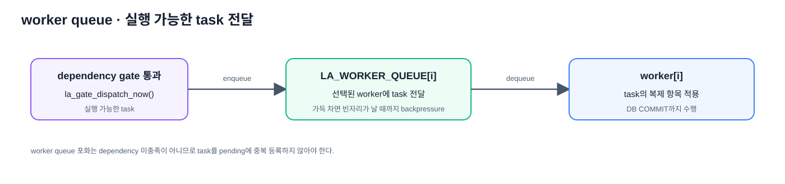

*그림 6-2-4b. dependency gate를 통과한 task가 선택된 worker의 입력 queue를 거쳐 worker에 전달되는 과정*

## 6-2.5 worker 실행과 결과 반환

worker는 worker queue에서 task를 가져와, task 하나에 포함된 변경을 하나의 DB 트랜잭션으로 적용한다. 성공하면 DB COMMIT 결과와 task의 COMMIT LSA 등 완료 판정에 필요한 정보를 result queue로 반환하고, 실패하면 오류 상태와 rollback 결과를 반환한다.

worker 안의 **복제 항목 적용 로직**은 `develop`의 기존 경로를 재사용한다. 바뀐 부분은 적용 로직 자체가 아니라 이를 실행하는 주체와 task·result 전달 방식이다.

```text
develop
reader → 기존 복제 항목 적용 로직 → DB 적용

병렬 적용
reader → worker queue[i] → worker[i]
                           → 같은 복제 항목 적용 로직
                           → DB COMMIT 또는 rollback
       ← result queue[i]  ← 적용 결과
```

develop에서는 reader가 기존 적용 함수를 직접 호출해 순차 실행한다. 병렬 구조에서는 `worker[i]`가 같은 적용 핵심을 실행하고, DB COMMIT 성공 여부·오류·COMMIT LSA를 result로 돌려준다. 구체적인 함수 대응은 [8-2.5절](./8-2-cubrid-슬레이브-병렬-적용-상세-설계.md#8-25-worker-적용과-결과-반환)에서 확인한다.

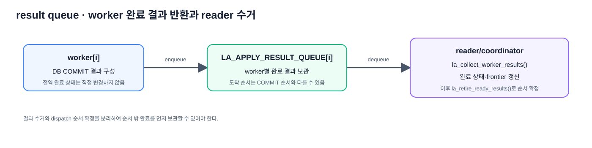

*그림 6-2-4c. worker가 DB COMMIT 결과를 result queue에 반환하고 reader/coordinator가 이를 수거해 완료 상태와 순서 확정 단계로 넘기는 과정*

reader/coordinator는 성공을 확인한 결과만 완료 상태에 반영한다. worker가 DB COMMIT을 끝내기 전에 task를 완료로 공개하거나, 실패한 task를 완료로 표시해 그 task를 기다리던 후속 작업을 실행시켜서는 안 된다. worker는 pending queue나 전역 적용 완료 LSA를 직접 변경하지 않으며, 결과 수거와 전역 완료 상태 갱신은 reader/coordinator가 담당한다.

## 6-2.6 막힌 task 뒤의 독립 task

마스터 커밋 순서가 `T1, T2, T3, T4`이고 T1이 아직 완료되지 않아 T2가 기다려야 하지만 T3과 T4는 T1·T2와 충돌하지 않는다고 하자.

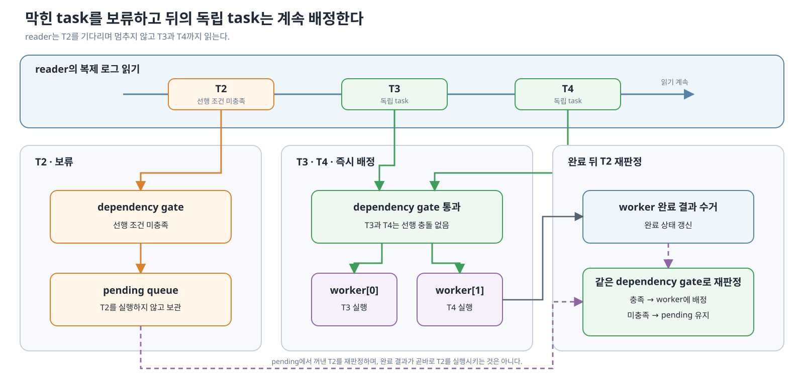

*그림 6-2-5. 기다리는 T2를 pending에 보류하고 뒤의 독립 트랜잭션을 먼저 실행한 뒤, 완료 상태가 바뀌면 T2를 같은 dependency gate로 재판정하는 과정*

이 구조는 T2의 선행 조건을 완화하거나 무시하지 않는다. 기다림의 위치를 reader에서 pending queue로 옮겨, 이미 실행 가능한 뒤쪽 트랜잭션을 읽고 배정할 수 있게 한다. 배정된 task의 결과가 순서 밖으로 도착해도 먼저 수거해 두고, 순서 처리는 앞선 항목이 준비될 때까지 기다리므로 reader가 worker 완료를 매번 동기적으로 기다리는 head blocking을 완화한다.

## 6-2.7 역할 전환 drain

failover가 발생해 역할 전환을 시작하면 먼저 로그 처리 기준점 `R`을 고정하고, 그 뒤에 생기는 새로운 transaction task의 유입을 막는다. 다만 `R`까지 이미 읽어 받아들인 task는 버리지 않는다. pending, worker 대기·실행, result 대기 상태에 남은 작업을 모두 drain 대상으로 유지한다.

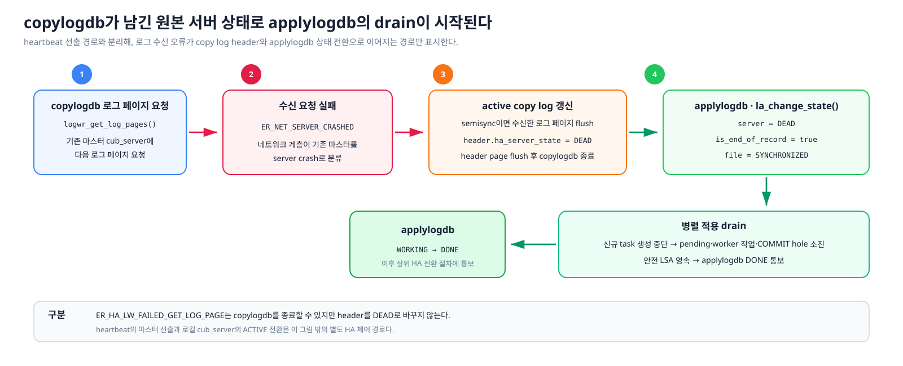

*그림 6-2-6. failover 발생 시 처리 기준점을 고정하고 새로운 task 유입은 막되, 이미 받아들인 작업은 drain 대상으로 유지하는 단계*

입력을 막은 뒤에는 남은 task를 평상시와 같은 dependency gate로 판정한다. dependency가 없거나 이미 충족된 task는 worker에 배정하고, 아직 충족되지 않은 task는 pending에 둔다. worker 결과가 도착하면 coordinator가 결과를 수거해 개별 완료 상태와 연속 완료 경계를 갱신하고, 그 변화로 실행 가능해진 pending task를 같은 gate에서 다시 판정한다.

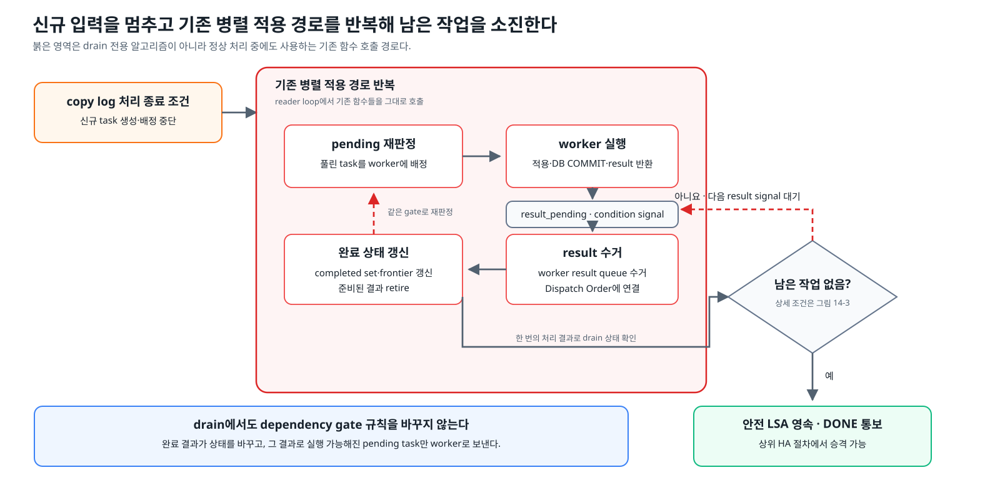

*그림 6-2-7. worker 완료 결과로 dependency 상태를 갱신하고 pending task를 같은 gate에서 재판정하는 과정을 반복해 남은 작업을 모두 소진하는 drain*

drain은 dependency를 무시해 pending task를 강제로 실행하는 과정이 아니다. 정상 실행과 같은 판정·worker 처리·결과 수거를 반복하여 받아들인 작업을 끝내고 COMMIT 순서의 홀을 닫는다.

남은 task와 실행 중인 worker 및 미회수 result가 없고, 연속 완료 경계가 받아들인 마지막 COMMIT까지 도달해 `committed_lsa`로 영속돼야 drain이 완료된다. 이 조건을 모두 확인한 뒤 슬레이브 적용 자원을 정리하고 마스터 역할로 승격한다.

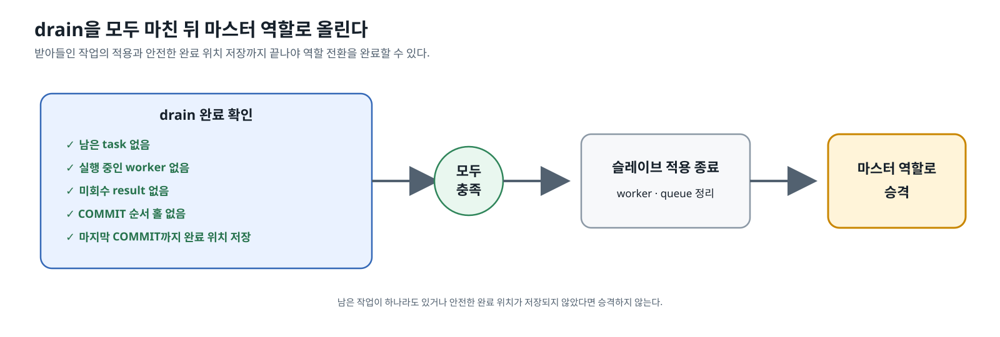

*그림 6-2-8. 남은 작업과 COMMIT 순서의 홀이 모두 사라지고 안전한 완료 위치가 저장된 뒤 마스터 역할로 승격하는 마지막 단계*

## 6-2.8 시작과 종료의 원칙

reader는 worker와 queue가 모두 준비된 뒤 task 배정을 시작한다. 종료할 때는 신규 task 배정을 중단하고 worker thread와 공유 자원을 안전하게 회수한다. 일부 worker만 초기화된 상태에서 실패하면 시작된 worker와 준비된 자원만 역순으로 정리해야 한다.

이 문서의 범위는 슬레이브 모듈 사이의 책임과 상태 이동이다. 실제 초기화·종료 구조, 상세 호출 흐름과 dependency metadata 오류 처리 위치는 [8-2장](./8-2-cubrid-슬레이브-병렬-적용-상세-설계.md)에서 구체화한다.
