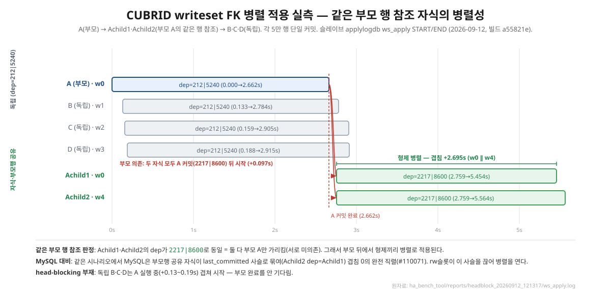

# 6-3. FK 병렬성 실측 — 같은 부모 행을 참조하는 자식의 병렬 적용

## 목적

writeset v2의 read/write 슬롯 분리(rw슬롯)가 **"같은 부모 행을 참조하는 자식 형제"를 슬레이브에서 병렬로 적용하는가**를 실측으로 확인한다. MySQL은 같은 상황에서 자식들이 `last_committed` 사슬로 묶여 완전 직렬화되는 과직렬화 버그(#110071)를 5년째 두고 있어, 이 지점이 CUBRID rw슬롯의 차별점이다.

## 방법

- **빌드**: CUBRID 11.5.0.2238-a55821e (완료 마커 제거 + rw슬롯).
- **도구**: `ha_bench_tool/bin/headblock_test.sh`. copylogdb는 켜 둔 채 슬레이브 applylogdb만 정지 → 마스터에 데이터 주입(사전 적재 등가물) → applylogdb 시작. 판정은 슬레이브 applylogdb 에러로그의 `ws_apply START/END`(LA_BENCH_TIMING_LOG, release 빌드에도 남음)로 한다.
- **시나리오**: A(부모) → Achild1·Achild2(**부모 A의 같은 행을 FK로 참조**) → B·C·D(독립). 트랜잭션당 5만 행 단일 커밋(부모 ws1 5만, 자식 ws2 10만 = Achild1·Achild2).
- **관계 판정 근거**: 테이블 이름 추론이 아니라, START 줄의 `dep=`에 담긴 **마스터 writeset이 게시한 의존 라벨**(선행 트랜잭션의 commit_lsa)로 판정한다. develop 직렬 어플라이어의 committed_lsa 게이트가 하던 순서 판정을 병렬에서는 이 dep가 한다.
- **원자료**: `ha_bench_tool/reports/headblock_20260912_121317/ws_apply.log` (2026-09-12). 같은 날 121001·121200 두 시도는 ws_apply.log가 비어 실패, 121317이 성공 런이다.

## 결과

| tx      | 워커  | start(s) | end(s) | dur(s) | dep(commit_lsa) |
| ------- | --- | -------- | ------ | ------ | --------------- |
| A (부모)  | w0  | 0.000    | 2.662  | 2.662  | 212\|5240       |
| B (독립)  | w1  | 0.133    | 2.784  | 2.651  | 212\|5240       |
| C (독립)  | w2  | 0.159    | 2.905  | 2.746  | 212\|5240       |
| D (독립)  | w3  | 0.188    | 2.915  | 2.727  | 212\|5240       |
| Achild1 | w0  | 2.759    | 5.454  | 2.695  | 2217\|8600      |
| Achild2 | w4  | 2.759    | 5.564  | 2.805  | 2217\|8600      |

## 해석

- **같은 부모 행 참조 = dep 동일**: Achild1·Achild2의 dep가 둘 다 `2217|8600`(= 부모 A의 commit_lsa)이다. 서로에게 의존(Achild2 dep=Achild1)하는 게 아니라 **둘 다 부모 A만** 가리킨다. 같은 부모 행을 참조한다는 사실이 dep 동일로 드러난다.
- **형제 병렬 유지**: Achild1(w0)·Achild2(w4)가 둘 다 2.759s에 시작해 겹침 **+2.695s**로 병렬 실행됐다. 같은 부모 행을 참조해도 형제끼리는 병렬이 유지된다.
- **부모 의존은 정확히 지킴**: 두 자식 모두 A.end + 0.097s에 시작 — 부모 커밋 뒤에만 적용된다(부모 행이 없으면 자식 FK가 실패하므로 이 순서는 필수).
- **head-blocking 부재**: 독립 B·C·D는 A 실행 중(+0.13~0.19s)에 겹쳐 시작했다. 부모/자식 완료를 기다리지 않는다.
- **MySQL 대비**: 같은 시나리오에서 MySQL은 부모행 공유 자식이 last_committed 사슬(Achild2 dep=Achild1)로 묶여 겹침 0의 완전 직렬(#110071)이다. rw슬롯이 이 사슬을 끊어 병렬을 연 것이 이 실측의 핵심 차이다.

## 한계·주의

- **1런**이다. 설계 뒷받침으로는 반복 실측(같은 부모행 공유 구성)으로 재현을 보강하는 것이 바람직하다.
- 판정은 dep 라벨 기반이며, 게시 불변식(C1: 복제 레코드 있는 모든 COMMIT 앞에 라벨 선행)은 마스터측 확정 대상이다.
- 동시 폭이 5(워커 10개 중)에 그친 것은 이 시나리오의 의존 폭이며 스케줄러 한계가 아니다.
