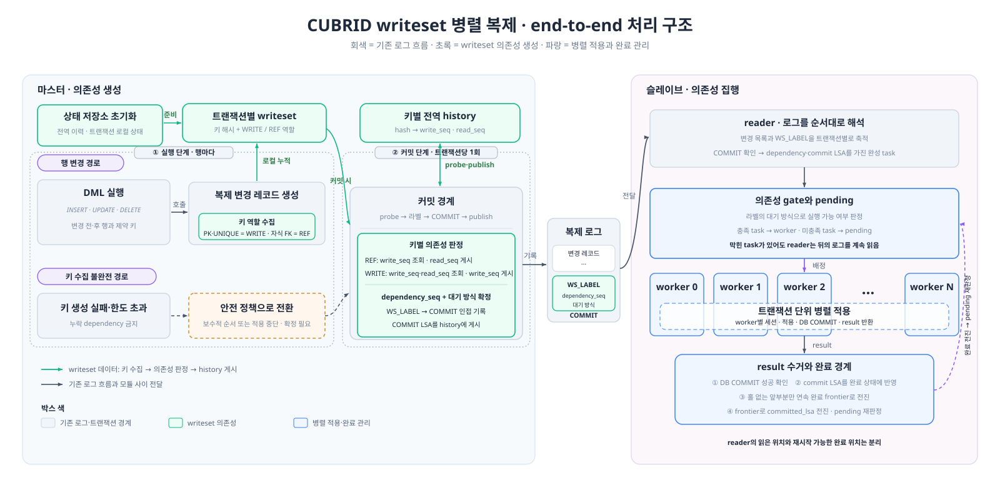

# 6. CUBRID writeset 병렬화 전체 설계

[5장](./5-cubrid-writeset-병렬화-요구사항.md)에서 확정한 정합성과 병렬화 요구사항을 CUBRID의 마스터·복제 로그·슬레이브 구조에 배치한다. 이 문서는 전체 구조와 모듈별 책임만 설명하며, 마스터의 키 수집과 dependency 계산은 [6-1](./6-1-cubrid-마스터-writeset-설계.md), 슬레이브의 task·gate·worker 구조는 [6-2](./6-2-cubrid-슬레이브-병렬-적용-설계.md)에서 상세히 설명한다.

## 6.1 목적과 설계 초점

현행 applylogdb는 복제 로그의 트랜잭션을 사실상 직렬로 적용한다. 적용 처리량이 마스터의 로그 생성량을 따라가지 못하면 apply lag와 적체량이 증가하고, 장애 전환이나 재시작 뒤 최신 상태까지 따라잡는 시간도 길어진다.

이 설계는 서로 독립인 트랜잭션을 동시에 적용해 처리량과 따라잡기 성능을 높인다. 단순히 worker 수를 늘리는 것이 아니라 제약조건이 요구하는 선행 관계는 보존하고, 관계없는 트랜잭션이 대기하지 않도록 의존성을 계산·전달·집행한다.

특히 다음 두 제약을 함께 완화한다.

- 같은 부모 키를 참조할 뿐인 자식 트랜잭션이 불필요한 의존성 사슬로 연결되는 문제
- 선행 task가 대기하는 동안 reader까지 멈춰 뒤의 독립 트랜잭션을 worker에 배정하지 못하는 문제

## 6.2 전체 아키텍처

전체 구조는 마스터의 **의존성 생성**, 복제 로그의 **순서 정보 전달**, 슬레이브의 **의존성 집행**으로 나뉜다.



*그림 6-1. 마스터의 WRITE·REF 의존성 생성부터 복제 라벨 전달과 슬레이브 병렬 적용 완료까지 이어지는 전체 구조*

- **마스터**: 행 연산에서 제약 키를 WRITE와 REF로 수집하고, 전역 history와 대조해 현재 트랜잭션의 선행 조건을 확정한다.
- **복제 로그**: 데이터 변경과 함께 마스터가 확정한 선행 조건을 전달한다. 로그 형식과 COMMIT 결합 규칙은 [6-1장](./6-1-cubrid-마스터-writeset-설계.md#ws_label의-복제-로그-기록과-전달-규칙), reader의 소비 규칙은 [6-2.2절](./6-2-cubrid-슬레이브-병렬-적용-설계.md#6-22-병렬-적용에-따른-lsa-관리-변화)에서 다룬다.
- **슬레이브**: 선행 조건을 다시 계산하지 않고 완료 상태와 대조한다. 실행 가능한 task는 worker로 보내고, 아직 실행할 수 없는 task는 pending에 보류한다.

reader가 읽은 위치와 worker가 적용을 완료한 위치는 서로 다를 수 있다. 따라서 완료 결과는 앞에서부터 빠짐없이 끝난 경계까지만 전진시키며, LSA 영속과 재시작 조건은 [7장](./7-writeset-병렬화에-따른-lsa-관리-변화.md)에서 설명한다.

## 6.3 WRITE와 REF를 분리하는 이유

자식 FK 참조를 부모 키의 WRITE와 같은 슬롯에 게시하면, 같은 부모를 참조할 뿐인 자식 트랜잭션도 앞선 자식이 게시한 이력을 다시 선행 조건으로 선택한다. 실제 변경 충돌이 없는 자식들이 직렬 사슬을 이루어 병렬성을 잃는다.

반대로 자식 FK 참조를 history에 게시하지 않으면 뒤의 부모 WRITE가 앞선 자식 작업을 발견하지 못한다. 부모 DELETE와 자식 DELETE처럼 순서를 지켜야 하는 작업이 동시에 실행되어 적용 순서가 뒤집힐 수 있다.

따라서 부모 PK의 WRITE와 자식 FK의 REF는 **동일한 충돌 키를 공유하되 이력을 분리**한다.

- **현재 REF**: 동일 키의 이전 WRITE만 선행 조건으로 삼는다. 같은 부모를 참조하는 REF끼리는 서로 기다리지 않는다.
- **현재 WRITE**: 동일 키의 이전 WRITE와 REF가 모두 완료돼야 한다. 부모 키의 변경 순서와 그 키의 상태를 전제로 수행된 자식 작업을 함께 보호한다.

충돌 식별자와 history 구조, 여러 키의 선행 조건을 계산하는 상세 알고리즘은 [6-1.2](./6-1-cubrid-마스터-writeset-설계.md#6-12-행-연산에서-수집할-키)에서 설명한다. 두 실패 방식의 실측 근거는 [5.1.1](./5-cubrid-writeset-병렬화-요구사항.md#511-fk-정합성을-지키면서-자식-간-과직렬화를-제거해야-한다)에 수록한다.

## 6.4 한 트랜잭션의 처리 흐름

```text
마스터 행 연산
  → 제약 키를 WRITE·REF entry로 수집
  → commit 직전 history probe로 선행 조건 확정
  → 의존성 라벨·COMMIT 기록
  → 현재 COMMIT LSA를 history에 publish

복제 로그 전달
  → 변경 레코드와 선행 조건을 같은 트랜잭션으로 전달

슬레이브 적용
  → reader가 COMMIT 단위 task 구성
  → dependency gate 판정
  → 미충족 task는 pending, 충족 task는 worker queue
  → worker 적용·DB COMMIT
  → 결과 수거·연속 완료 경계 전진·pending 재판정
```

**구조 6-1 — 마스터의 키 수집부터 슬레이브의 완료 경계 갱신까지 이어지는 처리 중심축**

마스터의 `probe`는 현재 트랜잭션이 기다릴 선행 조건을 history에서 **조회**하고, `publish`는 COMMIT 이후 현재 트랜잭션을 후속 트랜잭션이 발견하도록 history에 **기록**한다. 슬레이브는 전달받은 선행 조건만 판정하며 마스터의 충돌 계산을 반복하지 않는다.

## 6.5 상세 문서 읽기 순서

1. [6-1 마스터 writeset 설계](./6-1-cubrid-마스터-writeset-설계.md) — 행·인덱스 키 수집, WRITE/REF history, dependency 계산, probe·publish와 WS_LABEL 기록 형식
2. [6-2 슬레이브 병렬 적용 설계](./6-2-cubrid-슬레이브-병렬-적용-설계.md) — 로그 라벨과 COMMIT의 task 조립, dependency gate, pending·worker, 결과 수거와 연속 완료 경계
3. [7장 LSA 관리 변화](./7-writeset-병렬화에-따른-lsa-관리-변화.md) — 비순서 완료에서 안전한 적용 경계와 재시작 위치를 관리하는 방법
4. [8-1장 마스터 상세 설계](./8-1-cubrid-마스터-writeset-상세-설계.md)과 [8-2장 슬레이브 상세 설계](./8-2-cubrid-슬레이브-병렬-적용-상세-설계.md) — 실제 함수와 코드 변경 위치

역할 전환 drain과 LSA 홀의 복구 정책은 [6-2장](./6-2-cubrid-슬레이브-병렬-적용-설계.md)에서 다룬다. CS 구현과 성능 계측용 로깅은 이 설계의 분석 범위에서 제외한다.
