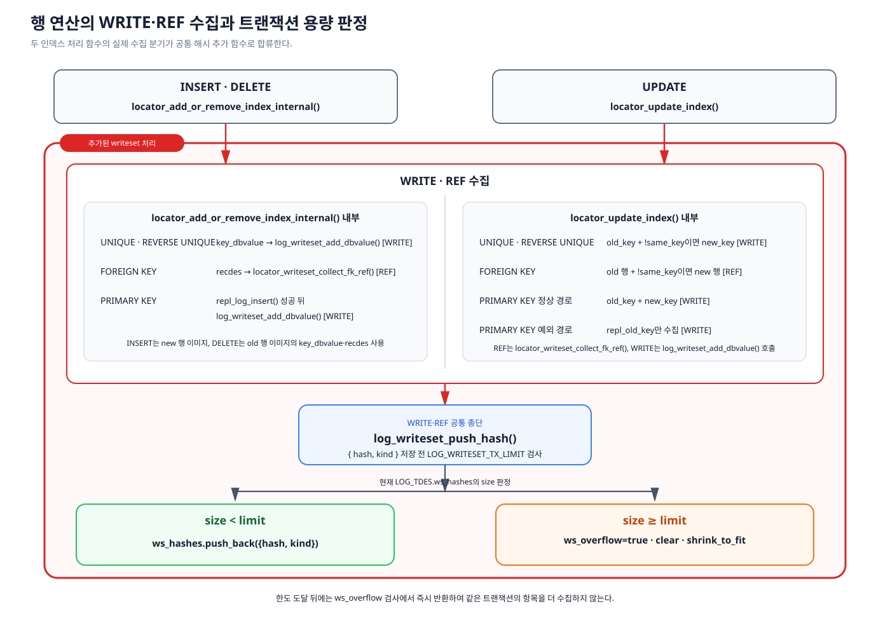
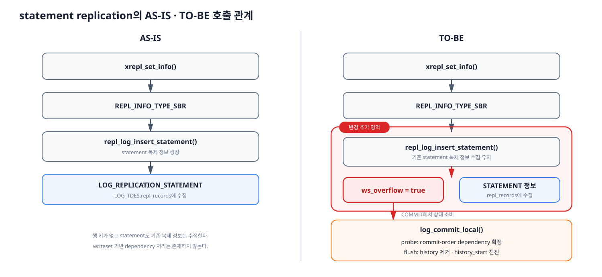
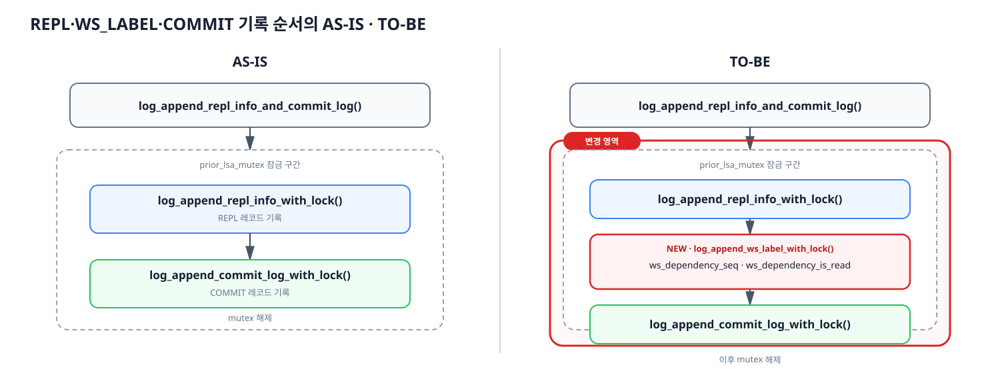
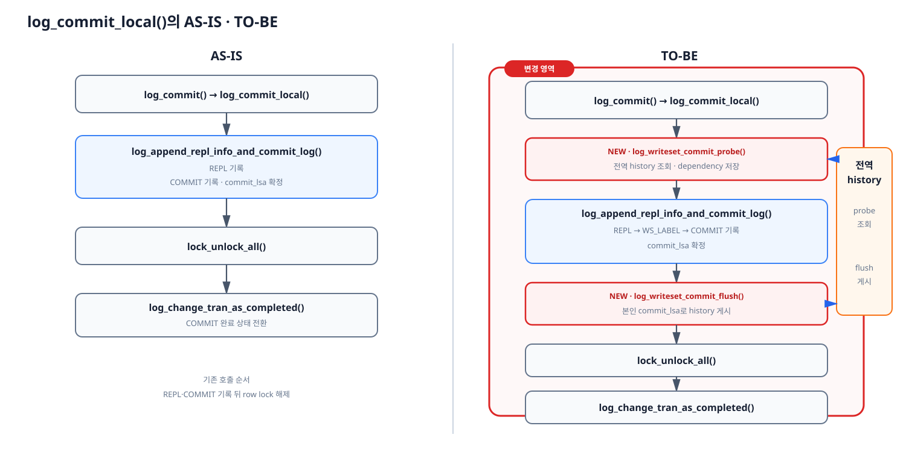

# 8-1. CUBRID 마스터 writeset 상세 설계

이 장은 [6-1장](./6-1-cubrid-마스터-writeset-설계.md)의 마스터 개념을 CUBRID의 행 변경, 트랜잭션 descriptor와 COMMIT 경로에 대응시킨다. `develop` 경로에 writeset 수집, dependency 계산, WS_LABEL 기록과 history 게시를 추가해야 할 위치를 설명한다.

상세 충돌 규칙과 WS_LABEL 기록 형식은 [6-1장](./6-1-cubrid-마스터-writeset-설계.md)을 따른다. 슬레이브 구현 상세는 [8-2장](./8-2-cubrid-슬레이브-병렬-적용-상세-설계.md)으로 분리한다.

## 8-1.1 전체 변경 구조

`develop`의 마스터는 복제 변경 레코드와 COMMIT을 기록하지만 슬레이브 병렬 적용을 위한 충돌 키와 dependency를 만들지 않는다. 병렬 적용을 위해 다음 세 경계를 추가해야 한다.

1. 행 변경 경로에서 PK·UNIQUE·FK 충돌 키를 WRITE·REF entry로 수집해야 한다.
2. COMMIT 직전에 전역 history를 조회해 선행 dependency를 확정하고 WS_LABEL에 기록해야 한다.
3. 정상 COMMIT LSA가 확정된 뒤 이를 history에 게시하고 row lock을 해제해야 한다.

트랜잭션 로컬 writeset은 `LOG_TDES`, 트랜잭션 사이의 이력은 전역 history가 소유해야 한다. 다음 절부터 두 상태의 생성·소비·정리 위치를 실제 함수 흐름에 대응시킨다.

## 8-1.2 마스터 변경

### 8-1.2.1 writeset 상태의 소유·초기화·정리

마스터는 트랜잭션별 writeset과 전역 history의 소유자를 구분하고, 서버 기동·트랜잭션 종료·서버 종료에 맞춰 각 상태를 초기화하고 정리해야 한다.

writeset 상태는 수명이 다른 두 영역으로 나눠야 한다. 현재 트랜잭션의 writeset은 `LOG_TDES`가 소유해야 하고, 커밋된 트랜잭션 사이의 키별 이력은 마스터 전역 history가 소유해야 한다.

#### 두 상태의 자료구조

기존 트랜잭션 descriptor인 `LOG_TDES`에는 현재 트랜잭션만 사용하는 필드를 추가해야 한다.

```c
typedef UINT64 LOG_WRITESET_HASH;
```

충돌 키 하나의 FNV-1a 64비트 해시. 입력은 `class_oid` + index VFID + 정규화한 키의 packed 값이다. 정수 typedef이며 전역 `tbb::concurrent_hash_map`의 키로 사용한다.


```c
typedef enum
{
  LOG_WRITESET_KIND_WRITE = 0,
  LOG_WRITESET_KIND_REF = 1
} LOG_WRITESET_KIND;

```
LOG_WRITESET_KIND는 수집한 키를 이 트랜잭션이 직접 썼는지(WRITE), FK 값으로 참조만 했는지(REF) 구분한다. PK·UNIQUE·REVERSE UNIQUE 키는 WRITE, 자식 FK가 가리키는 부모 PK 키는 REF다. 

```c

typedef struct log_writeset_entry LOG_WRITESET_ENTRY;
struct log_writeset_entry
{
  LOG_WRITESET_HASH hash;
  LOG_WRITESET_KIND kind;  /* WRITE 또는 REF */
};
```
 행 연산 한 번에 수집한 충돌 키 하나. 트랜잭션별 ws_hashes에 쌓이며, COMMIT 직전 history 조회와 COMMIT 후 history 게시의 단위가 된다

```c
typedef struct log_tdes LOG_TDES;
struct log_tdes
{
  ...
  /* LOG_TDES에 추가하는 트랜잭션별 상태 */
  std::vector<LOG_WRITESET_ENTRY> ws_hashes;  
  /* 행 연산에서 수집한 {hash, WRITE|REF} 항목 목록 */
  bool ws_overflow;             
  /* 완전한 writeset을 사용할 수 없어 commit-order 폴백이 필요한 상태 */
  LOG_LSA ws_dependency_seq;    /* COMMIT 직전에 선택한 선행   COMMIT LSA */
  bool ws_dependency_is_read;   /* 최종 dependency가 read_seq에서 선택됐는지 나타내는 플래그 */
...
}
```

정식 설계 용어는 `ref_seq`·`dependency_is_ref`다. PoC 코드의 필드명은 `read_seq`·`dependency_is_read`이며 위 인용은 코드 그대로다.

`LOG_TDES`는 트랜잭션 하나의 실행 상태를 담는 서버 측 transaction descriptor다. 로컬 writeset은 `std::vector<LOG_WRITESET_ENTRY>`를 유지한다. 한 트랜잭션이 항목을 추가하고 COMMIT에서 순회한 뒤 일괄 정리하므로, 전역 history에 필요한 동시 접근용 map을 로컬에 도입하지 않는다.

커밋된 트랜잭션들이 충돌 키별로 남긴 WRITE·REF COMMIT LSA 이력은 트랜잭션 사이에서 공유하므로 `LOG_TDES`가 아니라 별도의 서버 전역 구조 `LOG_WRITESET_HISTORY`로 둬야 한다.

```c
typedef struct log_writeset_slots LOG_WRITESET_SLOTS;
struct log_writeset_slots
{
  LOG_LSA write_seq;
  LOG_LSA read_seq;
};
```

`LOG_WRITESET_SLOTS`는 충돌 키 하나의 WRITE·REF 슬롯이다. `write_seq`·`ref_seq`에는 정수 순번이 아니라 해당 트랜잭션의 COMMIT LSA를 저장한다.

```c
typedef struct log_writeset_history LOG_WRITESET_HISTORY;
struct log_writeset_history
{
  tbb::concurrent_hash_map<LOG_WRITESET_HASH, LOG_WRITESET_SLOTS> map;
  /* 충돌 키 history entry별 WRITE·REF 슬롯 */
  LOG_LSA history_start;    /* map을 비운 뒤 사라진 이력을 대신하는 보수적 하한 */
  /* 별도 세대 보호: 정상 접근은 공유, clear·history_start 전환은 배타 */
  /* 용량 판정용 entry 수·예약 수는 동시 갱신을 보호해야 한다. */
};
```

`LOG_WRITESET_HISTORY`는 커밋된 트랜잭션들이 남긴 키별 이력이다. 커밋하려는 트랜잭션은 자기 `ws_hashes`로 여기를 조회해 선행 dependency를 정하고, COMMIT LSA가 확정되면 같은 키에 자기 LSA를 게시한다. 서버 전역 map은 `tbb::concurrent_hash_map`을 채택한다. 조회는 `const_accessor`, 삽입과 슬롯 갱신은 `accessor`로 충돌 키 history entry를 보호하고, 한 번에 entry 하나만 잡아 사용 후 즉시 해제해야 한다. accessor 범위 밖으로 entry 참조를 보관해서는 안 된다.

자료구조 선택 이유와 동기화 범위는 [전역 history map 대안 비교](#전역-history-map-대안-비교)에서 설명한다.

> [!NOTE]
> 검증에 사용한 기존 구현은 `std::unordered_map`과 하나의 `pthread_mutex_t latch`로 전체 조회·게시를 보호한다. 위 TBB 구조는 정식 반영 설계이며 기존 실측 결과를 TBB 성능으로 해석해서는 안 된다.

> [!NOTE]
> **map 크기 설정과 HA 게이팅 (코드 확인 완료).** map 크기는 `ha_writeset_history_size`(가칭) 같은 **`ha_*` 시스템 파라미터**(플래그 `PRM_FOR_SERVER | PRM_FOR_HA`, `cubrid_ha.conf`에 명시)로 받아야 한다 — 이 map은 **마스터 서버**에 살아 `PRM_FOR_SERVER`가 필요하다(슬레이브용 `ha_apply_max_mem_size`는 `PRM_FOR_CLIENT`라 선례가 아니고, 서버가 읽는 HA 파라미터 선례는 `ha_mode`다). 수집(`log_writeset_commit_probe`)과 게시(`log_writeset_commit_flush`)는 이미 `log_does_allow_replication()` 게이트와 `#if SERVER_MODE||SA_MODE` 안에 있어, **복제하지 않는 서버에서는 map을 만들지도 수집하지도 않는다** — 별도 게이팅은 불필요하다.

```c
LOG_WRITESET_HISTORY log_Writeset_history;
LOG_LSA log_Writeset_prev_commit_lsa;
```

#### 자료구조 선택: 트랜잭션 로컬 writeset과 전역 history

두 영역은 소유자, 동시성과 수명이 다르므로 자료구조도 구분한다.

- **트랜잭션 로컬 writeset**: `LOG_TDES` 하나가 소유하고 행 연산이 수집한다. 공유 갱신이 없고 append, 커밋 시 순차 순회, commit·abort 시 일괄 폐기가 주 동작이므로 연속 메모리인 `std::vector<LOG_WRITESET_ENTRY>`를 유지한다. TBB concurrent container를 사용할 이유가 없다.
- **전역 history**: 여러 커밋 트랜잭션이 서버 수명 동안 공유한다. 서로 다른 충돌 키에는 동시에 접근할 수 있어야 하고, 같은 충돌 키의 슬롯 조회·갱신은 일관성을 유지해야 한다.

MySQL 9.7도 로컬 writeset은 `std::vector<uint64_t>`, 전역 history는 `ankerl::unordered_dense::map<uint64, int64>`로 분리한다. CUBRID도 이 소유권 구분은 유지하되, 다중 commit 경로가 전역 history에 동시에 진입할 수 있으므로 전역 history의 구현은 별도로 선택한다.

로컬 writeset에 동일한 `{hash, kind}`가 반복돼도 정합성은 깨지지 않는다. 메모리와 probe 비용이 실제 병목으로 확인되면 보조 set 또는 정렬 후 중복 제거를 검토한다. 단, 같은 hash의 WRITE와 REF는 의미가 다르므로 hash만으로 합쳐서는 안 된다. 중복을 제거하더라도 `{hash, kind}`를 보존해야 한다.

#### 전역 history map 대안 비교

- **`std::unordered_map` + 전역 history mutex**: 외부 의존성이 없고 구현이 단순하다. 검증 대상 브랜치도 이 구조를 사용하며, `log_writeset_commit_probe()`와 `log_writeset_commit_flush()`가 하나의 `pthread_mutex_t latch`로 map 전체를 보호한다. `log_writeset_commit_probe()`는 `prior_lsa_mutex` 밖에서 호출되므로 여러 commit 경로가 이 latch에 진입할 수 있다. 반면 node 기반 구조의 메모리·cache 부담이 있고, 서로 다른 키를 처리하는 독립 트랜잭션도 probe·publish 구간에서 직렬화된다.
- **MySQL식 `ankerl::unordered_dense::map` + 전역 lock**: 조밀한 배치와 cache locality 때문에 단일 lock 구간의 `find`·`insert`와 메모리 효율에 유리하다. MySQL 9.7은 `Writeset_history = ankerl::unordered_dense::map<uint64, int64>`로 정의하지만, binlog flush leader가 `LOCK_log`를 보유한 채 commit group을 순차 처리한다. map 자체는 concurrent read/write를 보장하지 않으므로 CUBRID에 자료구조만 가져오면 안전하지 않으며 전역 lock이 계속 필요하다.
- **`tbb::concurrent_hash_map`**: 정상 경로의 `find`·`insert`와 슬롯 갱신을 충돌 키 history entry별 accessor로 보호한다. 같은 충돌 키는 직렬화하고 서로 다른 충돌 키는 병렬 처리할 수 있다. CUBRID가 이미 oneTBB 2021.11.0을 사용하므로 새로운 외부 라이브러리를 도입하지 않아도 된다.

정식 설계는 **`tbb::concurrent_hash_map`**을 선택한다. history clear는 capacity 도달이나 폴백에 한정된 드문 경로이고, 정상 workload의 대부분은 키별 `find`·`insert`·probe·publish이다. 따라서 CUBRID의 다중 commit 구조에서 독립 키의 정상 경로를 전역 mutex로 묶지 않는 편이 설계 목적에 맞다. 다만 TBB가 항상 빠르다고 전제하지 않고 아래 실측으로 최종 확인한다.

#### TBB history의 동시성 구조

accessor가 보호하는 단위는 DB 행이 아니라 **충돌 키 history entry**다. 한 행에서 PK·UNIQUE·FK에 해당하는 여러 entry가 생길 수 있고, 부모 PK의 WRITE와 자식 FK의 REF는 같은 entry를 공유한다. 서로 다른 키가 같은 64비트 hash를 만들면 같은 entry에서 보수적으로 직렬화되지만 정합성은 유지된다.

```text
정상 probe·publish
→ generation shared lock
→ 충돌 키 하나의 TBB accessor 획득
→ 슬롯 조회 또는 비교·갱신
→ accessor 즉시 해제
→ generation shared lock 해제

history clear·reset
→ generation exclusive lock
→ 진행 중인 probe·publish 종료 대기
→ map clear·history_start·entry_count 갱신
→ generation exclusive lock 해제
```

- `log_writeset_commit_probe()`는 `const_accessor`로 `write_seq`·`ref_seq`의 일관된 값을 읽는다.
- `log_writeset_commit_flush()`는 `accessor` 안에서 기존 LSA와 현재 COMMIT LSA의 비교·갱신을 함께 수행한다. `LOG_LSA`는 `pageid`와 `offset`으로 구성되므로 무잠금 일반 대입을 원자 연산으로 간주하지 않는다. 여러 REF가 같은 entry의 `ref_seq`를 갱신할 때는 accessor 안에서 최댓값을 선택해 lost update를 막고, `write_seq`도 값이 되돌아가지 않도록 단조 증가시킨다.
- 한 트랜잭션이 여러 키를 갖더라도 accessor는 하나씩 획득하고 즉시 해제한다. 여러 entry의 accessor를 동시에 보유하지 않아 다중 키 잠금 순서에서 발생할 수 있는 deadlock을 피한다.
- CUBRID에 기존 사용 사례가 있는 `tbb::concurrent_unordered_map` 대신 `concurrent_hash_map`을 선택한다. 이 history는 컨테이너 삽입·검색뿐 아니라 mutable value인 `{write_seq, ref_seq}`의 비교·갱신을 키 단위로 보호해야 하며, `concurrent_hash_map`의 accessor가 이 요구를 직접 표현한다.
- TBB accessor는 map 밖의 `history_start`와 `log_Writeset_prev_commit_lsa`를 보호하지 않는다. `clear()`와 `history_start` 전환에는 별도의 generation shared/exclusive lock이 필요하고, `log_Writeset_prev_commit_lsa`에는 짧은 별도 동기화 또는 기존 커밋 순서 보호 구간이 필요하다.
- capacity는 atomic entry count로 판정하되, 상한을 감지하면 shared lock을 놓고 exclusive lock을 획득한 뒤 다시 확인해야 한다. clear가 삭제하는 이력의 최대 COMMIT LSA를 `history_start`에 반영해야 하므로, 단순히 clear를 촉발한 트랜잭션의 LSA만 기록해서는 안 된다.

다음 항목을 기존 `std::unordered_map + 전역 mutex` 기준선과 비교한다.

- 독립 키의 동시 commit thread 수에 따른 probe·publish latency, lock wait와 throughput
- 같은 키 contention과 서로 다른 키 병렬 처리의 차이
- 최대 history 용량에서의 메모리 사용량과 재해시 시 peak memory
- capacity 도달 시 exclusive 전환 대기와 clear latency

#### 상태 생명주기 요약

두 상태는 초기화 시점과 유지 범위를 다르게 두어야 한다. `LOG_TDES`의 writeset은 개별 트랜잭션에 묶여 정리되어야 하고, 전역 history는 transaction table이 살아 있는 동안 유지되어야 한다. 재시작 시 이전 map은 복원하지 않고 다시 초기화한다.

```text
트랜잭션별 writeset
descriptor 초기화
→ 행 연산 중 WRITE·REF 항목 수집
→ commit 직전: 전역 history 조회·dependency 저장
→ commit: 본인 COMMIT LSA로 history 게시 후 정리
  abort: 게시 없이 정리
→ descriptor 재사용
```

```text
전역 writeset history
서버 기동 시 초기화
→ 트랜잭션 COMMIT마다 조회·게시
→ map 포화 시 clear·history_start 갱신
→ 서버 종료 시 해제
```

다음 절부터는 이 요약의 각 단계를 실제 초기화·정리 함수와 호출 순서에 맞춰 상세히 설명한다.

#### 초기화 함수와 수행 내용


*호출 관계 8-1-1. 서버 기동 시 기존 transaction descriptor 초기화 경로에 트랜잭션별 writeset 상태와 전역 history 초기화를 추가한 구조*

> [!NOTE]-
> **호출 관계 원문**
> ```text
> AS-IS
>
> boot_restart_server()
> └─ logtb_define_trantable()
>    └─ logtb_define_trantable_log_latch()
>       └─ logtb_expand_trantable()
>          └─ logtb_allocate_tdes_area()
>             └─ logtb_initialize_tdes()
>                └─ 기존 LOG_TDES 상태 초기화
> ```
>
> ```text
> TO-BE
>
> boot_restart_server()
> └─ logtb_define_trantable()
>    └─ logtb_define_trantable_log_latch()
>       ├─ logtb_expand_trantable()
>       │  └─ logtb_allocate_tdes_area()
>       │     └─ logtb_initialize_tdes()
>       │        └─ log_writeset_tdes_initialize(tdes)       # 설계상 추가
>       └─ log_writeset_history_initialize()     # 추가
> ```

`LOG_TDES` 쪽은 기존 `logtb_initialize_tdes()`에서 트랜잭션별 writeset 초기화 함수를 호출해야 한다.

```text
logtb_initialize_tdes()
└─ log_writeset_tdes_initialize(tdes)
   ├─ ws_hashes 초기화
   ├─ ws_overflow 초기화
   ├─ ws_dependency_seq 초기화
   └─ ws_dependency_is_read 초기화
```

`log_writeset_tdes_initialize()`는 정식 설계에서 사용하는 개념적 함수명이다. 현재 구현에서는 이 초기화가 `logtb_initialize_tdes()` 내부 대입으로 처리된다.

전역 history 쪽은 `log_writeset_history_initialize()`가 TBB map, 기준 LSA와 별도 동기화 상태를 초기화해야 한다. 동시 접근을 허용하기 전에 다음 준비를 끝낸다.

```text
log_writeset_history_initialize():
    빈 tbb::concurrent_hash_map 준비
    history_start와 prev_commit_lsa를 NULL로 초기화
    세대 보호와 prev_commit_lsa 보호 상태 준비
    entry 수·용량 예약 상태를 0으로 초기화
```

#### 정리 함수와 수행 내용

트랜잭션 종료 시 `logtb_clear_tdes()`가 `LOG_TDES`의 writeset 필드를 초기 상태로 되돌려야 한다. commit 경로는 history 게시를 먼저 수행해야 하고, abort 경로는 게시 없이 이 정리만 수행해야 한다.

```c
/* logtb_clear_tdes() 내부: 트랜잭션별 상태 정리 */
tdes->ws_hashes.clear ();
tdes->ws_overflow = false;
LSA_SET_NULL (&tdes->ws_dependency_seq);
tdes->ws_dependency_is_read = false;
```

서버 종료 시 `logtb_undefine_trantable()`이 `log_writeset_history_finalize()`를 호출해야 한다. finalize는 모든 probe·publish와 accessor 사용이 종료된 뒤 map, 기준 LSA와 별도 동기화 자원을 정리해야 한다.

```text
logtb_undefine_trantable()                      [CHANGED]
└─ log_writeset_history_finalize()             ✓ NEW
```

```text
log_writeset_history_finalize():
    새 history 접근 차단 → 진행 중 probe·publish 종료 확인
    TBB map과 기준 LSA·entry 수·용량 예약 상태 정리
    세대 보호와 prev_commit_lsa 보호 자원 해제
```

### 8-1.2.2 행 연산과 writeset 수집

행 연산의 writeset 수집은 별도 순회가 아니라 기존 인덱스 처리 함수 안에 추가해야 한다. INSERT·DELETE는 `locator_add_or_remove_index_internal()`, UPDATE는 `locator_update_index()`가 인덱스 키를 이미 추출한 위치에서 WRITE·REF 수집 함수를 동기 호출해야 한다. 이 단계에서는 전역 history를 조회하지 않고 현재 트랜잭션의 `LOG_TDES.ws_hashes`만 채워야 한다.

두 함수는 복제가 필요한 데이터 변경이고 로그 적용 스레드가 아니며 복제가 허용된 경우에만 writeset을 수집해야 한다. 인덱스 종류에 따른 실제 호출은 다음과 같이 구분해야 한다.

- `locator_add_or_remove_index_internal()`은 UNIQUE·REVERSE UNIQUE의 `key_dbvalue`를 `log_writeset_add_dbvalue()`에 넘겨 WRITE로 수집해야 한다. FOREIGN KEY이면 같은 행의 `recdes`를 `locator_writeset_collect_fk_ref()`에 넘겨 부모 키 REF를 수집해야 한다. PRIMARY KEY는 기존 `repl_log_insert()`가 성공한 뒤 같은 `key_dbvalue`를 WRITE로 수집해야 한다.
- `locator_update_index()`는 UNIQUE·REVERSE UNIQUE의 `old_key`를 WRITE로 수집하고, `same_key=false`이면 `new_key`도 WRITE로 수집해야 한다. FOREIGN KEY도 old 행의 REF를 수집하고, `same_key=false`이면 new 행의 REF를 추가해야 한다. PRIMARY KEY의 정상 순회 경로는 `old_key`와 `new_key`를 모두 WRITE로 수집해야 한다. 순회 안에서 PK를 확보하지 못해 뒤에서 `repl_old_key`를 다시 구하는 예외 경로는 현재 old PK만 수집하므로 별도 보강 대상으로 관리해야 한다.


*그림 8-1-1. `locator_add_or_remove_index_internal()`의 인덱스 순회 — 기존 인덱스 처리와 복제 정보 생성을 유지하면서 ① UNIQUE·REVERSE UNIQUE 키와 자식 FK의 REF(`locator_writeset_collect_fk_ref()`)를, ② 같은 함수의 PK 블록에서 `repl_log_insert()` 성공 뒤 PK 키를 `log_writeset_add_dbvalue()`로 writeset에 추가하는 비교*

**붉은 영역의 코드 대응**

- **① 인덱스별 WRITE·REF 수집 추가**: 기존 `locator_add_or_remove_index_internal()`의 인덱스 순회에 UNIQUE·REVERSE UNIQUE의 `log_writeset_add_dbvalue()` 호출과, 자식 FK의 `locator_writeset_collect_fk_ref()` → `log_writeset_add_ref_dbvalue()` 호출을 추가한다. 수집은 이 행 변경이 복제 로그를 생성해야 하는 경우에만 한다.
- **② PK WRITE 수집 추가**: 같은 함수의 PK 인덱스 블록에서 기존 `repl_log_insert()`가 성공한 뒤에 `log_writeset_add_dbvalue()`를 호출해 PK를 현재 `LOG_TDES.ws_hashes`에 보관한다. 이 블록 자체가 복제 로그를 생성하는 경우에만 실행되고, 수집은 그 안에서 `repl_log_insert()` 성공을 확인한 뒤에만 한다.

INSERT와 DELETE는 같은 `locator_add_or_remove_index_internal()`을 사용한다. 이 함수의 `recdes`와 `key_dbvalue`는 INSERT이면 새 행, DELETE이면 기존 행에서 만들어지므로 별도의 연산별 수집 함수가 필요하지 않다. UNIQUE·REVERSE UNIQUE와 FK는 해당 인덱스의 B-tree 연산 전에 수집하고, PK만 복제 정보 생성이 성공한 뒤 수집해야 한다.


*그림 8-1-2. `locator_update_index()` — UPDATE의 기존 old/new 인덱스 처리에서 UNIQUE·REVERSE UNIQUE와 PK는 WRITE, 자식 FK는 REF로 함께 수집하는 비교*

**붉은 영역의 코드 대응**

- **① old/new WRITE·REF 수집 추가**: 기존 `locator_update_index()`의 인덱스 순회에서 `log_writeset_add_dbvalue()`와 `locator_writeset_collect_fk_ref()`를 동기 호출한다. INSERT·DELETE와 같이 이 변경이 복제 로그를 생성해야 하는 경우에만 수집한다.
- **② PK WRITE 수집 추가**: PK 인덱스 위치(`pk_btid_index`)는 복제 로그를 생성하는 경우에만 정해지므로, 아래 두 경로 모두 그 조건 안에 있다. 정상 경로에서는 순회 중 PK 인덱스를 처음 만날 때 old/new PK를 `log_writeset_add_dbvalue()`로 수집한다. `repl_old_key`를 순회 뒤 다시 구하는 기존 예외 경로는 `repl_log_insert()` 호출 뒤 old PK만 수집하며, 이때 반환값을 확인하지 않는다(INSERT·DELETE 경로는 확인한다). 정식 구현에서는 예외 경로도 성공 조건을 확인해야 한다.

UPDATE는 인덱스별로 `old_key`와 `new_key`를 만든 뒤 `btree_compare_key()`의 결과로 `same_key`를 정한다. UNIQUE·REVERSE UNIQUE와 FK는 old 값을 항상 수집하고, 값이 달라진 경우에만 new 값을 추가해야 한다. PK 정상 경로는 동일 여부와 관계없이 old/new를 모두 수집해 이전 행 식별자와 새로운 행 식별자를 보존해야 한다.

`repl_old_key`를 인덱스 순회 뒤 다시 구하는 PK 예외 경로에서는 `repl_log_insert()` 뒤 old PK만 수집한다. 이 경로는 new PK를 더 이상 보유하지 않고 수집 함수의 반환값도 확인하지 않으므로, 정식 구현에서는 정상 PK 경로와 같은 old/new 수집 및 오류 전달이 가능한 위치로 조정해야 한다. 두 행 처리 함수에서 모은 항목은 commit 또는 abort까지 현재 트랜잭션의 `LOG_TDES.ws_hashes`가 보유해야 한다.

#### FK REF 수집

INSERT·DELETE와 UPDATE의 인덱스 처리 경로는 자식 FK마다 `locator_writeset_collect_fk_ref()`를 호출해야 한다. 이 함수는 단일·복합 FK와 NULL 판정을 포함한 REF 수집 전체를 맡고, 완성한 부모 키를 공통 해시 함수로 전달해야 한다.

```text
locator_add_or_remove_index_internal() 또는 locator_update_index()
└─ locator_writeset_collect_fk_ref()
   ├─ 부모 PK index와 domain 조회
   ├─ 자식 FK 컬럼을 FK 선언 순서로 추출
   ├─ NULL 포함 여부 판정
   │  └─ NULL 있음: 부모 REF를 만들지 않고 NO_ERROR 반환
   ├─ 단일 FK: 부모 PK domain에 맞춰 값 변환
   ├─ 복합 FK: 부모 PK의 컬럼 순서·각 domain에 맞춰 MIDXKEY 구성
   └─ log_writeset_add_ref_dbvalue()
      ├─ 부모 PK WRITE와 같은 충돌 식별자 생성
      └─ log_writeset_push_hash(..., REF)
```

단일 FK는 `DB_IS_NULL()`, 복합 FK는 `btree_multicol_key_has_null()`과 같은 기존 FK 검사 기준으로 NULL을 판정해야 한다. NULL이 포함된 FK에는 참조 대상 부모 행이 없으므로 부모 REF를 만들지 않아야 한다. 이는 정상 경로이므로 `ws_overflow`나 commit-order 폴백을 설정하지 않고, 자식 행의 PK·UNIQUE WRITE 수집과 복제 변경 처리는 계속 진행해야 한다.

복합 FK는 자식 컬럼 전체를 부모 PK의 컬럼 순서와 각 컬럼 domain에 맞춰 하나의 MIDXKEY로 구성해야 한다. REF의 충돌 식별자는 `부모 class_oid + 부모 PK index VFID + 정규화한 부모 키 전체 값`으로 만들고, 부모 PK WRITE에도 같은 형식을 적용해야 한다. 이를 위해 `locator_writeset_collect_fk_ref()`가 가진 `index->fk->ref_class_pk_btid`의 VFID를 REF 해시 함수까지 전달해야 한다.

`locator_writeset_collect_fk_ref()`는 처리 결과를 `int`로 반환해야 한다. 부모 domain 조회, 키 추출, 형 변환, MIDXKEY 구성 또는 packing에 실패하면 INSERT·DELETE의 `locator_add_or_remove_index_internal()`과 UPDATE의 `locator_update_index()`까지 오류를 전달하여 트랜잭션을 중단해야 한다. NULL FK만 `NO_ERROR`로 정상 반환해야 하며, 실제 처리 실패를 REF 누락으로 숨긴 채 불완전한 writeset을 커밋하면 안 된다.

WRITE와 REF의 충돌 식별자는 `대상 class_oid + 대상 index VFID + 정규화한 전체 키 값`으로 구성해야 한다. PK·UNIQUE·REVERSE UNIQUE WRITE에는 현재 인덱스의 VFID를 사용하고, 자식 FK REF에는 `ref_class_pk_btid.vfid`를 사용해야 한다. 부모 PK WRITE와 자식 FK REF가 같은 형식을 사용해야 같은 history 슬롯에서 만날 수 있다. drop/recreate·rebuild로 VFID가 바뀌면 기존 history를 무효화하고 보수적 하한을 세워야 한다.

UNIQUE·REVERSE UNIQUE의 NULL은 이번 설계에서 WRITE 충돌 키로 수집해야 한다. UPDATE는 old와 new를 각각 판정해 값의 해제와 점유를 모두 남겨야 한다. 반면 NULL FK에는 참조 대상 부모 행이 없으므로 해당 REF만 만들지 않아야 한다. 구조체와 packed 표현을 포함한 코드 근거는 [8-1.5.1](#8-151-null의-packed-표현)에서 확인한다.

#### 트랜잭션별 writeset 수집과 용량 판정

WRITE와 REF는 종류와 관계없이 마지막에 `log_writeset_push_hash()`를 거쳐 `LOG_TDES.ws_hashes`에 들어간다. 이 공통 지점에서 트랜잭션별 용량을 검사한다.



*그림 8-1-3. INSERT·DELETE와 UPDATE에서 수집한 WRITE·REF가 `log_writeset_push_hash()`로 합류하고, 이 공통 종단에서 트랜잭션별 용량을 판정하는 구조*

> [!NOTE]-
> **호출 관계 원문**
> **WRITE·REF 수집 경로**
> ```text
> INSERT·DELETE
> └─ locator_add_or_remove_index_internal()
>    ├─ UNIQUE·REVERSE UNIQUE
>    │  └─ key_dbvalue → log_writeset_add_dbvalue(..., WRITE)
>    ├─ FOREIGN KEY
>    │  └─ recdes → locator_writeset_collect_fk_ref()
>    │              └─ log_writeset_add_ref_dbvalue(..., REF)
>    └─ PRIMARY KEY
>       └─ repl_log_insert() 성공
>          └─ key_dbvalue → log_writeset_add_dbvalue(..., WRITE)
>
> UPDATE
> └─ locator_update_index()
>    ├─ UNIQUE·REVERSE UNIQUE
>    │  ├─ old_key → log_writeset_add_dbvalue(..., WRITE)
>    │  └─ !same_key: new_key도 WRITE로 추가
>    ├─ FOREIGN KEY
>    │  ├─ old 행 → locator_writeset_collect_fk_ref(..., REF)
>    │  └─ !same_key: new 행의 REF도 추가
>    └─ PRIMARY KEY
>       ├─ 정상 경로: old_key와 new_key를 WRITE로 추가
>       └─ 예외 경로: repl_old_key만 WRITE로 추가
> ```
>
> **공통 종단과 용량 처리**
> ```text
> log_writeset_add_dbvalue() 또는 log_writeset_add_ref_dbvalue()
> └─ *_internal()에서 값 정규화
>    ├─ 일반 값: packing → log_writeset_push()
>    │                    └─ log_writeset_push_hash()
>    └─ 문자열: hash ──────────┘
>          ├─ size < LOG_WRITESET_TX_LIMIT
>          │  └─ LOG_TDES.ws_hashes에 추가
>          └─ 한도 도달
>             ├─ LOG_TDES.ws_hashes 전체 제거
>             └─ LOG_TDES.ws_overflow = true
> ```

`log_writeset_add_dbvalue()`와 `log_writeset_add_ref_dbvalue()`는 각자 `_internal()`에서 값을 정규화·packing한 뒤 `log_writeset_push()`를 거쳐 `log_writeset_push_hash()`에 도달해야 한다. 문자열형처럼 해시가 이미 만들어진 경로는 `log_writeset_push_hash()`를 바로 호출해야 한다. 한도 검사는 이 공통 종단 한 곳에서 수행하여 WRITE와 REF가 같은 트랜잭션별 한도를 사용하게 해야 한다.

```text
log_writeset_push_hash(tdes, class_oid, hash, kind):
    if tdes 또는 class_oid가 유효하지 않음:
        return

    if tdes.ws_overflow == true:
        return                         # 이미 폐기한 트랜잭션은 추가 수집하지 않음

    if tdes.ws_hashes.size < LOG_WRITESET_TX_LIMIT:
        tdes.ws_hashes.push({hash, kind})
        return                         # WRITE·REF 항목을 정상 보관

    tdes.ws_overflow = true
    tdes.ws_hashes.clear()
    tdes.ws_hashes.shrink_to_fit()
    return                             # 불완전한 부분 writeset을 남기지 않음
```

- **한도 이내**: `{hash, kind}`를 현재 트랜잭션의 `LOG_TDES.ws_hashes`에 추가해야 한다. `kind`에는 WRITE 또는 REF가 들어가며, 이후 COMMIT의 dependency 계산에서 같은 목록을 사용해야 한다.
- **한도 도달**: `ws_overflow=true`로 전환하고 지금까지 모은 `ws_hashes` 전체를 제거해야 한다. 부분 writeset을 남기면 누락된 키를 충돌하지 않은 것으로 오판할 수 있기 때문이다.
- **overflow 전환 이후**: 같은 트랜잭션에서 WRITE·REF 수집 함수가 다시 호출되더라도 `ws_overflow`를 확인하고 항목을 더 추가하지 않아야 한다.

`LOG_WRITESET_TX_LIMIT`과 `LOG_WRITESET_HISTORY_CAP`은 검증 코드에서 각각 1000만이다(`log_writeset.h:101-102`). 초기 25만·200만에서 MySQL의 기본 한도와 비교하기 위해 맞춘 값이다. 기존 전체 latch 구현에서는 큰 트랜잭션이 긴 조회·게시 임계 구간을 만들었다. TBB 설계에서도 많은 키의 순회 비용과 세대 공유 보호 때문에 clear가 기다리는 시간은 남으므로, 운영 한도는 해당 동시성 구조로 다시 측정해 정해야 한다.

트랜잭션별 writeset 수집 공간이 한도에 도달하면 완전한 충돌 키 목록을 만들 수 없으므로 키별 병렬 판정을 계속하면 안 된다. 이 시점에는 `ws_overflow`를 설정하고 수집을 중단해야 한다. 실제 보수 처리는 COMMIT 단계에서 수행해야 한다. COMMIT 전 probe에서는 직전 COMMIT까지 기다리는 commit-order dependency를 만들고, COMMIT 성공 후 flush에서는 불완전한 키 이력을 제거하기 위해 전역 history를 비운 뒤 `history_start`를 본인 COMMIT LSA까지 올려야 한다. 상세 처리는 [dependency 계산](#dependency-계산)과 [COMMIT 성공 뒤 history 게시](#commit-성공-뒤-history-게시)에서 설명한다.

#### statement replication

DDL 등 statement replication에는 해시할 행 키가 없다. 따라서 statement 복제 정보를 수집하는 시점에 `ws_overflow`를 설정해야 한다. COMMIT에서는 writeset 용량 초과와 같은 보수 경로를 사용해야 한다. probe는 commit-order dependency를 만들고, COMMIT 성공 뒤 flush는 전역 history를 비운 후 `history_start`를 올려야 한다.



*그림 8-1-4. 기존 statement 복제 정보 수집 경로에 `ws_overflow` 설정을 추가하고, COMMIT에서 commit-order dependency와 이후 트랜잭션을 위한 history 기준을 만드는 구조*

> [!NOTE]-
> **호출 관계 원문**
> **AS-IS**
> ```text
> xrepl_set_info()
> └─ REPL_INFO_TYPE_SBR
>    └─ repl_log_insert_statement()
>       └─ LOG_REPLICATION_STATEMENT 정보 수집
> ```
>
> **TO-BE**
> ```text
> xrepl_set_info()
> └─ REPL_INFO_TYPE_SBR
>    └─ repl_log_insert_statement()               [CHANGED]
>       ├─ LOG_TDES.ws_overflow = true            ✓ NEW
>       └─ LOG_REPLICATION_STATEMENT 정보 수집
>              ↓
> log_commit_local()
> ├─ log_writeset_commit_probe()
> │  └─ commit-order dependency 확정
> └─ log_writeset_commit_flush()
>    └─ history 제거·history_start 전진
> ```

`ws_overflow`는 writeset 용량 초과만 나타내는 값이 아니다. 행 단위 충돌 키로 표현할 수 없어 키별 판정을 사용하지 않는 트랜잭션도 같은 commit-order 폴백 상태로 표시해야 한다.

### 8-1.2.3 dependency 전달 로그와 COMMIT 기록

다음 절에서 설명할 COMMIT 로직은 계산한 dependency를 복제 로그에 기록한 뒤 COMMIT을 append해야 한다. 따라서 COMMIT 처리 순서를 설명하기에 앞서, dependency 정보를 슬레이브에 전달하기 위해 추가해야 하는 writeset 전용 로그 레코드와 배치 방식을 먼저 정의한다.

마스터는 전역 history에서 확정한 dependency 결과를 `LOG_DUMMY_WS_LABEL`에 기록해, 슬레이브가 충돌 키와 history를 다시 계산하지 않고 실행 순서를 판정할 수 있게 해야 한다.
> to ai: LOG_DUMMY_WS_LABEL 선언과 값 찾아서 적어줘

dependency 전달에는 `LOG_DUMMY_WS_LABEL` 레코드를 사용하고 다음 payload를 기록해야 한다.

```c
typedef struct log_rec_ws_label LOG_REC_WS_LABEL;
struct log_rec_ws_label
{
  LOG_LSA dependency_seq;
  bool dependency_is_read;
};
```

*코드 8-1-1. 선행 COMMIT 위치와 슬레이브의 대기 판정 종류를 전달하는 WS_LABEL payload*

`dependency_seq`는 현재 트랜잭션이 기다려야 할 선행 COMMIT LSA다. `dependency_is_ref=false`이면 슬레이브는 그 선행 트랜잭션의 개별 완료를 확인하고, `true`이면 해당 LSA까지 빈 구간 없이 완료된 frontier를 확인한다. 하나의 LSA와 bool로 여러 키의 후보를 축약하는 안전성은 8-1.2.4의 검증 항목으로 남긴다.

그림 8-1-5는 COMMIT 로그 기록 함수 `log_append_repl_info_and_commit_log()` 안에서 WS_LABEL 레코드를 어디에 끼워 넣는지를 AS-IS와 TO-BE로 비교한 것이다. 왼쪽 AS-IS는 `prior_lsa_mutex` 한 구간에서 REPL 레코드와 COMMIT 레코드를 연속 기록하는 기존 경로다. 오른쪽 TO-BE는 같은 구간 안에서 두 레코드 사이에 `log_append_ws_label_with_lock()` 호출을 추가해, REPL → WS_LABEL → COMMIT 순서로 세 레코드를 끊김 없이 기록한다. 이때 WS_LABEL에는 COMMIT 직전 probe가 `LOG_TDES`에 저장한 `ws_dependency_seq`와 `ws_dependency_is_read`를 기록한다. 세 레코드를 한 mutex 구간에서 기록하는 이유는 다른 트랜잭션의 로그가 그 사이에 끼어들어 WS_LABEL과 COMMIT이 떨어지는 것을 막기 위해서다.



*그림 8-1-5. 기존 REPL·COMMIT 기록 사이에 WS_LABEL을 추가하고, 세 레코드를 동일 `prior_lsa_mutex` 구간에서 연속 기록하는 비교*

> [!NOTE]-
> **호출 관계 원문**
> **AS-IS**
> ```text
> log_append_repl_info_and_commit_log()
> └─ prior_lsa_mutex 잠금
>    ├─ log_append_repl_info_with_lock(tdes)
>    ├─ log_append_commit_log_with_lock(tdes, commit_lsa)
>    └─ prior_lsa_mutex 해제
> ```
>
> **TO-BE**
> ```text
> log_append_repl_info_and_commit_log()                 [CHANGED]
> └─ prior_lsa_mutex 잠금
>    ├─ log_append_repl_info_with_lock(tdes)
>    ├─ log_append_ws_label_with_lock(tdes)             ✓ NEW
>    │  └─ {ws_dependency_seq, ws_dependency_is_read} 기록
>    ├─ log_append_commit_log_with_lock(tdes, commit_lsa)
>    └─ prior_lsa_mutex 해제
> ```

> [!NOTE]-
> **인접성 보장과 `trid` 확인**
> 위 mutex 구간은 다른 트랜잭션의 로그가 WS_LABEL과 COMMIT 사이에 들어오지 못하게 해야 한다. WS_LABEL은 공통 로그 레코드 헤더에 이미 `trid`를 가지므로 payload에 이를 중복 저장할 필요가 없다. 슬레이브 reader는 라벨의 `trid`를 보관했다가 동일한 `trid`의 COMMIT에만 연결해야 한다. 물리적 인접성은 라벨 유실을 막고, `trid` 확인은 다른 COMMIT으로의 오귀속을 막는다.

여기서는 의존성 라벨이 커밋 단위 안에서 배치되는 위치만 설명한다. 기록은 `log_append_ws_label_with_lock()`이 담당한다. 전달 형식은 [6-1장](./6-1-cubrid-마스터-writeset-설계.md#ws_label의-복제-로그-기록과-전달-규칙), 슬레이브 reader의 `la_retrieve_ws_label()` 소비 방식은 [8-2.3절](./8-2-cubrid-슬레이브-병렬-적용-상세-설계.md#8-23-reader의-로그-수집과-transaction-task-생성)에서 설명한다. DUMMY 레코드는 system recovery에서 데이터 변경으로 redo·undo하지 않고 applylogdb가 순서 메타데이터로만 소비한다.

### 8-1.2.4 마스터 로컬 COMMIT의 dependency 계산과 history 게시

`LOG_TDES`는 transaction table이 관리하는 트랜잭션별 descriptor이며 전역 history와 구분된다. 행 처리에서 수집한 writeset은 `tdes->ws_hashes`에 보관되고, 계산한 dependency는 `tdes->ws_dependency_seq`와 `tdes->ws_dependency_is_read`에 저장된다.

`log_commit()`은 로컬 트랜잭션이면 `log_commit_local()`을 호출한다. `log_commit_local()`은 로그 적용 스레드가 아닌 일반 사용자 트랜잭션에서 복제가 허용된 경우, 먼저 `log_writeset_commit_probe()`로 dependency를 계산해야 한다. REPL·WS_LABEL·COMMIT의 기록 순서와 인접성은 앞의 [8-1.2.3절](#8-123-dependency-전달-로그와-commit-기록)에서 설명했으므로 이 절에서는 반복하지 않는다.

`log_commit_local()`은 COMMIT 레코드에서 본인 LSA를 확정한 뒤 `log_writeset_commit_flush()`로 history를 게시한다. 그다음 row lock을 해제하고 `log_change_tran_as_completed()`로 트랜잭션 상태를 완료로 바꾼다. `logtb_clear_tdes()`는 이 커밋 임계 구간의 직접 호출이 아니며, 이후 descriptor 정리·재사용 단계에서 writeset 필드를 비운다.



*그림 8-1-6. 기존 `log_commit_local()`의 REPL·COMMIT 경로에 dependency probe, WS_LABEL 기록과 COMMIT LSA 기반 history 게시를 추가하는 전체 호출 흐름*

> [!NOTE]-
> **호출 관계 원문**
> **AS-IS**
> ```text
> log_commit()
> └─ log_commit_local()
>    ├─ log_append_repl_info_and_commit_log()
>    │  ├─ log_append_repl_info_with_lock()
>    │  └─ log_append_commit_log_with_lock()
>    ├─ lock_unlock_all()
>    └─ log_change_tran_as_completed()
> ```
>
> **TO-BE**
> ```text
> log_commit()
> └─ log_commit_local()                              [CHANGED]
>    ├─ log_writeset_commit_probe()                  ✓ NEW
>    ├─ log_append_repl_info_and_commit_log()        [CHANGED]
>    │  ├─ log_append_repl_info_with_lock()
>    │  ├─ log_append_ws_label_with_lock()           ✓ NEW
>    │  └─ log_append_commit_log_with_lock()
>    ├─ log_writeset_commit_flush()                  ✓ NEW
>    ├─ lock_unlock_all()
>    └─ log_change_tran_as_completed()
> ```

#### dependency 계산

다음 수도코드는 커밋 직전에 전역 history를 조회해 하나의 dependency 라벨을 만드는 계산을 설명한다. 알고리즘 1~3은 실제 함수 세 개가 아니라 `log_writeset_commit_probe()` 내부 로직을 나눈 것이다. 호출부는 probe 동안 세대 공유 보호를 유지하고 `history_start`를 읽으며, `prev_commit`은 별도 보호 아래 스냅샷으로 읽어야 한다. 아래 `find_slots_copy()`는 TBB `const_accessor`로 슬롯 두 값을 복사한 뒤 accessor를 해제하는 설명용 연산이다.

```text
log_writeset_commit_probe()
├─ tdes.ws_overflow 확인
│
├─ true
│  └─ 알고리즘 1·2 생략
│     └─ [알고리즘 3] 폴백 분기
│        └─ lc = prev_commit
│
└─ false
   ├─ [알고리즘 1] 트랜잭션 전체에서 가장 늦은 선행 충돌 후보 선택
   │  └─ 각 entry마다 [알고리즘 2] 선행 충돌 후보 선택
   └─ [알고리즘 3] 정상 분기
      └─ parent와 prev_commit으로 최종 lc 확정
```

**알고리즘 1 — 트랜잭션 전체 선행 후보 선택**

현재 트랜잭션의 각 충돌 키를 전역 history와 대조해, 현재 트랜잭션보다 먼저 완료돼야 할 과거 COMMIT LSA 중 가장 늦은 값을 선택한다.

`select_latest_transaction_candidate(entries, history, history_start)`의 입력은 다음과 같다.

- `entries`: 현재 트랜잭션에서 수집한 모든 WRITE·REF 항목이다.
- `history`: 충돌 키별 과거 `write_seq`·`ref_seq`를 보관하는 전역 history다.
- `history_start`: history를 비우면서 사라진 과거 이력을 대신하는 보수적 하한이다.

이 함수는 `{lsa, from_ref_seq}`를 반환한다. `lsa`는 모든 entry의 선행 후보 중 가장 늦은 COMMIT LSA이며, `from_ref_seq`는 그 최종 후보가 `ref_seq`에서 선택됐는지를 나타낸다.

```text
select_latest_transaction_candidate(entries, history, history_start):
    parent = {history_start, false}         # {lsa, from_ref_seq}

    for each entry in entries:
        candidate = select_entry_candidate(entry, history)  # 알고리즘 2
        if candidate.lsa is not NULL and candidate.lsa > parent.lsa:
            parent = candidate

    return parent
```

**알고리즘 2 — entry 하나의 선행 후보 선택**

반환값은 `{lsa, from_ref_seq}` 형식의 선행 후보다.

- `lsa`: 현재 entry보다 먼저 완료돼야 하는 과거 트랜잭션의 COMMIT LSA다. 선행 충돌이 없으면 `NULL`을 반환한다.
- `from_ref_seq`: 반환한 `lsa`가 history의 `ref_seq`에서 선택됐으면 `true`, `write_seq`에서 선택됐거나 선행 충돌이 없으면 `false`다. 현재 entry의 종류나 함수 성공 여부를 나타내는 값이 아니다.

```text
select_entry_candidate(entry, history):
    # return: {dependency COMMIT LSA, dependency가 ref_seq에서 선택됐는지}
    slots = history.find_slots_copy(entry.hash)  # const_accessor에서 복사 후 해제
    if slots does not exist:
        return {NULL, false}               # 이 키의 선행 충돌 없음

    if entry.kind == REF:
        return {slots.write_seq, false}    # 현재 REF는 이전 WRITE만 기다림

    if slots.ref_seq > slots.write_seq:
        return {slots.ref_seq, true}      # 현재 WRITE: 이전 REF가 이전 WRITE보다 늦음

    return {slots.write_seq, false}        # 현재 WRITE: write_seq >= ref_seq
                                           # 이전 WRITE를 선행 후보로 반환
```

`from_ref_seq`는 슬레이브의 대기 방식을 결정한다. `true`이면 frontier가 해당 LSA까지 도달하기를 기다리고, `false`이면 해당 WRITE 트랜잭션 한 건의 완료도 충족 조건으로 사용할 수 있다.

**알고리즘 3 — 폴백과 최종 dependency 라벨(`lc`) 확정**

알고리즘 3은 `{dependency_seq, dependency_is_ref}`를 반환한다. `dependency_seq`가 현재 트랜잭션의 최종 `lc`이며, `dependency_is_ref`는 이 `lc`를 슬레이브에서 연속 완료 경계로 기다려야 하는지를 나타낸다.

첫 번째 `if tdes.ws_overflow`가 폴백 분기다. 이 조건에 해당하지 않으면 알고리즘 1·2로 `parent`를 계산한 뒤 정상 분기에서 최종 `lc`를 확정한다.

```text
if tdes.ws_overflow:
    return {prev_commit, true}  # lc=prev_commit: 직전 COMMIT까지 연속 완료 대기

parent = select_latest_transaction_candidate(entries, history, history_start)

if parent.from_ref_seq:
    return {parent.lsa, true}
else:
    return {min(parent.lsa, prev_commit), false}
```

> [!WARNING]
> **다중 dependency 축약 규칙은 검증 중**
> 단일 `dependency_seq`와 종류 한 비트만으로 여러 독립 선행자를 표현하면, 더 작은 REF 후보와 더 큰 WRITE 후보가 함께 있을 때 앞선 REF 구간의 대기 조건이 사라질 수 있다. 최종 구현은 후보별 대기 방식을 보존하는 dependency 집합과 frontier를 사용하거나, 모든 dependency를 연속 완료 경계로 판정하는 안전한 단순화 중 하나를 선택해야 한다.

#### COMMIT 성공 뒤 history 게시

COMMIT LSA가 확정되면 `log_writeset_commit_flush()`가 현재 트랜잭션의 WRITE·REF 이력을 전역 history에 게시한다.

**알고리즘 4 — history 게시**

```text
log_writeset_commit_flush(tdes, my_commit_lsa):
    prev_commit_lsa를 별도 보호 아래 max(prev_commit_lsa, my_commit_lsa)로 갱신

    if tdes.ws_overflow:
        세대 배타 보호 아래 map.clear()와 history_start 단조 전진 수행
        entry 수·용량 예약 상태를 새 세대로 초기화
        return

    세대 공유 보호 획득
    if 현재 세대에 게시 용량을 원자적으로 예약할 수 없음:
        공유 보호 해제 → 세대 배타 보호 획득
        용량 재확인 후 필요하면 clear·history_start 단조 전진·개수 초기화
        현재 writeset을 게시할 용량 확보  # 이 경로는 배타 보호 유지

    for entry in tdes.ws_hashes:
        accessor로 entry.hash를 find 또는 insert  # 새 슬롯은 NULL 초기화
        slots = accessor가 보호하는 슬롯

        if entry.kind == WRITE:
            slots.write_seq = my_commit_lsa
        else:  # REF
            slots.ref_seq = max(slots.ref_seq, my_commit_lsa)
        accessor 해제

    실제 신규 entry 수를 반영하고 남은 용량 예약 반환
    세대 보호 해제
```

`writeset_overflow`는 현재 트랜잭션의 writeset 용량 초과 또는 statement replication에 사용하는 폴백 상태다. 이 경우 게시할 키 목록이 없으므로 전역 history를 비우고 `history_start`를 단조 증가시켜야 한다. 정상 publish의 용량은 동시 게시분을 포함해 예약·집계해야 한다. 단순한 `map.size() + entries.size()` 확인만으로는 여러 publish의 동시 삽입을 제한할 수 없다. 배타 보호로 전환할 때는 공유 보호를 먼저 놓고 조건을 재확인한다. 세대 전환과 용량 예약은 설명용 절차이며 기존 함수로 구현돼 있다는 뜻은 아니다.

TBB accessor는 슬롯 값의 데이터 경쟁을 막지만 여러 키를 하나의 원자적 스냅샷으로 만들지는 않는다. probe와 publish 사이의 논리적 순서 보장은 기존 row lock·COMMIT 순서 규칙과 함께 검증해야 한다. `clear()` 시 제거되는 이력을 대신할 하한의 안전성과 대기 방식은 [9.1.6절](./9-미해결-리스크.md#916-history-용량-포화-뒤-연속-완료-하한-보존)의 별도 검증 대상이다.

`log_writeset_commit_flush()`는 history 갱신까지만 수행해야 한다. row lock 해제는 이 함수가 반환된 뒤 `log_commit_local()`이 수행해야 하며, history 게시과 map 초기화는 정상 COMMIT LSA가 확정된 뒤 row lock을 해제하기 전에 끝나야 한다.

## 8-1.3 구현 위치와 보강 항목

### 8-1.3.1 미확정 및 보강 대상

- 여러 WRITE·REF 후보를 하나의 dependency와 종류로 축약하는 규칙의 정합성 검증이 진행 중이다.
- REF를 게시하지 않는다고 적힌 일부 주석은 실제 `ref_seq` publish 코드와 다르다.
- 트랜잭션 writeset overflow와 전역 history map 포화를 서로 다른 상태와 로그로 구분해야 한다.
- UPDATE의 `repl_old_key` 재추출 예외 경로는 `repl_log_insert()` 반환값을 확인하지 않고 old PK를 수집한다. INSERT·DELETE 경로와 같이 성공 조건을 확인해야 한다.
- 동일한 `{hash, kind}`가 반복될 때 트랜잭션별 목록의 중복 제거 위치와 비용을 결정해야 한다.
- 다단계 cascade와 자기참조 FK를 포함한 우회 행 변경 경로에서도 WRITE·REF 수집이 빠지지 않는지 전수 검증해야 한다.

## 8-1.4 충돌 식별자의 코드 근거

### 8-1.4.1 현재 인덱스와 FK가 보유한 식별자

```c
struct or_foreign_key
{
  ...
  OID ref_class_oid;
  BTID ref_class_pk_btid;
  ...
};

struct or_index
{
  ...
  char *btname;
  ...
  BTID btid;
  ...
};
```

**코드 8-1-4 — 현재 인덱스와 자식 FK가 보유한 부모 클래스·부모 PK 식별자 (`object_representation_sr.h`)**

WRITE 수집 지점에서는 `index->btid.vfid`, REF 수집 지점에서는 `index->fk->ref_class_pk_btid.vfid`를 얻을 수 있다. 부모와 자식의 충돌 키를 같은 범위로 구성하면서 이름 변경의 영향을 피하기 위해 인덱스 이름이 아니라 VFID를 사용해야 한다.

### 8-1.4.2 인덱스 동일성 단위

```c
#define BTID_IS_EQUAL(b1,b2) \
  (((b1)->vfid.fileid == (b2)->vfid.fileid) && \
   ((b1)->vfid.volid == (b2)->vfid.volid))
```

**코드 8-1-5 — BTID를 VFID의 볼륨·파일 식별자로 비교하는 매크로 (`storage_common.h`)**

drop/recreate·rebuild로 VFID가 바뀌면 이전 충돌 이력과 새 인덱스 이력이 섞이지 않도록 history를 무효화하고 보수적 하한을 세워야 한다. 이름만 바꾸는 rename은 VFID 기반 충돌 식별자에 영향을 주지 않는다.

### 8-1.4.3 FK가 부모 PK 전체를 참조하는 근거

```c
pk = classobj_find_class_primary_key (ref_cls);
...
fk_info->ref_class_oid = *(ws_oid (ref_clsop));
fk_info->ref_class_pk_btid = pk->index_btid;

for (i = 0; pk->attributes[i]; i++)
  {
    ;
  }

if (i != n_atts)
  {
    ERROR2 (error, ER_FK_NOT_MATCH_KEY_COUNT,
            constraint_name, pk->name);
    goto err;
  }
```

**코드 8-1-6 — FK 컬럼 수와 부모 PK 컬럼 수가 다르면 정의를 거부하는 검사 (`schema_template.c`)**

CUBRID는 참조 대상 부모 PK와 그 BTID를 저장한다. 복합 부모 PK는 전체 컬럼을 같은 순서와 도메인으로 조립해야 한다.

### 8-1.4.4 해시 입력의 보완 지점

```c
UINT64 log_writeset_fnv1a (const OID *class_oid, const VFID *index_vfid,
                           const char *packed, int len);
```

`log_writeset_fnv1a()`는 FNV-1a 64비트 해시 함수로, `class_oid` + index VFID + packed key를 이어 붙여 `LOG_WRITESET_HASH`를 만든다. 문자열 키는 collation을 반영한 pseudo key를 packed key 자리에 넣는다. index VFID는 같은 클래스의 서로 다른 UNIQUE 인덱스가 같은 packed 표현을 만들 때 둘을 구분한다. 해시의 성질과 상세는 [6-1 충돌 식별자](./6-1-cubrid-마스터-writeset-설계.md#충돌-식별자)에 있다.

```c
/* child FK REF */
parent_pk_domain =
  btree_read_key_type (thread_p, &index->fk->ref_class_pk_btid);
...
log_writeset_add_ref_dbvalue (
  thread_p, tdes, &index->fk->ref_class_oid,
  fk_key, parent_pk_domain);

/* PK·UNIQUE·REVERSE UNIQUE WRITE */
log_writeset_add_dbvalue (thread_p, ws_tdes,
                          class_oid, key_dbvalue);
```

**코드 8-1-7 — WRITE와 REF 수집 지점에서 인덱스 식별자를 추가로 전달할 수 있는 위치 (`locator_sr.c`)**

## 8-1.5 UNIQUE NULL 정책과 향후 최적화

이번 설계에서는 UNIQUE·REVERSE UNIQUE의 NULL도 WRITE 충돌 키로 해시해야 한다. 실제 NULL은 문자열 토큰이 아니라 NULL 여부가 포함된 `DB_VALUE` 또는 MIDXKEY의 packed 표현으로 구분해야 한다.

### 8-1.5.1 NULL의 packed 표현

```c
if (DB_VALUE_TYPE (value) == DB_TYPE_NULL)
  {
    domain = tp_domain_resolve_value (value, NULL);
    if (domain != NULL)
      {
        rc = or_put_domain (buf, domain, 1, 1);
      }
  }

...

if (is_null)
  {
    carrier |= OR_DOMAIN_NULL_FLAG;
  }
```

**코드 8-1-8 — packed domain에 실제 NULL 상태를 기록하는 경로 (`object_representation.c`)**

실제 NULL은 NULL flag가 켜진 domain 표현이고, 문자열 `'NULL'`은 VARCHAR domain과 문자 바이트를 가진 값이므로 서로 구분된다. 단일 NULL은 `packed(NULL DB_VALUE)`, 복합 키는 각 컬럼의 NULL 여부와 값을 포함한 전체 packed MIDXKEY를 해시한다.

자식 FK 값이 NULL이면 참조할 부모가 없으므로 REF를 수집하지 않는다.

```c
if (DB_IS_NULL (fk_value))
  {
    return NO_ERROR;
  }
```

**코드 8-1-9 — 자식 FK의 NULL을 REF 수집에서 제외하는 경로 (`log_writeset.c`)**

### 8-1.5.2 UPDATE old/new와 NULL

- `'X' → NULL`: old key `'X'`와 new `packed(NULL DB_VALUE)`를 모두 WRITE로 수집한다.
- `NULL → 'X'`: old `packed(NULL DB_VALUE)`와 new key `'X'`를 모두 WRITE로 수집한다.

old/new 중 한쪽만 수집하면 값의 해제 또는 점유가 history에서 사라질 수 있다. 특히 `'X' → NULL`에서 old key를 빠뜨리면 다른 트랜잭션이 `'X'`를 재사용할 때 필요한 선행 관계가 누락될 수 있다.

### 8-1.5.3 향후 최적화 대안

NULL을 UNIQUE writeset에서 제외하면 서로 다른 NULL 행의 불필요한 직렬화를 줄일 수 있다. 다만 UPDATE의 old/new 행을 독립적으로 판정하고, 복합 UNIQUE의 NULL 의미를 실제 B-tree 중복 판정과 일치시켜야 한다. 검증이 불완전한 상태에서 제외하면 false negative가 생길 수 있으므로 이번 설계에서는 NULL을 해시하는 보수 정책을 채택해야 한다.

후속 최적화에서는 다음을 검증해야 한다.

- 단일·복합 UNIQUE와 REVERSE UNIQUE에서 NULL 중복 허용 규칙
- 복합 키의 첫·중간·마지막 컬럼 및 전체 컬럼이 NULL인 경우
- `'X' → NULL`, `NULL → 'X'`, `NULL → NULL` UPDATE의 old/new 수집
- NULL 판별은 REF 제외 규칙과 일치하는지, key packing 실패는 호출자 오류로 전달되는지 여부

## 8-1.6 해시 비용 실측

행마다 해시를 만들고(collect) 커밋에서 history를 조회·갱신하는(probe·flush) 비용을 기존 `std::unordered_map`·전체 latch 구현에서 측정했다(2026-09-01~04). 다음 표는 TBB 적용 전 기준선이며 TBB 성능 수치가 아니다. 측정 방법·환경·원시 표는 [10.6](./10-코드-및-실측-부록.md#106-cubrid-마스터-해시-비용-원시-실측)에 원문 그대로 있고, 여기에는 결과 표 셋만 둔다.

### 8-1.6.1 세 구성의 오버헤드

동일 조건(대량은 10만 행 1커밋, 단건은 1행 1커밋 × 1만)에서 재측정한 값이다.

| 구성               | 대량 (커밋당 %)           | 단건 (커밋당 %)          | 행당 해시 |
| ---------------- | -------------------- | ------------------- | ----- |
| PK만              | 49.9ms / **0.099%**  | 0.84us / **0.047%** | 243ns |
| FK 단일 슬롯         | 132.7ms / **0.290%** | 1.06us / **0.075%** | 820ns |
| FK read-write 슬롯 | 183.6ms / **0.417%** | 2.94us / **0.142%** | 845ns |

세 구성 모두 실행 대비 0.42%를 넘지 않는다. read 슬롯 게시 비용은 flush에 얹혀 대량에서 132.7 → 183.6ms/커밋(커밋당 +50.9ms)으로 늘고, 해시 계산 자체(collect)는 820 → 845ns로 거의 그대로다. 슬롯 분리의 설계 근거는 [6-1.3](./6-1-cubrid-마스터-writeset-설계.md#6-13-write와-ref-history를-분리하는-이유)에 있다.

### 8-1.6.2 함수별 단일 호출 시간

서버 없이 함수만 도는 유닛 벤치(웜캐시·무경합·단일 스레드)로 같은 연산의 순수 CPU 하한을 재, 실측과 대조했다.

| 연산 | 유닛 벤치 (하한) | 실측 (실환경) | 차이의 원인 |
| --- | --- | --- | --- |
| WRITE 수집 (직렬화+해시) | 130ns | 250ns | 콜드 캐시 + 시계 호출(40ns) |
| REF 수집 (캐스팅+직렬화+해시) | 152ns | ~1,000ns | 캐스팅 경로의 캐시 미스 |
| probe (10만 맵 조회) | 21ns | ~300ns | latch 대기(동시 세션 경합) 포함 |
| flush (10만 맵 게시) | 14ns | ~640ns | latch 대기 + 리해싱 포함 |

두 경로가 같은 자릿수에서 만나므로 실측 단가는 계측 오류가 아니라 실환경의 정상 범위로 확정된다. 각 연산의 코드 위치는 collect가 [`log_writeset_add_dbvalue()`·`log_writeset_add_ref_dbvalue()`](#트랜잭션별-writeset-수집과-용량-판정), probe·flush가 [`log_writeset_commit_probe()`·`log_writeset_commit_flush()`](#8-124-마스터-로컬-commit의-dependency-계산과-history-게시)다.

### 8-1.6.3 lock 구간의 경합 — 동시 커밋 수에 따른 대기

probe와 flush만 전역 `log_Writeset_history.latch`를 잡고, collect는 트랜잭션 로컬이라 lock이 없다. 데이터가 몰릴 때 늘어나는 것은 이 두 함수의 대기다. 커밋당 키 17,577 고정, 스레드 1→512.

**PK 기반**

| 지표 | 1 | 4 | 16 | 64 | 256 | 512 |
| --- | --- | --- | --- | --- | --- | --- |
| 순수 수행 (커밋당) | 0.52ms | 0.91ms | 0.78ms | 2.43ms | 1.49ms | 2.26ms |
| 대기 포함 (커밋당) | 0.52ms | 3.63ms | 12.5ms | 155ms | 381ms | 1.16초 |
| 평균 대기 | ~0 | 2.7ms | 11.7ms | 153ms | 380ms | 1.16초 |

**FK 기반**

| 지표 | 1 | 4 | 16 | 64 | 256 | 512 |
| --- | --- | --- | --- | --- | --- | --- |
| 순수 수행 (커밋당) | 2.04ms | 1.91ms | 1.84ms | 2.03ms | 2.38ms | 2.93ms |
| 대기 포함 (커밋당) | 2.04ms | 7.65ms | 29.5ms | 130ms | 609ms | 1.50초 |
| 평균 대기 | ~0 | 5.7ms | 27.7ms | 128ms | 607ms | 1.50초 |

순수 수행은 대체로 1~2ms대이고, 동시 수를 512배로 늘려도 그 규모를 유지한다. 커밋 시간을 늘리는 것은 순수 수행이 아니라 대기이며, 대기는 동시 수에 비례해 선형으로 증가한다. 판정 기준은 초당 유입되는 행 수와 lock이 초당 통과시킬 수 있는 행 수의 비교다. lock은 최악 조건(CLEAR 포함 512 동시)에서도 **초당 467만 행**을 통과시키는데, 실측 유입은 초당 수천 행으로 0.1% 수준이다.

키 수·map 크기별 표, 역전 방어 비용, 운영 유의 사항과 원인 미상 3건은 [10.6.4](./10-코드-및-실측-부록.md#1064-경합확장성-측정-2026-09-0304)에, 아직 재지 않은 항목은 [9.2](./9-미해결-리스크.md#92-검증-필요--설계는-있으나-실측이-없는-것)에 있다.
