# 8-2. CUBRID 슬레이브 병렬 적용 상세 설계

이 장은 슬레이브 병렬 적용 코드에서 확인한 thread, queue, reader, worker와 완료 상태의 실제 호출 관계와 자료구조를 설명한다. 개념과 목표 동작은 [6-2장](./6-2-cubrid-슬레이브-병렬-적용-설계.md)에서 다룬다.

## 8-2.1 슬레이브 변경 구조

`develop`에서는 reader가 로그를 읽고 같은 흐름에서 트랜잭션을 적용한다. 병렬 적용에서는 `la_apply_log_file()`이 reader 반복을 수행하는 동안 별도의 worker thread가 각자의 반복을 수행해야 한다. 다음 전체 콜트리는 주요 함수를 먼저 보여주고, `①`부터 `⑧`까지의 번호를 뒤의 상세 절과 연결한다.

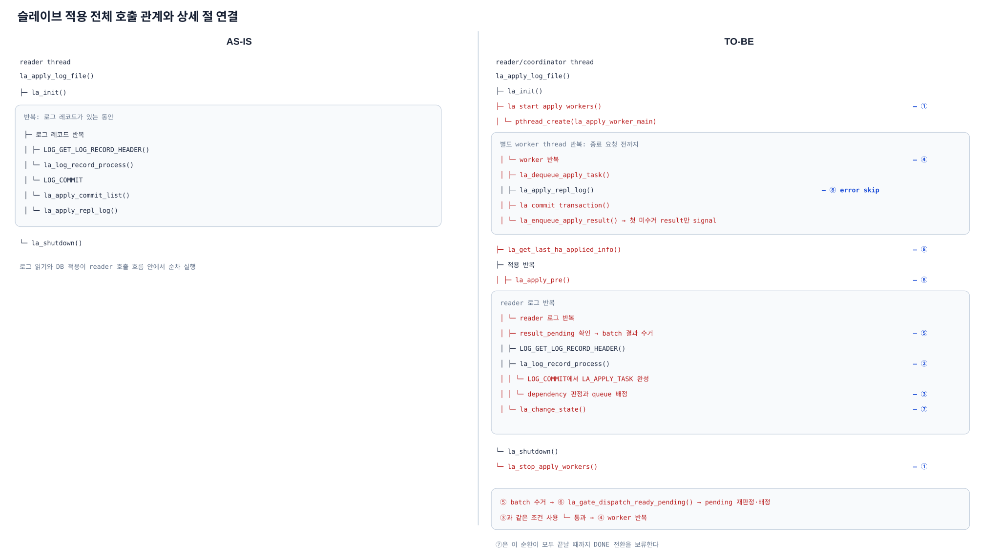

*그림 8-2-1. `la_apply_log_file()`을 기준으로 초기화, reader의 로그 반복, worker의 적용 반복과 결과 수거를 구분하고 각 상세 절의 번호를 연결한 전체 호출 관계*

> [!NOTE]-
> **호출 관계 원문**
> ```text
> AS-IS
>
> reader thread
> la_apply_log_file()
> ├─ la_init()
> ├─ 로그 레코드 반복
> │  ├─ LOG_GET_LOG_RECORD_HEADER()
> │  └─ la_log_record_process()
> │     └─ LOG_COMMIT
> │        └─ la_apply_commit_list()
> │           └─ la_apply_repl_log()
> └─ la_shutdown()
> ```
>
> ```text
> TO-BE
>
> reader/coordinator thread
> la_apply_log_file() 
> ├─ la_init()
> ├─ la_start_apply_workers()                       — ①
> │  └─ pthread_create(la_apply_worker_main)
> │     └─ worker 반복                              — ④
> │        ├─ la_dequeue_apply_task()
> │        ├─ la_apply_repl_log()
> │        │  └─ 재시작 복구 구간 error skip       — ⑧
> │        ├─ la_commit_transaction()
> │        └─ la_enqueue_apply_result()
> ├─ la_get_last_ha_applied_info()                 — ⑧
> ├─ 적용 반복
> │  ├─ la_apply_pre()                              — ⑧
> │  └─ reader 로그 반복
> │     ├─ la_collect_apply_results()               — ⑤
> │     ├─ LOG_GET_LOG_RECORD_HEADER()
> │     ├─ la_log_record_process()                  — ②
> │     │  └─ LOG_COMMIT에서 LA_APPLY_TASK 완성
> │     │     └─ dependency 판정과 queue 배정       — ③
> │     └─ la_change_state()                        — ⑦
> └─ la_shutdown()
>    └─ la_stop_apply_workers()                     — ①
>
> pending 재실행 순환
> ⑤ la_collect_apply_results()
> └─ la_collect_worker_results()
>    └─ la_gate_drain_ready()                      — ⑥
>       └─ pending task를 ③과 같은 조건으로 재판정
>          └─ 통과한 task는 ④ worker 반복으로 전달
> ```

- **① 8-2.2**: worker와 queue의 생성·시작·종료
- **② 8-2.3**: reader의 로그 수집과 transaction task 생성
- **③ 8-2.4**: transaction task의 dependency 판정과 queue 배정
- **④ 8-2.5**: worker의 task 적용과 결과 반환
- **⑤ 8-2.6**: 결과 수거, 완료 상태 반영과 안전 LSA 전진
- **⑥ 8-2.7**: 완료 상태 변경 후 pending task 재판정과 worker queue 재배정
- **⑦ 8-2.8**: 역할 전환 drain과 `DONE` 전환
- **⑧ 8-2.9**: 비정상 종료 뒤 재시작 범위와 error skip

각 절의 호출 관계는 이 전체 콜트리에서 해당 번호가 붙은 함수를 루트로 삼아 하위 호출을 확장한다.

## 8-2.2 thread 및 queue 생명주기

이 절은 그림 8-2-1의 **① 초기화·시작·종료 함수**에서 호출되는 하위 구조를 설명한다.

슬레이브는 병렬 적용 queue와 worker context를 먼저 준비하고, 각 worker의 DB 실행 환경 초기화가 끝난 뒤 task 배정을 시작해야 한다. 종료할 때는 신규 task 유입을 차단하고 시작된 worker를 join한 다음 queue와 동기화 객체를 회수해야 한다.

worker는 독립된 DB session에서 transaction task 하나를 적용하고 결과를 reader에 돌려주어야 한다. 시작 단계에서는 worker별 입출력 queue와 동기화 객체뿐 아니라 8-2.4에서 설명할 dispatch·gate 상태도 빈 상태로 초기화해야 한다.

### task와 result 전달 형식

다음 구조는 실제 코드의 모든 운영·계측 필드를 옮긴 것이 아니라, task 전달과 완료 판정에 필요한 필드만 표시한 설계 구조다.

```c
typedef struct la_apply_task LA_APPLY_TASK;
struct la_apply_task
{
  UINT64 seq;                 /* task와 result를 연결하는 슬레이브 내부 dispatch 순번 */
  int tranid;                 /* COMMIT과 LA_APPLY를 연결하고 종료 상태를 정리할 트랜잭션 id */
  LOG_LSA commit_lsa;         /* 현재 트랜잭션의 본인 seq. 완료 등록·frontier·재시작 판정 기준 */
  LA_APPLY *apply;            /* 같은 trid로 수집한 복제 항목 목록 */
  LOG_LSA dependency_seq;     /* 먼저 완료돼야 하는 선행 트랜잭션의 COMMIT LSA */
  bool dependency_is_read;    /* read_seq 유래 dependency인지 나타내는 대기 방식 */
};

typedef struct la_apply_result LA_APPLY_RESULT;
struct la_apply_result
{
  UINT64 seq;                 /* dispatch entry와 result를 대응시키는 키 */
  int tranid;                 /* 완료한 트랜잭션의 slot과 commit node 정리 기준 */
  int error;                  /* 적용과 DB COMMIT 결과 */
  LOG_LSA commit_lsa;         /* 완료 집합과 frontier에 반영할 본인 seq */
};
```

`LA_APPLY_TASK`는 reader가 구성해 worker에 전달하는 입력이고, `LA_APPLY_RESULT`는 worker가 적용을 끝낸 뒤 reader에 반환하는 출력이다. 각 필드를 채우는 시점은 8-2.3과 8-2.5에서 설명한다.

> **`commit_lsa`**: 현재 transaction task에 해당하는 `LOG_COMMIT` 레코드의 LSA다. 이 값을 task의 본인 시퀀스로 사용해 완료 결과, COMMIT 순서와 재시작 판정을 연결한다.

`seq`는 슬레이브 내부의 전달 순번이고, `commit_lsa`는 현재 트랜잭션의 본인 시퀀스이며, `dependency_seq`는 그보다 먼저 완료돼야 하는 선행 시퀀스다. 세 값은 서로 대체할 수 없다.

각 worker는 `LA_APPLY_TASK`를 받는 입력 queue와 `LA_APPLY_RESULT`를 반환하는 출력 queue를 가져야 한다. 두 queue는 mutex와 condition으로 보호하는 bounded queue로 구성해야 한다. 배열, `head`·`tail`과 용량 같은 내부 구현은 이 절의 호출 흐름에서 다루지 않는다.

### 생성과 시작 call stack

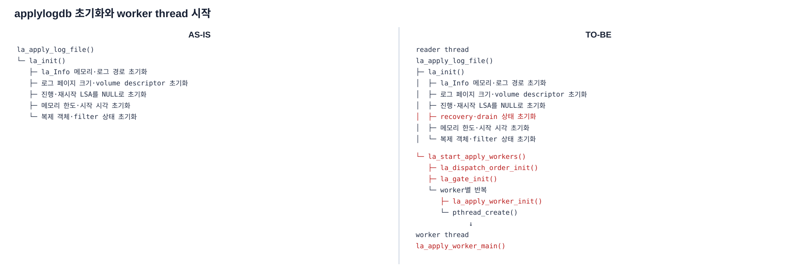

*그림 8-2-2. 기존 reader 공통 상태 초기화 뒤에 dispatch·dependency gate·worker별 실행 자원 초기화와 worker thread 시작을 추가하는 호출 관계*

> [!NOTE]-
> **호출 관계 원문**
> ```text
> AS-IS
>
> la_apply_log_file()
> └─ la_init()
>    ├─ la_Info 메모리 초기화·log_path 설정
>    ├─ 로그 페이지 크기·active/archive volume descriptor 초기화
>    ├─ committed·rep·append·eof·required·final LSA 초기화
>    ├─ 기동 시 고정하는 last_committed 계열 LSA 초기화
>    ├─ 메모리 한도·시작 시각·archive 삭제 상태 초기화
>    └─ 복제 객체·복제 filter 상태 초기화
> ```
>
> ```text
> TO-BE
>
> reader thread
> la_apply_log_file()     
> ├─ la_init()
> │  ├─ la_Info 메모리 초기화·log_path 설정
> │  ├─ 로그 페이지 크기·active/archive volume descriptor 초기화
> │  ├─ committed·rep·append·eof·required·final LSA 초기화
> │  ├─ 기동 시 고정하는 last_committed 계열 LSA 초기화
> │  ├─ recovery_boundary_lsa 초기화
> │  ├─ 역할 전환 drain 대기 상태 초기화     
> │  ├─ 메모리 한도·시작 시각·archive 삭제 상태 초기화
> │  └─ 복제 객체·복제 filter 상태 초기화
> └─ la_start_apply_workers()   
>    ├─ la_dispatch_order_init()
>    ├─ la_gate_init()          
>    └─ worker별 반복
>       ├─ la_apply_worker_init()   
>       │  ├─ task/result queue 초기화
>       │  └─ mutex·condition 초기화
>       └─ pthread_create(la_apply_worker_main)
>              ↓
> worker thread
> la_apply_worker_main()        
> ├─ CS sub-client·DB session 초기화
> └─ worker 실행 context 초기화 후 task 대기
> ```

`la_init()`은 기존과 같이 reader의 공통 실행 상태를 먼저 초기화해야 한다. `la_Info`를 비우고 로그 경로와 페이지 크기, 로그 볼륨 상태, 주요 LSA, 메모리 한도와 시작 시각, 복제 필터를 초기화해야 한다. 병렬 적용의 queue와 worker 상태는 이 함수에 섞지 않고, 이어서 호출하는 `la_start_apply_workers()`가 별도로 준비해야 한다.

#### 주요 구현 흐름

```text
추가 함수의 역할

la_start_apply_workers()
├─ dispatch 순서 상태 초기화
├─ dependency gate·pending·완료 상태 초기화
└─ worker별 queue·mutex·condition 생성 후 thread 시작

la_apply_worker_main()
├─ CS sub-client·DB session 초기화
└─ worker 실행 context 초기화 후 task 대기
```

각 worker는 DB session뿐 아니라 로그 복원에 사용하는 압축 해제 버퍼와 record descriptor 작업 공간도 독립적으로 가져야 한다. worker 시작 시 이 context를 준비하고 종료 시 해당 worker의 자원만 정리해야 한다. 로그 page cache는 reader와 worker가 공유하되, 사용 중인 page가 제거되지 않도록 기존 mutex와 fix count 규칙으로 보호해야 한다.

### 종료 call stack

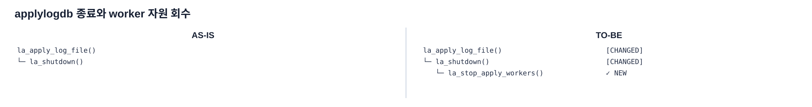

*그림 8-2-3. worker를 깨워 join하고 worker별 queue와 동기화 객체를 해제한 뒤 기존 reader 공통 자원을 정리하는 종료 호출 관계*

> [!NOTE]
> **호출 관계 원문**
> ```text
> AS-IS
>
> la_apply_log_file()
> └─ la_shutdown()
>    └─ reader의 기존 로그·캐시·복제 상태 정리
> ```
>
> ```text
> TO-BE
>
> la_apply_log_file()     
> └─ la_shutdown()        
>    ├─ la_stop_apply_workers() 
>    │  ├─ shutdown 설정·condition broadcast
>    │  ├─ worker thread의 session·context 정리
>    │  ├─ pthread_join()
>    │  └─ worker queue·동기화 객체 해제
>    └─ reader의 기존 로그·캐시·복제 상태 정리
> ```

`la_shutdown()`은 기존과 같이 reader가 사용한 로그 볼륨, 캐시, 복제 객체와 필터 등의 공통 자원을 정리해야 한다. 병렬 적용에서는 이 기존 정리보다 먼저 `la_stop_apply_workers()`를 호출하여 실행 중인 worker를 깨우고 모두 join해야 한다. worker가 종료되기 전에 reader 공통 자원을 해제하면 worker가 해당 상태를 참조할 수 있으므로 순서를 바꾸면 안 된다.

#### 주요 구현 흐름

```text
추가 함수의 역할

la_stop_apply_workers()
├─ shutdown 설정·condition broadcast
├─ worker thread 내부 session·context 정리
├─ pthread_join()
└─ worker queue·동기화 객체 해제
```

## 8-2.3 reader의 로그 수집과 transaction task 생성

이 절은 그림 8-2-1의 **② `la_log_record_process()`**에서 로그 종류별 상태를 수집하고 task를 완성하는 하위 구조를 설명한다.

transaction task는 worker가 트랜잭션 하나를 적용하는 데 필요한 복제 항목, COMMIT 정보와 마스터가 전달한 dependency를 묶은 `LA_APPLY_TASK`다. reader는 같은 `trid`의 REPL item과 WS_LABEL을 각각 보관하다가 COMMIT을 읽는 시점에 task 하나를 완성해야 한다.

### 기능 진입 call stack — 로그를 읽어 task를 만드는 시점

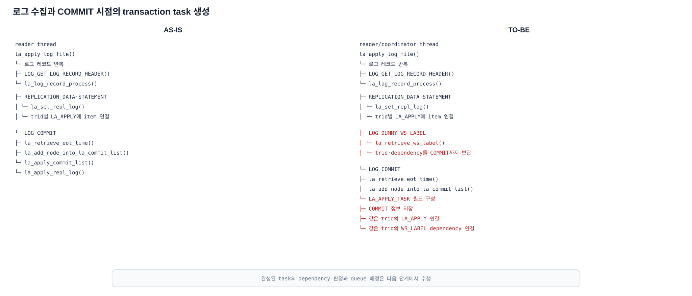

*그림 8-2-4. 기존 로그 읽기 방식을 유지하면서 WS_LABEL 처리를 추가하고, 같은 `trid`의 COMMIT을 읽는 시점에 `LA_APPLY_TASK`를 완성하는 호출 관계*

`la_apply_log_file()` 전체에는 worker 시작과 결과 수거가 추가되지만, 로그 페이지에서 `LOG_GET_LOG_RECORD_HEADER()`로 레코드 헤더를 읽고 `la_log_record_process()`에 전달하는 기본 읽기 방식은 유지해야 한다. 그림 8-2-4에서 달라지는 부분은 `la_log_record_process()`가 처리할 로그 종류와 COMMIT 이후의 처리다.

> [!NOTE]
> **호출 관계 원문**
> ```text
> AS-IS
>
> reader thread
> la_apply_log_file()
> └─ 로그 레코드 반복
>    ├─ LOG_GET_LOG_RECORD_HEADER()
>    └─ la_log_record_process()
>       ├─ REPLICATION_DATA·STATEMENT
>       │  └─ la_set_repl_log()
>       │     └─ trid별 LA_APPLY에 item 연결
>       └─ LOG_COMMIT
>          ├─ la_add_node_into_la_commit_list()
>          └─ la_apply_commit_list()
>             └─ la_apply_repl_log()
> ```
>
> ```text
> TO-BE
>
> reader/coordinator thread
> la_apply_log_file()
> └─ 로그 레코드 반복
>    ├─ LOG_GET_LOG_RECORD_HEADER()
>    └─ la_log_record_process()
>       ├─ REPLICATION_DATA·STATEMENT
>       │  └─ la_set_repl_log()
>       │     └─ trid별 LA_APPLY에 item 연결
>       ├─ LOG_DUMMY_WS_LABEL        
>       │  └─ la_retrieve_ws_label() 
>       │     └─ trid·dependency를 COMMIT까지 보관
>       └─ LOG_COMMIT
>          ├─ la_add_node_into_la_commit_list()
>          └─ LA_APPLY_TASK 필드 구성
>             ├─ COMMIT 정보 저장
>             ├─ 같은 trid의 LA_APPLY 연결
>             └─ 같은 trid의 WS_LABEL dependency 연결
> ```

호출 관계에서 reader가 처리하는 각 로그의 역할은 다음과 같다.

- `LOG_REPLICATION_DATA`·`LOG_REPLICATION_STATEMENT`: 기존 `la_set_repl_log()`를 사용해 같은 `trid`의 `LA_APPLY`에 replication item을 연결해야 한다.
- `LOG_DUMMY_WS_LABEL`: 새 `la_retrieve_ws_label()`로 `dependency_seq`와 `dependency_is_read`를 읽고, 공통 로그 헤더의 `trid`와 함께 COMMIT까지 reader 상태에 보관해야 한다. 이 레코드는 writeset 전체가 아니라 마스터가 계산한 dependency 결과만 전달한다.
- `LOG_COMMIT`: 앞에서 보관한 replication item과 dependency를 소비해 `LA_APPLY_TASK`를 완성해야 한다. 구체적인 필드 구성은 아래의 `COMMIT에서 task 필드 구성`에서 설명한다.

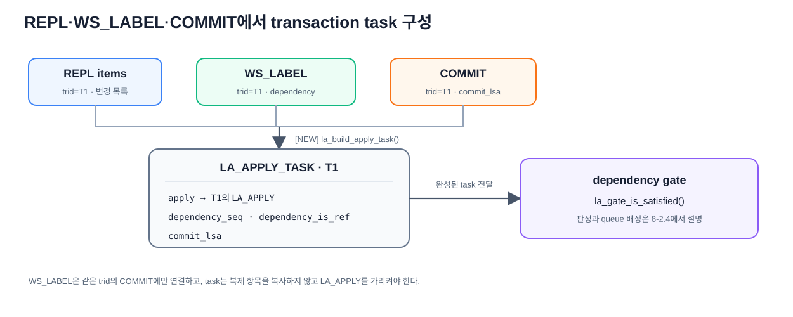

*그림 8-2-5. `la_log_record_process()`가 같은 `trid`의 REPL item과 WS_LABEL을 각각 보관하고, COMMIT에서 `LA_APPLY_TASK`로 결합하는 과정*

REPL이나 WS_LABEL을 읽은 시점에는 task가 완성되지 않는다. **같은 `trid`의 COMMIT을 읽어 task 필드를 채우는 시점이 transaction task의 생성 시점**이다. develop은 이 지점에서 `la_apply_commit_list()`로 직접 적용하지만, 병렬 적용은 task를 완성한 뒤 8-2.4의 실행 가능 판정으로 넘겨야 한다.

### 주요 구현 흐름 — COMMIT에서 task 필드 구성

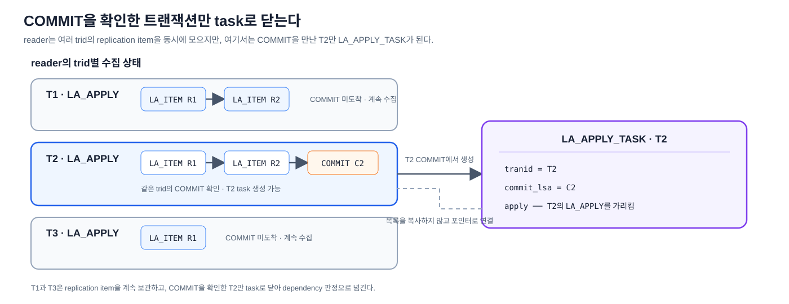

*그림 8-2-5a. reader가 T1·T2·T3의 replication item을 trid별 `LA_APPLY`에 보관하고, COMMIT을 확인한 T2만 `LA_APPLY_TASK`로 닫아 T2의 목록을 가리키는 구조*

```c
task.apply = la_find_apply_list (lrec->trid);  /* lrec->trid = T2 */
```

`task.apply`는 같은 `trid`의 replication item들을 모아 둔 기존 `LA_APPLY` 목록을 가리켜야 한다. worker는 이 목록의 `LA_ITEM`을 따라 해당 트랜잭션의 변경을 적용해야 한다.

> worker가 task를 처리하고 result를 반환할 때까지 reader는 해당 `LA_APPLY` slot과 `LA_ITEM` 목록을 변경·해제·재사용하면 안 된다. dispatch 상태는 이 포인터를 결과 회수까지 보관하고, 완료 결과를 확인한 뒤 해당 transaction slot을 정리해야 한다. 포인터 보관은 [8-2.4](#8-24-transaction-task-판정과-queue-배정), transaction slot 정리는 [8-2.6](#8-26-완료-결과와-안전-lsa-전진)에서 설명한다.

이 절에서는 `LA_APPLY_TASK` 구조를 다시 정의하지 않고 reader가 각 필드를 채우는 시점만 설명한다.

`seq`는 task 생성 시점에 채우지 않아야 한다. task가 gate를 통과해 worker에 배정될 때 `la_dispatch_order_push()`가 dispatch 순번을 만들고 `la_gate_dispatch_now()`가 이를 task에 기록해야 한다.

REPL 로그에서 만든 `LA_APPLY`, WS_LABEL에서 보관한 dependency와 현재 COMMIT 정보를 다음과 같이 같은 `trid`로 결합해야 한다.

```c
/* la_log_record_process(): LOG_COMMIT 처리 */
LA_APPLY_TASK task;

la_add_node_into_la_commit_list (/* 기존 COMMIT 정보 */);

task.tranid = lrec->trid;
LSA_COPY (&task.commit_lsa, final);
task.apply = la_find_apply_list (lrec->trid);

if (la_ws_label_trid == lrec->trid)
  {
    LSA_COPY (&task.dependency_seq, &la_ws_label_dependency_seq);
    task.dependency_is_read = la_ws_label_dependency_is_read;
    la_ws_label_trid = NULL_TRANID;
  }
else
  {
    LSA_SET_NULL (&task.dependency_seq);
    task.dependency_is_read = false;
  }
```

*코드 8-2-1. COMMIT 정보, 기존 `LA_APPLY`와 같은 `trid`의 WS_LABEL을 결합해 `LA_APPLY_TASK`를 채우는 처리*

`la_add_node_into_la_commit_list()`는 기존 COMMIT 처리 상태를 등록하며, 새 `LA_APPLY_TASK`는 이 목록에 저장하지 않고 별도로 구성한다.

WS_LABEL의 `trid`가 COMMIT과 다르면 dependency를 현재 task에 연결하면 안 된다. 이 상태를 정상적인 `dependency_seq=NULL`로 해석하면 필요한 선행 조건을 잃을 수 있으므로, dependency metadata 오류로 처리하거나 commit-order 보수 경로로 보내야 한다.

## 8-2.4 transaction task 판정과 queue 배정

이 절은 그림 8-2-1의 **③ dependency 판정과 queue 배정**에서 호출되는 gate와 dispatch 하위 구조를 설명한다.

### 기능 진입 call stack

```text
8-2.3에서 LA_APPLY_TASK 완성
├─ ① la_gate_order_push(task.commit_lsa)
└─ ② la_gate_is_satisfied(dependency_seq, dependency_is_read)
   ├─ true  → ③ la_gate_dispatch_now(task)
   │           ├─ la_gate_choose_worker()
   │           ├─ la_dispatch_order_push()
   │           └─ la_enqueue_apply_task()
   └─ false → ④ la_gate_enqueue_pending(task)
```

### 주요 구현 흐름 — dependency gate 판정과 최초 배정

#### ① COMMIT 순서 등록

COMMIT에서 task를 완성하면 pending 여부와 관계없이 `commit_lsa`를 **frontier 전진에 사용할 COMMIT 순서 상태**에 먼저 등록해야 한다. 이 순서를 보존해야 뒤의 task가 먼저 끝나더라도, worker 완료 결과와 앞에서부터 대조해 빈 구간 없는 연속 완료 경계를 계산할 수 있다.

```text
la_gate_order_push(task.commit_lsa):
    commit_order_fifo.push_back(task.commit_lsa)
```

결과 수거 시 FIFO의 앞에서부터 worker 완료 결과와 대조해 frontier를 전진시키는 과정은 8-2.6에서 설명한다.

#### ② dependency 판정

`la_gate_is_satisfied()`는 `dependency_seq`와 `dependency_is_read`로 현재 task의 실행 가능 여부를 판정해야 한다.

gate 판정에서 참조하는 완료 집합과 frontier도 이 지점에서 함께 정의해야 한다.

```c
LOG_LSA *la_Gate_completed_slots;   /* 완료된 commit_lsa의 오픈 어드레싱 해시 */
LOG_LSA la_Gate_frontier;           /* 이 LSA 이하의 COMMIT은 빈틈없이 적용 완료 */
bool la_Gate_frontier_seeded;       /* frontier 초기값이 잡혔는지 */
```

`la_Gate_completed_slots`는 frontier보다 뒤에서 먼저 끝난 특정 dependency를 확인하고, `la_Gate_frontier`는 해당 위치까지 앞선 COMMIT이 빠짐없이 완료됐는지 판정하는 데 사용해야 한다. 두 상태를 worker 결과로 갱신하는 과정은 8-2.6에서 설명한다.

`la_gate_is_satisfied()`의 판정 순서는 다음과 같이 구현해야 한다.

```text
la_gate_is_satisfied(dependency, dependency_is_read):
    if dependency가 NULL이면:
        return true   # 기다릴 선행 트랜잭션이 없으므로 worker에 배정

    if frontier가 초기화됐고 dependency <= frontier이면:
        return true   # dependency까지 빠짐없이 완료됐으므로 worker에 배정

    if dependency_is_read == true이면:
        return false  # read_seq 유래 dependency는 frontier가 도달할 때까지 pending

    # 여기까지 왔으면 WRITE 이력에서 온 dependency다.
    if la_gate_set_contains(dependency):
        return true   # 해당 선행 트랜잭션의 DB COMMIT이 끝났으므로 worker에 배정

    return false      # 해당 선행 트랜잭션이 아직 끝나지 않았으므로 pending
```

- `dependency_is_read == true`는 최종 dependency가 과거 `read_seq`에서 선택됐다는 뜻이다. 해당 LSA의 트랜잭션 하나가 끝났더라도 그보다 앞선 다른 REF 트랜잭션이 실행 중일 수 있으므로, frontier가 dependency까지 전진할 때까지 기다려야 한다.
- `la_gate_set_contains(dependency)`는 위 분기를 통과한 WRITE 이력 유래 dependency에만 적용한다. worker 결과를 수거할 때 `la_gate_mark_completed()`가 DB COMMIT에 성공한 `commit_lsa`를 `la_Gate_completed_slots`에 등록하며, 이 함수는 그 안에 `dependency`와 같은 LSA가 있는지 확인한다.

#### ③ gate를 통과한 task의 즉시 배정

`la_gate_dispatch_now()`는 gate를 통과한 task를 다음 순서로 worker queue에 전달해야 한다.

```text
la_gate_dispatch_now(task):
    worker = la_gate_choose_worker()
    dispatch_seq = la_dispatch_order_push(worker, task.apply, task.tranid, task.rectype)
    task.seq = dispatch_seq
    return la_enqueue_apply_task(worker, task)
```

`la_gate_choose_worker()`는 queue에서 기다리는 task 수와 현재 실행 중인 task를 합한 부하가 가장 작은 worker를 선택해야 한다. `la_dispatch_order_push()`는 배정 순번을 만들고 task의 `LA_APPLY`를 결과가 돌아올 때까지 보존해야 한다. 이 순번을 `task.seq`에 넣어 worker에 전달하며, result를 원래 task에 대응시키고 정리하는 과정은 8-2.6에서 설명한다. worker 선택 시점의 부하 오차는 배정 균형에만 영향을 주며, 순서 정합성은 앞의 dependency gate가 보장해야 한다.

#### ④ dependency 미충족 task 보관

`la_gate_enqueue_pending()`은 `la_gate_is_satisfied()`를 통과하지 못한 task를 pending queue의 끝에 넣어야 한다.

```text
la_gate_enqueue_pending(task):
    pending_queue.push_back(task)
```

pending task를 다시 판정해 worker queue로 보내는 과정은 8-2.7에서 설명한다.

## 8-2.5 worker 적용과 결과 반환

이 절은 그림 8-2-1의 **④ `la_apply_worker_main()` worker 반복**에서 task를 가져와 적용하고 결과를 반환하는 하위 구조를 설명한다.

develop에서는 reader가 복제 항목을 직접 적용한다. 병렬 적용에서는 worker가 기존 적용 함수를 실행하고, DB COMMIT 결과를 `LA_APPLY_RESULT`로 reader에 반환해야 한다.

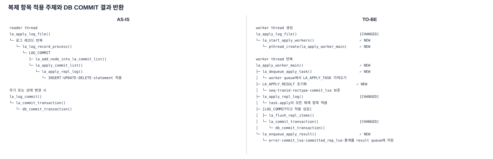

*그림 8-2-6. develop에서 reader가 직접 수행하던 적용·DB COMMIT을 worker가 task 단위로 수행하고 result queue로 결과를 반환하는 호출 관계*

> [!NOTE]-
> **호출 관계 원문**
> ```text
> AS-IS
>
> reader thread
> la_apply_log_file()
> └─ 로그 레코드 반복
>    └─ la_log_record_process()
>       └─ LOG_COMMIT
>          ├─ la_add_node_into_la_commit_list()
>          └─ la_apply_commit_list()
>             └─ la_apply_repl_log()
>                └─ INSERT·UPDATE·DELETE·statement 적용
>
> 주기 또는 상태 변경 시
> la_log_commit()
> └─ la_commit_transaction()
>    └─ db_commit_transaction()
> ```
>
> ```text
> TO-BE
>
> worker thread 생성
> la_apply_log_file()
> └─ la_start_apply_workers()
>    └─ pthread_create(la_apply_worker_main)
>
> worker thread 반복
> la_apply_worker_main()
> ├─ ① la_dequeue_apply_task()
> │  └─ worker queue에서 LA_APPLY_TASK 가져오기
> ├─ ② LA_APPLY_RESULT 초기화
> │  └─ seq·tranid·rectype·commit_lsa 보존
> ├─ ③ la_apply_repl_log()
> │  └─ task.apply의 모든 복제 항목 적용
> ├─ ④ [LOG_COMMIT이고 적용 성공]
> │  ├─ la_flush_repl_items()
> │  └─ la_commit_transaction()
> │     └─ db_commit_transaction()
> └─ ⑤ la_enqueue_apply_result()
>    └─ error·commit_lsa·committed_rep_lsa·통계를 result queue에 저장
> ```

### 주요 구현 흐름

#### ① task 가져오기

`la_dequeue_apply_task()`는 dependency gate를 통과해 worker queue에 배정된 `LA_APPLY_TASK` 하나를 가져와야 한다. queue가 비어 있으면 task 도착을 기다리고, 종료 요청을 받으면 worker 반복을 끝내야 한다.

#### ② result 초기화

worker는 `LA_APPLY_RESULT`를 빈 값으로 초기화하고 task의 `seq`, `tranid`, `rectype`과 `commit_lsa`를 복사해야 한다. reader는 `seq`로 원래 dispatch 항목을 찾고, `tranid`·`rectype`으로 트랜잭션 종료 상태를 정리하며, `commit_lsa`를 완료 상태와 frontier 계산에 사용해야 한다.

#### ③ 복제 항목 적용

`la_apply_repl_log()`는 `task.apply`가 가리키는 기존 `LA_APPLY`의 replication item을 순서대로 적용해야 한다. INSERT·UPDATE·DELETE·statement의 실제 적용 로직은 기존 경로를 재사용해야 한다.

#### ④ flush와 DB COMMIT

적용에 성공한 `LOG_COMMIT` task는 기존 `la_flush_repl_items()`와 `la_commit_transaction()`을 순서대로 호출해야 한다. 적용 또는 flush에서 오류가 발생하면 뒤의 성공 단계를 실행하지 않고 오류를 result에 보존해야 한다.

#### ⑤ result 반환

`la_enqueue_apply_result()`는 적용 결과와 `commit_lsa`를 worker의 result queue에 넣어야 한다. worker는 전역 완료 상태를 직접 바꾸지 않으며, reader가 result를 수거해 처리하는 과정은 8-2.6에서 설명한다.

## 8-2.6 완료 결과와 안전 LSA 전진

이 절은 그림 8-2-1의 **⑤ `la_collect_apply_results()`**에서 결과를 수거하고 완료 상태와 안전 LSA를 갱신하는 하위 구조를 설명한다.

reader/coordinator는 worker 결과를 완료 상태와 dispatch entry에 반영하고, COMMIT 순서에 홀 없이 이어진 frontier를 계산한다.

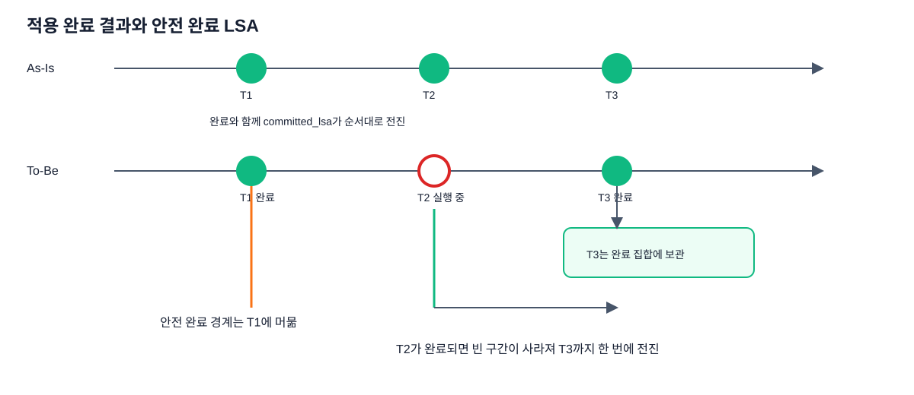

*그림 8-2-7. `la_collect_apply_results()` → `la_collect_worker_results()` → `la_gate_advance_frontier()` — 먼저 도착한 후행 worker 결과는 보관하고 앞의 빈 구간이 채워졌을 때만 `committed_lsa`와 apply-info를 전진시키는 비교*

이 처리는 reader의 로그 반복에서 `la_collect_apply_results()`로 진입한다. 결과를 도착한 순서대로 **수거하는 단계**와, 배정 순서의 앞에서부터 상태를 **확정하는 단계**가 분리되어 있다.

### 처리 순서

```text
la_collect_apply_results():
    error = ① la_collect_worker_results()
    if error != NO_ERROR:
        return error

    return ② la_retire_ready_results()
```

### 주요 구현 흐름

#### ① `la_collect_worker_results()` — worker 결과 등록과 frontier 전진

```text
la_collect_worker_results():
    for each worker:
        while result = la_try_dequeue_apply_result(worker):
            entry = la_dispatch_order_find_by_seq(result.seq)  # 배정할 때 저장한 task 찾기
            entry.result = result
            entry.result_ready = true

            if result.error == NO_ERROR and result.rectype == LOG_COMMIT:
                la_gate_mark_completed(result.commit_lsa)      # DB COMMIT에 성공한 task만 완료로 등록

    la_gate_advance_frontier()
    return la_gate_drain_ready()  # pending 재판정은 8-2.7
```

`la_dispatch_order_find_by_seq()`는 result를 원래 dispatch entry에 연결해야 한다. DB COMMIT에 성공한 result만 `la_gate_mark_completed()`로 완료 상태에 등록한 뒤, `la_gate_advance_frontier()`가 Gate Order를 사용해 frontier를 계산해야 한다.

```text
la_gate_advance_frontier():
    while la_Gate_order_head가 있고
          la_gate_set_contains(la_Gate_order_head.commit_lsa):
        frontier = la_Gate_order_head.commit_lsa
        Gate Order의 head 제거

    # head가 아직 완료되지 않았으면 그 위치에서 중단
```

Gate Order(`LA_GATE_ORDER`, `la_Gate_order_head/tail`)는 `la_gate_order_push()`가 reader의 COMMIT 읽기 순서대로 만든 frontier 계산 전용 FIFO다. `la_gate_advance_frontier()`는 head가 완료 상태에 있을 때만 frontier를 전진시키고 해당 Gate Order 노드를 제거해야 한다. 이 제거는 `LA_APPLY` 슬롯 정리가 아니다.

#### ② `la_retire_ready_results()` — 결과 확정과 transaction slot 정리

```text
la_retire_ready_results():
    while entry = la_dispatch_order_peek():
        if entry.result_ready == false:
            break

        if entry.result.error != NO_ERROR:
            return entry.result.error

        la_free_commit_node_by_tranid(entry.result.tranid)
        entry.apply의 start_lsa·last_lsa를 NULL로 설정
        entry.apply.tranid = 0

        if frontier > committed_lsa:
            committed_lsa = frontier

        la_dispatch_order_pop()

        if commit 주기이면:
            la_reader_commit_apply_info()
```

Dispatch Order는 worker에 보낸 task와 result를 연결하고 retire 순서를 정한다. `la_retire_ready_results()`는 준비된 head부터 `LA_COMMIT` 노드를 제거하고, `la_Info.repl_lists`의 해당 `LA_APPLY` 슬롯을 `tranid=0`으로 비워 재사용할 수 있게 해야 한다. `committed_lsa`는 개별 entry의 COMMIT 위치가 아니라 앞에서 계산한 frontier까지만 전진시켜야 한다.

#### `required_lsa` 보존

`required_lsa` 계산은 retire와 별개로 `la_log_commit()`이 수행해야 한다.

```text
la_log_commit()
├─ la_find_required_lsa()
│  └─ 사용 중인 transaction slot의 start_lsa 최솟값 계산
└─ la_reader_commit_apply_info()
   ├─ _db_ha_apply_info 갱신
   └─ db_commit_transaction()
```

```text
lowest_lsa = NULL

for each transaction slot:
    if slot.tranid > 0:
        lowest_lsa = min(lowest_lsa, slot.start_lsa)

if lowest_lsa is NULL:
    la_Info.required_lsa = la_Info.final_lsa
else:
    la_Info.required_lsa = lowest_lsa
```

retire에서 `tranid=0`으로 비운 슬롯은 다음 계산에서 제외된다. 따라서 아직 retire되지 않은 `LA_APPLY.start_lsa` 중 최솟값만 로그 보관 하한에 남고, 사용 중인 슬롯이 없으면 `final_lsa`를 사용해야 한다.

## 8-2.7 pending task 재판정과 재배정

이 절은 그림 8-2-1의 **⑥ `la_gate_drain_ready()`**에서 완료 상태 변경으로 실행 가능해진 pending task를 찾고 worker queue로 다시 보내는 하위 구조를 설명한다.

`la_gate_drain_ready()`는 역할 전환을 위한 전체 drain 함수가 아니다. worker 결과로 `la_Gate_completed_slots`나 frontier가 바뀐 뒤 pending task를 다시 확인하는 함수다. 최초 task와 다른 기준을 사용하지 않도록 8-2.4의 `la_gate_is_satisfied()`를 그대로 호출해야 한다.

### 주요 구현 흐름

```text
la_gate_drain_ready():
    repeat:
        dispatched = false

        for each task in pending queue:
            if la_gate_is_satisfied(task.dependency_seq, task.dependency_is_read):
                pending queue에서 task 제거
                la_gate_dispatch_now(task)
                dispatched = true

    until dispatched == false
```

재판정을 통과한 task는 worker queue에 들어가 8-2.5의 worker 반복에서 실행해야 한다. 통과하지 못한 task는 다음 worker 결과로 완료 상태가 바뀔 때까지 pending에 유지해야 한다.

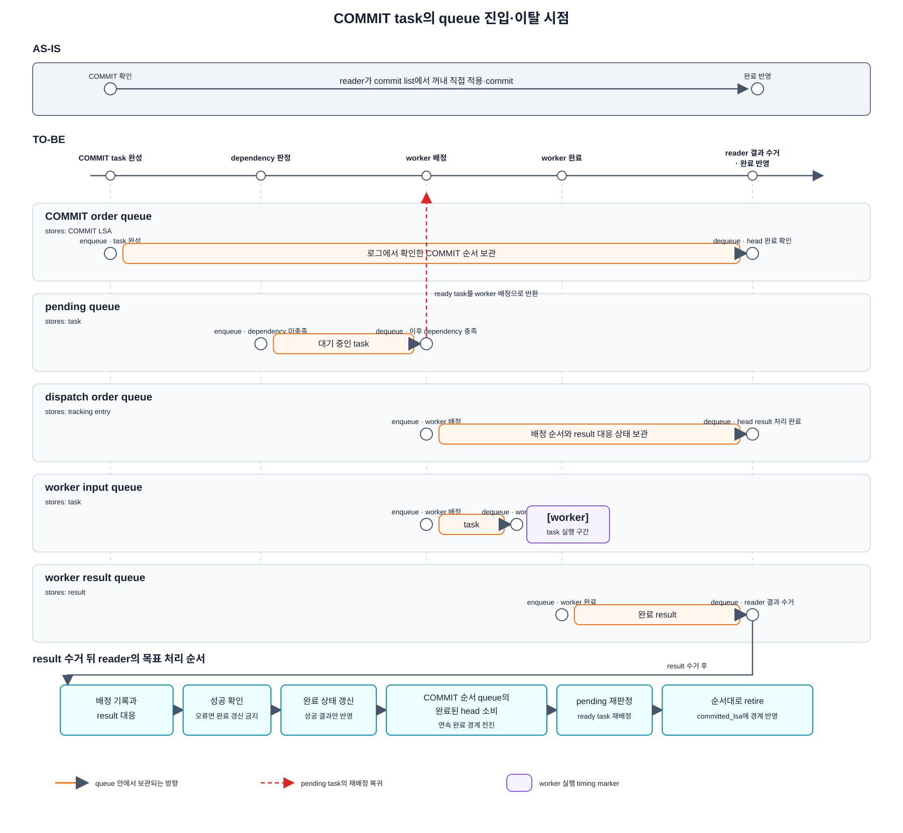

*그림 8-2-8. `la_gate_is_satisfied()` → `la_gate_dispatch_now()`/`la_gate_enqueue_pending()`, `la_dispatch_order_push()`, `la_enqueue_apply_task()` — 병렬 적용의 5개 queue와 순서 상태에서 task·result를 enqueue/dequeue하는 시점*

그림 8-2-8의 두 순서는 역할이 다르다. COMMIT 순서(`LA_GATE_ORDER`)는 frontier 계산용이고, dispatch 순서(`LA_DISPATCH_ORDER`)는 result 대응과 순서 있는 retire용이다. `LA_WORKER_QUEUE`는 dependency를 통과한 task를 worker에 전달하고, `LA_APPLY_RESULT_QUEUE`는 worker가 결과를 reader에 반환할 때 사용한다.

## 8-2.8 역할 전환 drain과 `DONE` 전환

이 절은 그림 8-2-1의 **⑦ 역할 전환 경로**를 설명한다. 마스터의 HA 상태 변경은 `LOG_DUMMY_HA_SERVER_STATE`와 active log header 상태로 슬레이브에 전달된다. applylogdb는 reader 반복에서 이 상태를 확인하고, 병렬 적용이 받아들인 작업을 모두 끝낸 뒤 `DONE`을 통보해야 한다.

정상 실행 중 pending task를 다시 배정하는 `la_gate_drain_ready()`와 역할 전환 drain은 목적이 다르다. 역할 전환 drain은 별도의 적용 알고리즘을 실행하지 않고, ⑤ 결과 수거 → ⑥ pending 재배정 → ④ worker 적용 순환이 남은 작업을 소진할 때까지 기존 상태 전환을 보류해야 한다.

역할 전환의 개념 흐름은 6-2.7의 역할 변경 감지·drain·승격 준비 그림에서 설명한다. 이 절에서는 그 흐름이 `la_log_record_process()`, reader 반복과 `la_change_state()`에 대응하는 위치를 설명한다.

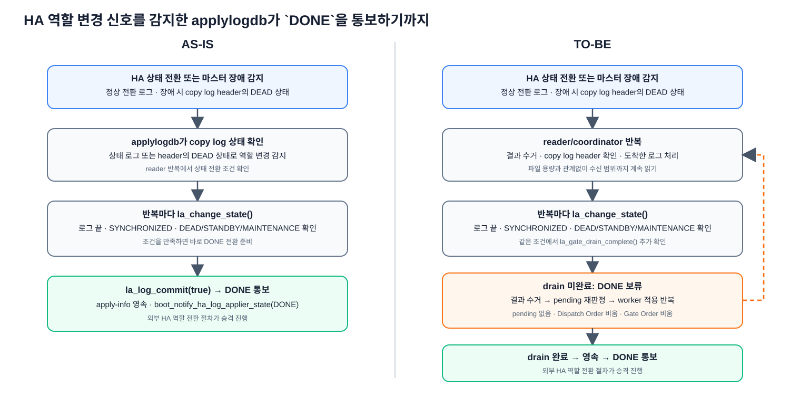

*그림 8-2-9. develop의 역할 변경 신호 감지 경로를 유지하면서, 병렬 적용에서는 `DONE` 전환 전에 이미 받아들인 task의 drain 완료를 추가로 확인하는 구조*

### 기능 진입 call stack

> [!NOTE]-
> **호출 관계 원문**
> ```text
> AS-IS
>
> la_apply_log_file()
> └─ reader 로그 반복
>    ├─ la_log_record_process()
>    │  └─ LOG_DUMMY_HA_SERVER_STATE
>    │     ├─ la_Info.is_role_changed = true
>    │     └─ ER_INTERRUPTED 반환
>    └─ la_change_state()
>       └─ 로그 끝 + SYNCHRONIZED + DEAD·STANDBY·MAINTENANCE
>          ├─ new_state = DONE
>          ├─ la_log_commit(true)
>          ├─ boot_notify_ha_log_applier_state(DONE)
>          └─ apply_state = DONE
> ```
>
> ```text
> TO-BE
>
> la_apply_log_file()
> └─ reader/coordinator 반복
>    ├─ la_collect_apply_results()
>    ├─ la_log_record_process()
>    │  └─ LOG_DUMMY_HA_SERVER_STATE
>    │     ├─ la_Info.is_role_changed = true
>    │     └─ ER_INTERRUPTED 반환
>    └─ la_change_state()
>       └─ 로그 끝 + SYNCHRONIZED + DEAD·STANDBY·MAINTENANCE
>          └─ la_gate_drain_complete()
>             ├─ false → DONE 전환 보류
>             │  └─ ⑤ 결과 수거 → ⑥ pending 재배정 → ④ worker 적용 반복
>             └─ true
>                ├─ new_state = DONE
>                ├─ la_log_commit(true)
>                ├─ boot_notify_ha_log_applier_state(DONE)
>                └─ apply_state = DONE
> ```

### 주요 구현 흐름

`la_gate_drain_complete()`는 다음 세 상태가 모두 비었을 때만 true를 반환해야 한다.

```text
pending list가 비어 있음
and dispatch order에 회수·확정할 task가 없음
and COMMIT 순서 FIFO가 비어 있음
```

worker queue와 실행 중 task는 dispatch order에 대응 항목이 남아 있으므로 별도 조건으로 중복 검사하지 않는다. drain이 끝나지 않은 상태에서 로그 입력도 더 이상 전진하지 않으면, reader loop는 설정한 제한 시간까지 기존 결과 수거와 pending 재배정을 계속해야 한다. 제한 시간을 넘기면 무한 대기 상태로 두지 않고 오류를 기록한 뒤 재시작 경로로 전환해야 한다.

`la_gate_drain_complete()`만 true라고 해서 즉시 승격하면 안 된다. `la_change_state()`는 로그 끝에 도달했고 active log가 `SYNCHRONIZED`이며 서버 상태가 `DEAD`, `STANDBY` 또는 `MAINTENANCE`인지 먼저 확인해야 한다. drain 완료 뒤에도 `la_log_commit(true)`가 안전한 `committed_lsa`와 apply-info를 DB에 영속하고, `boot_notify_ha_log_applier_state(DONE)`이 성공해야 `apply_state`를 `DONE`으로 바꿔야 한다.

`DONE`은 applylogdb가 남은 적용 작업과 COMMIT 순서의 홀을 모두 정리했다는 통보다. 실제 마스터 승격은 이 통보를 확인한 외부 HA 역할 전환 절차가 수행해야 한다.

## 8-2.9 비정상 종료 뒤 재시작 범위와 error skip

이 절은 그림 8-2-1의 **⑧ 재시작 경로**에서 이전 실행의 안전 완료 위치부터 로그를 다시 읽고, 이미 DB에 반영된 순서 밖 완료 트랜잭션을 처리하는 하위 구조를 설명한다.

병렬 적용에서는 이전 실행에서 `final_lsa`까지 로그를 읽었더라도 `committed_lsa` 뒤에 홀과 순서 밖 완료가 남을 수 있다. 재시작 시 reader는 안전 경계인 `committed_lsa`부터 다시 읽어야 하며, 이전 실행의 영속 `final_lsa`는 error skip을 허용할 복구 구간의 상한으로만 고정해야 한다.

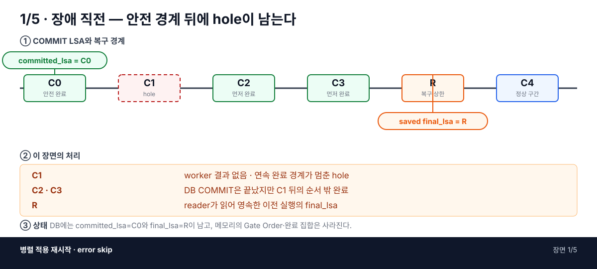

*그림 8-2-10a. 장애 직전 `committed_lsa=C0` 뒤에 미완료 C1과 먼저 완료된 C2·C3이 남고, reader가 읽은 위치 R이 `final_lsa`로 저장된 상태*

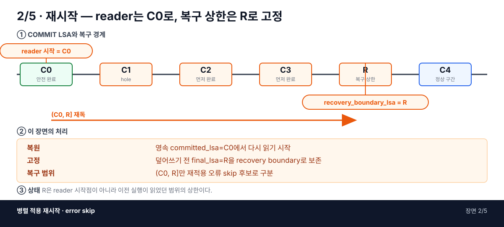

*그림 8-2-10b. 재시작 시 reader 위치를 안전 경계 C0로 되감고, 이전 실행의 `final_lsa=R`을 `recovery_boundary_lsa`로 고정하는 단계*

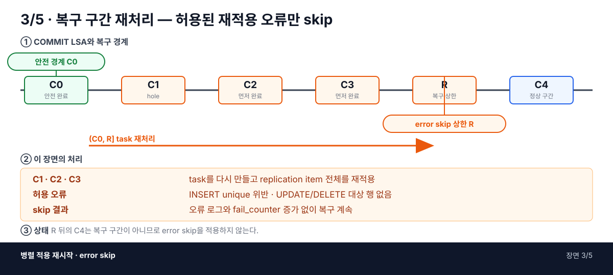

*그림 8-2-10c. `(C0, R]`의 task를 다시 구성·적용하고, 복구 구간에서 허용한 재적용 오류만 로그와 `fail_counter` 증가 없이 건너뛰는 단계*

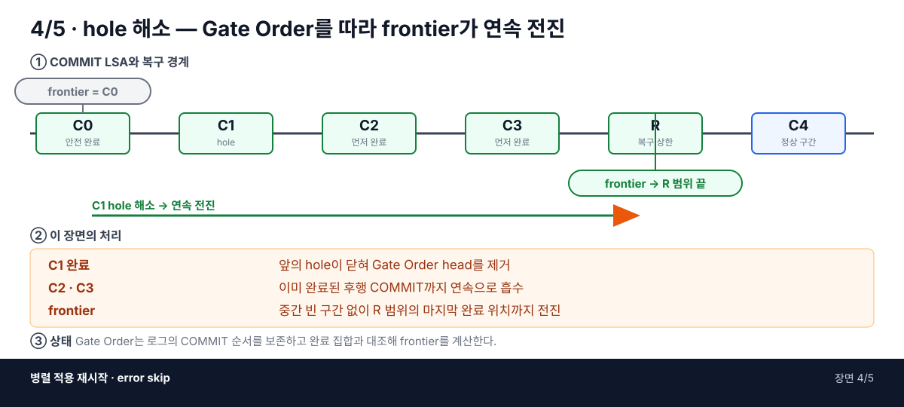

*그림 8-2-10d. C1의 hole이 닫히면 Gate Order의 앞에서부터 이미 완료된 C2·C3을 연속으로 흡수해 frontier를 R 범위까지 전진시키는 단계*

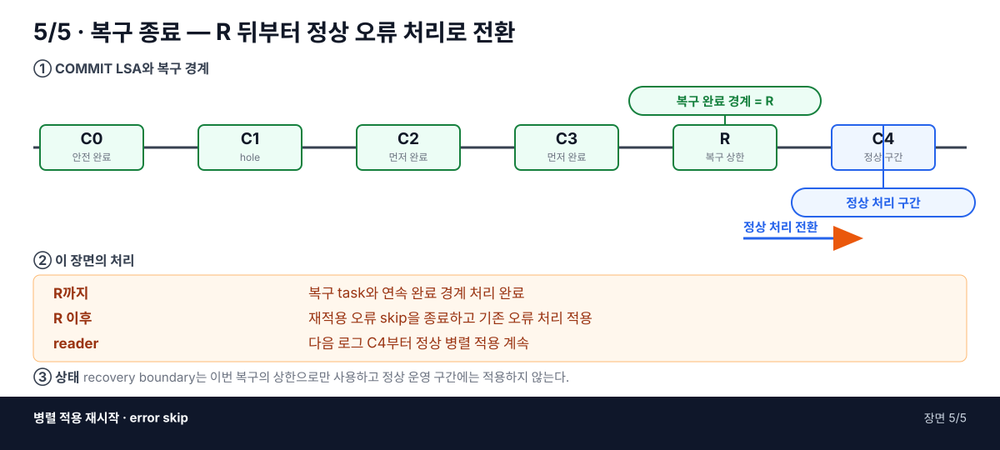

*그림 8-2-10e. R 범위의 task와 연속 완료 경계 처리를 마친 뒤, R 다음 로그부터 기존 오류 처리로 전환하는 단계*

### 기능 진입 call stack

```text
la_apply_log_file()
├─ la_get_last_ha_applied_info()
│  ├─ committed_lsa 복원
│  ├─ final_lsa 복원
│  └─ recovery_boundary_lsa = 복원한 final_lsa
├─ la_apply_pre()
│  └─ final_lsa = committed_lsa
└─ reader가 committed_lsa부터 로그 재독
   └─ worker: la_apply_repl_log()
      ├─ commit_lsa <= last_committed_lsa
      │  └─ 이미 확정된 트랜잭션 전체 skip
      └─ last_committed_lsa < commit_lsa <= recovery_boundary_lsa
         └─ recovery window로 표시해 전체 item 재적용
            └─ flush 결과의 재적용 오류를 제한적으로 skip
```

### 주요 구현 흐름

`recovery_boundary_lsa`는 `_db_ha_apply_info`에서 복원한 이전 실행의 `final_lsa`를 `la_apply_pre()`가 덮어쓰기 전에 복사해야 한다. apply-info 행이 없는 최초 기동에서는 NULL로 유지하여 복구 구간을 만들지 않아야 한다.

develop은 `commit_lsa <= last_committed_lsa`이면 트랜잭션 전체를 건너뛰고, 처리 대상 트랜잭션 안에서도 `item->lsa <= last_committed_rep_lsa`인 item을 건너뛴다. 병렬 적용에서는 `committed_rep_lsa`가 순서 밖 worker 결과의 최댓값일 수 있으므로 item 단위 skip 기준으로 사용하면 다른 트랜잭션의 위치 때문에 현재 트랜잭션 일부만 누락될 수 있다. 따라서 트랜잭션 전체 skip만 유지하고, 복구 구간의 트랜잭션은 item 전체를 다시 적용해야 한다.

error skip은 복구 구간의 모든 오류를 무시하는 기능이 아니다. 현재 코드는 다음 재적용 오류만 별도 카운터로 분류한다.

- INSERT 재적용의 unique 위반
- UPDATE·DELETE 재적용의 대상 행 없음

그 밖의 오류와 `recovery_boundary_lsa` 뒤의 정상 운영 구간 오류는 기존 오류 처리 경로를 따라야 한다. 또한 현재 구현은 재적용 오류를 `recovery_skipped_counter`로 분류한 뒤에도 기존 `la_restart_on_bulk_flush_error()`를 호출한다. 따라서 해당 서버 오류가 retry 목록에 포함돼 있으면 재연결 오류로 전환될 수 있으며, 정식 error skip 정책에서는 재적용 skip과 retry 판정의 우선순위를 확정해야 한다.
