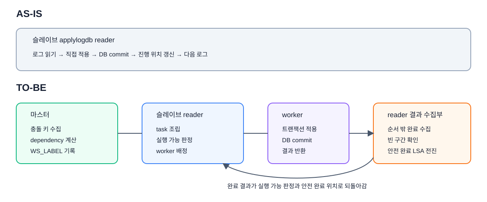
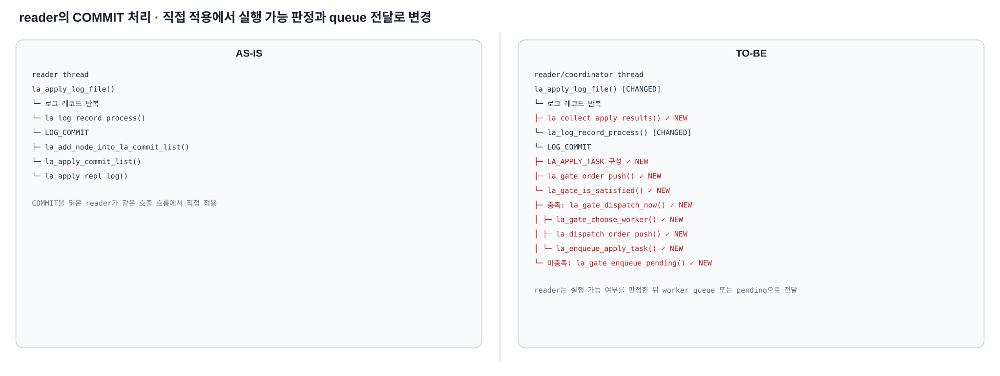

# 8-2. CUBRID 슬레이브 병렬 적용 상세 설계

이 장은 슬레이브 병렬 적용 코드에서 확인한 thread, queue, reader, worker와 완료 상태의 실제 호출 관계와 자료구조를 설명한다. 개념과 목표 동작은 [6-2장](./6-2-cubrid-슬레이브-병렬-적용-설계.md)에서 다룬다.

## 8-2.1 슬레이브 변경 구조

`develop`에서는 reader가 로그를 읽고 같은 흐름에서 트랜잭션을 적용한다. 병렬 적용에서는 책임을 다음과 같이 나눈다.

- **reader/coordinator**: 같은 `trid`의 REPL item·WS_LABEL·COMMIT을 task로 조립하고 dependency를 판정해야 한다.
- **pending·worker queue**: 아직 실행할 수 없는 task와 실행 가능한 task를 구분해 보관해야 한다.
- **worker**: task 하나를 DB 트랜잭션 하나로 적용하고 결과만 반환해야 한다.
- **결과 수집부**: 성공 결과를 완료 상태에 등록하고 COMMIT 순서의 연속 완료 경계를 전진시켜야 한다.



*그림 8-2-1. `la_apply_log_file()` 메인 루프 기준 — reader `la_log_record_process()`, worker `la_apply_worker_main()`, 결과 수집 `la_collect_apply_results()`. develop의 직렬 적용 흐름을 슬레이브 reader·queue·worker·완료 경계 관리로 분리하는 전체 코드 구조*

## 8-2.2 thread 및 queue 생명주기

슬레이브는 병렬 적용 queue와 worker context를 먼저 준비하고, 각 worker의 DB 실행 환경 초기화가 끝난 뒤 task 배정을 시작해야 한다. 종료할 때는 신규 task 유입을 차단하고 시작된 worker를 join한 다음 queue와 동기화 객체를 회수해야 한다.

worker는 독립된 DB session에서 트랜잭션 task 하나를 적용하고 결과를 reader에 돌려주어야 한다. 이를 위해 시작 전에 다음 다섯 queue·목록의 빈 상태가 준비돼야 한다.

- **worker별 `LA_WORKER_QUEUE`**: reader가 배정한 transaction task를 worker에 전달하는 입력 queue다.
- **worker별 `LA_APPLY_RESULT_QUEUE`**: worker의 적용 결과를 reader가 회수할 때까지 보관해야 한다.
- **reader 전역 `LA_DISPATCH_ORDER`**: task를 worker에 보낸 순서를 보존하는 dispatch FIFO다.
- **reader 전역 `LA_GATE_PENDING` 연결 목록**: dependency가 아직 충족되지 않은 task를 보류해야 한다.
- **reader 전역 `LA_GATE_ORDER` 연결 목록**: 로그에서 읽은 COMMIT 순서를 보존해 연속 완료 경계를 전진시키는 데 사용해야 한다.

### 생성과 시작 call stack


*그림 8-2-2. 기존 reader 공통 상태 초기화 뒤에 dispatch·dependency gate·worker별 실행 자원 초기화와 worker thread 시작을 추가하는 호출 관계*

> [!NOTE]- 호출 관계 원문
> ```text
> AS-IS
>
> la_apply_log_file()
> └─ la_init()
>    ├─ la_Info 메모리 초기화·log_path 설정
>    ├─ 로그 페이지 크기·active/archive volume descriptor 초기화
>    ├─ committed·rep·append·eof·required·final LSA 초기화
>    ├─ 기동 시 고정하는 last_committed 계열 LSA 초기화
>    ├─ 메모리 한도·시작 시각·archive 삭제 상태 초기화
>    └─ 복제 객체·복제 filter 상태 초기화
> ```
>
> ```text
> TO-BE
>
> reader thread
> la_apply_log_file()                         [CHANGED]
> ├─ la_init()
> │  ├─ la_Info 메모리 초기화·log_path 설정
> │  ├─ 로그 페이지 크기·active/archive volume descriptor 초기화
> │  ├─ committed·rep·append·eof·required·final LSA 초기화
> │  ├─ 기동 시 고정하는 last_committed 계열 LSA 초기화
> │  ├─ recovery_boundary_lsa 초기화          ✓ NEW
> │  ├─ 역할 전환 drain 대기 상태 초기화      ✓ NEW
> │  ├─ 메모리 한도·시작 시각·archive 삭제 상태 초기화
> │  └─ 복제 객체·복제 filter 상태 초기화
> └─ la_start_apply_workers()                 ✓ NEW
>    ├─ la_dispatch_order_init()              ✓ NEW
>    ├─ la_gate_init()                        ✓ NEW
>    └─ worker별 반복
>       ├─ la_apply_worker_init()             ✓ NEW
>       │  ├─ task/result queue 초기화
>       │  └─ mutex·condition 초기화
>       └─ pthread_create(la_apply_worker_main) ✓ NEW
>              ↓
> worker thread
> la_apply_worker_main()                      ✓ NEW
> ├─ CS sub-client·DB session 초기화
> └─ worker 실행 context 초기화 후 task 대기
> ```

`la_init()`은 기존과 같이 reader의 공통 실행 상태를 먼저 초기화해야 한다. `la_Info`를 비우고 로그 경로와 페이지 크기, 로그 볼륨 상태, 주요 LSA, 메모리 한도와 시작 시각, 복제 필터를 초기화해야 한다. 병렬 적용의 queue와 worker 상태는 이 함수에 섞지 않고, 이어서 호출하는 `la_start_apply_workers()`가 별도로 준비해야 한다.

```text
추가 함수의 역할

la_start_apply_workers()
├─ dispatch 순서 상태 초기화
├─ dependency gate·pending·완료 상태 초기화
└─ worker별 queue·mutex·condition 생성 후 thread 시작

la_apply_worker_main()
├─ CS sub-client·DB session 초기화
└─ worker 실행 context 초기화 후 task 대기
```

### 종료 call stack


*그림 8-2-3. worker를 깨워 join하고 worker별 queue와 동기화 객체를 해제한 뒤 기존 reader 공통 자원을 정리하는 종료 호출 관계*

> [!NOTE]- 호출 관계 원문
> ```text
> AS-IS
>
> la_apply_log_file()
> └─ la_shutdown()
>    └─ reader의 기존 로그·캐시·복제 상태 정리
> ```
>
> ```text
> TO-BE
>
> la_apply_log_file()                         [CHANGED]
> └─ la_shutdown()                            [CHANGED]
>    ├─ la_stop_apply_workers()               ✓ NEW
>    │  ├─ shutdown 설정·condition broadcast
>    │  ├─ worker thread의 session·context 정리
>    │  ├─ pthread_join()
>    │  └─ worker queue·동기화 객체 해제
>    └─ reader의 기존 로그·캐시·복제 상태 정리
> ```

`la_shutdown()`은 기존과 같이 reader가 사용한 로그 볼륨, 캐시, 복제 객체와 필터 등의 공통 자원을 정리해야 한다. 병렬 적용에서는 이 기존 정리보다 먼저 `la_stop_apply_workers()`를 호출하여 실행 중인 worker를 깨우고 모두 join해야 한다. worker가 종료되기 전에 reader 공통 자원을 해제하면 worker가 해당 상태를 참조할 수 있으므로 순서를 바꾸면 안 된다.

```text
추가 함수의 역할

la_stop_apply_workers()
├─ shutdown 설정·condition broadcast
├─ worker thread 내부 session·context 정리
├─ pthread_join()
└─ worker queue·동기화 객체 해제
```

## 8-2.3 reader의 로그 수집과 transaction task 생성

transaction task는 worker가 트랜잭션 하나를 적용하는 데 필요한 정보와 reader가 계산한 배정 조건을 묶은 `LA_APPLY_TASK`다. reader는 같은 `trid`의 복제 항목과 WS_LABEL을 보관하다가 COMMIT을 만나면 task 하나를 완성해야 한다.

develop의 reader는 COMMIT을 만나면 해당 트랜잭션을 직접 적용한다. 병렬 적용의 reader는 `la_log_record_process()`에서 REPL item을 트랜잭션별 `LA_APPLY`에 모으고, `la_retrieve_ws_label()`이 읽은 같은 `trid`의 WS_LABEL과 COMMIT 정보를 결합해야 한다.


*그림 8-2-4. `la_apply_log_file()` → `la_log_record_process()`의 LOG_COMMIT 분기 — 기존 reader 직접 적용을 `LA_APPLY_TASK` 생성과 dependency gate를 통한 queue 배정으로 바꾸는 호출 관계*

> [!NOTE]- 호출 관계 원문
> ```text
> AS-IS
>
> reader thread
> la_apply_log_file()
> └─ 로그 레코드 반복
>    ├─ LOG_GET_LOG_RECORD_HEADER()
>    └─ la_log_record_process()
>       └─ case LOG_COMMIT
>          ├─ la_retrieve_eot_time()
>          ├─ la_add_node_into_la_commit_list()
>          │  ├─ LA_COMMIT 메모리 할당
>          │  ├─ tranid·type·log_lsa·log_record_time 저장
>          │  └─ la_Info.commit_head/tail 끝에 연결
>          └─ la_apply_commit_list()
>             └─ la_apply_repl_log()
> ```
>
> ```text
> TO-BE
>
> reader/coordinator thread
> la_apply_log_file()                              [CHANGED]
> └─ 로그 레코드 반복
>    ├─ LOG_GET_LOG_RECORD_HEADER()
>    └─ la_log_record_process()                    [CHANGED]
>       └─ case LOG_COMMIT
>          ├─ la_retrieve_eot_time()
>          ├─ la_add_node_into_la_commit_list()
>          │  ├─ LA_COMMIT 메모리 할당
>          │  ├─ tranid·type·log_lsa·log_record_time 저장
>          │  └─ la_Info.commit_head/tail 끝에 연결
>          ├─ LA_APPLY_TASK 필드 구성              ✓ NEW
>          │  ├─ COMMIT 정보와 LA_APPLY 포인터 저장
>          │  └─ 같은 trid의 WS_LABEL 값을 dependency에 저장
>          ├─ la_gate_order_push()                 ✓ NEW
>          └─ la_gate_is_satisfied()               ✓ NEW
>             ├─ true  → la_gate_dispatch_now()
>             │           └─ worker queue enqueue
>             └─ false → la_gate_enqueue_pending()
> ```

### `LA_APPLY_TASK` 자료구조

`LA_APPLY_TASK`는 복제 항목 자체를 다시 복사하지 않고, 같은 `trid`의 항목을 모은 `LA_APPLY`를 가리켜야 한다.

```c
struct la_apply_task
{
  UINT64 seq;
  int tranid;
  int rectype;
  LOG_LSA commit_lsa;
  LOG_PAGEID final_pageid;
  time_t log_record_time;
  LA_APPLY *apply;
  LOG_LSA dependency_seq;
  bool dependency_is_read;
};
```

- `tranid`·`rectype`: 현재 COMMIT의 트랜잭션과 레코드 종류를 보관해야 한다.
- `commit_lsa`: task 자신의 COMMIT 로그 위치를 끝까지 보존해야 한다.
- `final_pageid`·`log_record_time`: 적용 상태와 지연 복제에 필요한 COMMIT 부가 정보를 보관해야 한다.
- `apply`: 같은 `trid`로 수집한 복제 항목을 가진 `LA_APPLY`를 가리켜야 한다.
- `dependency_seq`·`dependency_is_read`: 같은 `trid`의 WS_LABEL에서 읽은 선행 조건과 대기 방식을 보관해야 한다.

`seq`는 task 생성 시점에 채우지 않아야 한다. task가 gate를 통과해 worker에 배정될 때 `la_dispatch_order_push()`가 dispatch 순번을 만들고 `la_gate_dispatch_now()`가 이를 task에 기록해야 한다.

### COMMIT에서 task 생성

REPL 로그에서 만든 `LA_APPLY`, WS_LABEL에서 보관한 dependency와 현재 COMMIT 정보를 같은 `trid`로 결합해야 한다.

```text
LOG_COMMIT을 읽음
├─ COMMIT list 노드 추가
├─ la_find_apply_list(trid)로 기존 LA_APPLY 조회
├─ 같은 trid의 WS_LABEL dependency 소비
└─ LA_APPLY_TASK 한 개 완성
```

COMMIT list는 종료 위치 추적용 구조이며 `LA_APPLY_TASK`를 보관하는 목록이 아니다. 완성한 task의 배정은 다음 절에서 설명한다.

다음 그림은 REPL·WS_LABEL·COMMIT으로 task 하나를 완성하는 범위를 보여준다.


*그림 8-2-5. `la_log_record_process()` — 같은 trid의 REPL item·WS_LABEL·COMMIT을 결합해 `LA_APPLY_TASK`를 완성하는 과정*

완성된 task를 dependency gate로 넘기는 지점에서 이 절의 범위가 끝난다. gate 판정과 queue 배정은 8-2.4에서 설명한다.

현재 분기는 WS_LABEL의 `trid`가 COMMIT의 `trid`와 다르면 `task.dependency_seq`를 NULL로 설정한다.

```c
if (la_ws_label_trid == lrec->trid)
  {
    LSA_COPY (&task.dependency_seq, &la_ws_label_dependency_seq);
  }
else
  {
    LSA_SET_NULL (&task.dependency_seq);
  }
```

*코드 8-2-1. WS_LABEL과 COMMIT의 `trid`가 일치할 때만 dependency를 task에 연결하는 분기*

## 8-2.4 transaction task 판정과 queue 배정

reader/coordinator와 worker는 pending·worker·result queue에 task와 result를 중복 보관하지 않고 단계별로 전달해야 한다. 전체 전달 규칙은 [6-2.1절](./6-2-cubrid-슬레이브-병렬-적용-설계.md#6-21-슬레이브-전체-실행-구조)을 따르며, 이 절에서는 이를 실제 호출 관계에 대응시킨다.

### dependency gate 판정 알고리즘

기존에는 reader가 COMMIT을 처리하면 `la_apply_commit_list()`를 거쳐 `la_apply_repl_log()`를 바로 호출했다. 개선안에서는 COMMIT에서 만든 task를 곧바로 실행하지 않고, 먼저 `la_gate_is_satisfied()`에 `dependency_seq`와 `dependency_is_read`를 전달해 실행 가능 여부를 판정해야 한다. 실행 가능하면 worker queue로 보내고, 아직 실행할 수 없으면 pending에 보관해야 한다.

`la_gate_is_satisfied()`의 판정 순서는 다음과 같이 구현해야 한다.

```text
la_gate_is_satisfied(dependency, dependency_is_read):
    if dependency가 NULL이면:
        return true

    if frontier가 초기화됐고 dependency <= frontier이면:
        return true

    if dependency_is_read == true이면:
        return false

    return completed_set에 dependency가 있음
```

- `dependency == NULL`: 기다릴 선행 트랜잭션이 없으므로 바로 실행할 수 있다.
- `dependency <= frontier`: 해당 위치까지 COMMIT 순서의 빈 구간 없이 적용이 끝났으므로 실행할 수 있다.
- `dependency_is_read == true`: 최종 dependency가 과거 `read_seq`에서 선택됐다는 뜻이다. 완료 집합에서 해당 LSA 한 건만 확인해서는 그보다 앞선 REF 트랜잭션까지 모두 끝났는지 보장할 수 없으므로, frontier가 dependency까지 전진할 때까지 pending에 두어야 한다.
- `completed_set` 조회: 위 조건을 통과한 WRITE 이력 유래 dependency에만 적용해야 한다. frontier보다 뒤에 있더라도 해당 선행 트랜잭션의 DB COMMIT 결과가 완료 집합에 있으면 실행할 수 있다.

`completed_set`은 worker 결과에서 수거한 COMMIT LSA를 보관하는 메모리 해시 집합이다. frontier보다 뒤에서 순서 밖으로 먼저 끝난 트랜잭션을 확인할 때 사용해야 한다.

COMMIT에서 task를 처음 판정할 때와 완료 결과를 수거한 뒤 pending task를 다시 판정할 때 모두 같은 함수를 사용해야 한다.

```text
la_gate_order_push(task.commit_lsa)

if la_gate_is_satisfied(task.dependency_seq, task.dependency_is_read):
    la_gate_dispatch_now(task)
else:
    la_gate_enqueue_pending(task)
```

*의사코드 8-2-1. dependency가 없거나 이미 충족된 task만 worker로 보내고, 나머지는 pending에 보관하는 gate 판정*

gate를 통과한 task는 worker를 선택하고 dispatch 순서 상태를 등록한 뒤 해당 worker queue에 넣어야 한다.

```text
la_gate_dispatch_now(task)
├─ la_gate_choose_worker()
├─ la_dispatch_order_push(task)
└─ la_enqueue_apply_task(worker[i], task)
```

gate를 통과하지 못한 task는 pending에 넣어야 한다. worker 결과로 완료 상태가 바뀌면 pending을 순회하며 같은 `la_gate_is_satisfied()`로 다시 판정하고, 통과한 task만 pending에서 제거해 dispatch해야 한다.

```text
la_gate_enqueue_pending(task)

la_gate_drain_ready()
└─ pending task마다 la_gate_is_satisfied()
   ├─ true  → pending에서 제거 → la_gate_dispatch_now()
   └─ false → pending 유지
```


*그림 8-2-6. `la_gate_is_satisfied()` → `la_gate_dispatch_now()`/`la_gate_enqueue_pending()`, `la_dispatch_order_push()`, `la_enqueue_apply_task()` — 병렬 적용의 5개 queue와 순서 상태에서 task·result를 enqueue/dequeue하는 시점*

- **`LA_GATE_ORDER`**: 로그 COMMIT 순서를 보존해 worker가 순서 밖으로 완료되어도 앞에서부터 빈틈없는 frontier를 계산하게 한다.
- **`LA_GATE_PENDING`**: dependency 미충족 task만 보류해야 한다. worker busy나 입력 queue 포화는 pending 사유가 아니며 worker input의 backpressure로 처리해야 한다.
- **`LA_DISPATCH_ORDER`**: 배정한 task와 순서 밖으로 도착한 result를 대응시키고, dispatch 순서대로 retire할 상태를 보존한다.
- **`LA_WORKER_QUEUE`**: dependency를 통과한 실행 가능 task를 선택된 worker에 전달한다.
- **`LA_APPLY_RESULT_QUEUE`**: worker가 전역 완료 상태를 직접 바꾸지 않고 DB commit 성공·오류와 식별 정보를 reader에 반환하게 한다.
- **두 순서의 차이**: COMMIT 순서는 안전한 frontier 계산용이고, dispatch 순서는 result 대응과 순서 있는 retire용이다.

### gate·worker·결과 수거 호출 관계

`la_apply_log_file()`은 병렬 적용에서도 reader/coordinator의 메인 함수다. 달라진 점은 reader가 직접 트랜잭션을 적용하지 않는다는 것이다. 함수 초반에 `la_start_apply_workers()`로 worker thread를 시작한 뒤, reader는 로그 레코드를 계속 읽으면서 완성된 task를 queue에 전달해야 한다. worker는 별도 thread에서 queue의 task를 적용하고 결과를 자신의 result queue에 넣어야 한다.

```text
worker thread 생성
la_apply_log_file()                             [CHANGED]
└─ la_start_apply_workers()                     ✓ NEW
   └─ pthread_create(la_apply_worker_main)      ✓ NEW
```

worker가 시작된 뒤 `la_apply_log_file()`은 reader 반복을 수행한다. 반복을 시작할 때 먼저 이전에 끝난 worker 결과가 있는지 확인하고, 이어서 현재 로그 레코드를 읽는다. COMMIT에서 만든 task가 dependency를 통과하면 worker queue로 보내고, 통과하지 못하면 pending에 보관한 뒤 다음 로그로 전진한다.



*그림 8-2-7. 기존 reader의 COMMIT 직접 적용을 worker 결과 수거, transaction task 생성, dependency 실행 가능 판정과 queue 전달로 분리하는 전후 호출 관계*

> [!NOTE]- 호출 관계 원문
> ```text
> AS-IS
>
> reader thread
> la_apply_log_file()
> └─ 로그 레코드 반복
>    └─ la_log_record_process()
>       └─ LOG_COMMIT
>          ├─ la_add_node_into_la_commit_list()
>          └─ la_apply_commit_list()
>             └─ la_apply_repl_log()
> ```
>
> ```text
> TO-BE
>
> reader/coordinator thread
> la_apply_log_file()                             [CHANGED]
> └─ 로그 레코드 반복
>    ├─ la_collect_apply_results()                ✓ NEW
>    └─ la_log_record_process()                   [CHANGED]
>       └─ LOG_COMMIT
>          ├─ LA_APPLY_TASK 구성                  ✓ NEW
>          ├─ la_gate_order_push()                ✓ NEW
>          └─ la_gate_is_satisfied()              ✓ NEW
>             ├─ 충족: la_gate_dispatch_now()     ✓ NEW
>             │  ├─ la_gate_choose_worker()       ✓ NEW
>             │  ├─ la_dispatch_order_push()      ✓ NEW
>             │  └─ la_enqueue_apply_task()       ✓ NEW
>             └─ 미충족: la_gate_enqueue_pending() ✓ NEW
> ```

worker thread는 reader와 별도로 실행된다. 입력 queue가 비어 있으면 기다리고, task가 들어오면 기존 적용 핵심인 `la_apply_repl_log()`를 실행한 뒤 DB COMMIT 결과를 result queue에 반환한다.

```text
worker thread
la_apply_worker_main()                          ✓ NEW
├─ la_dequeue_apply_task()                      ✓ NEW
├─ la_apply_repl_log()                          [CHANGED]
├─ la_commit_transaction()                      ✓ NEW
└─ la_enqueue_apply_result()                    ✓ NEW
```

reader는 매 반복에서 `la_collect_apply_results()`를 호출한다. 도착한 결과가 없으면 상태를 바꾸지 않고 로그 읽기를 계속한다. 결과가 있으면 개별 완료 상태와 frontier를 갱신하고, 새로 dependency가 풀린 pending task를 다시 worker queue로 보낸 뒤 준비된 결과를 retire한다.

```text
reader/coordinator thread의 결과 수거
la_apply_log_file()                             [CHANGED]
└─ 로그 레코드 반복 시작·종료
   └─ la_collect_apply_results()                ✓ NEW
      ├─ la_collect_worker_results()            ✓ NEW
      │  ├─ la_try_dequeue_apply_result()       ✓ NEW
      │  ├─ la_gate_mark_completed()            ✓ NEW
      │  ├─ la_gate_advance_frontier()          ✓ NEW
      │  └─ la_gate_drain_ready()               ✓ NEW
      └─ la_retire_ready_results()              ✓ NEW
```

*호출 관계 8-2-4. 병렬 적용의 dependency 판정, task 배정, worker 실행과 결과 수거 경로*

`la_gate_choose_worker()`는 `worker[i].queue.count + (worker[i].busy ? 1 : 0)`가 가장 작은 worker를 선택한다. 0번부터 순서대로 확인하다 부하가 0인 worker를 만나면 즉시 반환한다. 
> 이는 기존의 `trid % LA_APPLY_WORKER_COUNT` 고정 배정을 대체한 방식이며 RR도 아니다. 이 값은 무락으로 읽는 부하분산 힌트이므로 선택 시점의 오차는 배정 균형에만 영향을 주고, 순서 정합성은 앞의 dependency gate가 담당한다.

pending에는 선행 작업이 끝나지 않아 **아직 실행하면 안 되는 task**만 넣어야 한다. dependency를 이미 통과한 task는 worker queue가 가득 찼더라도 pending으로 되돌리지 않아야 한다. `la_enqueue_apply_task()`가 queue에 빈자리가 생길 때까지 reader를 잠시 기다리게 한 뒤, 같은 task를 worker queue에 넣어야 한다.

## 8-2.5 worker 적용과 결과 반환

develop에서는 reader가 COMMIT 로그를 처리하는 호출 경로 안에서 복제 항목을 직접 적용한다.

병렬 적용에서는 reader가 `LA_APPLY_TASK`를 worker queue에 넣고, 별도로 실행 중인 worker가 task를 꺼내 적용한다. 기존 `la_apply_repl_log()`는 worker별 실행 context를 받도록 변경됐고, 각 `LOG_COMMIT` task는 해당 worker의 DB 트랜잭션으로 flush와 commit을 끝낸 뒤 결과 queue로 반환된다.


*그림 8-2-8. develop에서 reader가 직접 수행하던 적용·DB COMMIT을 worker가 task 단위로 수행하고 result queue로 결과를 반환하는 호출 관계*

worker는 task를 dequeue하고 적용 결과를 자신의 result queue에 enqueue해야 한다. reader의 dequeue 이후 완료 상태 갱신과 retire는 8-2.6에서 설명한다.

```text
la_apply_worker_main()
├─ la_dequeue_apply_task(worker[i])
├─ la_apply_repl_log(task)
├─ la_commit_transaction()
└─ la_enqueue_apply_result(worker[i], result)

la_collect_worker_results()
└─ la_try_dequeue_apply_result(worker[i], result)
```

적용, flush 또는 DB commit에서 오류가 발생하면 이후 성공 단계는 실행하지 않고 오류 코드를 `LA_APPLY_RESULT.error`에 담아 반환한다. `la_apply_worker_main()` 안에는 명시적인 rollback 호출이 없으므로, 이 절에서 오류 결과를 rollback 완료로 해석하지 않는다.

worker는 다른 worker의 상태, pending queue, 전역 `committed_*`를 직접 갱신하지 않는다. reader가 `la_collect_worker_results()`로 result를 회수한 뒤에만 dependency 해제와 안전 LSA 전진을 판단한다.

## 8-2.6 완료 결과와 안전 LSA 전진

reader/coordinator는 worker 결과를 완료 상태와 dispatch entry에 반영하고, COMMIT 순서에 홀 없이 이어진 frontier를 계산한다.


*그림 8-2-9. `la_collect_worker_results()` → `la_collect_apply_results()` → `la_gate_advance_frontier()` — 먼저 도착한 후행 worker 결과는 보관하고 앞의 빈 구간이 채워졌을 때만 `committed_lsa`와 apply-info를 전진시키는 비교*

이 처리는 reader의 로그 반복에서 `la_collect_apply_results()`로 진입한다. 결과를 도착한 순서대로 **수거하는 단계**와, 배정 순서의 앞에서부터 상태를 **확정하는 단계**가 분리되어 있다.

```text
reader/coordinator thread
la_apply_log_file()                             [CHANGED]
└─ 로그 레코드 반복 시작·종료
   └─ la_collect_apply_results()                ✓ NEW
      ├─ la_collect_worker_results()            ✓ NEW
      │  ├─ worker별 result queue 수거
      │  ├─ la_dispatch_order_find_by_seq()     ✓ NEW
      │  │  └─ 해당 dispatch entry에 result 연결·result_ready 설정
      │  ├─ la_gate_mark_completed()            ✓ NEW
      │  ├─ la_gate_advance_frontier()           ✓ NEW
      │  └─ la_gate_drain_ready()               ✓ NEW
      │     └─ dependency가 풀린 pending task를 다시 dispatch
      └─ la_retire_ready_results()              ✓ NEW
         ├─ 배정 순서 head의 result_ready·error 확인
         ├─ commit node와 transaction slot 정리
         ├─ committed_lsa를 frontier까지 전진
         ├─ 결과 통계와 committed_rep_lsa 반영
         ├─ dispatch entry 제거
         └─ commit 주기에 따라 apply-info 영속
```

완료 판정에는 목적이 다른 두 자료구조를 함께 사용한다.

- **COMMIT 순서 FIFO(`LA_GATE_ORDER`)**: reader가 COMMIT 로그를 읽을 때마다 `LA_APPLY_TASK.commit_lsa`를 로그 순서대로 넣는다.
- **완료 집합(`la_Gate_completed_slots`)**: worker의 `LOG_COMMIT` 결과에서 수거한 `commit_lsa`를 오픈 어드레싱 해시에 보관한다. frontier보다 뒤의 특정 dependency가 이미 끝났는지 빠르게 확인하는 데도 사용한다. 현재 코드의 오류 결과 등록 문제는 아래에서 별도로 구분한다.
- **연속 완료 경계(`la_Gate_frontier`)**: COMMIT 순서 FIFO의 head와 완료 집합을 대조해 전진시키는 메모리 LSA다.

COMMIT 순서 FIFO는 로그에서 읽은 순서를 보존한다. 완료 집합은 결과의 도착 순서를 줄 세우는 queue가 아니라, 먼저 끝난 `commit_lsa`가 들어 있는 해시 집합이다. `la_gate_advance_frontier()`는 FIFO의 앞쪽 COMMIT이 완료 집합에 있는지를 다음과 같이 확인한다.

```text
while COMMIT 순서 FIFO의 head가 완료 집합에 있으면:
    frontier = FIFO head의 COMMIT LSA
    FIFO head 제거

완료 집합에 없는 head를 만나면 중단
```

예를 들어 FIFO가 `C1 → C2 → C3`일 때 C3이 먼저 완료되면 frontier는 움직이지 않는다. 이후 C1이 완료되면 C1까지만 전진하고, 마지막으로 C2가 완료되면 이미 완료된 C3까지 연속해서 전진한다.

여기서 COMMIT 순서 FIFO와 dispatch 순서 상태의 역할도 다르다. COMMIT 순서 FIFO는 frontier의 빈 구간을 찾고, dispatch 순서 상태는 worker에 보낸 task와 돌아온 result를 연결한 뒤 앞에서부터 정리한다.

```text
la_collect_apply_results():
    la_collect_worker_results()
        worker별 result queue 수거
        dispatch entry에 result 연결
        LOG_COMMIT 결과의 commit_lsa를 completed_set에 등록
        모든 수거가 끝나면 frontier 전진
        pending task를 같은 dependency gate로 재판정

    la_retire_ready_results()
        while 배정 순서 head의 result가 준비됨:
            결과 오류 확인
            task의 트랜잭션 슬롯 정리
            committed_lsa를 현재 frontier까지 전진
            commit 주기가 됐으면 apply info 저장
            배정 순서 head 제거
```

현재 브랜치의 `la_collect_worker_results()`는 `result.error`를 확인하기 전에 `LOG_COMMIT` 결과를 완료 집합에 등록한다. 오류 확인은 뒤의 `la_retire_ready_results()`에서 수행된다. 따라서 위 호출 순서는 현재 코드 설명이며, 실패한 task가 frontier를 전진시키거나 pending dependency를 풀지 않게 하려면 완료 등록 전에 DB commit 성공 여부를 확인하도록 순서를 보강해야 한다.

```c
entry->result = result;
entry->result_ready = true;
if (result.rectype == LOG_COMMIT)
  {
    la_gate_mark_completed (&result.commit_lsa);
  }
...
if (result->error != NO_ERROR)
  {
    return result->error;
  }
```

*코드 8-2-2. result를 dispatch entry에 연결하고 완료 집합에 등록한 뒤 retire에서 오류를 확인하는 현재 순서*

완료 집합은 고정 용량 해시다. 삽입 공간이 부족하면 frontier 이하 항목을 먼저 제거하고, 정리 뒤에도 공간이 없으면 `ER_HA_GENERIC_ERROR`를 반환한다.

`required_lsa`는 retire되지 않은 트랜잭션의 시작 로그를 보존한다. retire는 완료한 task의 transaction slot을 비우지만, 하한 계산 자체는 retire 함수가 아니라 주기 또는 상태 변경 시 호출되는 `la_log_commit()`에서 수행한다.

```text
la_log_commit()
├─ la_find_required_lsa()
│  └─ 사용 중인 transaction slot의 start_lsa 최솟값 계산
└─ la_reader_commit_apply_info()
   ├─ _db_ha_apply_info 갱신
   └─ db_commit_transaction()
```

```text
lowest_lsa = NULL

for each transaction slot:
    if slot.tranid > 0:
        lowest_lsa = min(lowest_lsa, slot.start_lsa)

if lowest_lsa is NULL:
    la_Info.required_lsa = la_Info.final_lsa
else:
    la_Info.required_lsa = lowest_lsa
```

task가 사용한 트랜잭션 슬롯은 retire에서 `tranid=0`으로 비워진다. 다음 `la_find_required_lsa()` 계산에서는 이 슬롯이 제외되므로, 아직 retire되지 않은 슬롯의 `start_lsa`만 로그 보관 하한에 남는다. 사용 중인 슬롯이 하나도 없으면 현재 reader 위치인 `final_lsa`가 새 `required_lsa`가 된다.
