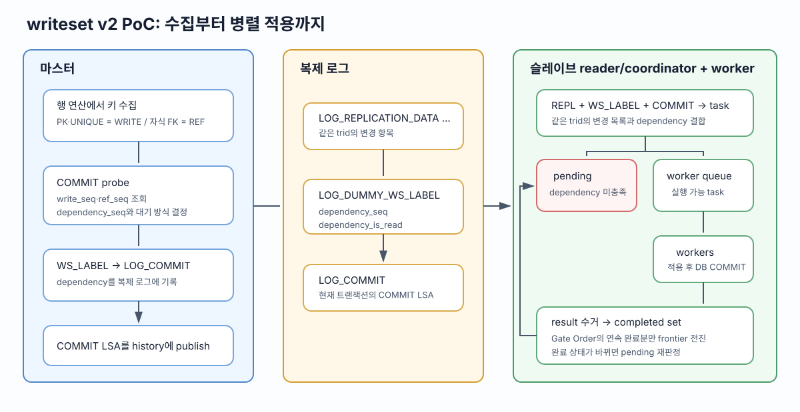
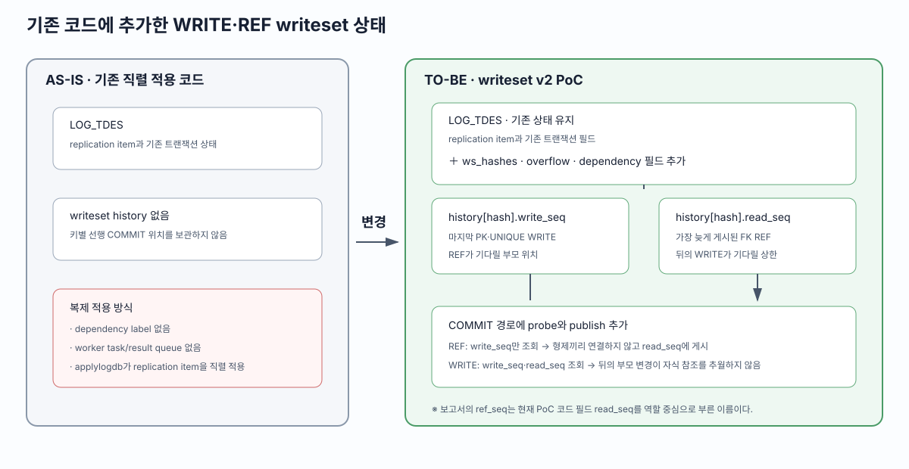
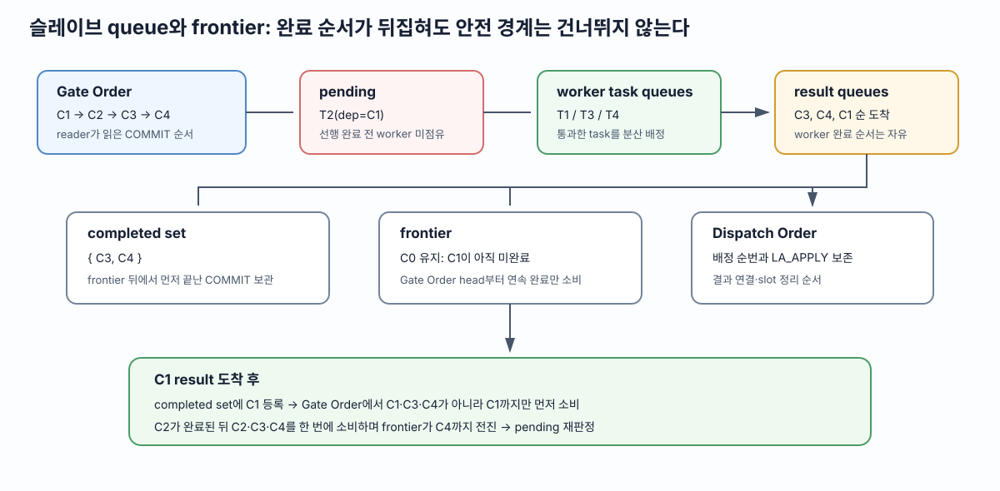
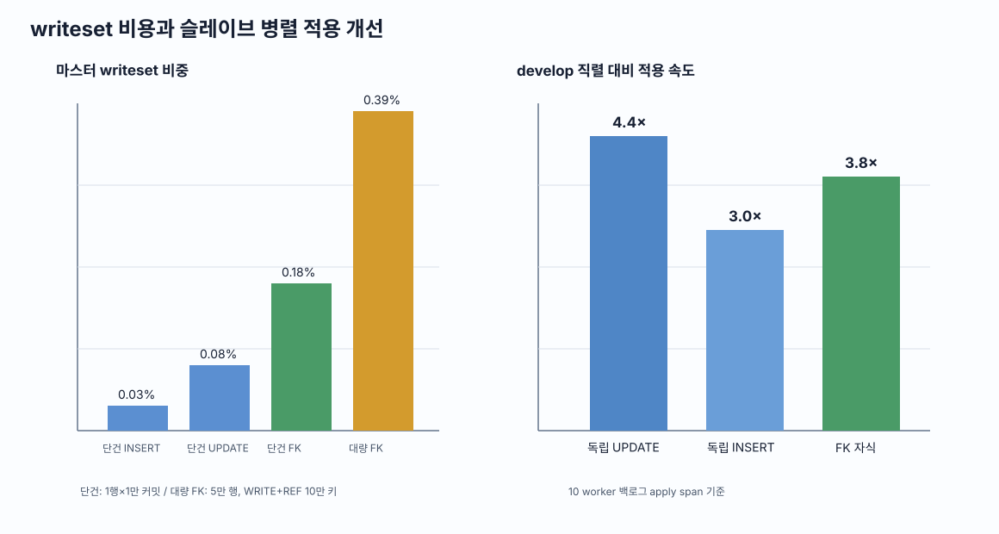
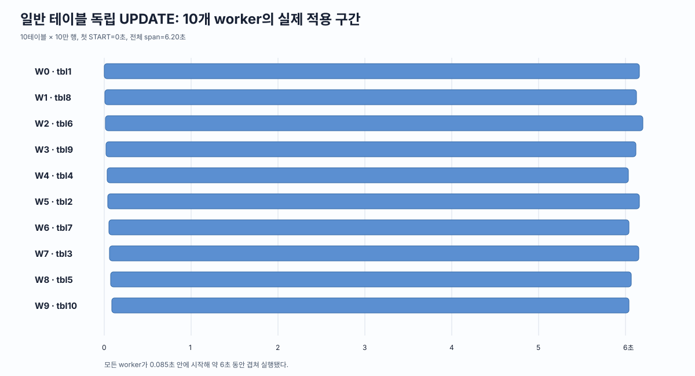
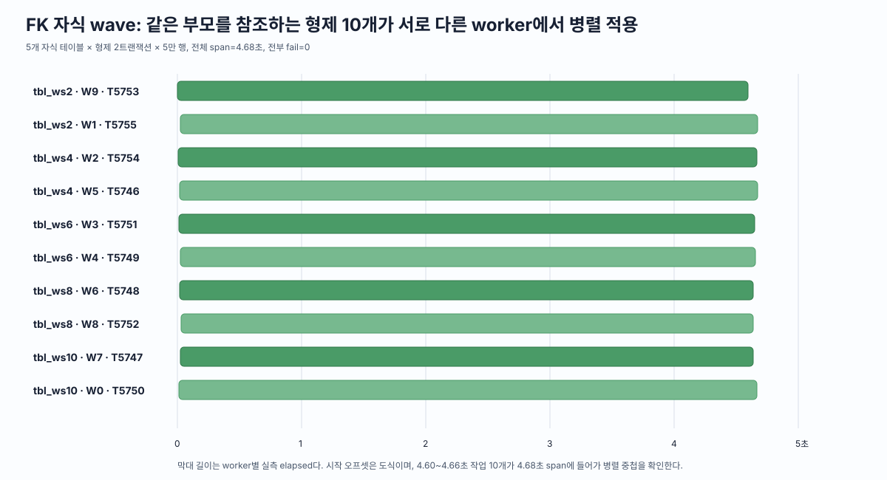

# CUBRID writeset v2 PoC 결과

## 1. 목적과 범위

이번 PoC는 지난 PK 기반 writeset을 UNIQUE와 FK까지 확장했다. 특히 같은 부모를 참조하지만 서로 변경하는 자식 행이 달라 실제 충돌이 없는 자식 트랜잭션을 병렬 적용하는 것을 목표로 했다. 이 보고서는 확장한 충돌 키와 dependency 계산·전달·집행 구조, 그리고 기능 및 성능 실측 결과를 정리한다.

PoC의 검증 범위는 다음과 같다.

1. 마스터에서 PK·UNIQUE·REVERSE UNIQUE와 FK 참조 키를 수집한다.
2. 동일 키의 변경과 참조를 `WRITE`와 `REF`로 구분해 dependency를 계산한다.
3. 계산 결과를 `LOG_DUMMY_WS_LABEL`에 기록해 슬레이브로 전달한다.
4. 슬레이브 reader/coordinator가 task를 만들고 dependency가 충족된 task를 여러 worker에 배정한다.
5. worker 완료 순서가 뒤집혀도 completed set과 frontier로 안전한 완료 경계를 계산한다.
6. 재시작 복구 구간에서는 재적용 때문에 발생할 수 있는 일부 오류만 구분해 skip한다.



*그림 1. 마스터의 키 수집·dependency 계산과 WS_LABEL 기록부터 슬레이브의 task 생성, pending, worker 실행과 frontier 전진까지 PoC가 연결한 전체 흐름*

핵심 결과는 다음과 같다.

- PK·UNIQUE 충돌과 부모·자식 FK 순서를 dependency로 전달했다.
- 같은 부모를 참조하는 형제 자식은 서로 의존하지 않고 병렬 적용됐다.
- 앞 task가 pending에 머무는 동안 뒤의 독립 task를 다른 worker에서 실행했다.
- 독립 UPDATE·INSERT와 FK 자식 workload의 순수 적용 구간은 기존 직렬 apply보다 각각 약 **4.4배·3.0배·3.8배** 빨랐다.
- 마스터 writeset 비용은 단건 트랜잭션에서 **0.03~0.18%**, 대량 workload에서 **0.12~0.39%**였다.
- 같은 키 충돌로 직렬 실행되는 workload에서는 슬레이브의 추가 지연이 측정 오차 범위에서 나타나지 않았다.

## 2. 마스터 writeset

### 2.1 PK·UNIQUE·FK를 충돌 키로 수집한다

PoC는 행 연산 중 트랜잭션 로컬 writeset에 `{key_hash, kind}` 항목을 누적한다. `kind`는 키를 변경한 `WRITE`와 부모 키를 참조한 `REF` 중 하나다.

| 대상 | 수집하는 값 | 종류 | 필요한 순서 |
|---|---|---|---|
| PK | 변경 전·후 PK | `WRITE` | 동일 행의 변경 순서 |
| UNIQUE·REVERSE UNIQUE | 변경 전·후 고유 키 | `WRITE` | 고유값 제거와 재사용 순서 |
| 자식 FK | 부모 PK domain으로 변환한 FK 값 | `REF` | 부모 행 생성·변경과 자식 참조 순서 |

INSERT는 새 키, DELETE는 기존 키를 수집한다. UPDATE는 이전 값의 해제와 새 값의 점유를 모두 추적하기 위해 변경 전·후 키를 수집한다. SQL 문에 PK가 직접 등장하지 않아도 서버가 처리하는 행 이미지에서 PK와 제약 키를 추출한다.

FK의 경우 자식 행은 자신의 PK를 `WRITE`로 수집하면서, `parent_id`도 부모 클래스와 부모 PK 형식으로 해시해 `REF`로 수집한다. 예를 들어 `child(id=101, parent_id=7)` INSERT는 다음 두 항목을 만든다.

```text
H(child, 101)  : WRITE
H(parent, 7)   : REF
```

부모의 `parent(id=7)` 변경도 `H(parent, 7)`을 `WRITE`로 만들기 때문에 부모 변경과 자식 참조가 같은 history 슬롯에서 만난다.

현재 PoC 해시 입력은 `class_oid + packed key`다. 서로 다른 인덱스를 구분하는 index VFID는 포함하지 않았으므로 같은 클래스의 서로 다른 제약 키가 같은 packed 값을 만들면 불필요한 충돌이 생길 수 있다. 이는 누락보다 보수적인 직렬화를 만드는 PoC 한계이며, 정식 설계에서는 index VFID를 추가해야 한다.

### 2.2 기존 코드에 writeset 상태와 수집 경로를 추가했다

비교 기준은 이전 PK PoC가 아니라 기존 직렬 적용 코드와 이번 writeset v2 PoC다. 기존 코드는 행 변경에 필요한 복제 정보를 만들지만, dependency 계산을 위한 로컬 writeset이나 전역 history를 보관하지 않는다. 이번 PoC는 이 경로에 다음 두 상태를 새로 추가했다.

```text
AS-IS · 기존 직렬 적용 코드

LOG_TDES
└─ replication item과 트랜잭션 상태

전역 writeset history 없음
```

```text
TO-BE · writeset v2 PoC

LOG_TDES
├─ replication item과 기존 트랜잭션 상태        # 기존 유지
├─ ws_hashes: vector<{hash, kind=WRITE|REF}>   # 추가
├─ ws_overflow                                # 추가
├─ ws_dependency_seq                          # 추가
└─ ws_dependency_is_read                      # 추가

log_Writeset_history
├─ map[hash] → { write_seq, read_seq }
├─ history_start
└─ latch
```



*그림 2. 기존 `LOG_TDES`의 replication 상태는 유지하면서 트랜잭션별 writeset 필드를 추가하고, 서버 전역에 `write_seq·read_seq` history를 새로 둔 변경*

로컬 writeset은 현재 트랜잭션이 이번 실행에서 수집한 키 목록이고, 전역 history는 앞서 COMMIT한 트랜잭션의 키별 위치다. 둘을 분리했기 때문에 현재 트랜잭션은 과거 history를 조회해 dependency를 계산하고, 자기 COMMIT 위치가 정해진 뒤에만 그 위치를 다음 트랜잭션을 위한 history로 게시할 수 있다.

#### 기존 행 처리 경로에서 충돌 키를 함께 수집한다

기존 locator 경로는 PK·UNIQUE·FK 인덱스를 처리하고, PK를 기준으로 replication item을 만든다. 이 동작은 유지하고 같은 행 이미지와 인덱스 키를 이용해 writeset을 함께 수집하도록 확장했다.

```text
AS-IS · 기존 코드

행 INSERT·UPDATE·DELETE
→ PK·UNIQUE·FK 인덱스 처리
→ PK를 기준으로 replication item 생성
→ 행 처리 계속
```

```text
TO-BE · writeset v2 PoC

행 INSERT·UPDATE·DELETE
→ PK·UNIQUE·FK 인덱스 처리                         # 기존 유지
├─ PK·UNIQUE 이전·이후 키
│  └─ log_writeset_add_dbvalue() → WRITE 수집      # 추가
├─ 자식 FK 이전·이후 값
│  └─ locator_writeset_collect_fk_ref()
│     └─ 부모 PK domain으로 변환
│        └─ log_writeset_add_ref_dbvalue() → REF 수집 # 추가
→ PK를 기준으로 replication item 생성              # 기존 유지
→ 행 처리 계속
```

즉 PoC는 locator의 인덱스 처리나 replication item 생성을 대체하지 않는다. 기존 경로가 이미 만든 키 값을 이용해 현재 트랜잭션의 `LOG_TDES.ws_hashes`에 WRITE·REF 항목을 추가한다.

```text
부모 parent(id=7) INSERT
→ { H(parent, 7), WRITE }

자식 child(id=101, parent_id=7) INSERT
→ { H(child, 101), WRITE }
→ { H(parent, 7), REF }
```

부모 WRITE와 자식 REF가 `H(parent, 7)`에서 만나되, 현재 트랜잭션의 목록에서는 서로 다른 `kind`를 유지한다.

#### COMMIT 경로에 probe와 flush를 추가한다

probe와 flush는 별도 경로가 아니라 모두 `log_commit_local()`에 추가됐다. probe는 로그를 기록하기 전에 dependency를 계산하고, flush는 `LOG_COMMIT`으로 본인 LSA가 정해진 뒤 행 잠금을 풀기 전에 history를 갱신한다.

```text
AS-IS · 기존 코드

log_commit_local()
├─ log_append_repl_info_and_commit_log()
│  ├─ replication item 기록
│  └─ LOG_COMMIT 기록 → commit_lsa 확정
└─ lock_unlock_all()
```

```text
TO-BE · writeset v2 PoC

log_commit_local()
├─ log_writeset_commit_probe()                       # 추가
│  ├─ global history latch 획득
│  ├─ LOG_TDES.ws_hashes 순회
│  ├─ WRITE·REF 종류에 맞는 history 슬롯 조회
│  └─ dependency_seq·dependency_is_read 결정
├─ log_append_repl_info_and_commit_log()
│  ├─ replication item 기록
│  ├─ LOG_DUMMY_WS_LABEL 기록                       # 추가
│  └─ LOG_COMMIT 기록 → commit_lsa 확정
├─ log_writeset_commit_flush(commit_lsa)             # 추가
│  ├─ global history latch 획득
│  ├─ WRITE → history[hash].write_seq 갱신
│  └─ REF   → history[hash].read_seq 갱신
└─ lock_unlock_all()
```

#### probe가 WRITE와 REF를 다르게 조회한다

`log_writeset_commit_probe()`가 각 항목에서 조회하는 슬롯은 다음과 같다.

```text
현재 항목이 REF
→ history[hash].write_seq만 후보로 사용

현재 항목이 WRITE
→ history[hash].write_seq와 read_seq 중 더 늦은 값을 후보로 사용
```

따라서 자식은 부모 WRITE를 기다리지만 앞선 형제 REF는 보지 않는다. 반대로 뒤의 부모 WRITE는 앞선 자식 REF까지 확인한다. 여러 키에서 찾은 후보 중 가장 늦은 LSA가 현재 트랜잭션의 writeset parent가 된다.

최종 후보가 `read_seq`에서 왔으면 `LOG_TDES.ws_dependency_is_read=true`를 함께 설정한다. `read_seq`는 여러 형제 REF 중 가장 늦은 위치만 보관하므로, 슬레이브에서 그 한 건의 완료만 확인해서는 안 된다. 이 비트가 있으면 frontier가 해당 LSA까지 도달할 때까지 기다린다.

#### flush가 각 슬롯에 본인 위치를 게시한다

행 잠금을 풀기 전에 게시하므로, 같은 키를 기다리던 다음 트랜잭션이 깨어났을 때 현재 COMMIT LSA를 history에서 확인할 수 있다. 항목별 probe와 publish 규칙은 다음과 같다.

| 현재 항목 | probe에서 조회 | 정상 COMMIT 뒤 publish |
|---|---|---|
| `REF` | `write_seq` | 본인 COMMIT LSA를 `read_seq`에 최댓값으로 반영 |
| `WRITE` | `write_seq`, `read_seq` | 본인 COMMIT LSA를 `write_seq`에 기록 |

REF를 `read_seq`에 남기기 때문에 뒤의 부모 변경이 자식 참조를 발견할 수 있다. 다음 자식 REF는 `write_seq`만 조회하므로 이 REF 이력을 보지 않으며, 같은 부모를 참조한다는 이유만으로 형제끼리 직렬화되지 않는다.

보고서의 개념 설명에서는 역할을 드러내기 위해 `read_seq`를 `ref_seq`라고도 표현한다. PoC 코드의 실제 필드명은 `read_seq`다.

### 2.3 수집 한도와 history 포화를 구분해 처리한다

트랜잭션 writeset 한도를 넘으면 수집한 일부 항목으로 dependency를 계산하지 않는다. `ws_overflow=true`로 표시하고 수집 목록을 버린 뒤 `prev_commit_lsa`를 dependency로 사용한다. COMMIT LSA가 정해지면 전역 map을 비우고 `history_start`를 현재 COMMIT LSA까지 전진시키며, 현재 키 목록은 이미 폐기했으므로 다시 게시하지 않는다.

전역 history 용량 포화는 처리 방식이 다르다. 현재 트랜잭션은 probe에서 기존 history로 dependency 계산을 마친다. publish에서 용량 초과를 확인하면 map을 비우고 `history_start`를 현재 COMMIT LSA로 올린 뒤, 현재 트랜잭션의 완전한 WRITE·REF 목록을 새 history의 첫 이력으로 게시한다.

## 3. dependency를 복제 로그로 전달한다

### 3.1 writeset 자체가 아니라 계산 결과만 기록한다

마스터의 해시 목록과 history map은 슬레이브로 보내지 않는다. 마스터가 계산한 결과를 `LOG_DUMMY_WS_LABEL`에 기록하고, 같은 트랜잭션의 `LOG_COMMIT` 바로 앞에 둔다.

```text
| LOG_REPLICATION_DATA ... | LOG_DUMMY_WS_LABEL | LOG_COMMIT |
                             dependency_seq        본인 COMMIT LSA
                             dependency_is_read
```

| 필드 | 의미 |
|---|---|
| `dependency_seq` | 현재 트랜잭션보다 먼저 적용돼야 하는 과거 COMMIT LSA |
| `dependency_is_read` | dependency가 `ref_seq`에서 왔으므로 해당 위치까지 연속 완료를 기다려야 함 |

`LOG_DUMMY_WS_LABEL`은 행을 변경하거나 crash recovery에서 redo·undo하는 로그가 아니다. applylogdb가 병렬 적용 순서를 판단하기 위한 메타데이터다. 공통 로그 헤더의 `trid`를 사용하므로 payload에 `trid`를 중복 저장하지 않는다.

### 3.2 reader가 COMMIT에서 transaction task를 완성한다

슬레이브 reader는 같은 `trid`의 replication item을 `LA_APPLY` slot에 모으고, WS_LABEL의 dependency를 임시로 보관한다. 이어지는 `LOG_COMMIT`을 읽으면 다음 정보를 하나의 `LA_APPLY_TASK`로 결합한다.

```text
LA_APPLY_TASK
├─ apply             : 같은 trid의 LA_APPLY·LA_ITEM 목록
├─ commit_lsa        : 현재 트랜잭션의 LOG_COMMIT 위치
├─ dependency_seq    : WS_LABEL에서 읽은 선행 COMMIT LSA
└─ dependency_is_read: 개별 완료 또는 frontier 대기 방식
```

Task는 replication item을 다시 복사하지 않고 `LA_APPLY` slot을 가리킨다. 따라서 worker 결과를 수거하고 Dispatch Order에서 해당 결과를 확정할 때까지 slot과 그 아래 `LA_ITEM` 목록을 유지한다.

## 4. 슬레이브 병렬 적용

### 4.1 dependency gate와 pending

Task가 완성되면 reader/coordinator가 실행 가능 여부를 판단한다.

```text
dependency_seq가 NULL
→ 즉시 worker 배정

dependency_seq <= frontier
→ 해당 위치까지 앞의 모든 COMMIT이 완료됐으므로 worker 배정

dependency_is_read = false이고 completed set에 dependency_seq가 있음
→ 해당 WRITE 한 건의 완료를 확인했으므로 worker 배정

그 밖의 경우
→ pending에 보관하고 다음 로그를 계속 읽음
```

`dependency_is_read=true`이면 completed set의 개별 완료만으로 통과시키지 않는다. 가장 늦은 REF가 먼저 완료됐더라도 그보다 앞의 형제 REF가 실행 중일 수 있기 때문에 frontier가 dependency까지 올라올 때까지 기다린다.

pending은 worker를 점유하지 않는다. reader는 뒤의 로그를 계속 읽으므로, 앞의 dependency가 풀리지 않은 동안에도 뒤에서 발견한 독립 task를 빈 worker에 보낼 수 있다.

### 4.2 queue와 순서 상태



*그림 3. worker 완료 순서가 로그 순서와 달라도 completed set에 개별 완료를 보관하고, Gate Order 앞부분의 빈 구간이 해소된 범위까지만 frontier를 전진시키는 구조*

| 구조 | PoC 용량·형태 | 맡는 역할 |
|---|---|---|
| pending linked list | 동적 연결 목록 | dependency 미충족 task 보관과 재판정 |
| worker별 task queue | worker당 1,024개 고정 ring | 실행 가능한 task를 worker에 전달 |
| worker별 result queue | worker당 1,024개 고정 ring | DB 적용·COMMIT 결과를 reader/coordinator에 반환 |
| Gate Order | 동적 FIFO | reader가 읽은 COMMIT LSA 순서를 보존해 frontier 계산 |
| completed set | 2<sup>18</sup> 슬롯, load 0.5에서 포화 판정 | frontier 뒤에서 순서 밖으로 먼저 끝난 COMMIT LSA 보관 |
| Dispatch Order FIFO | 10×1,024+1개 고정 ring | 배정 순번과 `LA_APPLY` slot을 결과 확정까지 보존 |

worker 선택은 각 worker의 queue 대기 건수와 현재 실행 중인 한 건을 합친 부하를 비교한다. 가장 작은 worker에 task를 넣고, worker는 별도 DB session에서 기존 replication item 적용·flush·DB COMMIT 경로를 실행한다.

### 4.3 completed set과 frontier

worker가 DB COMMIT을 끝내면 결과를 result queue에 넣는다. reader/coordinator는 결과의 배정 순번으로 Dispatch Order entry를 찾아 결과를 연결하고, 성공한 COMMIT LSA를 completed set에 등록하는 것이 안전한 처리 순서다.

`frontier`는 **로그 COMMIT 순서에서 앞의 빈 구간 없이 DB COMMIT이 끝난 마지막 위치**다. Gate Order의 head가 completed set에 있으면 그 항목을 소비하며 계속 전진하고, 미완료 head를 만나면 뒤의 COMMIT들이 끝났더라도 멈춘다.

예를 들어 C3과 C4가 먼저 완료되고 C2가 실행 중이면 `max_completed_lsa`는 C4까지 갈 수 있지만 frontier는 C1에서 멈춘다. C2가 끝나면 Gate Order의 C2·C3·C4를 연속으로 소비하면서 frontier가 C4까지 한 번에 전진한다. 이때 완료 상태가 바뀌었으므로 pending 목록을 다시 판정한다.

Dispatch Order는 frontier 계산과 목적이 다르다. 여러 worker에서 돌아온 result를 원래 배정 entry에 연결하고, 앞에서부터 결과가 준비된 task의 `LA_APPLY` slot을 안전하게 정리한다.

### 4.4 PoC의 재시작 오류 처리

프로세스 재시작 뒤에는 이전 실행에서 frontier보다 뒤의 트랜잭션이 이미 DB COMMIT됐을 수 있지만 completed set은 메모리 상태라 사라진다. PoC는 별도 완료 마커를 매 COMMIT마다 기록하지 않고, 저장된 `required_lsa`부터 복구 구간을 다시 읽어 transaction 전체를 재적용한다.

재적용 구간에서 다음 오류만 **연산 종류와 오류 코드가 맞을 때** skip한다.

| 재적용 연산 | 허용하는 오류 |
|---|---|
| INSERT | `ER_BTREE_UNIQUE_FAILED` — 이미 삽입된 키 |
| DELETE·UPDATE | `ER_OBJ_OBJECT_NOT_FOUND`, `ER_HEAP_UNKNOWN_OBJECT` — 이미 반영돼 대상 행이 없음 |

그 밖의 오류는 정상 실패로 처리한다. skip은 일반 실행의 오류를 감추는 기능이 아니라, 이전 실행에서 이미 COMMIT된 트랜잭션을 복구 구간에서 다시 적용할 때 생기는 멱등성 오류에만 한정한다.

현재 PoC에는 제품화 전에 보완할 지점도 있다. worker result 수거 코드가 `result.error`를 Dispatch Order retire에서 확인하기 전에 `LOG_COMMIT`을 completed set에 등록한다. 실패한 worker 결과가 dependency를 풀지 않도록 **성공한 DB COMMIT만 completed set에 등록하는 순서로 수정**해야 한다. 이 보고서의 성능 실험은 모두 `err=0`, `fail=0`인 성공 결과를 사용했다.

## 5. 기능 검증 결과

### 5.1 UNIQUE 값 제거와 재사용 순서를 보존했다

PK가 다른 두 행이라도 같은 UNIQUE 값의 제거와 재사용은 순서를 지켜야 한다.

```text
T1: account(id=1, email='X') DELETE
T2: account(id=2, email='X') INSERT
```

PK만 보면 `1`과 `2`가 달라 독립으로 판단한다. PoC는 T1과 T2가 모두 `email='X'`의 UNIQUE 해시를 `WRITE`로 수집하므로 T2가 T1의 COMMIT LSA를 dependency로 받고, 슬레이브에서 INSERT가 DELETE보다 먼저 실행되는 UNIQUE 위반을 막는다.

### 5.2 REF가 부모 변경과 자식 참조의 양방향 순서를 보존했다

초기 PoC는 자식이 부모의 WRITE를 조회만 하고 자기 참조를 history에 남기지 않았다. 형제 자식은 병렬화됐지만, 뒤의 부모 DELETE가 앞선 자식 작업을 발견하지 못했다.


*그림 4. 자식이 부모 WRITE만 조회하고 REF 이력을 게시하지 않아, 뒤의 부모 변경이 앞선 자식 작업을 발견하지 못한 초기 PoC의 누락*

WRITE·REF 슬롯을 적용한 뒤 부모 DELETE는 `ref_seq`에서 앞선 자식 DELETE의 COMMIT LSA를 찾았다. RESTRICT·CASCADE·SET NULL 실험 모두 자식 DELETE가 끝난 뒤 부모 DELETE가 실행됐다.

- RESTRICT: 부모 없는 자식이 보이는 중간 상태가 사라졌다.
- CASCADE: 부모가 먼저 자식을 지워 명시적 자식 DELETE에서 발생하던 `fail_counter=1,000`이 사라졌다.
- SET NULL: 마스터에는 없던 `parent_id=NULL` 중간 상태가 사라졌다.

### 5.3 pending이 뒤의 독립 task를 막지 않았다

부모 A, 같은 부모를 참조하는 Achild1·Achild2, 독립 B·C·D를 각각 50,000행 트랜잭션으로 실행했다.


*그림 5. Achild1·Achild2는 부모 A 완료 뒤 함께 실행되고, 독립 B·C·D는 그 dependency와 무관하게 별도 worker에서 먼저 실행된 실측*

- Achild1과 Achild2의 dependency는 모두 부모 A의 COMMIT LSA였다.
- 두 자식은 2.759초에 함께 시작해 약 2.7초 동안 겹쳤다.
- 독립 B·C·D는 A 시작 후 0.13~0.19초에 별도 worker에서 시작했다.
- 앞의 대기 task를 pending에 보관했기 때문에 reader가 뒤의 독립 task를 발견하고 배정할 수 있었다.

## 6. 성능 결과

### 6.1 단건 명령의 writeset 비용

1행 INSERT·UPDATE·FK 자식 명령을 각각 autocommit으로 10,000회 실행했다. 아래 수치는 트랜잭션 1건당 평균이다.

| workload | 키 수 | 전체 시간 | collect(키 생성·해시) | writeset 전체 | 전체 대비 |
|---|---:|---:|---:|---:|---:|
| INSERT | WRITE 1 | 0.897ms | 0.2µs | 0.3µs | **0.03%** |
| UPDATE | 이전·이후 WRITE 2 | 0.849ms | 0.7µs | 0.7µs | **0.08%** |
| FK 자식 INSERT | WRITE 1 + REF 1 | 0.927ms | 0.9µs | 1.7µs | **0.18%** |

단건에서도 큰 트랜잭션 고정비가 나타나지 않았다. UPDATE는 변경 전·후 두 키를 만들고, FK는 부모 domain 변환과 REF publish가 추가되므로 INSERT보다 비용이 높지만 모두 트랜잭션 시간의 0.2% 미만이었다.

### 6.2 대량 트랜잭션의 writeset 비용

대량 실험은 트랜잭션당 10만 행을 사용했다. FK 자식 성능 실험은 5만 행에 WRITE 5만 개와 REF 5만 개, 합계 10만 키를 수집했다.

| workload | writeset 키 | collect | probe | publish | 합계 | 트랜잭션 실행 | 비중 |
|---|---:|---:|---:|---:|---:|---:|---:|
| INSERT 10만 행 | 100,000 | 24.9ms | 4.4ms | 24.4ms | 53.7ms | 44.6s | **0.12%** |
| UPDATE 10만 행 | 200,000 | 73.5ms | 18.7ms | 17.5ms | 109.7ms | 54.3s | **0.20%** |
| 같은 키 UPDATE 10만 행 | 200,000 | 54.0ms | 11.3ms | 9.0ms | 74.3ms | 41.5s | **0.18%** |
| FK 자식 5만 행 | 100,000 | 56.3ms | 15.2ms | 25.0ms | 96.5ms | 25.0s | **0.39%** |

키당 collect 비용은 일반 WRITE에서 약 0.25~0.37µs, 부모 domain 변환을 포함한 REF 경로에서 약 0.8~1.0µs였다. 가장 비싼 FK 자식 workload도 전체 실행 시간 대비 0.39%였다.



*그림 6. 단건·대량 workload의 마스터 writeset 비중과 기존 직렬 apply 대비 슬레이브 적용 속도 개선*

### 6.3 일반 테이블의 worker 병렬 실행

copylogdb로 로그를 모두 쌓아 둔 뒤 applylogdb를 시작하는 백로그 방식으로 로그 도착 시차를 제거했다. 독립 UPDATE 10개 트랜잭션은 각각 다른 테이블의 10만 행을 변경했다.



*그림 7. 독립 UPDATE 10개가 0.085초 안에 worker 10개에 배정되어 약 6초 동안 동시에 적용된 실측 시간선*

PoC의 전체 apply span은 6.20초였고 기존 직렬 apply의 트랜잭션별 시간 합은 27.32초였다. worker 하나의 수행시간이 기존 코드보다 짧아진 것이 아니라, 10개 worker의 실행 구간이 겹치면서 전체 완료 시간이 줄었다.

### 6.4 FK 테이블의 형제 worker 병렬 실행

부모 5개를 먼저 반영한 뒤, 자식 테이블 5개마다 같은 부모를 참조하는 형제 트랜잭션 두 개를 만들었다. 각 트랜잭션은 자식 50,000행을 INSERT했다.



*그림 8. 같은 부모를 참조하는 형제 두 개씩을 포함한 자식 10개 트랜잭션이 worker 10개에서 같은 4.68초 span에 겹쳐 실행된 결과*

각 형제는 부모의 `write_seq`만 dependency로 사용했고 서로의 `ref_seq`를 기다리지 않았다. 10개 worker가 모두 사용됐으며 모든 task가 `applied=50,000`, `fail=0`, `err=0`으로 끝났다.

### 6.5 기존 직렬 apply와 비교

| workload | PoC 병렬 apply span | 기존 직렬 기준 | 개선 |
|---|---:|---:|---:|
| 독립 UPDATE 10개 × 10만 행 | 6.20초 | 27.32초 | 약 **4.4배** |
| 독립 INSERT 10개 × 10만 행 | 8.75초 | 26.28초 | 약 **3.0배** |
| FK 형제 10개 × 5만 행 | 4.68초 | 17.8초 | 약 **3.8배** |

INSERT의 개선 폭이 UPDATE보다 작은 이유는 새 heap page 할당, PK B-tree 삽입과 로그 append에서 worker들이 공유 자원을 더 많이 경합했기 때문이다. 병렬 실행은 worker 수만큼 선형으로 빨라지는 구조가 아니며, 실제 속도는 저장소와 인덱스 경합의 영향을 받는다.

### 6.6 충돌 workload에서는 추가 손해가 없었다

모든 트랜잭션이 같은 키를 UPDATE해 dependency 사슬이 생기는 최악 조건도 측정했다.

```text
PoC worker apply 평균      2.726초/트랜잭션
기존 직렬 apply 평균      2.727초/트랜잭션
차이                       측정 오차 범위
```

병렬화할 수 없는 workload에서 reader·gate·queue가 추가됐지만 슬레이브 적용 시간의 유의미한 증가는 관측되지 않았다. 마스터의 writeset 비용은 74.3ms/트랜잭션으로 전체 실행의 약 0.18%였다.

## 7. 해석과 PoC 한계

### 7.1 확인한 것

1. PK뿐 아니라 UNIQUE 값의 제거·재사용도 같은 충돌 키로 연결할 수 있다.
2. 부모 PK의 WRITE와 자식 FK의 REF를 같은 해시로 만들면 부모·자식 순서를 키 단위로 표현할 수 있다.
3. `write_seq`와 `ref_seq`를 분리하면 부모 순서를 지키면서 형제 자식을 병렬화할 수 있다.
4. pending을 worker 앞에 두면 dependency 대기가 뒤의 독립 task 발견을 막지 않는다.
5. completed set과 frontier를 함께 사용하면 out-of-order 완료를 허용하면서 연속 완료 경계를 보존할 수 있다.
6. 독립 키와 FK 형제 workload에서는 3~4배의 적용 시간 개선이 나타났고, 직렬 workload의 추가 비용은 작았다.

### 7.2 제품화 전에 남은 항목

- 복합 FK의 부모 PK packed image 동등성은 PoC에서 검증되지 않아 REF 수집 대상에서 제외했다.
- 해시 입력에 index VFID를 추가해 같은 클래스의 서로 다른 인덱스를 구분해야 한다.
- statement·DDL과 키 수집 실패 경로의 폴백을 전체 복제 경로에서 검증해야 한다.
- 현재 overflow 폴백은 `dependency_seq=prev_commit_lsa`를 기록하면서 `dependency_is_read=false`를 유지한다. 직전 COMMIT 한 건의 완료만으로 그 앞의 hole까지 해소됐다고 볼 수 없으므로, 연속 완료 대기를 전달하도록 보완해야 한다.
- 여러 키의 후보 중 더 작은 `read_seq`와 더 큰 `write_seq`가 함께 나오면 현재 코드는 최종 최댓값 후보의 종류만 남긴다. 앞선 REF 구간의 연속 완료 조건을 잃지 않도록 dependency 값과 대기 방식을 함께 보존해야 한다.
- 성공한 worker DB COMMIT만 completed set과 frontier의 입력으로 사용하도록 result 처리 순서를 수정해야 한다.
- 고정 크기 completed set과 Dispatch Order의 포화 정책, pending의 메모리 상한을 확정해야 한다.
- crash·재시작, error skip 경계와 HA 역할 전환을 장애 주입으로 반복 검증해야 한다.
- 성능 수치는 해당 장비에서 각 workload를 한 번 실행한 결과다. 단건은 10,000 commit 평균이고 대량은 10만 행 집계지만, 제품 판단에는 반복 실행과 분산값이 추가로 필요하다.

## 8. 결론

PoC는 CUBRID 마스터의 행·제약 키를 writeset으로 수집하고, `WRITE·REF` 슬롯에서 dependency를 계산해 복제 로그로 전달한 뒤, 슬레이브의 pending·worker·completed set·frontier가 그 순서를 집행하는 전 구간을 연결했다.

실측에서는 UNIQUE와 FK 순서를 보존하면서 독립 트랜잭션과 같은 부모를 참조하는 형제 자식을 병렬화했다. 마스터 비용은 측정한 모든 workload에서 0.4% 미만이었고, 슬레이브 적용은 기존 직렬 기준보다 3.0~4.4배 빨랐다. 병렬화할 수 없는 같은 키 workload에서도 추가 지연은 측정 오차 범위였다.

따라서 writeset 기반 dependency와 WRITE·REF 슬롯, reader 앞의 pending, out-of-order 완료를 수용하는 frontier 구조가 CUBRID 병렬 applylogdb의 성능 가능성을 실제 코드와 실측으로 확인했다. 다만 현재 결과는 PoC의 타당성 검증이며, 7.2의 오류 처리·복구·용량 경계를 닫은 뒤 제품 설계로 이어가야 한다.

## 참고 문서

- [MySQL writeset 조사](./1.%20MySQL%20writeset%20조사.md)
- [FK 병렬성 실측](<../6-3. FK 병렬성 실측 (headblock, 2026-09-12).md>)
- [같은 키 UPDATE와 병렬 적용 오버헤드 실측](../11-추가실험-같은키-UPDATE-직렬-오버헤드-실측.md)
